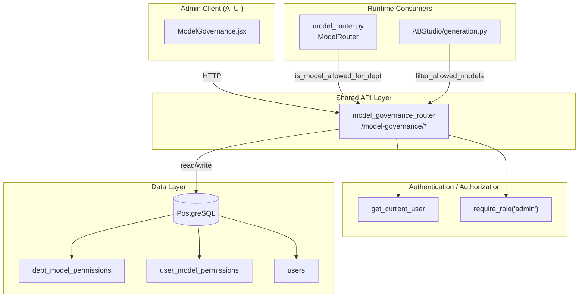
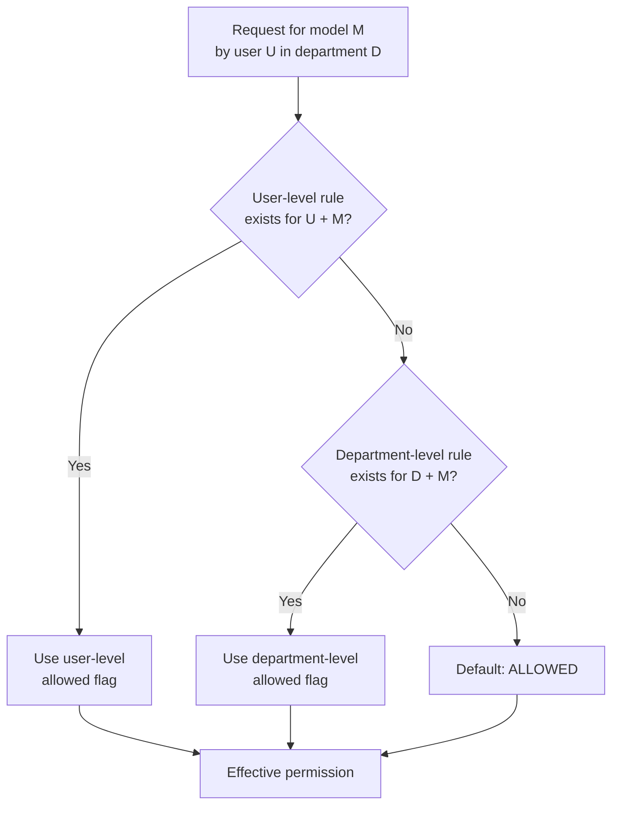
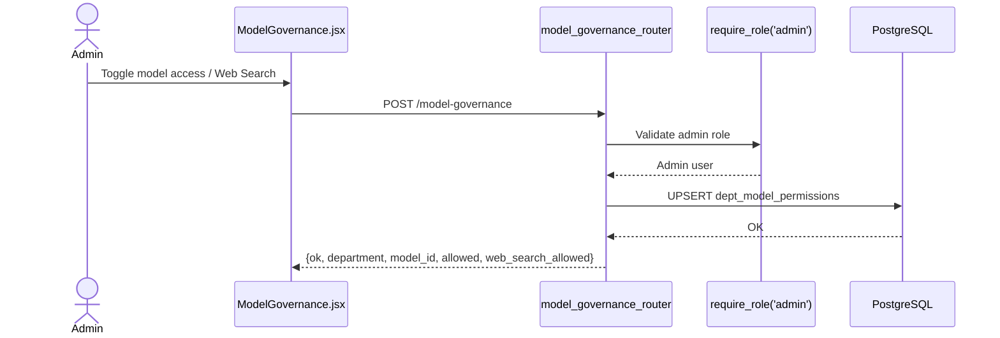
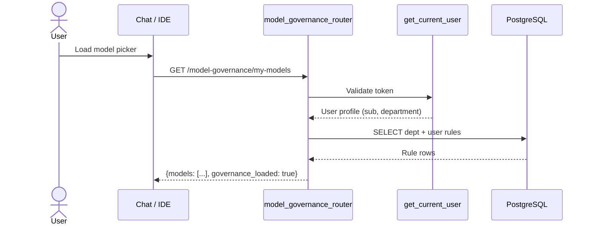
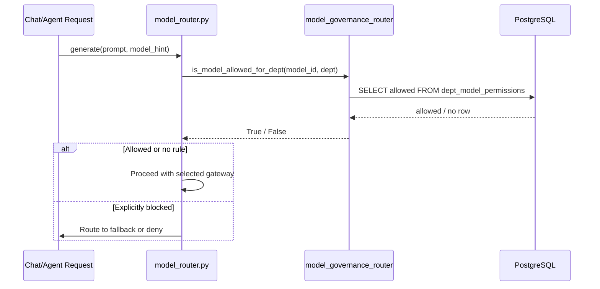
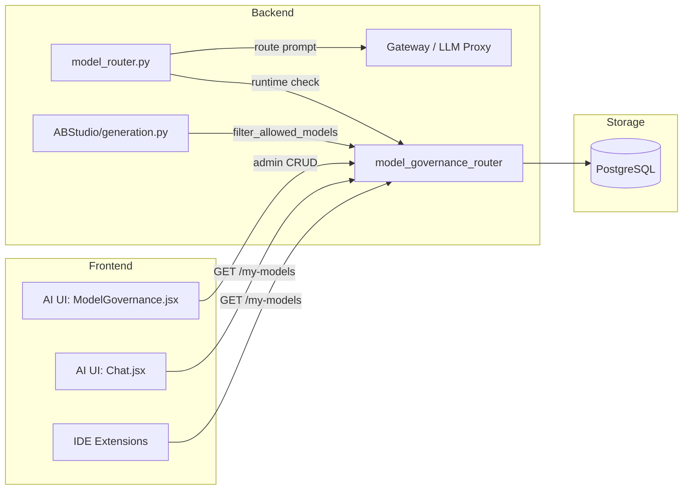

# model_governance_router

## Introduction

The `model_governance_router` module is a FastAPI router that provides **administrative controls for department-level and user-level access to Large Language Models (LLMs)**. It governs which models a user or department may invoke, and whether they may use the **Web Search** capability attached to those models. The router is part of the shared API layer (`shared_api_routers`) and is consumed by both the AI UI governance page and the runtime model-routing infrastructure.

This module is intentionally narrow: it owns the persistence and query logic for model permissions, exposes REST endpoints for administrators, and offers lightweight helper functions for other backend components to resolve effective permissions at request time.

---

## Core Functionality

| Capability | Description |
|------------|-------------|
| **Department-level permissions** | Allow or block specific `model_id`s for an entire department, and independently toggle Web Search. |
| **User-level overrides** | Grant or restrict model access for individual users within a department; user rules take precedence over department rules. |
| **Effective-permission resolution** | Compute the final list of models a user may use, applying the override hierarchy. |
| **Web Search governance** | Resolve whether a user may invoke Web Search for a given model. |
| **Available model catalog** | Return the canonical list of model IDs that administrators can govern, sourced from `core.model_registry` and optional local gateways. |
| **Runtime enforcement helper** | Provide a synchronous, fail-open check (`is_model_allowed_for_dept`) used by the request-time model router. |

---

## Module Architecture

### Router Registration

- **Prefix:** `/model-governance`
- **Tag:** `model-governance`
- **Authentication:** All endpoints require a valid bearer token or cookie (via `get_current_user`).
- **Authorization:** All endpoints except `GET /my-models` require `role=admin` (via `require_role("admin")`).

### Route Order Sensitivity

`GET /my-models` is registered **before** the parameterized `GET /{dept}` route. FastAPI evaluates routes in declaration order, so registering `/{dept}` first would incorrectly capture `/my-models` as a department name.

---

## Components

### Pydantic Request Bodies

| Class | Purpose |
|-------|---------|
| `ModelPermissionBody` | Payload for creating or updating a department-level permission: `department`, `model_id`, `allowed`, `web_search_allowed`. |
| `UserPermissionBody` | Payload for creating or updating a user-level override: `department`, `user_id`, `model_id`, `allowed`, `web_search_allowed`. |

### Database Dependency

- `_get_db()` yields a SQLAlchemy `SessionLocal` instance and ensures the session is closed after the request.

### Permission Resolution Helpers

| Function | Description |
|----------|-------------|
| `filter_allowed_models(model_ids, user_id, department, db)` | Returns the subset of `model_ids` that the user is permitted to use. User-level rules override department-level rules; absent rules default to **allowed**. |
| `is_web_search_allowed(model_id, user_id, department, db)` | Returns `True` only if the model is allowed for the user **and** the effective `web_search_allowed` flag is `True`. Defaults to **deny** on any error. |
| `is_model_allowed_for_dept(model_id, department)` | Synchronous, fail-open runtime check used by `model_router.py`. Returns `True` when no rule exists or when the database is unreachable. |

### Endpoint Handlers

| Method | Route | Access | Purpose |
|--------|-------|--------|---------|
| `GET` | `/model-governance` | Admin | List all department-level permissions. |
| `GET` | `/model-governance/models` | Admin | Return all governable model IDs. |
| `GET` | `/model-governance/my-models` | Authenticated user | Return the models the caller is allowed to use. |
| `GET` | `/model-governance/{dept}` | Admin | List model permissions for one department. |
| `POST` | `/model-governance` | Admin | Set or update a department-level permission. |
| `DELETE` | `/model-governance/{dept}/{model_id}` | Admin | Remove a department-level permission. |
| `GET` | `/model-governance/{dept}/users` | Admin | List active users for override management. |
| `GET` | `/model-governance/{dept}/user-permissions` | Admin | List user-level overrides for a department. |
| `POST` | `/model-governance/user` | Admin | Set or update a user-level override. |
| `DELETE` | `/model-governance/user/{user_id}/{model_id}` | Admin | Remove a user-level override. |

---

## Permission Resolution Hierarchy

Web Search resolution follows the same hierarchy, but defaults to **denied** when no rule exists.

---

## Data Flows

### 1. Admin Configures Department Access

### 2. User Fetches Allowed Models

### 3. Runtime Enforcement

---

## Available Model Catalog

The `_all_model_ids()` helper builds the canonical list of governable models from `core.model_registry` constants:

- Claude family: primary, Haiku, Opus variants, Sonnet 5
- OpenAI family: coding, latest, simple, and optional GPT-5.6 Tera/Luna when feature flags are enabled
- Gemini family: text, coding-lite, vision
- Local models: discovered dynamically from `gateway_local_llm`

Any model listed in `BLOCKED_MODELS` (for example, retired or opt-in-only models) is excluded from the catalog.

---

## Database Schema Assumptions

The router uses raw SQL and expects the following tables:

- `dept_model_permissions(department, model_id, allowed, web_search_allowed, created_by, created_at)` with a unique constraint on `(department, model_id)`.
- `user_model_permissions(user_id, model_id, allowed, web_search_allowed, created_by, created_at)` with a unique constraint on `(user_id, model_id)`.
- `users(id, email, name, role, ad_level, department, is_active)`.

The code is defensive: if `user_model_permissions` does not exist on older schemas, the helpers fall back to department-only resolution or fail open.

---

## Error Handling and Safety Defaults

| Scenario | Behavior |
|----------|----------|
| Database error during `is_model_allowed_for_dept` | **Fail open** — returns `True` so a transient DB issue does not block all traffic. |
| Database error during `is_web_search_allowed` | **Fail closed** — returns `False` so Web Search is not accidentally enabled. |
| Missing `user_model_permissions` table | Falls back to department-only rules. |
| No rule exists for a department/model | Treated as **allowed**. |
| No rule exists for Web Search | Treated as **denied**. |

---

## Dependencies

| Dependency | Purpose |
|------------|---------|
| `auth.dependencies.get_current_user` | Extract and validate the authenticated user from JWT, API key, or cookie. |
| `auth.rbac.require_role` | Enforce the admin role on mutating and most read endpoints. |
| `db.database.SessionLocal` / `engine` | SQLAlchemy session and connection management. |
| `core.model_registry` | Canonical model ID constants and feature flags. |
| `gateway_local_llm` (optional) | Discover local models to include in the governable catalog. |

---

## Integration with the Broader System

- **AI UI** administrators use [`ModelGovernance.jsx`](ai_ui_frontend_model_governance.md) to configure access.
- **Chat and IDE clients** call `GET /my-models` to populate the model picker with only permitted models.
- **`model_router.py`**, the central request-time routing component, calls `is_model_allowed_for_dept` before dispatching to a gateway. See [`model_router.md`](model_router.md) for routing details.
- **`ABStudio/generation.py`** imports `filter_allowed_models` to respect governance when listing models in the ABStudio workflow builder.

---

## Related Documentation

- [`model_router.md`](model_router.md) — Request-time LLM routing, tier selection, and gateway dispatch.
- [`ai_ui_frontend_model_governance.md`](ai_ui_frontend_model_governance.md) — Frontend governance configuration page.
- [`auth_router.md`](auth_router.md) — Authentication and session management.
- [`admin_router.md`](admin_router.md) — Other administrative endpoints.
