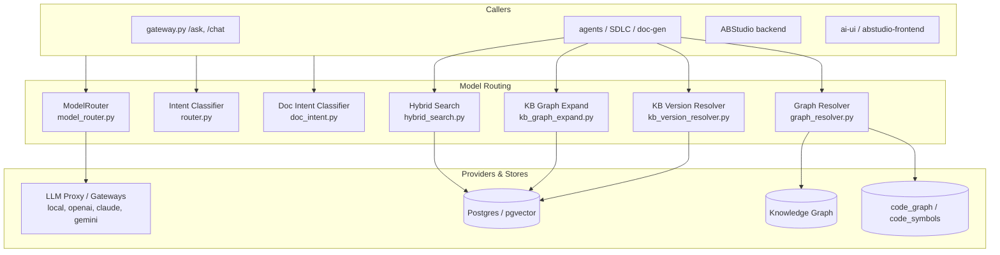
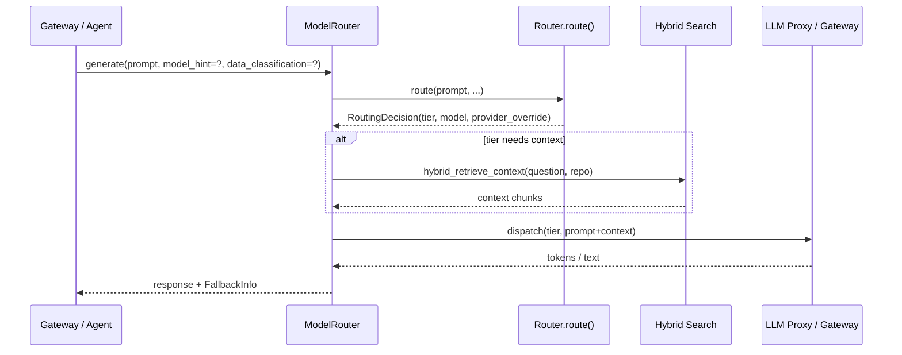

# Model Routing Module

The **model_routing** module is the central intelligence layer that decides *which* model should answer a request and *what context* should be supplied to it. It sits between the application surface (gateway, chat, agents, ABStudio, document generation) and the lower-level LLM gateways / data stores.

## Purpose

- **Model selection**: Route every prompt to an approved LLM provider and model based on signals such as caller hint, vision keywords, query complexity, data classification, and context size.
- **Fallback resilience**: When a primary provider is unavailable, automatically cascade to approved alternatives without leaking restricted data.
- **Context retrieval**: Provide hybrid semantic + keyword + symbol + graph retrieval over the enterprise knowledge base and code graph.
- **Knowledge graph traversal**: Expand natural-language questions into structurally related code files and symbols.
- **KB version resolution**: Pin retrieval to the correct product/domain/spec-version of a knowledge document.
- **Document-generation intent**: Classify whether a user wants a downloadable document artifact or a normal chat answer.

## Architecture Overview

The module is intentionally split into small, focused files so that routing, retrieval, graph traversal, versioning, and document intent can evolve independently.

## Sub-modules

| Sub-module | Responsibility | Key Files | Documentation |
|------------|----------------|-----------|---------------|
| **Core Router & Intent** | Tier selection, provider dispatch, streaming/blocking calls, fallback chains, privacy floor, thread-local telemetry. | `model_router.py`, `router.py` | [model_routing_core.md](model_routing_core.md) |
| **Retrieval & Search** | Hybrid semantic/BM25/pgvector search, symbol search, result merging/reranking, embed-service client, ACL/scope filtering. | `hybrid_search.py`, `metadata_retriever.py`, `local_model.py` | [model_routing_retrieval.md](model_routing_retrieval.md) |
| **Knowledge Graph** | Code-graph resolution, dependency slices, multi-hop knowledge-graph traversal, RBAC-aware expansion. | `graph_resolver.py`, `kb_graph_expand.py` | [model_routing_knowledge_graph.md](model_routing_knowledge_graph.md) |
| **KB Versioning** | Resolve the authoritative knowledge-document version for a product/domain, walk lineage, diff versions. | `kb_version_resolver.py` | [model_routing_versioning.md](model_routing_versioning.md) |
| **Document Intent** | LLM-only classification of whether the user wants a downloadable document, plus deterministic vetoes and format normalization. | `doc_intent.py` | [model_routing_document_intent.md](model_routing_document_intent.md) |

## How It Fits Into the System

- **Gateway** (`gateway.py`) calls `model_router.generate()` / `stream()` for every chat/agent turn and reads `last_model_label` / `last_decision` for cost and telemetry.
- **LLM Proxy** (`llm_proxy`) is the downstream target for most cloud-model calls when `LLM_PROXY_URL` is configured; otherwise the router talks directly to `gateway_openai`, `gateway_claude`, and `gateway_gemini`.
- **Shared Core** supplies the model registry (`core/model_registry.py`), circuit breakers (`core/circuit_breaker.py`), RAG ACL (`core/rag_acl.py`), and prompt sanitizer (`core/prompt_sanitizer.py`).
- **Embedding Service** (`services/embed_svc`) is the only production embedding path; `hybrid_search.py` calls it over HTTP.
- **Database layer** (`db/database.py`, `db/models.py`) provides `document_embeddings`, `code_graph`, `code_symbols`, `knowledge_graph_nodes/edges`, `kb_edges`, and `knowledge_docs`.

## Common Data Flow

## Operational Notes

- All routing decisions are logged with the chosen tier, model label, and fallback status for audit and cost attribution.
- The **privacy floor** is a hard invariant: data classified `CONFIDENTIAL`, `RESTRICTED`, or `PCI_SENSITIVE` is pinned to the in-house local model and fails closed if local is unavailable.
- **Context-size routing** promotes a turn to a larger-window model when the estimated token footprint exceeds the tier's safe headroom.
- Thread-local state (`last_model_label`, `last_decision`, token counts) prevents cross-request bleed under concurrent uvicorn workers.
