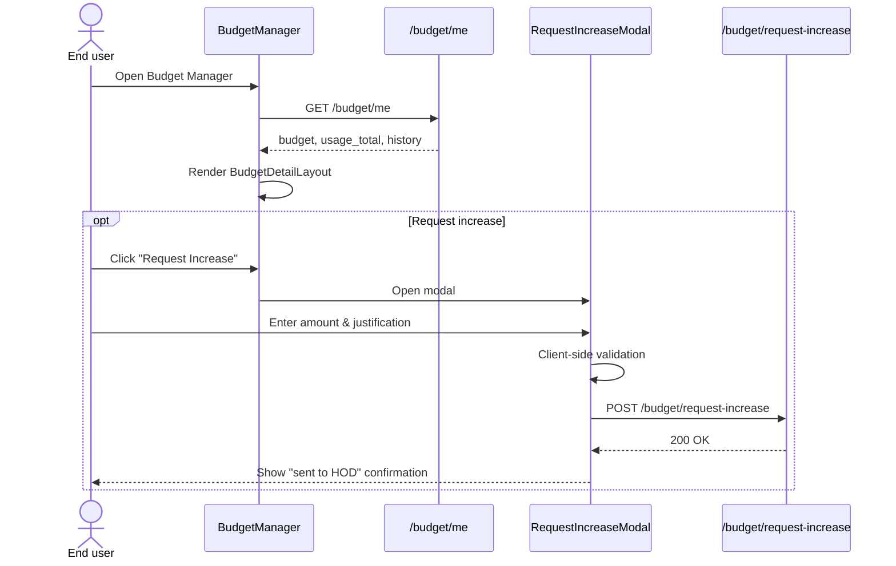
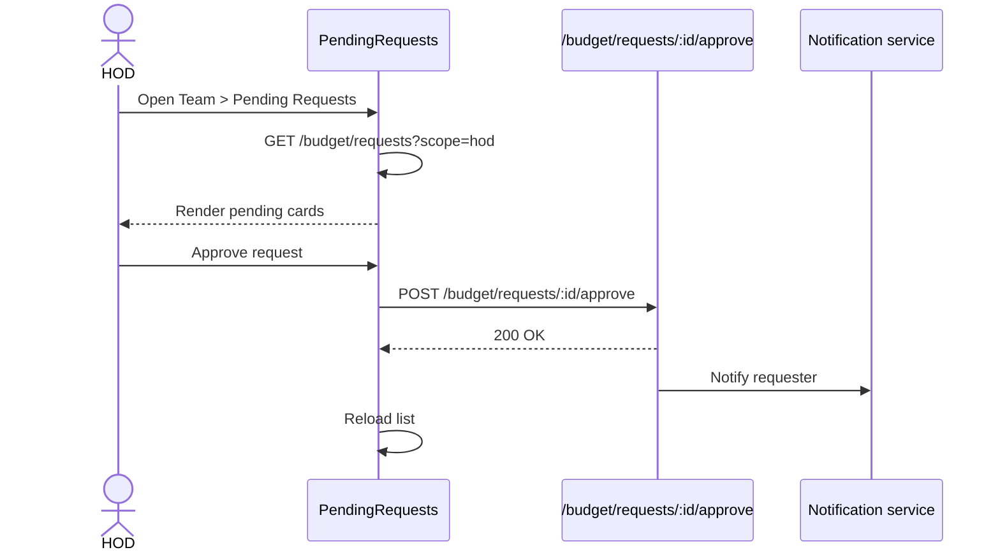
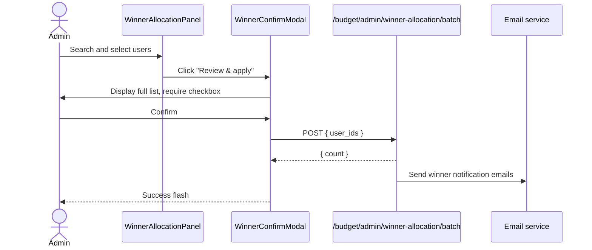

# Budget Manager

The **Budget Manager** is the frontend surface for controlling, requesting, and reviewing LLM spend budgets across the platform. It lets end-users see their own monthly budget and request top-ups, while giving Heads of Department (HODs), reporting managers, and administrators read-only or approval-based tools to monitor and govern team spending.

---

## 1. Purpose & Core Functionality

Budgets in the platform are split into two parts:

| Part | Description | Who controls it |
|------|-------------|---------------|
| **Base budget** | Default monthly allocation (normally `$50`). | Admins via the **10x Winner** action. |
| **Extra budget** | HOD-approved top-up added on top of base. | End-user requests it; their department HOD approves or rejects it. |

The Budget Manager component therefore has three audiences:

1. **End users** — view "My Budget", see utilisation, request increases, and review approved-increase history.
2. **HODs / reporting managers** — view department or reportee budgets, approve pending increase requests, and see their own monthly cap consumption.
3. **Admins** — do everything HODs do, plus set monthly HOD caps and run the **10x Winner** base-allocation batch action.

Key behaviours enforced by the UI:

- Increase requests are **additive**; they never replace the base budget.
- A single request cannot exceed `$200` of extra budget.
- A user cannot accumulate more than `$10,000` of total extra budget.
- HODs can approve/reject only pending requests routed to them.
- Admins cannot directly edit a user's base or extra budget; the only admin write path is the **10x Winner** batch action that raises base to `$1,000`.
- The elevated winner base is **period-scoped**; monthly reset returns every user to the default base.

---

## 2. Architecture Overview

```mermaid
graph TB
    subgraph "Budget Manager UI"
        BM[BudgetManager]
        BM --> MY[My Budget view]
        BM --> ADMIN[Admin view]
        BM --> TEAM[Team / HOD view]

        MY --> BDL[BudgetDetailLayout]
        MY --> RIM[RequestIncreaseModal]
        MY --> MIS[MyIncreasesSection]
        MY --> UV[UtilizationPage]

        ADMIN --> URP[UserRosterPanel]
        ADMIN --> PR[PendingRequests]
        ADMIN --> HCP[HodCapsPanel]
        ADMIN --> WAP[WinnerAllocationPanel]
        ADMIN --> WCM[WinnerConfirmModal]

        TEAM --> TBP[TeamBudgetPanel]
        TEAM --> URP2[UserRosterPanel]
        TEAM --> PR2[PendingRequests]
    end

    subgraph "Shared budget sub-components"
        BDL --> SC[StatCard]
        BDL --> UV2[UtilizationPage]
        URP --> UBD[UserBudgetDetail]
        UBD --> BDL2[BudgetDetailLayout]
        TBP --> UBD
    end

    subgraph "Backend API"
        API1[/budget/me\n/budget/users/:id/usage\n/budget/team\n/budget/users\n/budget/request-increase\n/budget/requests/:id/:verb\n/budget/admin/hods\n/budget/admin/hods/:email/cap\n/budget/admin/winner-allocation/batch\n/budget/admin/hod-audit\n/budget/my-increases\n/budget/hod/cap-status\n/utilization/*\n]
    end

    BM --> API1
    TBP --> API1
    URP --> API1
    HCP --> API1
    WAP --> API1
```

The module is implemented as a single-page React component with three top-level view modes. Most heavy UI pieces are extracted into local helper components and into the sibling `budget/` sub-module so that admin, HOD, and user views stay consistent.

---

## 3. Component Breakdown

### 3.1 `BudgetManager` (main entry)

`BudgetManager` is the route-level container. It decides which view to render based on the user's role and the active tab:

- **My Budget** — default for everyone.
- **Admin** — visible only when `user.role === "admin"`.
- **Team** — visible when `user.is_hod` or `user.is_reporting_manager`.

It also loads the current user's budget (`/budget/me`) and, when the admin view is open, the full user roster (`/budget/users`).

### 3.2 `BudgetDetailLayout`

Shared layout used by both **My Budget** and the **UserBudgetDetail** drill-down. It renders:

- Three `StatCard`s: allocated base, extra budget, and utilisation.
- Optional increase-history section (toggled by clicking the Extra card).
- Optional month-to-date cost history table.

Keeping this layout shared guarantees that an admin/HOD sees exactly the same budget semantics as the end user.

### 3.3 `StatCard`

A small presentational card with colour-coded tones (`neutral`, `green`, `yellow`, `red`, `indigo`). The utilisation card includes a progress bar and is clickable to open the utilisation drill-down.

### 3.4 `RequestIncreaseModal`

Modal for requesting extra budget. Validates:

- Amount > 0 and ≤ `MAX_REQUEST_EXTRA_USD` (`$200`).
- Mandatory justification, sanitised via `validateDescription`.
- Justification length ≤ 1,000 characters.

On success it shows a confirmation message explaining that the request was sent to the user's HOD.

### 3.5 `PendingRequests`

Lists pending/approved/rejected increase requests. HODs see action buttons to approve or reject. The component reloads after an action; if the server returns a conflict (another HOD acted first), it refreshes the list silently.

### 3.6 `UserRosterPanel`

Read-only paginated table of users for admins. Supports:

- Search by user id, email, or name.
- Sort by utilisation (highest/lowest spend first).
- Expand a row to show `UserBudgetDetail`.
- Load-more pagination (`PAGE_SIZE = 50`).

### 3.7 `UserBudgetDetail`

Fetches `/budget/users/:id/usage` for a selected user and renders `BudgetDetailLayout`. It also supports the same "extra" and "utilisation" drill-downs as the user's own view.

### 3.8 `HodCapsPanel` & `HodCapModal`

Admin-only panel for listing Heads of Department and setting their monthly allocation caps. Each row shows:

- HOD identity and departments.
- Number of users under the HOD.
- Current cap, consumed amount, remaining amount, and reset date.
- Shadow-mode indicator when enforcement is disabled.
- Expandable audit table of allocations approved by that HOD.

`HodCapModal` is the add/edit modal for a single cap.

### 3.9 `WinnerAllocationPanel` & `WinnerConfirmModal`

Admin-only batch action for raising selected users' base budget to `$1,000`. It includes:

- Searchable user dropdown (primary match on email).
- Selected-user chips with remove action.
- A confirmation modal that lists **every** selected email in full and requires an explicit acknowledgement checkbox before applying.
- Backend notification emails are triggered server-side.

### 3.10 `TeamBudgetPanel`

Used by the **Team** view for reporting managers and HODs. Loads `/budget/team` and shows a read-only roster of direct/indirect reports with aggregate team totals and a team-wide utilisation drill-down.

### 3.11 `UtilizationPage`

Reusable drill-down component that switches between:

- Date-wise month-to-date history.
- Channel-wise usage breakdown.
- Model-wise usage breakdown.

It is used by `BudgetManager`, `UserBudgetDetail`, and `TeamBudgetPanel`.

---

## 4. Data Flow

### 4.1 My Budget flow



### 4.2 HOD approval flow



### 4.3 Admin 10x Winner allocation flow



---

## 5. Role-Based Views

| Role | Tabs available | Write actions |
|------|----------------|---------------|
| End user | My Budget | Request increase |
| Reporting manager | My Budget, Team (users) | None (read-only) |
| HOD | My Budget, Team (users + pending requests) | Approve/reject increase requests |
| Admin | My Budget, Admin (users, requests, HOD caps, 10x Winner) | Approve/reject requests, set HOD caps, run winner allocation |

The component uses three booleans derived from the `user` prop:

- `IS_ADMIN = user?.role === "admin"`
- `IS_HOD = !!user?.is_hod`
- `IS_REPORTING_MGR = !!user?.is_reporting_manager`

---

## 6. Key Constants & Business Rules

| Constant | Value | Meaning |
|----------|-------|---------|
| `MAX_EXTRA_USD` | `10_000` | Hard ceiling on total extra budget a user can hold. |
| `MAX_REQUEST_EXTRA_USD` | `200` | Maximum extra budget a user can request in a single request. |
| `WINNER_BASE_USD` | `1_000` | Base budget set by the 10x Winner admin action. |
| `PAGE_SIZE` | `50` | Number of users loaded per page in rosters. |

Utilisation colour coding:

- `< 70%` — green
- `70–89%` — yellow
- `≥ 90%` — red

---

## 7. Dependencies

### 7.1 Same-project dependencies

- [`budget`](budget.md) — `TeamBudgetPanel`, `UtilizationPage`, `utilizationEndpoints`, and utilisation sort helpers.
- [`message_meta`](../chat/message_meta.md) — `MonthlyBudgetChip` surfaces budget status inside chat message metadata.
- [`ui_dialog`](../ui/ui_dialog.md) — `useConfirm` hook used by `HodCapModal` and `WinnerAllocationPanel`.
- [`config`](../infrastructure/config.md) — `authFetch` and `API_BASE` for authenticated HTTP calls.
- [`utils/securityValidation`](../securityValidation.md) — `validateDescription` for sanitising request justifications.
- [`utils/time`](../time.md) — `toISTDate` for formatting timestamps.

### 7.2 Backend dependencies

- [`budget_router`](../api/budget_router.md) — REST endpoints for budget read/write operations.
- [`budget_store`](../budget_store.md) — persistence layer for budget records and usage totals.
- [`BudgetMiddleware`](../reference/middleware.md) — enforces budget limits on incoming requests.
- [`hod_budget_governor`](../hod_budget_governor.md) — computes HOD allocation deltas and cap checks.
- [`budget_request_email`](../budget_request_email.md) — sends HOD request and winner-allocation emails.
- [`worker_orchestration`](../workers/worker_orchestration.md) — runs monthly budget reset and reset-warning cron jobs.
- [`kafka_event_consumer`](../reference/kafka_event_consumer.md) — consumes `_handle_budget_events` for asynchronous budget updates.

---

## 8. Error Handling & Edge Cases

- **Request conflict**: if two HODs try to act on the same request, the second call receives a non-OK response and `PendingRequests` silently refreshes to show the resolved state.
- **Roster timeout**: `loadUsers` aborts after 45 seconds and shows a retry-able error message.
- **Validation errors**: form-level validation surfaces inline before any network call is made.
- **Empty states**: every list/table has an explicit empty state (no pending requests, no HODs, no usage history, etc.).
- **Shadow mode**: HOD caps can be configured without enforcement; the UI shows a "Shadow mode" badge in those rows.

---

## 9. How It Fits Into the System

The Budget Manager is one of the governance surfaces in the `ai_ui_frontend`. It sits alongside:

- [`model_governance`](../sdlc/model_governance.md) — controls which models a user or department may use.
- [`governance`](../sdlc/governance.md) — handles entity approval workflows.
- [`endpoint_manager`](../reference/endpoint_manager.md) — manages API keys and endpoint access.
- [`coach_admin`](../evaluation/coach_admin.md) — governance over coaching rules and usage.

Together these modules form the **cost and access governance** layer of the platform. The Budget Manager is the user-facing piece of the **spend governance** vertical; the actual enforcement happens in the backend via [`BudgetMiddleware`](../reference/middleware.md) and the budget-related workers.

---

## 10. Related Documentation

- [budget](budget.md)
- [budget_router](../api/budget_router.md)
- [budget_store](../budget_store.md)
- [message_meta](../chat/message_meta.md)
- [ui_dialog](../ui/ui_dialog.md)
- [hod_budget_governor](../hod_budget_governor.md)
- [budget_request_email](../budget_request_email.md)
- [worker_orchestration](../workers/worker_orchestration.md)
- [kafka_event_consumer](../reference/kafka_event_consumer.md)
