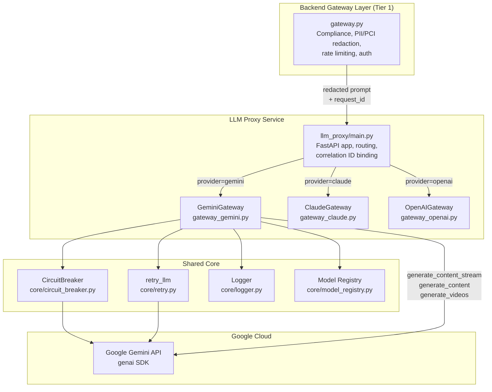
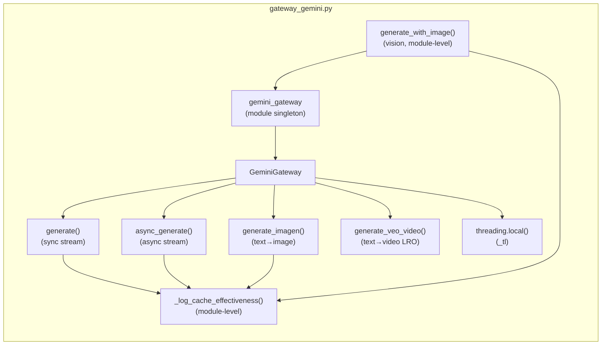
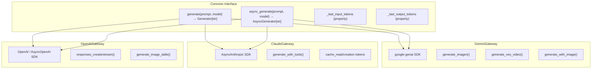
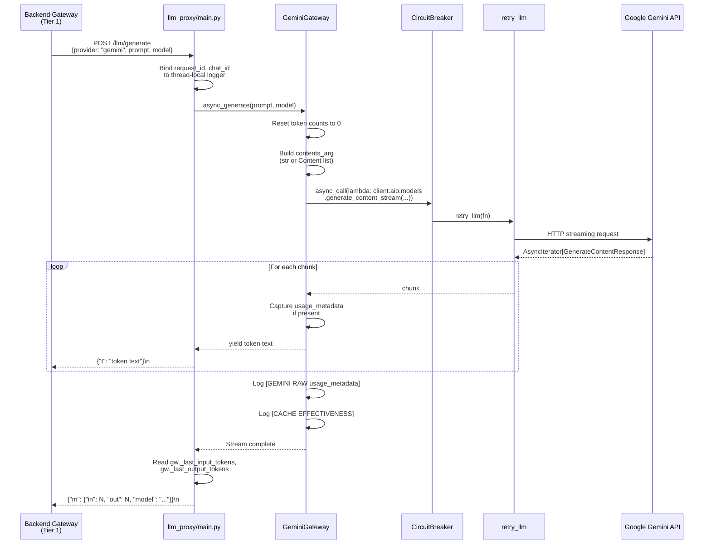
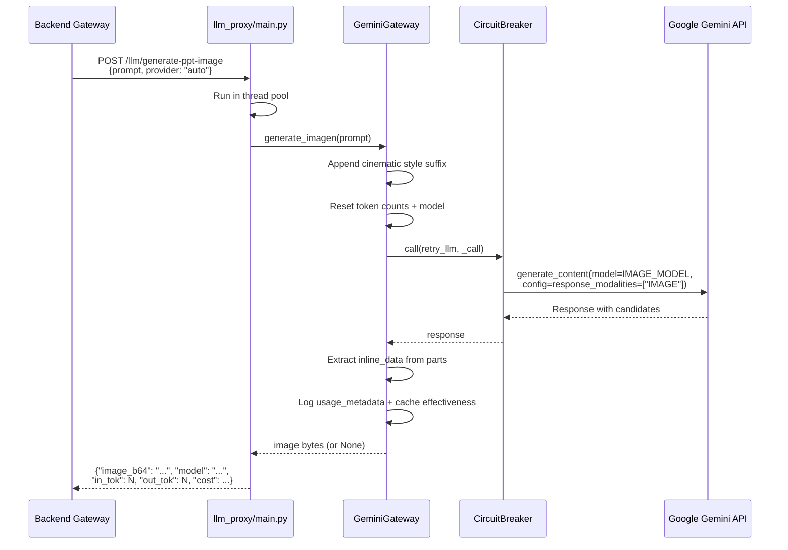
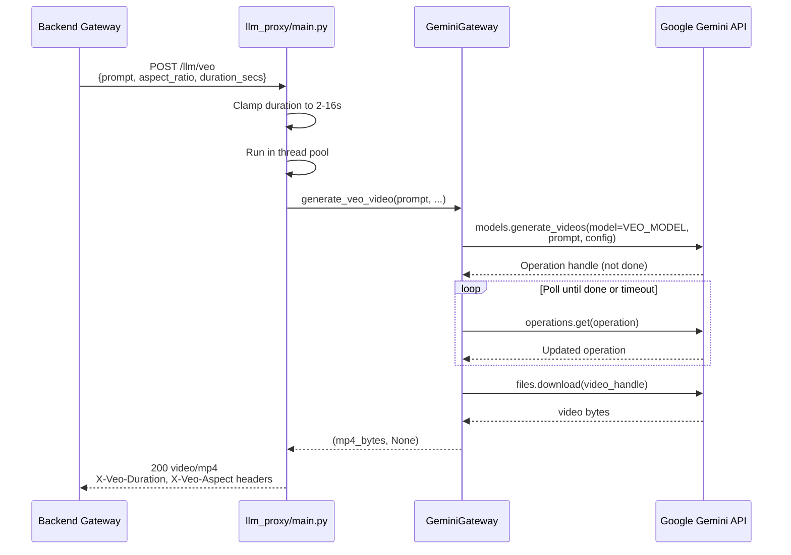
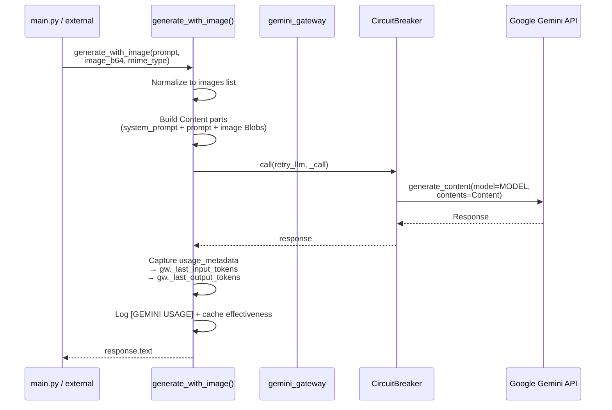
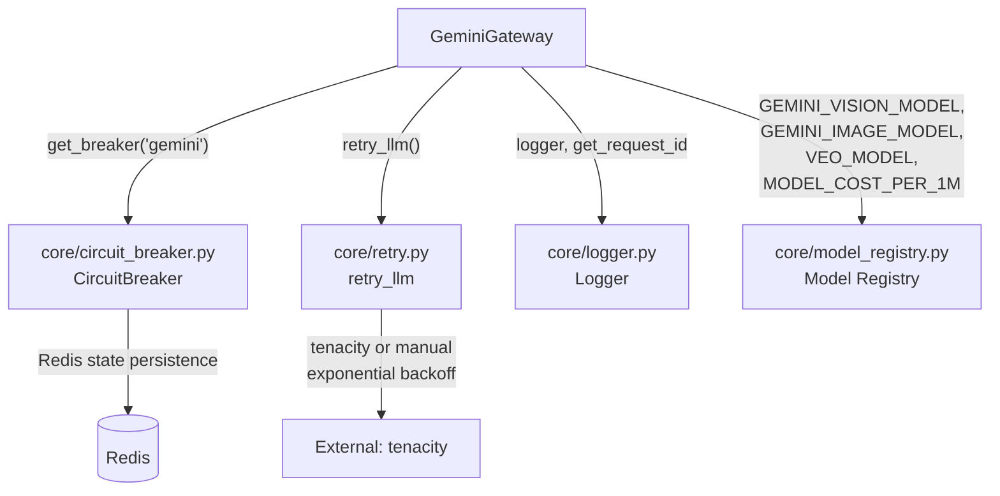
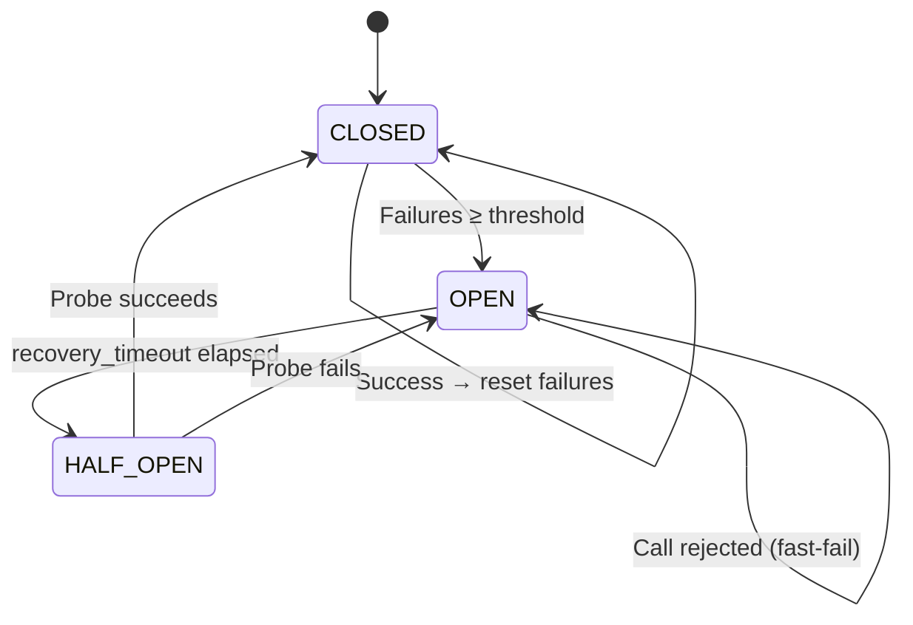

# LLM Proxy Gateway — Gemini

## Overview

The **Gemini Gateway** (`services/llm_proxy/gateway_gemini.py`) is the Google Gemini–specific adapter within the LLM Proxy service. It provides a unified interface for streaming text generation, multimodal vision (image input), image generation (Imagen), and video generation (Veo 3.1) through the Google `genai` SDK. The gateway is one of three provider gateways in the LLM Proxy layer — alongside [Claude Gateway](llm_proxy_gateway_claude.md) and [OpenAI Gateway](llm_proxy_gateway_openai.md) — and is orchestrated by the [LLM Proxy Main](llm_proxy_main.md) FastAPI application.

### Key Responsibilities

| Responsibility | Description |
|---|---|
| **Text streaming (sync)** | `generate()` — streams tokens from Gemini via `generate_content_stream`, yielding text chunks as they arrive. |
| **Text streaming (async)** | `async_generate()` — mirrors the sync path using `genai.Client.aio.models` for native event-loop streaming. |
| **Multimodal vision** | `generate_with_image()` — sends prompt + inline image(s) to Gemini vision models and returns full response text. |
| **Image generation** | `generate_imagen()` — text-to-image via Gemini's multimodal image model with `response_modalities=["IMAGE"]`. |
| **Video generation** | `generate_veo_video()` — text-to-video via Google Veo 3.1, a long-running operation (LRO) with polling. |
| **Token usage tracking** | Captures `usage_metadata` (prompt, candidates, cached, thoughts tokens) from every response and exposes them via thread-local properties. |
| **Cache effectiveness logging** | Emits structured `[CACHE EFFECTIVENESS]` log lines for every call, quantifying Gemini context-caching savings. |

### Design Principles

1. **No compliance logic** — PCI/PII detection and redaction are handled exclusively by the backend gateway layer (Tier 1) *before* requests reach this proxy. The gateway forwards already-validated, already-redacted text verbatim.
2. **Thread-safe token tracking** — Uses `threading.local()` so concurrent requests don't overwrite each other's token counts.
3. **Resilience by default** — Every SDK call is wrapped in a circuit breaker (`get_breaker("gemini")`) and retry logic (`retry_llm`).
4. **Unified async interface** — `async_generate()` allows the [LLM Proxy Main](llm_proxy_main.md) to treat all three providers identically on the uvicorn event loop.

---

## Architecture

### Module Position in the System



### Component Relationships



### Provider Gateway Comparison

The three provider gateways share a common interface pattern but differ in SDK and capabilities:



---

## Core Components

### `GeminiGateway` Class

The central class that encapsulates all Gemini API interactions. A single module-level instance (`gemini_gateway`) is created at import time and shared across all requests.

#### Initialization

```python
GeminiGateway()
```

- Reads `GEMINI_API_KEY` from environment (raises `RuntimeError` if unset).
- Creates a `genai.Client` instance with the API key.
- Logs the SSL certificate configuration (`SSL_CERT_FILE` / `REQUESTS_CA_BUNDLE`) for debugging corporate proxy setups.

#### Thread-Local Token Tracking

The gateway uses `threading.local()` (`_tl`) to store per-request metadata, ensuring thread safety when the gateway is called from thread-pool workers:

| Property | Thread-Local Key | Description |
|---|---|---|
| `_last_input_tokens` | `gemini_in` | Prompt token count from `usage_metadata.prompt_token_count` |
| `_last_output_tokens` | `gemini_out` | Completion token count from `usage_metadata.candidates_token_count` |
| `_last_imagen_model` | `gemini_imagen_model` | Model ID used for the last image generation call |

These properties are reset to `0` at the start of every call and populated from the response's `usage_metadata` after streaming completes.

#### Methods

##### `generate(prompt, model=None) → Generator[str, None, None]`

Synchronous streaming text generation.

- **Input**: `prompt` can be a plain `str` (single turn) or an OpenAI-format messages list (`[{"role": "user"|"assistant", "content": str}]`). When a list is provided, `"assistant"` roles are mapped to Gemini's `"model"` role.
- **Model resolution**: Falls back to `MODEL` constant (`GEMINI_VISION_MODEL` from the model registry) when `model` is `None`.
- **Resilience**: Wraps the SDK call in `breaker.call(retry_llm, _call)` — circuit breaker + exponential backoff retry.
- **Token capture**: Extracts `usage_metadata` from the final streaming chunk and logs raw JSON breakdown.
- **Error handling**: Catches all exceptions, logs with request ID, and yields `"\nError generating response"`.

##### `async_generate(prompt, model=None) → AsyncGenerator[str, None, None]`

Asynchronous streaming text generation — mirrors `generate()` but uses `self.client.aio.models.generate_content_stream()`.

- Runs entirely on the uvicorn event loop without blocking a thread-pool worker.
- Called from the [LLM Proxy Main](llm_proxy_main.md) `/llm/generate` endpoint's `_stream()` coroutine.
- Uses `breaker.async_call()` for circuit breaker protection on the async path.

##### `generate_imagen(prompt) → bytes | None`

Text-to-image generation using Gemini's multimodal image model.

- Appends a cinematic photography style suffix to the user prompt.
- Uses `GEMINI_IMAGE_MODEL` from the model registry.
- Configures `response_modalities=["IMAGE"]` with `aspect_ratio="16:9"`.
- Extracts inline image data from `response.candidates[0].content.parts`.
- Returns raw image `bytes` or `None` on failure.
- Called by the `/llm/generate-ppt-image` endpoint in [LLM Proxy Main](llm_proxy_main.md).

##### `generate_veo_video(prompt, aspect_ratio, duration_secs, poll_interval_secs, max_wait_secs) → tuple[bytes | None, str | None]`

Text-to-video generation via Google Veo 3.1 (preview).

- **Long-Running Operation (LRO) pattern**:
  1. Submit `models.generate_videos()` → returns an `Operation` handle.
  2. Poll `operations.get(op)` until `op.done`.
  3. Download bytes from the returned `File` handle.
- **Timeout**: Wall-clock capped by `max_wait_secs` (default 300s) to bound LRO polling.
- **Returns**: `(mp4_bytes, None)` on success or `(None, error_str)` on failure.
- Called by the `/llm/veo` endpoint in [LLM Proxy Main](llm_proxy_main.md).

### `generate_with_image(prompt, image_b64, mime_type, system_prompt, _gateway, images_b64, mime_types) → str`

Module-level function for multimodal vision (image input).

- **Single-image mode** (backward-compatible): Pass `image_b64` (base64 string) + `mime_type`.
- **Multi-image mode**: Pass `images_b64` (list of base64 strings) + matching `mime_types`.
- Builds a multi-part `Content` with text parts (system prompt + user prompt) and one or more inline image `Blob` parts.
- Uses the module-level `gemini_gateway` singleton by default, or accepts a `_gateway` parameter for dependency injection (used by [LLM Proxy Main](llm_proxy_main.md) to read token counts from the correct instance).
- Returns full response text (non-streaming).
- Token counts are written back to the gateway instance's thread-local properties.

### `_log_cache_effectiveness(request_id, model, cache_read, prompt_total, context)`

Module-level helper that emits a structured `[CACHE EFFECTIVENESS]` log line for every Gemini call.

- Derives per-token cost from `MODEL_COST_PER_1M` in the model registry.
- Calculates hit rate and estimated USD savings (cached tokens billed at 25% of normal input rate).
- Always emitted — even when `cache_read=0` — so zero-cache calls are visible and cache effectiveness can be tracked over time.
- Also imported and called by [LLM Proxy Main](llm_proxy_main.md) for the `_chat_gemini` and `gemini_tools_stream` paths.

---

## Data Flow

### Streaming Text Generation Flow



### Image Generation Flow (Imagen)



### Video Generation Flow (Veo LRO)



### Vision (Image Input) Flow



---

## Integration with LLM Proxy Main

The [LLM Proxy Main](llm_proxy_main.md) application instantiates a single `GeminiGateway` at startup (stored as `_gemini_gw`) and routes Gemini-specific requests to it. The following endpoints interact with the gateway:

| Endpoint | Gateway Method | Description |
|---|---|---|
| `POST /llm/generate` | `async_generate()` | Unified streaming text generation (all providers) |
| `POST /llm/chat` | `_chat_gemini()` (uses `client.models.generate_content` directly) | Single tool-use round with function calling |
| `POST /llm/gemini-tools-stream` | `client.models.generate_content_stream` (via `_gemini_gw.client`) | Streaming tool-call responses in OpenAI NDJSON format |
| `POST /llm/generate-ppt-image` | `generate_imagen()` | Text-to-image for PPTX slide backgrounds |
| `POST /llm/veo` | `generate_veo_video()` | Text-to-video via Veo 3.1 |
| `POST /llm/ask-with-image` | `generate_with_image()` | Multimodal vision (image input) |

### Correlation ID Propagation

The gateway inherits the request ID from the thread-local logger context (`get_request_id()`), which is set by [LLM Proxy Main](llm_proxy_main.md) at the start of each request. If no upstream ID is present, a UUID is generated. This ID appears in all log lines, enabling end-to-end tracing across the backend gateway → LLM proxy → Google API hop chain.

---

## Dependencies

### Internal Dependencies



| Dependency | Module | Purpose |
|---|---|---|
| `core.circuit_breaker.get_breaker` | [shared_core](../reference/shared_core.md) | Per-provider circuit breaker with Redis-backed state (CLOSED → OPEN → HALF_OPEN) |
| `core.retry.retry_llm` | [shared_core](../reference/shared_core.md) | Exponential backoff retry on transient errors (rate-limit, timeout, connection) |
| `core.logger` | [shared_core](../reference/shared_core.md) | Structured logging with request ID / chat ID context binding |
| `core.model_registry` | [shared_core](../reference/shared_core.md) | Centralized model IDs and pricing (`GEMINI_VISION_MODEL`, `GEMINI_IMAGE_MODEL`, `VEO_MODEL`, `MODEL_COST_PER_1M`) |

### External Dependencies

| Dependency | Purpose |
|---|---|
| `google.genai` | Official Google GenAI Python SDK for Gemini, Imagen, and Veo APIs |
| `google.genai.types` | Type definitions for `Content`, `Part`, `Blob`, `GenerateContentConfig`, etc. |

### Environment Variables

| Variable | Required | Description |
|---|---|---|
| `GEMINI_API_KEY` | Yes | Google Gemini API key — gateway raises `RuntimeError` if unset |
| `SSL_CERT_FILE` | No | Path to SSL certificate bundle for corporate proxy environments |
| `REQUESTS_CA_BUNDLE` | No | Fallback CA bundle path (logged but not explicitly consumed) |
| `CIRCUIT_BREAKER_DISABLED` | No | Set to `1`/`true` to bypass circuit breaker protection |

---

## Resilience Patterns

### Circuit Breaker

All Gemini SDK calls are protected by a named circuit breaker (`"gemini"`), obtained via `get_breaker("gemini")`. The breaker follows a standard three-state pattern:



- **State persistence**: Redis-backed so state survives process restarts.
- **Sync path**: `breaker.call(retry_llm, _call)` — wraps the retry-wrapped SDK call.
- **Async path**: `breaker.async_call(lambda: ...)` — async variant for `async_generate()`.

### Retry Logic

The `retry_llm` function provides exponential backoff retry on transient errors:

- **Delays**: 1s → 2s → 4s (doubles each attempt, max 3 attempts by default).
- **Retryable conditions**: Rate-limit errors, timeouts, connection errors.
- **Implementation**: Uses `tenacity` if available, otherwise falls back to manual retry.

---

## Token Usage & Cost Tracking

### Usage Metadata Capture

Gemini attaches `usage_metadata` to the final streaming chunk (or directly on non-streaming responses). The gateway captures the following fields:

| Field | Property | Description |
|---|---|---|
| `prompt_token_count` | `_last_input_tokens` | Input/prompt tokens |
| `candidates_token_count` | `_last_output_tokens` | Output/completion tokens |
| `total_token_count` | — | Total tokens (logged but not stored) |
| `cached_content_token_count` | — | Tokens served from Gemini context cache |
| `thoughts_token_count` | — | Thinking/reasoning tokens (Gemini 2.5+/3.x) |

### Cache Effectiveness Logging

Every Gemini call emits a structured `[CACHE EFFECTIVENESS]` log line:

```
[CACHE EFFECTIVENESS] provider=gemini request_id=abc-123 model=gemini-3.5-flash context=stream
  cache_read=1500 prompt_total=5000 hit_rate=30.0% savings_tokens=1500 savings_est_usd=0.001125
```

- **Cache read ratio**: Gemini context caching bills cached tokens at 25% of the normal input rate (`_GEMINI_CACHE_READ_RATIO = 0.25`).
- **Savings calculation**: `cache_read × input_rate_per_1M × (1 - 0.25) / 1,000,000`
- **Always emitted**: Even when `cache_read=0`, so cache adoption can be tracked over time.
- **Cost source**: `MODEL_COST_PER_1M` from the model registry — single source of truth for pricing.

---

## Error Handling

| Scenario | Behavior |
|---|---|
| `GEMINI_API_KEY` not set | `RuntimeError` raised at gateway initialization |
| SDK call fails (transient) | `retry_llm` retries with exponential backoff |
| SDK call fails (persistent) | Circuit breaker opens after threshold; `RuntimeError` propagated |
| Streaming error mid-response | Exception logged with request ID; `"\nError generating response"` yielded to client |
| Imagen returns no candidates | `None` returned; warning logged |
| Imagen response has no inline data | `None` returned; warning logged with part count |
| Veo LRO timeout | `(None, "timeout after Ns")` returned; error logged |
| Veo poll failure | `(None, "poll failed: ...")` returned; error logged |
| Veo no generated videos | `(None, "no generated_videos in response")` returned; warning logged |
| Vision call failure | `"Error generating response from image"` returned; error logged |

All exceptions are caught at the method boundary — the gateway never raises to the caller for streaming methods (it yields an error string instead), ensuring the streaming response always completes gracefully.
