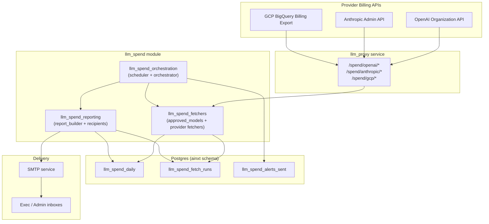
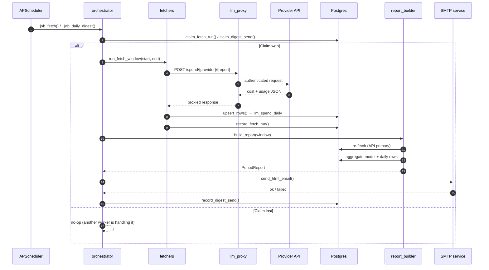

# LLM Spend Module

## Purpose

The `llm_spend` module tracks, aggregates, and reports organization-level LLM spend across the three billable providers used by the platform: **OpenAI**, **Anthropic**, and **Gemini (GCP)**. It is the authoritative source for executive cost visibility and is designed to:

- Fetch daily cost and token-usage data from each provider's admin/billing APIs (routed through [`llm_proxy`](llm_proxy.md)).
- Normalize and bucket raw model identifiers so spend is reported under stable canonical model names.
- Persist one row per `(usage_date, provider, model, source)` into `ainxt.llm_spend_daily`.
- Generate and email periodic executive digests: **daily**, **weekly**, **monthly**, and **quarterly**.
- Handle late-arriving data (notably GCP's 6–24h BigQuery billing lag) via overnight retry loops and stale-data banners.
- Operate safely across multiple uvicorn workers through database-backed claim deduplication.

The module is intentionally independent of department- or user-level permissions: if a model has been used or is present in the registry defaults, it is tracked.

---

## Architecture Overview

### Key Design Decisions

| Decision | Rationale |
|----------|-----------|
| **Provider APIs are primary; DB is fallback** | Every digest build re-fetches the window from the provider APIs before aggregating, so retroactive corrections from OpenAI/Anthropic and late GCP exports are reflected. |
| **API auth lives in `llm_proxy`** | The application workers do not hold OpenAI/Anthropic admin keys or GCP credentials; all billing API calls go through the dedicated proxy service. |
| **Multi-worker safe via DB claims** | APScheduler runs in every uvicorn worker. `claim_fetch_run` / `claim_digest_send` guarantee only one worker performs the actual API calls or SMTP send per window. |
| **Partial-outage shipping** | A digest ships as long as at least one provider has usable data. Only a total outage (all providers down) suppresses the email. |
| **Canonical model bucketing** | Raw model strings from providers and internal `model_usages` are normalized to stable keys, preventing duplicate rows when providers use dot vs. dash separators or display names. |

---

## Sub-modules

### 1. [llm_spend_fetchers](llm_spend_fetchers.md)

Responsible for pulling cost and usage data from each provider and writing it to `ainxt.llm_spend_daily`.

- **`approved_models.py`** — Defines the canonical model whitelist. A model is "approved for tracking" if it appears in `core.model_registry` defaults **or** has been observed in `ainxt.model_usages` within the trailing 90 days. Anything else is bucketed as `other`.
- **`fetchers/openai_costs.py`** — Calls `/spend/openai/costs` and `/spend/openai/usage` via `llm_proxy`, parses `line_item` strings into model IDs, and upserts daily rows.
- **`fetchers/anthropic_admin.py`** — Calls `/spend/anthropic/cost_report` and `/spend/anthropic/usage_report`, converts cent-denominated costs to USD, and upserts daily rows.
- **`fetchers/gcp_billing_bq.py`** *(referenced, not in core components)* — Queries GCP BigQuery for Gemini spend and exposes `window_is_settled()` for the overnight settle loop.
- **`fetchers/_common.py`** *(referenced, not in core components)* — Shared helpers: `FetchResult`, `SpendRow`, `upsert_rows`, `record_fetch_run`, `_proxy_post`.

### 2. [llm_spend_orchestration](../llm_spend_orchestration.md)

Coordinates when fetches and digests run, handles multi-worker deduplication, and manages the overnight Gemini settle loop.

- **`gateway_bootstrap.py`** — Owns the `AsyncIOScheduler`. Registers five cron jobs (evening fetch, daily/weekly/monthly/quarterly digests) and triggers a one-time 90-day backfill on first deploy.
- **`orchestrator.py`** — Public entrypoints for fetches (`run_daily_fetch`, `run_evening_fetch`, `run_fetch_window`, `backfill_if_empty`) and digests (`send_daily_digest`, `send_weekly_digest`, `send_monthly_digest`, `send_quarterly_digest`). Implements the partial-outage policy and the Gemini settle loop.

### 3. [llm_spend_reporting](../llm_spend_reporting.md)

Builds the executive report payload, renders email templates, and resolves recipients.

- **`report_builder.py`** — Aggregates `llm_spend_daily` into `PeriodReport` objects (provider totals, model breakdown, daily series, prior-period comparison, active users). Implements the API-primary re-fetch policy, freshness gap detection, failed-run detection, and SVG/ASCII sparklines.
- **`recipients.py`** — Resolves per-cadence `To:` and optional `Bcc:` lists from dedicated environment variables (`LLM_SPEND_DAILY_TO`, `LLM_SPEND_WEEKLY_TO`, etc.). Also retains legacy exec/admin helpers for ad-hoc use.

---

## Data Flow

---

## Digest Schedule

| Job | Default Cron (Asia/Kolkata) | Window Reported |
|-----|----------------------------|-----------------|
| `llm_spend_daily_fetch` | 21:00 daily | Today |
| `llm_spend_digest_daily` | 06:00 daily | Yesterday |
| `llm_spend_digest_weekly` | 10:00 Monday | Previous Monday–Sunday |
| `llm_spend_digest_monthly` | 10:00 1st of month | Previous calendar month |
| `llm_spend_digest_quarterly` | 10:00 1st of Jan/Apr/Jul/Oct | Previous calendar quarter |

All times are env-overridable (see [`llm_spend_orchestration`](../llm_spend_orchestration.md)).

---

## Multi-Worker Safety

Because `gateway_bootstrap.py` registers APScheduler jobs in **every** uvicorn worker, all workers fire the same cron events simultaneously. The module uses two database-backed claim functions (implemented in the referenced `alerts.py`):

- `claim_fetch_run(cadence, window_start, window_end, dedup_key)` — ensures one worker performs the provider API calls per window.
- `claim_digest_send(cadence, window_start, window_end, period_label)` — ensures one worker renders and sends the email per period.

If the claim fails, the worker no-ops and logs that another worker is handling the work. The design **fails open**: a database blip causes workers to fall back to the old behavior (all workers fetch/send) rather than skipping the job entirely.

---

## Source-of-Truth Policy

1. **Provider APIs are primary.** Every digest build re-invokes the fetchers for the report window and upserts `llm_spend_daily`.
2. **`llm_spend_daily` is the fallback.** If a fetcher fails, that provider's slice is sourced from existing rows.
3. **Freshness is surfaced.** `PeriodReport.source_of_truth` maps each provider to `"api"`, `"db_fallback"`, or `"skipped"`; `stale_providers` drives the email banner.
4. **Ship unless totally down.** A digest is cancelled only when **all** required providers lack usable data. Partial outages ship with surviving providers and alert the on-call list.

---

## Related Modules

- [`llm_proxy`](llm_proxy.md) — Proxies authenticated billing API calls to OpenAI, Anthropic, and GCP.
- [`shared_core_database`](../reference/shared_core.md#database) — Defines `llm_spend_daily`, `llm_spend_fetch_runs`, and related models in `db/models.py`.
- [`shared_api_routers_llm_spend_report_router`](../api/shared_api_routers.md#llm_spend_report_router) — Admin endpoints (`admin_fetch`, `admin_email_daily`, etc.) that call into the orchestrator.
- [`services_smtp_service`](../reference/shared_core.md#services) — Sends the rendered HTML/text emails.

---

## Operational Notes

- **GCP lag:** Gemini data is typically incomplete at 21:00 because GCP's BigQuery export lags 6–24 hours. The `run_gemini_until_settled` loop retries until 06:00 the next morning; if still unsettled, the digest ships with a stale-data banner.
- **First deploy:** A background thread runs a 90-day backfill if `llm_spend_daily` is empty. Controlled by `LLM_SPEND_BACKFILL_DAYS`.
- **Env-driven routing:** Each cadence has its own `To:` env var (`LLM_SPEND_DAILY_TO`, etc.). An empty var skips that digest and fires a misconfiguration alert.
- **Refetch disable:** Set `LLM_SPEND_DIGEST_REFETCH=0` to build reports purely from the DB (useful for tests or template debugging).
