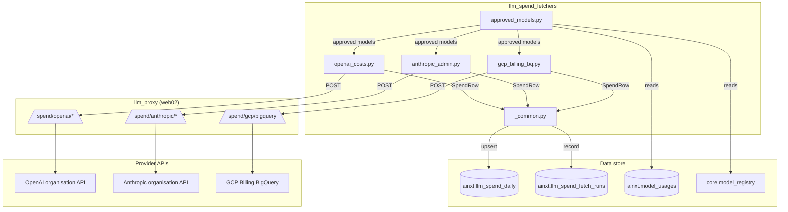
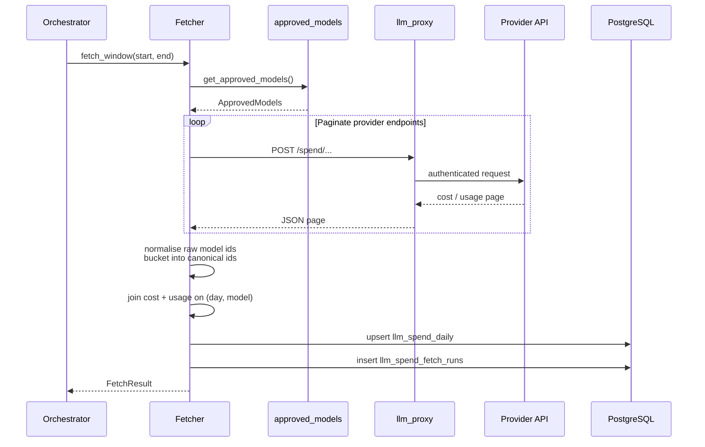

# llm_spend_fetchers

The `llm_spend_fetchers` module is the data-ingestion layer of the platform's LLM spend tracking system. It is responsible for pulling cost and usage data from external LLM provider APIs, normalising model identifiers, bucketing spend into canonical model families, and persisting the results into `ainxt.llm_spend_daily`. The module is intentionally narrow: it fetches, transforms, and upserts — it does not build reports, send digests, or enforce budgets. Those responsibilities live in sibling modules under [`llm_spend`](../llm_spend_orchestration.md) and are consumed by routers such as [`llm_spend_report_router`](../api/llm_spend_report_router.md).

## Core responsibilities

1. **Provider-specific fetching**
   - OpenAI organisation costs and token usage via the admin API.
   - Anthropic organisation cost and usage reports via the admin API.
   - Google Cloud / Vertex AI Gemini spend from the GCP Billing BigQuery export.
2. **Model canonicalisation**
   - Normalise raw model strings (display names, dated variants, provider prefixes) into stable keys.
   - Decide which models are "approved for tracking" by combining registry defaults with recently observed usage.
3. **Aggregation and persistence**
   - Join cost and usage streams on `(usage_date, provider, model)`.
   - Upsert rows into `ainxt.llm_spend_daily` with idempotent `ON CONFLICT` semantics.
   - Record every fetch attempt in `ainxt.llm_spend_fetch_runs` for audit and digest gating.
4. **Egress safety**
   - All external calls are routed through [`llm_proxy`](llm_proxy_main.md) on `web02`; `app02` carries no provider admin credentials.

## Module structure

```text
services/llm_spend/
├── approved_models.py          # ApprovedModels whitelist + cache
├── fetchers/
│   ├── __init__.py
│   ├── _common.py              # SpendRow, FetchResult, upsert, proxy client
│   ├── anthropic_admin.py      # Anthropic admin API fetcher
│   ├── openai_costs.py         # OpenAI admin API fetcher
│   └── gcp_billing_bq.py       # GCP BigQuery billing export fetcher
```

## Architecture



## Component reference

### `approved_models.py`

Defines the `ApprovedModels` whitelist and the `get_approved_models()` resolver.

- **Approved union**: a model is tracked if it appears in either
  - `core.model_registry` environment defaults, or
  - `ainxt.model_usages` within the trailing `LLM_SPEND_APPROVED_LOOKBACK_DAYS` (default 90 days).
- **Bucketing**: `ApprovedModels.bucket(provider, raw_model)` returns a canonical model id or the fallback string `other`.
- **Normalisation**: strips display-name wrappers, provider prefixes, dots, and non-alphanumeric characters so that variants such as `gpt-5.4-2026-06-01` and `gpt-5-4-2026-06-01` collapse to one key.
- **Provider detection**: regex-based attribution for OpenAI, Anthropic, and Gemini with a loose fallback for future variants.
- **Caching**: the resolved whitelist is cached for `LLM_SPEND_APPROVED_CACHE_TTL` seconds (default 60) so a single fetch run performs only one registry scan and one usage query. `clear_approved_models_cache()` forces a refresh.

### `fetchers/_common.py`

Shared infrastructure used by every fetcher.

| Component | Purpose |
|-----------|---------|
| `SpendRow` | Dataclass representing one `(usage_date, provider, model)` aggregate with cost, input/output tokens, and request count. |
| `FetchResult` | Dataclass returned by every `fetch_window` implementation, including status, window, rows, and optional error text. |
| `upsert_rows(rows, source)` | Bulk-upserts `SpendRow` objects into `ainxt.llm_spend_daily` using `ON CONFLICT (usage_date, provider, model, source)`. |
| `record_fetch_run(...)` | Writes an audit row to `ainxt.llm_spend_fetch_runs`. |
| `_proxy_post(path, body, timeout)` | POSTs to `LLM_PROXY_URL` with `X-Internal-Token`, retrying transient 5xx / 429 / connection errors up to three times. |

### `fetchers/openai_costs.py`

Implements `fetch_window(window_start, window_end)` for OpenAI.

- Calls `/spend/openai/costs` grouped by `line_item` (e.g. `gpt-5.4-2026-06-01 / input`).
- Calls `/spend/openai/usage` grouped by `model` for token counts and request counts.
- Splits the `line_item` string on the first comma to extract the model id.
- Re-keys both cost and usage dictionaries through `ApprovedModels.bucket` before joining, preventing the same canonical model from appearing on two rows when the raw keys differ.
- Persists with `source = "openai_costs_api"`.

### `fetchers/anthropic_admin.py`

Implements `fetch_window(window_start, window_end)` for Anthropic.

- Calls `/spend/anthropic/cost_report` grouped by `description`.
- Calls `/spend/anthropic/usage_report` grouped by `model`.
- Anthropic returns cost amounts in **cents**; the fetcher divides by 100 before storing USD.
- Prefers the structured `model` field on cost rows, falling back to parsing `description` only when `model` is absent.
- Re-keys through `ApprovedModels.bucket` before joining, matching the OpenAI fetcher's strategy.
- Persists with `source = "anthropic_admin"`.

### `fetchers/gcp_billing_bq.py`

Implements `fetch_window(window_start, window_end)` for Gemini via GCP Billing.

- Calls `/spend/gcp/bigquery` with a date window; the actual SQL, project, and table live on `llm_proxy`.
- Parses `sku_description` (e.g. `Gemini 2.5 Flash Input Token Count`) into canonical model ids.
- Classifies SKU rows as input or output tokens based on the description.
- Exposes `window_is_settled(target_date)`, which the [`orchestrator`](../llm_spend_orchestration.md) uses in the overnight Gemini settle loop.
- Uses a longer HTTP timeout (`LLM_SPEND_GCP_HTTP_TIMEOUT`, default 120s) because BigQuery scans can exceed the default 60s.
- Persists with `source = "gcp_bq_export"`.

## Data flow



## Provider-specific quirks

| Provider | Cost grouping | Usage grouping | Unit / note |
|----------|---------------|----------------|-------------|
| OpenAI | `line_item` | `model` | Dollars; `limit` up to 180 for costs, 31 for usage. |
| Anthropic | `description` | `model` | Cents; divide by 100. `limit` capped at 31. |
| Gemini (GCP) | BigQuery SKU rows | BigQuery SKU rows | Cost in dollars; input/output inferred from SKU description. |

## Interaction with the wider system

- **Triggered by**: [`services.llm_spend.orchestrator`](../llm_spend_orchestration.md) (`run_fetch_window`, `run_daily_fetch`, `run_evening_fetch`, `backfill_if_empty`).
- **Scheduled by**: [`services.llm_spend.gateway_bootstrap`](../llm_spend_orchestration.md) via APScheduler jobs registered in [`gateway.py`](gateway.md) startup.
- **Consumed by**: [`services.llm_spend.report_builder`](../llm_spend_reporting.md) and the [`llm_spend_report_router`](../api/llm_spend_report_router.md) for admin dashboards and email digests.
- **Depends on**: [`llm_proxy`](llm_proxy_main.md) for egress, [`core.model_registry`](../core_model_registry.md) for registry defaults, [`db.database`](../storage/database.md) for persistence, and [`ainxt.model_usages`](../storage/database.md) for recently observed models.

## Configuration

| Environment variable | Default | Description |
|----------------------|---------|-------------|
| `LLM_PROXY_URL` | — | Base URL of the `llm_proxy` service (required). |
| `LLM_PROXY_TOKEN` | — | Internal token for `X-Internal-Token` header. |
| `LLM_SPEND_APPROVED_LOOKBACK_DAYS` | 90 | Days of `model_usages` history to scan for approved models. |
| `LLM_SPEND_APPROVED_CACHE_TTL` | 60 | Seconds to cache the resolved `ApprovedModels`. |
| `LLM_SPEND_GCP_HTTP_TIMEOUT` | 120 | HTTP timeout for the GCP BigQuery proxy call. |

## Error handling and observability

- Any exception during fetch or upsert is logged, recorded in `llm_spend_fetch_runs` with status `failed`, and returned in `FetchResult.error_text`.
- `_proxy_post` retries 5xx, 429, and transport errors with exponential backoff up to three attempts.
- Fetch results are idempotent: re-running the same window simply re-upserts the same `(usage_date, provider, model, source)` rows.
- The orchestrator uses `llm_spend_fetch_runs` to detect missing or failed fetches before sending digests.

## Idempotency and concurrency

- Upserts use `ON CONFLICT (usage_date, provider, model, source)`, so repeated runs are safe.
- Multi-uvicorn-worker safety is handled upstream in the orchestrator via `claim_fetch_run`; the fetchers themselves are stateless.
- `get_approved_models()` uses a thread-safe TTL cache so concurrent fetchers in the same process share one resolution.
