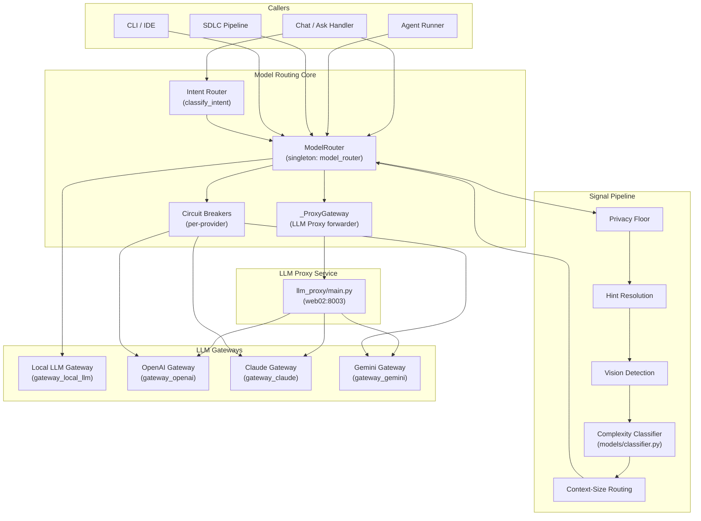
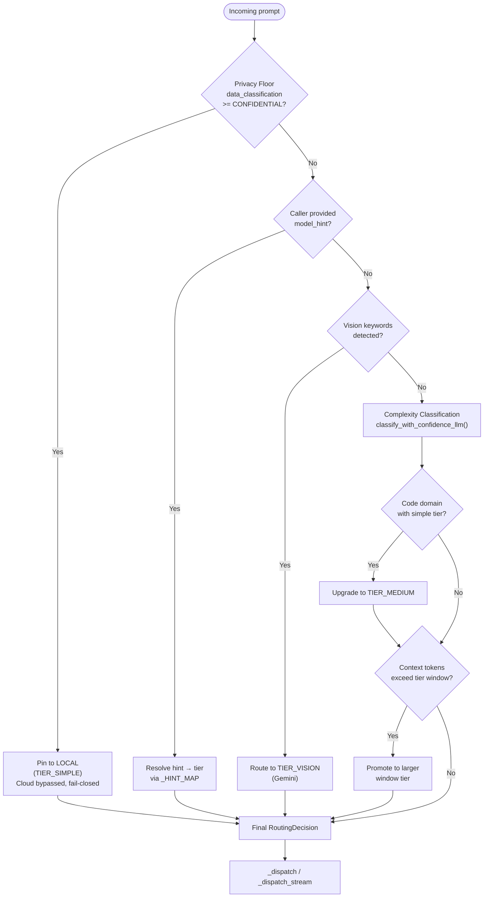
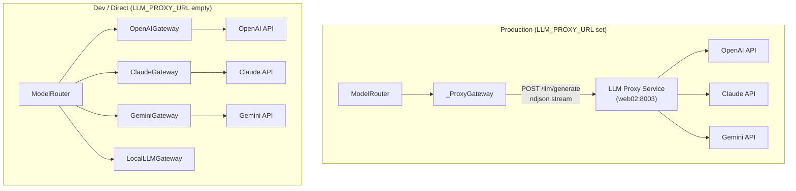

# Model Routing Core

## 1. Introduction & Purpose

The **Model Routing Core** module is the central intelligence layer that determines which LLM (Large Language Model) gateway handles each incoming prompt. It sits between the application's request handlers (chat, agent execution, SDLC pipelines, etc.) and the concrete provider gateways (OpenAI, Claude, Gemini, and in-house Local LLM).

Every prompt that enters the system is evaluated through a multi-signal routing pipeline:

1. **Privacy Floor** — Hard enterprise safety invariant that pins confidential/restricted data to on-premises models.
2. **Caller Hint** — Explicit model selection from the user, CLI, or IDE.
3. **Vision Detection** — Automatic detection of image/visual queries.
4. **Complexity Classification** — LLM-backed classification (with regex fast-path and Claude Haiku fallback) that assigns a complexity tier.
5. **Context-Size Routing** — Promotion to a larger-context-window model when the prompt's token footprint exceeds the tier's capacity.

The router then dispatches to the appropriate gateway with automatic **fallback chains** and **circuit breakers** per provider, ensuring high availability and graceful degradation.

---

## 2. Architecture Overview



### Key Design Principles

| Principle | Implementation |
|-----------|---------------|
| **Signal-based routing** | Routing decisions are derived from multiple signals (hint, vision, complexity, context size) evaluated in priority order. |
| **Approved models only** | A fixed routing table maps tiers to specific, approved model IDs from `core/model_registry.py`. Blocked models are never used. |
| **Privacy-first** | The privacy floor runs *before* all other signals and cannot be overridden — confidential data never egresses to cloud providers. |
| **Fail-safe fallback** | Every tier has a defined fallback chain. Circuit breakers per provider prevent cascading failures. |
| **Thread-safe state** | Per-request metadata (model label, token counts, fallback info) is stored in `threading.local()`, preventing cross-request bleed under concurrent load. |
| **Lazy gateway init** | Gateways are initialized on first use, so import-time failures in one provider never crash the router. |

---

## 3. Routing Tiers & Model Mapping

The router defines a comprehensive tier system. Each tier maps to a specific approved model and has a defined fallback chain.

```mermaid
graph LR
    subgraph "Tier → Model"
        SIMPLE["simple<br/>→ Local LLM"]
        MINI["mini<br/>→ GPT-5 mini"]
        LOCAL_MINI["local_mini<br/>→ GPT-OSS-120B"]
        MEDIUM["medium<br/>→ GPT-5.4"]
        COMPLEX["complex<br/>→ Claude Sonnet 4.6"]
        HAIKU["haiku<br/>→ Claude Haiku"]
        DEEP["deep<br/>→ GPT-5-5"]
        TERA["tera<br/>→ GPT-5.6 Terra"]
        LUNA["luna<br/>→ GPT-5.6 Luna"]
        VISION["vision<br/>→ Gemini 2.5 Flash"]
        GEMINI["gemini<br/>→ Gemini (text)"]
        SOLUTION["solution<br/>→ Claude Opus 4.7"]
        OPUS48["opus-4-8<br/>→ Claude Opus 4.8"]
        OPUS5["opus-5<br/>→ Claude Opus 5"]
        SONNET5["sonnet-5<br/>→ Claude Sonnet 5"]
    end
```



### Fallback Chains

| Tier | Primary | Fallback 1 | Fallback 2 | Terminal |
|------|---------|------------|------------|----------|
| simple | Local LLM | GPT-5 mini | Claude Sonnet | error |
| mini | GPT-5 mini | Claude Haiku → local:kimi-k2.7 → local:glm-5.2 (via `CHAT_FALLBACK_CHAIN`) | — | error |
| medium | GPT-5.4 | Claude Sonnet | — | error |
| complex | Claude Sonnet | GPT-5.4 | — | error |
| deep | GPT-5-5 | Claude Sonnet | — | error |
| vision/gemini | Gemini | Claude Sonnet | — | error |
| solution | Claude Opus 4.7 | Claude Sonnet | — | error |
| opus-4-8 | Claude Opus 4.8 | Claude Sonnet | — | error |
| opus-5 | Claude Opus 5 | Claude Sonnet | — | error |
| sonnet-5 | Claude Sonnet 5 | Claude Sonnet 4.6 | — | error |

---

## 4. Signal Evaluation Pipeline



### Privacy Floor (Hard Invariant)

The privacy floor is the most critical enterprise safety feature. When a request carries data classified as `CONFIDENTIAL`, `RESTRICTED`, or `PCI_SENSITIVE`:

- The request is **pinned to the in-house Local model** (`TIER_SIMPLE`).
- Cloud providers (OpenAI, Claude, Gemini) are **bypassed entirely**.
- Even an explicit `model_hint` from the user is **ignored** — restricted data cannot be opted onto the cloud.
- If the local model is unavailable, the router **fails closed** (returns an error) rather than egressing to the cloud.
- Every enforcement is logged at `WARNING` level for SIEM/alerting.

### Context-Size Routing

When a prompt's estimated token footprint would exceed 80% of the selected tier's context window (configurable via `CONTEXT_FIT_FRACTION`), the router promotes to a larger-window tier:

| Tier | Context Window |
|------|---------------|
| simple / mini / local_mini / medium | 128K |
| deep / tera / luna | 256K |
| complex / haiku / solution / opus variants / sonnet-5 | 200K |
| vision / gemini | 1M |

Promotion ladder: `deep` (256K) → `gemini` (1M).

---

## 5. Sub-Module Documentation

The Model Routing Core is divided into two sub-modules, each documented separately:

### 5.1 Core Router Engine (`model_routing_core_router`)

The main routing engine containing `ModelRouter`, `_ProxyGateway`, `FallbackInfo`, `RoutingDecision`, and supporting functions. Handles signal evaluation, gateway dispatch, fallback chains, streaming, and async generation.

**Core components:** `ModelRouter`, `_ProxyGateway`, `FallbackInfo`, `classification_from_policy`, `_local_display_label`

📄 **[Detailed Documentation](../model_routing_core_router.md)**

### 5.2 Intent Classifier (`model_routing_core_intent`)

A lightweight intent classification layer that categorizes user questions as `code` or `general` using an LLM-backed classifier with Redis caching. Used by upstream services to determine whether a query should be routed to code-specific retrieval pipelines.

**Core component:** `classify_intent`

📄 **[Detailed Documentation](../model_routing_core_intent.md)**

---

## 6. Public API

The module exposes a **singleton** `model_router` instance of `ModelRouter`:

```python
from models.model_router import model_router

# Blocking generation (returns full string)
response = model_router.generate(
    prompt="Explain quantum computing",
    model_hint=None,               # auto-route
    data_classification="INTERNAL", # optional privacy tag
    return_meta=True,              # optional: returns {"text": ..., "meta": ...}
)

# Streaming generation (yields tokens)
for token in model_router.stream(prompt="Write a haiku"):
    if isinstance(token, dict) and "__stream_meta__" in token:
        meta = token["__stream_meta__"]  # in_tok, out_tok, model_label, tier, thinking
        continue
    print(token, end="", flush=True)

# Async generation (for IDE/CLI paths)
response = await model_router.async_generate(prompt, model_hint="complex")

# Structured generation (Claude content blocks with prompt caching)
response = model_router.generate_structured(blocks, model_hint="solution")

# Routing only (no generation)
decision = model_router.route(prompt, model_hint=None)
# → RoutingDecision(tier="complex", model="Claude Sonnet 4.6 (...)", ...)
```

### Intent Classification API

```python
from models.router import classify_intent

intent = classify_intent("How do I implement a binary search tree?")
# → "code" or "general"
```

---

## 7. Gateway Dispatch & LLM Proxy

### Direct vs. Proxy Mode

The router supports two deployment modes controlled by the `LLM_PROXY_URL` environment variable:



In production, all cloud model calls are forwarded to the internal LLM proxy service via `_ProxyGateway`. This provides:

- **Centralized compliance** — The backend gateway layer (Tier 1) performs compliance detection and redaction before forwarding to the proxy, which forwards text verbatim.
- **Connection pooling** — A persistent `httpx.Client` (200 max connections, 100 keepalive) eliminates per-request TCP handshake overhead.
- **Streaming preservation** — Raw byte streaming with manual newline splitting ensures per-token flush (bypassing httpx's buffering layer that can batch tokens).
- **Circuit breaker integration** — Per-provider breakers (`_CB_LOCAL`, `_CB_OPENAI`, `_CB_CLAUDE`, `_CB_GEMINI`) gate all dispatch calls.

### Circuit Breaker Configuration

| Provider | Failure Threshold | Recovery Timeout |
|----------|------------------|-----------------|
| local | 3 | 30s |
| openai | 5 | 60s |
| claude | 5 | 60s |
| gemini | 5 | 60s |

---

## 8. Thread-Local State & Metadata

The `ModelRouter` uses `threading.local()` to store per-request state, ensuring concurrent requests (under uvicorn + FastAPI threadpool) never overwrite each other's metadata:

| Property | Type | Description |
|----------|------|-------------|
| `last_model_label` | `str` | Human-readable model label (e.g., `"Claude Sonnet 4.6 (claude-sonnet-4-6)"`) |
| `last_tier` | `str` | Routing tier used (e.g., `"complex"`) |
| `last_input_tokens` | `int` | Input tokens from the last call |
| `last_output_tokens` | `int` | Output tokens from the last call |
| `last_cache_read_tokens` | `int` | Prompt cache read tokens (Claude) |
| `last_cache_creation_tokens` | `int` | Prompt cache creation tokens (Claude) |
| `last_thinking_text` | `str` | Extended thinking content from Claude (if any) |
| `last_decision` | `FallbackInfo` | Fallback details from the last `generate()` call |

### Streaming Meta Sentinel

For streaming calls, the `stream()` method yields a final `__stream_meta__` dict as data (not thread state) to avoid cross-thread issues under anyio threadpool:

```python
{
    "__stream_meta__": {
        "in_tok": 150,
        "out_tok": 42,
        "model_label": "Claude Sonnet 4.6 (claude-sonnet-4-6)",
        "tier": "complex",
        "thinking": "..."  # extended thinking text if any
    }
}
```

---

## 9. Dependencies & Cross-References

### Internal Dependencies

| Dependency | Module | Purpose |
|------------|--------|---------|
| `core/model_registry.py` | [core_infrastructure](../infrastructure/core_infrastructure.md) | Approved model IDs, display labels, feature flags, blocked models |
| `core/circuit_breaker.py` | [core_infrastructure](../infrastructure/core_infrastructure.md) | Per-provider circuit breakers |
| `core/logger.py` | [core_infrastructure](../infrastructure/core_infrastructure.md) | Structured logging with request ID context |
| `core/proxy_tool_use.py` | [core_infrastructure](../infrastructure/core_infrastructure.md) | LLM proxy headers |
| `models/classifier.py` | (sibling) | Complexity classification with regex + LLM fallback |
| `core/config.py` | [core_infrastructure](../infrastructure/core_infrastructure.md) | Redis cache config (`RDB_CACHE`) |
| `core/kv` | [kv_store](../storage/kv_store.md) | Redis client for intent cache |
| `core/prompts.py` | [core_infrastructure](../infrastructure/core_infrastructure.md) | `INTENT_CLASSIFIER_PROMPT` template |

### External Gateway Modules

| Gateway | Module | Provider |
|---------|--------|----------|
| `gateway_local_llm.py` | [local_llm_gateway](local_llm_gateway.md) | In-house Local LLM (LiteLLM) |
| `gateway_openai.py` | [openai_gateway](openai_gateway.md) | OpenAI (GPT-5 family) |
| `gateway_claude.py` | [claude_gateway](claude_gateway.md) | Anthropic Claude |
| `gateway_gemini.py` | [gemini_gateway](gemini_gateway.md) | Google Gemini |

### Related Routing Modules

| Module | Description |
|--------|-------------|
| [model_routing_retrieval](../model_routing_retrieval.md) | Hybrid search, metadata retrieval, local model inference |
| [model_routing_knowledge_graph](../model_routing_knowledge_graph.md) | Graph resolution and KB expansion |
| [model_routing_versioning](../model_routing_versioning.md) | KB version resolution |
| [model_routing_document_intent](../model_routing_document_intent.md) | Document intent detection |
| [profiles](../reference/profiles.md) | Domain profiles, routing policy, context policy, response shaping |
| [router_policy](../api/router_policy.md) | Model spec, route request, routing policy |

---

## 10. Environment Variables

| Variable | Default | Description |
|----------|---------|-------------|
| `LLM_PROXY_URL` | `""` | LLM proxy service URL. When set, all cloud calls go through `_ProxyGateway`. |
| `LLM_TIMEOUT_SEC` | `300` | Total read timeout for LLM calls. Set to `0` to disable. |
| `PRIVACY_FLOOR_ENFORCE` | `true` | Enable/disable the privacy floor invariant. |
| `CONTEXT_SIZE_ROUTING` | `true` | Enable/disable context-size-based tier promotion. |
| `CONTEXT_FIT_FRACTION` | `0.8` | Fraction of context window that triggers promotion. |
| `SDLC_PER_LOOP_HTTP_CLIENT` | `1` | `1`=per-call async client (safe for RQ workers); `0`=shared singleton. |
| `ENABLE_OPUS` | — | Enables Claude Opus for solution tier. |
| `ENABLE_CLI_OPUS_5` | — | Enables Claude Opus 5 for CLI/IDE. |
| `ENABLE_GPT56_TERA` | — | Enables GPT-5.6 Terra variant. |
| `ENABLE_GPT56_LUNA` | — | Enables GPT-5.6 Luna variant. |
