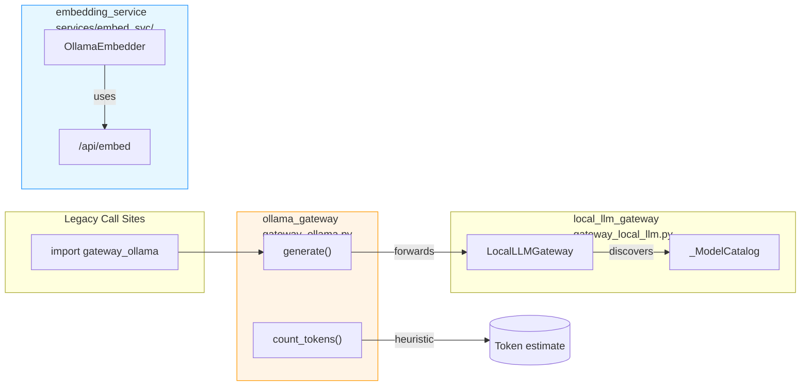
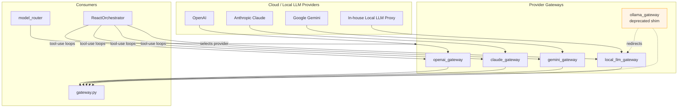
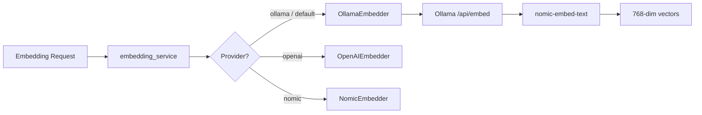
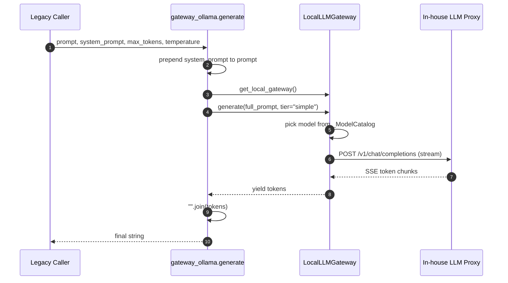
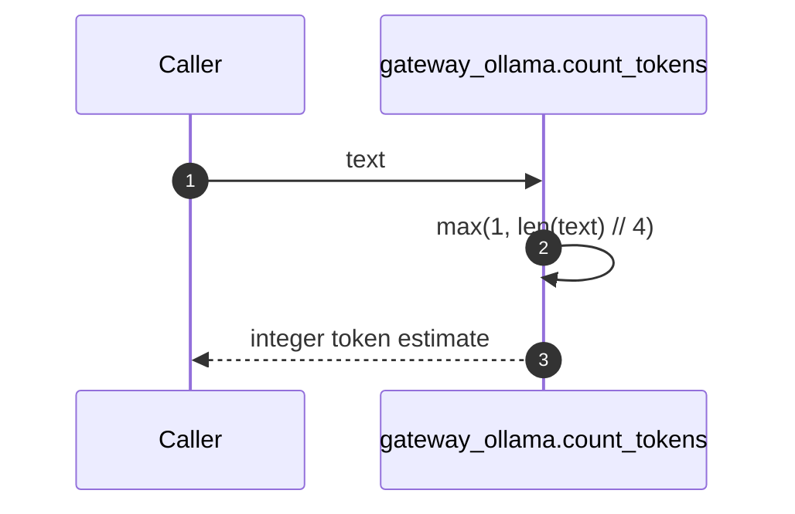
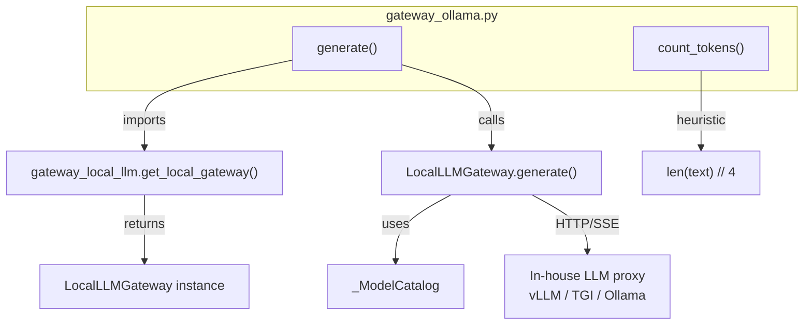
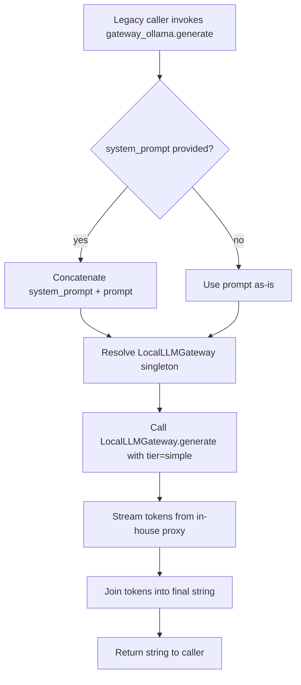

# Ollama Gateway

## Brief Introduction

The `ollama_gateway` module is a **deprecated compatibility shim** that preserves legacy import paths for code previously relying on Ollama for LLM inference. In the current architecture, all LLM inference is routed through the in-house [local_llm_gateway](local_llm_gateway.md) proxy, and Ollama is used **only** by the [embedding_service](../knowledge/embedding_service.md) for generating `nomic-embed-text` embeddings.

The module exposes two functions:

- `generate(...)` — redirects text generation requests to `LocalLLMGateway`.
- `count_tokens(text)` — returns a rough character-based token estimate.

> **Deprecation Notice:** New code should call `gateway_local_llm.get_local_gateway()` directly instead of importing `gateway_ollama`. This shim exists solely to avoid breaking older call sites.

---

## Module Purpose and Core Functionality

### Purpose

1. **Backward Compatibility:** Keep legacy `from gateway_ollama import generate` imports working without runtime errors.
2. **Inference Redirection:** Transparently forward any generation call to the canonical in-house local LLM proxy.
3. **Token Estimation Fallback:** Provide a simple, dependency-free token count heuristic for contexts that do not need exact tokenizer counts.

### Core Functions

| Function | Purpose | Behavior |
|----------|---------|----------|
| `generate(prompt, system_prompt="", max_tokens=4096, temperature=0.2)` | Text generation | Prepends `system_prompt` to `prompt` and streams the response from `LocalLLMGateway.generate(..., tier="simple")`. Returns the concatenated string. |
| `count_tokens(text)` | Token counting | Returns `max(1, len(text) // 4)` as a coarse 4-characters-per-token estimate. |

---

## Architecture and Component Relationships

### High-Level Position



### Gateway Ecosystem Context



### Relationship with Embedding Service

Although `ollama_gateway` no longer performs LLM inference, Ollama itself remains in use inside the platform through the dedicated embedding service:



See [embedding_service](../knowledge/embedding_service.md) for details on batching, caching, multi-instance load balancing, and fallback behavior.

---

## Data Flow

### `generate()` Redirection Flow



### `count_tokens()` Flow



---

## Component Interaction

### Internal Components



### External Dependencies

| Dependency | Module | Role |
|------------|--------|------|
| `core.logger` | [shared_core](../reference/shared_core.md) | Structured logging and request-id propagation. |
| `gateway_local_llm` | [local_llm_gateway](local_llm_gateway.md) | Canonical provider for local LLM inference. |
| `services/embed_svc` | [embedding_service](../knowledge/embedding_service.md) | The only production consumer of Ollama (`nomic-embed-text`). |

---

## Process Flows

### Legacy Generation Request Handling



### Token Estimation

```mermaid
flowchart TD
    A[Caller invokes count_tokens] --> B{len(text) < 4?}
    B -->|yes| C[Return 1]
    B -->|no| D[Return len(text) // 4]
```

---

## How It Fits into the Overall System

1. **Gateway Layer:** `gateway_ollama` sits alongside [openai_gateway](openai_gateway.md), [claude_gateway](claude_gateway.md), [gemini_gateway](gemini_gateway.md), and [local_llm_gateway](local_llm_gateway.md) as a provider-facing module. Unlike the others, it is not a first-class provider; it is a redirector.
2. **Model Router:** The [model_router](../reference/shared_core.md#model_routing) selects providers based on policy, cost, availability, and compliance. It does not select `ollama_gateway`; it selects `local_llm_gateway` when a local model is appropriate.
3. **Embedding Service:** Ollama's production role moved to the [embedding_service](../knowledge/embedding_service.md), where `OllamaEmbedder` calls `/api/embed` on one or more Ollama instances for `nomic-embed-text` embeddings.
4. **Request Tracing:** The shim relies on `core.logger.get_request_id()` to propagate the request ID through `LocalLLMGateway` and onward as `X-Request-ID` to the in-house LLM proxy.

---

## Migration Guidance

Replace legacy imports:

```python
# Deprecated
from gateway_ollama import generate
result = generate(prompt, system_prompt="...")

# Recommended
from gateway_local_llm import get_local_gateway
gw = get_local_gateway()
result = "".join(gw.generate(prompt, tier="simple"))
```

For exact token counts, use the tokenizer exposed by the active provider or the platform's token utilities instead of `count_tokens()`.

---

## References

- [local_llm_gateway](local_llm_gateway.md) — Canonical local LLM inference gateway.
- [embedding_service](../knowledge/embedding_service.md) — Production Ollama consumer for `nomic-embed-text` embeddings.
- [openai_gateway](openai_gateway.md) — OpenAI provider gateway.
- [claude_gateway](claude_gateway.md) — Anthropic Claude provider gateway.
- [gemini_gateway](gemini_gateway.md) — Google Gemini provider gateway.
- [gateway](gateway.md) — Main API gateway that orchestrates provider selection.
- [shared_core](../reference/shared_core.md) — Core logging, compliance, and routing infrastructure.
