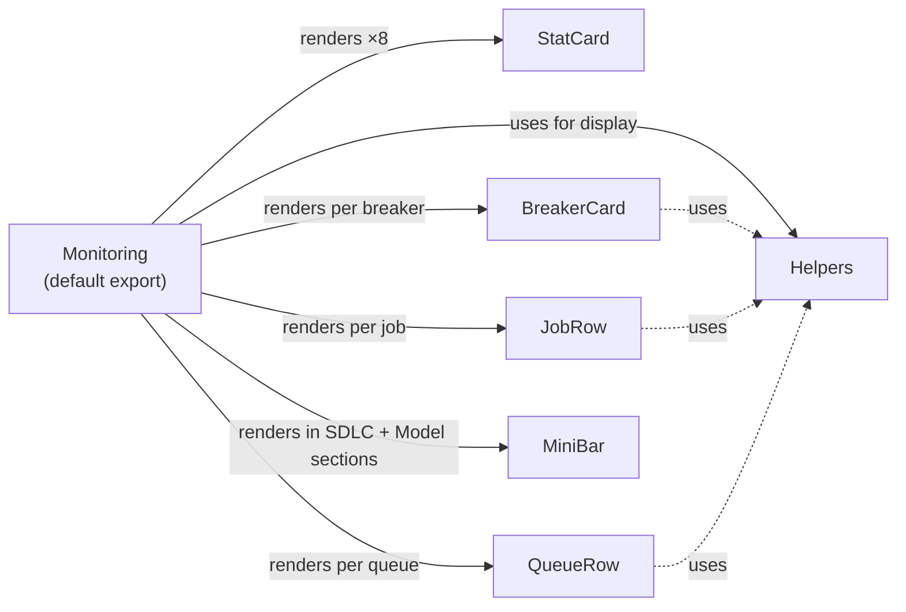
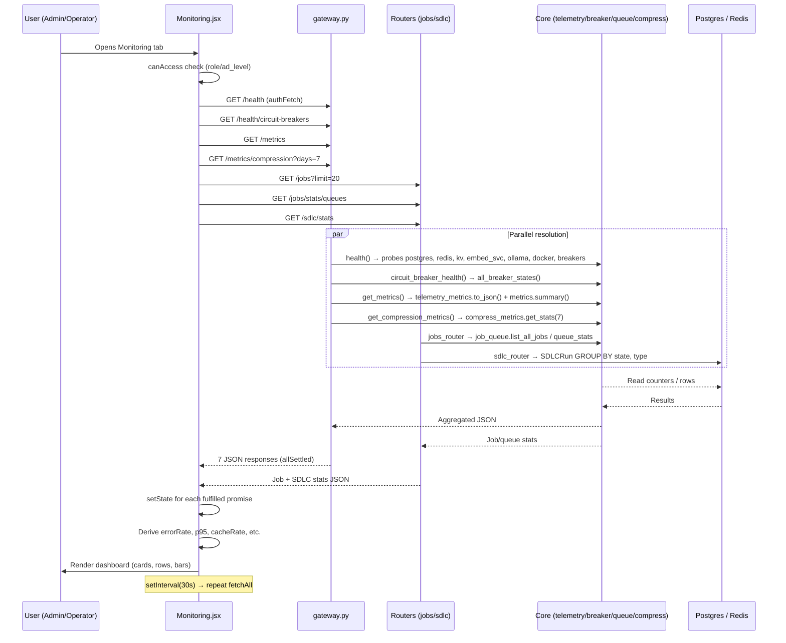
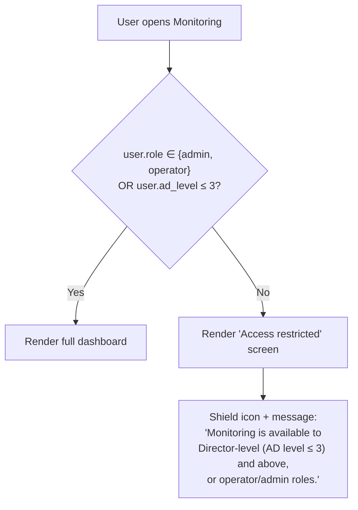
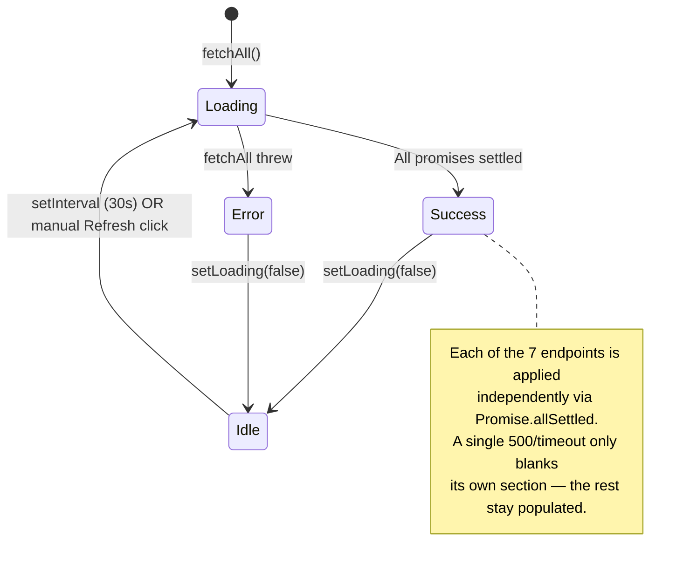
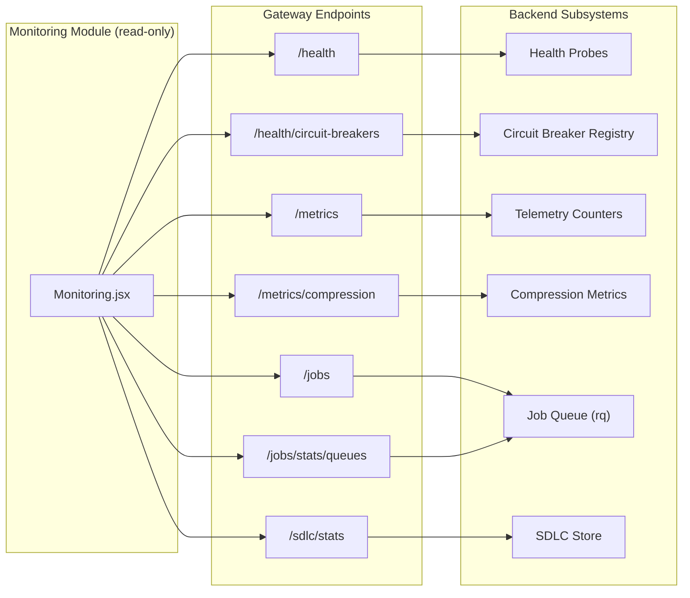

# Monitoring Module

## Overview

The **Monitoring** module is a real-time platform observability dashboard rendered in the `ai-ui` frontend. It provides administrators and operators a single-pane view of platform health, telemetry counters, circuit-breaker states, job-queue depth, SDLC pipeline statistics, model usage, and context-compression telemetry. The dashboard auto-refreshes every 30 seconds and is access-gated to Director-level (AD level ≤ 3) users, operators, and admins.

The module is a pure **read-only consumer** — it issues seven parallel `GET` requests against gateway endpoints on each refresh cycle and renders the aggregated JSON into a set of reusable card, row, and bar components. It does not mutate any backend state.

---

## Architecture

```mermaid
graph TB
    subgraph Frontend["ai-ui Frontend (React)"]
        Monitoring["Monitoring.jsx<br/>Dashboard orchestrator"]
        StatCard["StatCard"]
        BreakerCard["BreakerCard"]
        QueueRow["QueueRow"]
        JobRow["JobRow"]
        MiniBar["MiniBar"]
        Helpers["fmt · ago · fmtDuration"]
    end

    subgraph Gateway["gateway.py (FastAPI)"]
        HealthEP["GET /health"]
        CBEP["GET /health/circuit-breakers"]
        MetricsEP["GET /metrics"]
        CompressEP["GET /metrics/compression"]
    end

    subgraph Routers["Shared API Routers"]
        JobsRouter["jobs_router.py<br/>GET /jobs · GET /jobs/stats/queues"]
        SDLCRouter["sdlc_router.py<br/>GET /sdlc/stats"]
    end

    subgraph Core["shared_core"]
        Telemetry["core/telemetry.py<br/>_TelemetryMetrics · Tracer"]
        Breaker["core/circuit_breaker.py<br/>CircuitBreaker · all_breaker_states"]
        JobQueue["core/job_queue.py<br/>queue_stats · list_all_jobs"]
        CompressMetrics["core/compress_metrics.py<br/>get_stats"]
        MetricsLegacy["metrics.py<br/>Metrics.summary()"]
    end

    subgraph DataStores["Backing Stores"]
        Postgres[("Postgres<br/>ModelUsage · SDLCRun")]
        Redis[("Redis / RustyCluster<br/>KV DBs 0·5·9")]
    end

    Monitoring -->|authFetch| HealthEP
    Monitoring -->|authFetch| CBEP
    Monitoring -->|authFetch| MetricsEP
    Monitoring -->|authFetch| CompressEP
    Monitoring -->|authFetch| JobsRouter
    Monitoring -->|authFetch| SDLCRouter

    Monitoring --> StatCard
    Monitoring --> BreakerCard
    Monitoring --> QueueRow
    Monitoring --> JobRow
    Monitoring --> MiniBar
    Monitoring --> Helpers

    HealthEP --> Breaker
    HealthEP --> Postgres
    HealthEP --> Redis
    CBEP --> Breaker
    MetricsEP --> Telemetry
    MetricsEP --> MetricsLegacy
    MetricsEP --> Postgres
    CompressEP --> CompressMetrics
    CompressMetrics --> Redis

    JobsRouter --> JobQueue
    JobQueue --> Redis
    SDLCRouter --> Postgres

    Telemetry --> Postgres
    Telemetry --> Redis
    Breaker --> Redis
```

### Component Relationships

---

## Core Components

### `Monitoring` (default export)

The top-level dashboard component. Responsibilities:

| Concern | Detail |
|---|---|
| **Access control** | Renders an "Access restricted" screen unless `user.role` is `admin`/`operator` **or** `user.ad_level ≤ 3`. |
| **Data fetching** | `fetchAll()` issues seven parallel `authFetch` calls via `Promise.allSettled`. Each result is applied independently so a single endpoint failure does not blank the entire dashboard. |
| **Auto-refresh** | `useEffect` sets a 30-second `setInterval` calling `fetchAll`; cleared on unmount. |
| **State** | Holds `health`, `breakers`, `sdlcStats`, `jobs`, `telemetry`, `queues`, `compressStats`, `loading`, `lastRefresh`, `error`. |
| **Derived metrics** | Computes `errorRate`, `p95`, `avgLat`, `cacheRate`, `successRate`, `isHealthy`, `allClosed` from raw telemetry. |

**Sections rendered (top to bottom):**

1. **Header** — title, last-refresh timestamp (IST), overall health badge, manual Refresh button.
2. **Key Metrics Row 1** — Total Requests, Error Rate, p95 Latency, Compliance Blocks.
3. **Key Metrics Row 2** — Agent Executions (+ success rate), Cache Hit Rate, SDLC Runs, Circuit Breakers summary.
4. **Service Health** — grid of per-service check cards (postgres, redis, kv, embed_svc, ollama, docker, circuit_breakers) from `health.checks`.
5. **Circuit Breakers** — grid of `BreakerCard` instances.
6. **Queue Health** — list of `QueueRow` instances (one per queue).
7. **SDLC Stats** — two panels: Runs by State (bar chart via `MiniBar`) and Runs by Type.
8. **Model Usage** — per-model call/token/cost breakdown sorted by call count.
9. **Context Compression** — 7-day per-source reduction-percentage tiles.
10. **Recent Jobs** — table of the 20 most recent jobs via `JobRow`.

### `StatCard`

A reusable metric tile. Props:

| Prop | Type | Purpose |
|---|---|---|
| `icon` | Lucide icon component | Leading icon. |
| `label` | `string` | Metric name. |
| `value` | `string\|number` | Primary value (rendered `—` when null). |
| `sub` | `string` | Secondary caption. |
| `color` | `green\|red\|blue\|yellow\|purple\|orange\|gray` | Background + icon tint. |
| `pulse` | `boolean` | Shows an animated green dot (live indicator). |

### `BreakerCard`

Visualizes a single circuit breaker's state. Color logic:

| State | Color | Indicator |
|---|---|---|
| `CLOSED` | Green | Static dot |
| `HALF_OPEN` | Yellow | Pulsing dot |
| `OPEN` | Red | Pulsing dot |

Displays `failures / failure_threshold`, `recovery_timeout` (seconds), and `opened_at` (relative time via `ago()`).

### `QueueRow`

One row per job queue. Computes a health dot:

- **Red** — any failed jobs.
- **Yellow** — more than 20 started (running) jobs.
- **Green** — otherwise.

Shows `queued`, `started`, `finished`, `failed` counts and a fail-rate percentage.

### `JobRow`

A table row for a single job. Status badge color:

| Status | Color |
|---|---|
| `finished` | Green |
| `failed` | Red |
| `started` | Blue |
| `queued` | Yellow |

Displays the job function name (last segment after `.`), enqueue time (`ago()`), and duration (`fmtDuration()`).

### `MiniBar`

A horizontal progress bar. Given `value` and `max`, renders a colored fill at `width = (value/max × 100)%`. Used inside SDLC state/type breakdowns and the Model Usage section.

### Helper Functions

| Function | Signature | Description |
|---|---|---|
| `fmt` | `fmt(n, decimals=0)` | Locale-formatted number with optional decimal precision. Returns `—` for null. |
| `fmtDuration` | `fmtDuration(ms)` | Converts milliseconds to `Xs` or `Xm Ys`. |
| `ago` | `ago(iso)` | Relative time (`5s ago`, `12m ago`) for events < 1 hour old; falls back to `toIST()` for older timestamps. |

---

## Data Flow

---

## Backend Endpoint Contract

The dashboard depends on seven gateway endpoints. Each is fetched independently via `Promise.allSettled`, so partial failures degrade gracefully (the affected section simply omits data).

| # | Endpoint | Source | Key Fields Consumed |
|---|---|---|---|
| 1 | `GET /health` | `gateway.py::health` | `status` (`healthy`/`degraded`/`unhealthy`), `checks` (per-service status + latency) |
| 2 | `GET /health/circuit-breakers` | `gateway.py::circuit_breaker_health` | `breakers[]` → `{name, state, failures, failure_threshold, recovery_timeout, opened_at}` |
| 3 | `GET /sdlc/stats` | `sdlc_router.py::get_stats` | `total`, `by_state{}`, `by_type{}` |
| 4 | `GET /jobs?limit=20` | `jobs_router.py::list_jobs` | `jobs[]` → `{id, status, fn, enqueued_at, started_at, ended_at, error}` |
| 5 | `GET /metrics` | `gateway.py::get_metrics` | `telemetry{}` → `{requests_total, errors_total, p95_latency_ms, avg_latency_ms, cache_hits, compliance_blocks, agent_executions, agent_success, model_calls{}, model_tokens{}, model_cost_usd{}}` |
| 6 | `GET /jobs/stats/queues` | `jobs_router.py::queue_stats` | `{queue_name: {queued, started, finished, failed}}` |
| 7 | `GET /metrics/compression?days=7` | `gateway.py::get_compression_metrics` | `totals{source: {before, after, calls, reduction_pct}}` |

### Health Status Semantics

The `/health` endpoint classifies the overall platform status using a two-tier model:

| Condition | Overall Status |
|---|---|
| Postgres **or** Redis **or** RustyCluster KV unreachable | `unhealthy` |
| Any non-critical service (embed_svc, ollama, docker) down **or** ≥ 2 circuit breakers open | `degraded` |
| All checks pass | `healthy` |

> See [health_and_monitoring](health_and_monitoring.md) for the full probe list and failure-classification logic.

---

## Dependencies

### Frontend Dependencies

| Dependency | Usage |
|---|---|
| `react` (`useState`, `useEffect`, `useCallback`) | Component lifecycle and state management. |
| `lucide-react` | Icon set for section headers and stat cards. |
| `../config` (`API_BASE`, `authFetch`) | Authenticated fetch wrapper (JWT via httpOnly cookie). See [config](config.md). |
| `../utils/time` (`toIST`) | UTC → IST timestamp formatting. |

### Backend Dependencies

The monitoring dashboard is a read-only view over several backend subsystems. The table below maps each dashboard section to its backing module:

| Dashboard Section | Backend Module | Documentation |
|---|---|---|
| Service Health | `gateway.py::health` | [health_and_monitoring](health_and_monitoring.md) |
| Circuit Breakers | `core/circuit_breaker.py` | [core_infrastructure](core_infrastructure.md) |
| Key Metrics (requests, errors, latency, cache, compliance, agents) | `core/telemetry.py::_TelemetryMetrics` | [core_infrastructure](core_infrastructure.md) |
| Key Metrics (legacy summary) | `metrics.py::Metrics` | [observability](observability.md) |
| Queue Health + Recent Jobs | `core/job_queue.py` + `routers/jobs_router.py` | [shared_api_routers](shared_api_routers.md) |
| SDLC Runs by State/Type | `routers/sdlc_router.py::get_stats` | [sdlc_router](sdlc_router.md) |
| Context Compression | `core/compress_metrics.py` | [core_infrastructure](core_infrastructure.md) |
| Model Usage (calls/tokens/cost) | `core/telemetry.py::record_model_usage` | [core_infrastructure](core_infrastructure.md) |

---

## Access Control

The access check is performed **before** any API calls are issued, so unauthorized users never trigger backend load.

---

## Refresh Lifecycle

### Resilience Characteristics

- **Partial failure tolerance**: `Promise.allSettled` ensures one endpoint failure does not discard data from the other six. Each `fulfilled` result is applied to its own state slot; `rejected` results are silently skipped (the previous value persists).
- **No stale-clearing**: On a failed refresh, the previous successful data remains visible. Only `error` state is set if the entire `fetchAll` throws (network-level failure).
- **Manual refresh**: The header Refresh button calls `fetchAll()` directly; it is disabled while `loading` is true.
- **Auto-refresh cleanup**: The `useEffect` cleanup function clears the interval on unmount, preventing memory leaks when navigating away.

---

## Telemetry Data Model

The `/metrics` endpoint returns a `telemetry` object produced by `_TelemetryMetrics.to_json()`. The dashboard consumes these fields:

| Field | Type | Dashboard Usage |
|---|---|---|
| `requests_total` | `int` | StatCard "Total Requests" |
| `errors_total` | `int` | StatCard "Error Rate" (sub-text) |
| `p95_latency_ms` | `float` | StatCard "p95 Latency" |
| `avg_latency_ms` | `float` | StatCard "p95 Latency" (sub-text) |
| `cache_hits` | `int` | StatCard "Cache Hit Rate" |
| `compliance_blocks` | `int` | StatCard "Compliance Blocks" |
| `agent_executions` | `int` | StatCard "Agent Executions" |
| `agent_success` | `int` | Derived: success rate % |
| `model_calls` | `{model: int}` | Model Usage section (call counts) |
| `model_tokens` | `{model: int}` | Model Usage section (token counts) |
| `model_cost_usd` | `{model: float}` | Model Usage section (cost) |

> The Prometheus endpoint (`GET /metrics/prometheus`) augments in-memory counters with DB-backed values on each scrape so the dashboard always shows real numbers even after a gateway restart. See [core_infrastructure](core_infrastructure.md) for the dual-mode (in-memory + DB-seeded) counter design.

---

## Circuit Breaker Visualization

The dashboard renders one `BreakerCard` per registered breaker. Breakers are registered lazily via `get_breaker(name)` calls in `models/model_router.py` and other gateway modules. The `/health/circuit-breakers` endpoint imports `model_router` as a side-effect to ensure all four LLM-provider breakers (ollama, openai, claude, gemini) are registered even before any chat request has been processed.

| Breaker Name | Failure Threshold | Recovery Timeout | Typical Cause of OPEN |
|---|---|---|---|
| `jira` | 5 | 30s | Atlassian outage |
| `gitlab` | 5 | 30s | GitLab API degradation |
| `confluence` | 5 | 30s | Confluence unavailability |
| `openai` | 10 | 30s | OpenAI rate-limit / timeout |
| `anthropic` | 10 | 30s | Claude API errors |
| `google` | 10 | 30s | Gemini API errors |
| `ollama` | 8 | 20s | Local LLM process down |
| `embed_svc` | 8 | 15s | Embedding service unreachable |

> See [core_infrastructure](core_infrastructure.md) for the Redis-backed state machine (CLOSED → OPEN → HALF_OPEN → CLOSED) and the fail-open-on-KV-unavailable safety policy.

---

## Queue Health

The `/jobs/stats/queues` endpoint returns per-queue counts from `core/job_queue.py::queue_stats()`. The dashboard renders one `QueueRow` per queue. The platform maintains 14 priority queues:

| Queue | Purpose | Depth Limit |
|---|---|---|
| `high_priority` | Interactive chat callbacks, approval responses | 1000 |
| `default` | Agent single-turn runs | 500 |
| `chat_queue` | Interactive chat (Redis Stream SSE) | 500 |
| `sdlc_queue` | SDLC pipelines (long-running, LLM-heavy) | 100 |
| `agent_queue` | Named-agent runs | 100 |
| `index_queue` | Codebase indexing (CPU/IO heavy) | 200 |
| `kb_queue` | Knowledge-base doc ingest | 100 |
| `security_queue` | Security scans (SonarQube/Checkmarx) | 50 |
| `doc_queue` | Document generation (docx/pptx/pdf) | 500 |
| `connector_queue` | Async connector tool calls | 100 |
| `exec_queue` | Cowork run_code sandbox (Docker) | 200 |
| `tenx_queue` | 10x Award evaluation | 200 |
| `coach_queue` | Coach evaluator jobs | 500 |
| `dead_letter_queue` | Permanently failed jobs | — |

> See [shared_api_routers](shared_api_routers.md) for the full queue back-pressure and DLQ architecture.

---

## SDLC Statistics

The `/sdlc/stats` endpoint performs a SQL `GROUP BY` aggregation on the `sdlc_runs` table (no JSONB deserialization). The dashboard renders two panels:

### Runs by State

The dashboard maps each SDLC state to a color:

| State | Color | Meaning |
|---|---|---|
| `COMPLETE` | Green | Pipeline finished successfully |
| `FAILED` | Red | Pipeline terminated with error |
| `AWAITING_*` | Blue | Parked at a human-in-the-loop gate |
| `AWAITING_USER_INPUT` | Yellow | Waiting for analyst question answers |
| `TICKET_NORMALIZATION` | Sky | Normalization gate |
| `MANIFEST_VALIDATION` | Violet | Manifest validation stage |
| `PRE_CODING_BUILD` | Amber | Pre-coding build check |
| `SLT_RUNNING` | Cyan | System-level test execution |
| `CREATED` | Gray | Newly created, not yet started |

### Runs by Type

| Type | Color |
|---|---|
| `feature` | Purple |
| `bug` | Red |
| `pr_review` | Blue |

> See [sdlc_router](sdlc_router.md) for the full SDLC pipeline state machine and HITL gate lifecycle.

---

## Context Compression Telemetry

The `/metrics/compression?days=7` endpoint reads Redis HASH keys (`compress:metrics:{YYYY-MM-DD}`) from DB 9 and aggregates per-source reduction statistics. The dashboard renders one tile per source:

| Source Key | Display Label | Description |
|---|---|---|
| `ide_session` | IDE Session | IDE conversation context compression |
| `ide_tool` | IDE File Read | IDE file-read content compression |
| `sdlc_build` | SDLC Build Log | SDLC build-log compression |
| `sdlc_test` | SDLC Test | SDLC test-output compression |
| `rag_phase1` | RAG Dedup | RAG chunk deduplication |
| `lingua_rag` | LLMLingua-2 | LLMLingua-2 prompt compression |

Each tile shows the reduction percentage (color-coded: ≥80% green, ≥40% yellow, else gray), call count, and before → after character counts.

> See [core_infrastructure](core_infrastructure.md) for the Redis-backed counter design (8-day TTL, no hot-path DB writes).

---

## Model Usage Section

When `telemetry.model_calls` is non-empty, the dashboard renders a per-model breakdown sorted by call count (descending). For each model:

- A colored dot (cycling through 6 colors).
- Model name (truncated to 48 chars).
- A `MiniBar` proportional to that model's call count vs. total.
- Call count, token count (in K), and cost (in USD, 4 decimal places).

The underlying data is recorded by `telemetry_metrics.record_model_usage(model, tokens, cost_usd)` on every LLM call in the gateway. The `/metrics/prometheus` endpoint augments these in-memory counters from the `model_usage` Postgres table on each scrape so they survive restarts.

---

## Error Handling

| Scenario | Behavior |
|---|---|
| User lacks access | Renders "Access restricted" screen; no API calls issued. |
| Single endpoint returns 500/timeout | `Promise.allSettled` marks it `rejected`; the corresponding dashboard section retains its previous data (or renders empty if first load). Other sections update normally. |
| `fetchAll` throws (network failure) | `error` state is set; a red error banner is shown at the top. Previous data remains visible. |
| Endpoint returns unexpected shape | Defensive access (`?.`, `\|\| 0`, `\|\| []`) prevents crashes; the affected section shows `—` or empty. |
| `loading` is true | Refresh button shows a spinning icon and is disabled. |

---

## Integration Points

The Monitoring module integrates with the broader platform exclusively through read-only HTTP endpoints. It has no direct imports from backend modules and does not participate in any write path.

The dashboard is mounted in the `ai-ui` SPA's navigation (via `Sidebar.jsx`) and is accessible at the `/monitoring` route. It receives the authenticated `user` object from the `AuthContext` provider.
