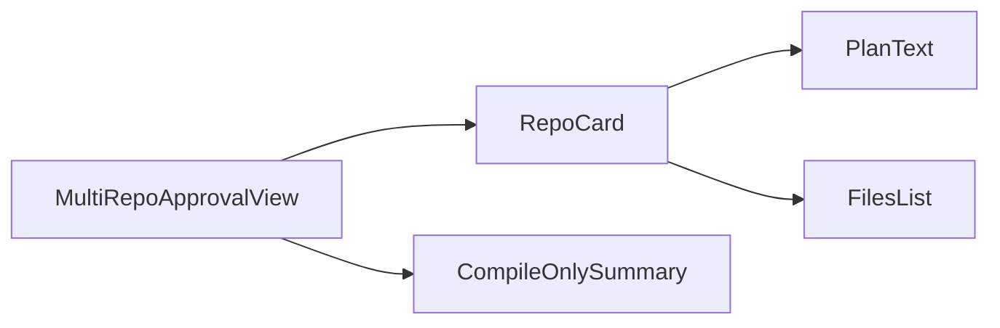
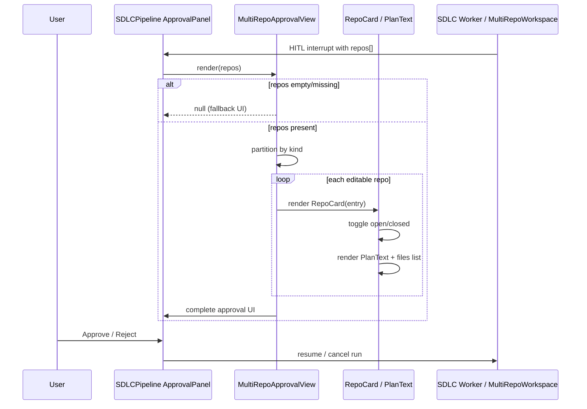
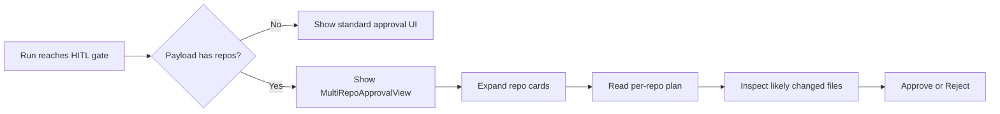
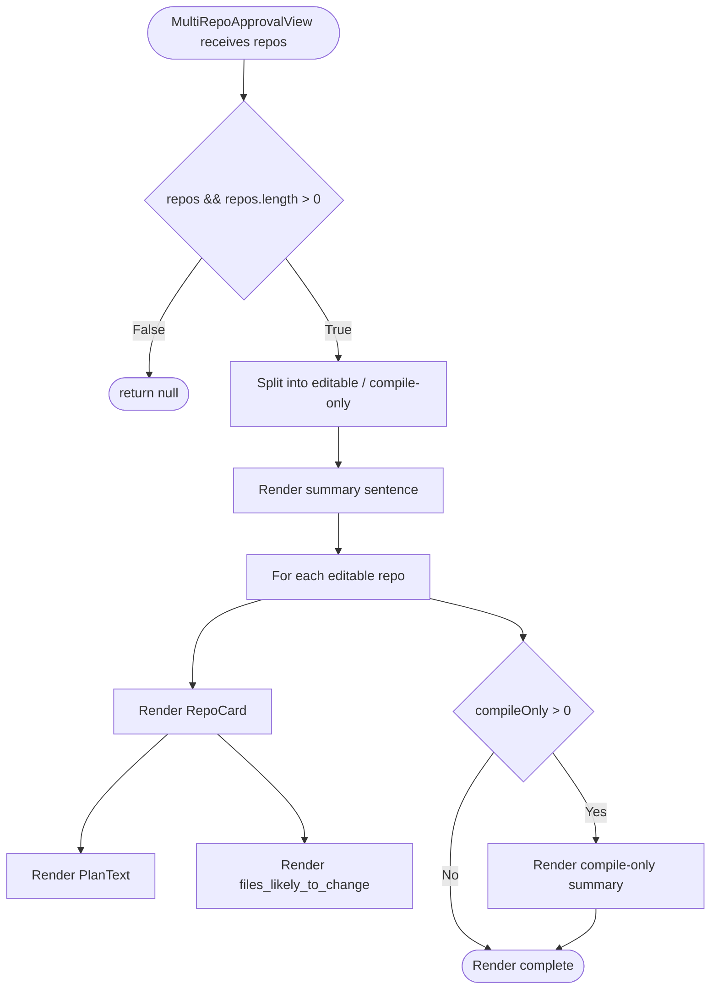

# Multi-Repo Approval View

## Brief Introduction

The **Multi-Repo Approval** module is a React UI component in the `ai-ui` frontend that renders per-repository plan details inside the SDLC [ApprovalPanel](sdlc_pipeline.md) when a Human-in-the-Loop (HITL) payload contains a `repos` array. It gives reviewers a compact, collapsible view of each repository's role (primary, editable, or compile-only), the design/plan markdown, and the files likely to change before they approve or reject a multi-repository run.

The module is intentionally thin and presentational: it receives a `repos` prop, partitions the entries by kind, and renders them with minimal local state for expand/collapse behavior. All business logic for producing the `repos` payload lives in the backend SDLC/agent workspace layer.

---

## Core Functionality

1. **Conditional rendering** — only appears when `repos` is present and non-empty; otherwise the parent [ApprovalPanel](sdlc_pipeline.md) falls back to its normal single-repo approval UI.
2. **Repository classification** — splits repositories into:
   * `primary` / `editable` repos that will receive code changes and merge requests.
   * `compile-only` repos that are checked out only for classpath/build resolution.
3. **Plan visualization** — renders `per_repo_plan` markdown as readable pre-formatted text.
4. **Change preview** — lists `files_likely_to_change` for each editable repository.
5. **Collapsible cards** — each repository is shown in an expandable `RepoCard` so reviewers can focus on relevant entries.

---

## Architecture

```mermaid
flowchart TB
    subgraph Frontend["ai-ui Frontend"]
        A[SDLCPipeline / ApprovalPanel] -->|repos prop| B[MultiRepoApprovalView]
        B --> C[RepoCard]
        B --> D[Compile-only summary block]
        C --> E[PlanText]
        C --> F[Files likely to change list]
    end

    subgraph Backend["Backend / Shared Core"]
        G[SDLC Pipeline Worker] --> H[Multi-repo workspace builder]
        H --> I[HITL interrupt payload]
        I -->|repos[]| A
    end
```

### Component hierarchy



---

## Component Reference

### `MultiRepoApprovalView`

| Prop | Type | Description |
|------|------|-------------|
| `repos` | `RepoEntry[]` | Array of repository descriptors produced by the backend for a multi-repo run. |

**Behavior**
* Returns `null` if `repos` is missing or empty, letting the parent panel render its default approval UI.
* Filters repositories into `editableRepos` (`primary` or `editable`) and `compileOnly` (`compile-only`).
* Renders a summary sentence followed by one `RepoCard` per editable repo and a compact summary block for compile-only dependencies.

### `RepoCard`

| Prop | Type | Description |
|------|------|-------------|
| `entry` | `RepoEntry` | A single repository descriptor. |

**Behavior**
* Maintains local `open` state for expand/collapse.
* Shows the repository name, ref, and a color-coded `kind` badge.
* Renders the design/plan section via `PlanText`.
* Renders the list of `files_likely_to_change` when present.

### `PlanText`

| Prop | Type | Description |
|------|------|-------------|
| `text` | `string \| null` | Markdown plan text for a repository. |

**Behavior**
* Renders the plan inside a scrollable `<pre>` block with light wrapping.
* Shows a placeholder when no plan detail is available.

### `RepoEntry` shape

```typescript
interface RepoEntry {
  repo: string;                       // e.g. "npci/payments-sdk"
  ref?: string;                       // branch or tag
  kind: "primary" | "editable" | "compile-only";
  per_repo_plan: string | null;       // markdown design/plan text
  files_likely_to_change: string[];   // predicted changed paths
}
```

---

## Dependencies

### Internal modules

| Module | Relationship |
|--------|--------------|
| [sdlc_pipeline](sdlc_pipeline.md) | `MultiRepoApprovalView` is rendered inside the `ApprovalPanel` component of the SDLC pipeline UI. |
| [sdlc_governance_review](sdlc_governance_review.md) | Governance review panels may surface the same multi-repo run metadata; this view is the approval-time counterpart. |
| [diff_approval](diff_approval.md) | Related diff-approval UI for code changes; multi-repo approval happens before diff-level review in the HITL flow. |
| [codebase_manager](codebase_manager.md) | Manages repository access and indexing; the `repo` identifiers in the payload originate from the codebase/product configuration. |
| [shared_core agent_system workspace_utilities](shared_core.md) | Backend `agents/multi_repo_workspace.py` builds the multi-repo workspace and produces the `repos` payload. |

### External libraries

| Library | Usage |
|---------|-------|
| `react` | `useState` for local expand/collapse state. |
| `lucide-react` | `ChevronDown`, `ChevronRight`, `GitBranch`, `Code2` icons. |

---

## Data Flow



---

## Process Flow

### Reviewer experience



### Component render path



---

## Styling & UX Conventions

* Uses Tailwind CSS utility classes consistent with the rest of `ai-ui`.
* `primary` repos are highlighted in indigo, `editable` in green, and `compile-only` in gray.
* Plans are capped to `max-h-64` with vertical scrolling to keep the approval panel compact.
* File lists are capped to `max-h-32` with vertical scrolling.
* Cards default to open so reviewers see the most important information immediately.

---

## Integration Notes

* The component is **purely presentational** and does not fetch data or manage approval actions. It relies on the parent [SDLCPipeline](sdlc_pipeline.md) `ApprovalPanel` to pass the `repos` array and to handle `Approve` / `Reject` button clicks.
* The backend contract for `repos` is defined by the multi-repo workspace builder in [shared_core agent_system workspace_utilities](shared_core.md). Any change to the `RepoEntry` shape must be kept in sync with both the backend producer and this frontend consumer.
* Because the codebase does not include a markdown renderer, `PlanText` intentionally renders plan text in a `<pre>` block to avoid adding a dependency for a rarely-used presentational path.

---

## Related Documentation

* [sdlc_pipeline](sdlc_pipeline.md) — parent SDLC pipeline UI and approval actions.
* [sdlc_governance_review](sdlc_governance_review.md) — governance review panel for the same runs.
* [diff_approval](diff_approval.md) — diff-level approval UI that may follow multi-repo approval.
* [codebase_manager](codebase_manager.md) — repository and codebase management.
* [shared_core](shared_core.md) — backend multi-repo workspace builder (`agents/multi_repo_workspace.py`).
