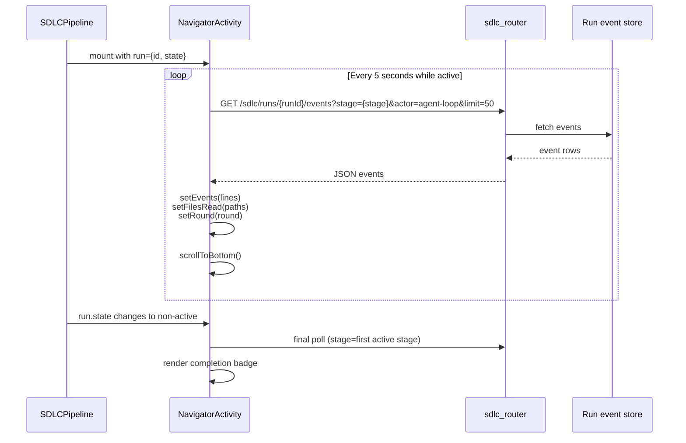
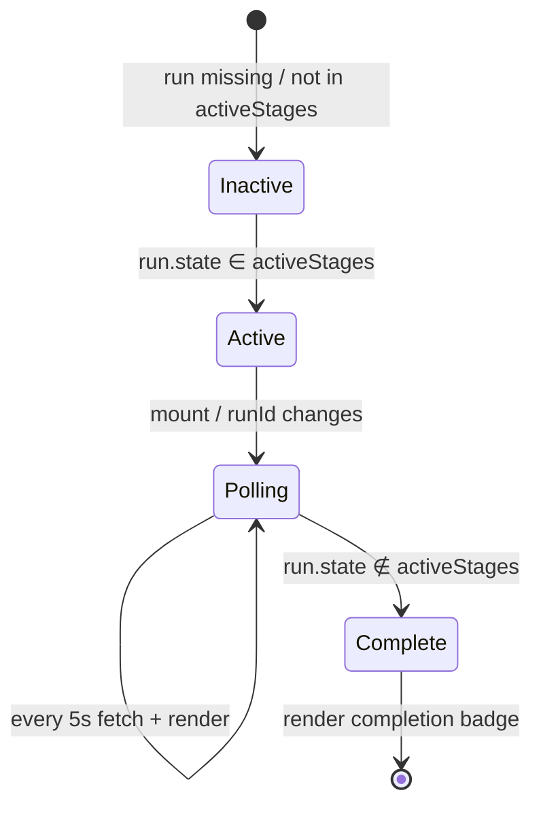
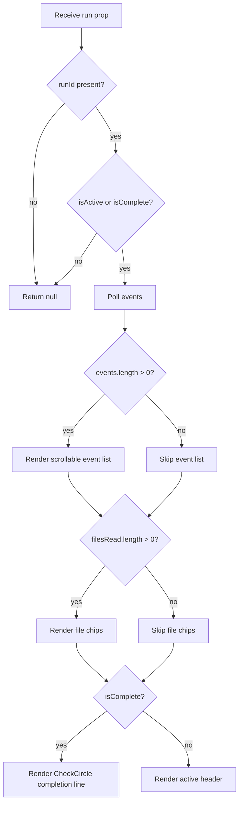

# Navigator Activity

The **Navigator Activity** module is a React UI panel in the `ai-ui` frontend that provides a live, real-time view of what the SDLC navigator / agent-loop is doing while a run is in an active exploration stage. It polls run events from the backend, renders each tool invocation as a color-coded line, surfaces the set of files the navigator has read, and reports when the navigator has finished.

---

## 1. Purpose & Core Functionality

When an SDLC run enters one of the exploration stages (for example `ANALYZING`, `DESIGNING`, `PLAN`, or `DIAGNOSING`), the user needs visibility into the agent's progress. `NavigatorActivity` fulfills that need by:

1. **Polling run events** every 5 seconds from the backend endpoint `/sdlc/runs/{runId}/events`.
2. **Filtering events** to the current active stage (or the first configured active stage when the run is complete).
3. **Rendering tool lines** with semantic icons for common navigator actions such as `grep`, `read_file`, `list_tree`, and cache hits.
4. **Extracting and deduplicating file paths** that the navigator has read.
5. **Detecting the current exploration round** from event text.
6. **Auto-scrolling** the event log to the latest entry.
7. **Showing a completion summary** once the run leaves the configured active stages.

The component is intentionally lightweight and read-only: it consumes the public SDLC events API and does not mutate run state.

---

## 2. Architecture

`NavigatorActivity` is a single-file React component with one small presentational helper.

### 2.1 Component Hierarchy

```text
NavigatorActivity (container)
├── useEffect #1  → polling logic + state updates
├── useEffect #2  → auto-scroll to bottom
├── ToolLine      → one rendered event line
└── UI chrome     → header, event list, file chips, completion badge
```

### 2.2 State

| State        | Type       | Purpose |
|--------------|------------|---------|
| `events`     | `string[]` | Raw output/message lines returned by the events endpoint. |
| `filesRead`  | `string[]` | Deduplicated file paths extracted from `read_file` / `explore-read` lines. |
| `round`      | `number`   | Current navigator round parsed from event text (`round=N`). |

### 2.3 Props

| Prop            | Type       | Default                                    | Purpose |
|-----------------|------------|--------------------------------------------|---------|
| `run`           | `object`   | required                                   | The SDLC run object; must contain `id` and `state`. |
| `activeStages`  | `string[]` | `['ANALYZING','DESIGNING','PLAN','DIAGNOSING']` | Stages that constitute "navigator is active". |

---

## 3. Component Interaction

The module interacts with three external layers:

1. **Parent SDLC UI** — typically the [SDLCPipeline](sdlc_pipeline.md) view — passes the current `run` object into `NavigatorActivity`.
2. **Backend SDLC events API** — the [sdlc_router](sdlc_router.md) exposes `/sdlc/runs/{runId}/events` and is consumed via `apiFetch` from [config](ai_ui_frontend_app_core.md#config).
3. **Agent loop / worker** — the [sdlc_agent_loop](shared_core_sdlc_pipeline.md#sdlc_agent_loop) and [sdlc_worker](workers.md#sdlc_pipeline_workers) produce the `agent-loop` actor events that this component displays.

```mermaid
flowchart LR
    subgraph Frontend["ai-ui frontend"]
        P[SDLCPipeline<br/>parent view]
        NA[NavigatorActivity]
        TL[ToolLine]
    end

    subgraph Backend["backend services"]
        SR[sdlc_router]
        AL[sdlc_agent_loop]
        SW[sdlc_worker]
    end

    P -->|run object| NA
    NA -->|GET /sdlc/runs/{runId}/events| SR
    SR -->|events| NA
    AL -->|emits agent-loop events| SW
    SW -->|persists events| SR
    NA -->|renders each line| TL
```

---

## 4. Data Flow



---

## 5. Event Parsing & Rendering

### 5.1 Polling Query

The component builds the request:

```
GET {API_BASE}/sdlc/runs/{runId}/events?stage={pollStage}&actor=agent-loop&limit=50
```

- `pollStage` is the current `run.state` while active, otherwise it falls back to the first entry in `activeStages` for a final scan.
- Only events where `actor=agent-loop` are requested, which isolates navigator activity from other run events.

### 5.2 Line Extraction

Each event is reduced to a single string:

```javascript
events.map(e => e.output || e.message || '').filter(Boolean)
```

### 5.3 File Path Extraction

The component looks for `read_file` or `explore-read` substrings, then extracts the first quoted path-like token matching `['"]([\w/.-]+\.\w+)['"]`.

### 5.4 Round Detection

A regex `/round[=s]+(\d+)/i` is applied to the joined event text to detect the current navigator round.

### 5.5 Icon Mapping (`ToolLine`)

| Text signal            | Icon (lucide-react) | Color     |
|------------------------|---------------------|-----------|
| `grep`                 | `Search`            | blue-400  |
| `read_file` / `read:`  | `FileText`          | green-400 |
| `list_tree`            | `Folder`            | amber-400 |
| cache hit              | `Database`          | gray-400  |
| default                | `Database`          | gray-400  |

Cache-hit lines are rendered at 40% opacity to de-emphasize them.

---

## 6. Process Flows

### 6.1 Active Run Lifecycle



### 6.2 Rendering Decision Tree



---

## 7. Dependencies

### 7.1 Direct Imports

| Import | Source | Purpose |
|--------|--------|---------|
| `useState`, `useEffect`, `useRef` | `react` | Component state, polling lifecycle, scroll anchor. |
| `Search`, `FileText`, `Folder`, `CheckCircle2`, `Database` | `lucide-react` | Semantic icons for tool lines. |
| `API_BASE`, `apiFetch` | `../config` | Backend base URL and authenticated fetch helper. See [config](ai_ui_frontend_app_core.md#config). |

### 7.2 Related Backend Modules

- [sdlc_router](sdlc_router.md) — serves the `/sdlc/runs/{runId}/events` endpoint.
- [sdlc_worker](workers.md#sdlc_pipeline_workers) — persists run events produced by the SDLC pipeline.
- [sdlc_agent_loop](shared_core_sdlc_pipeline.md#sdlc_agent_loop) — the agent loop that emits `agent-loop` actor events.

### 7.3 Related Frontend Modules

- [SDLCPipeline](sdlc_pipeline.md) — the primary parent view that hosts `NavigatorActivity` during SDLC runs.
- [ai_ui_frontend_app_core](ai_ui_frontend_app_core.md) — contains `App.jsx` and global configuration.

---

## 8. How It Fits Into the System

`NavigatorActivity` is a **user-observability component** in the broader SDLC experience. It does not drive the pipeline; instead, it translates low-level agent-loop events into a human-readable activity feed. This helps users understand:

- Which tools the navigator is invoking.
- Which files are being inspected.
- How many exploration rounds have elapsed.
- When the navigator has finished its current phase.

It is designed to be reusable: any parent that passes a `run` object with the expected shape can drop `NavigatorActivity` in, and the `activeStages` prop lets callers customize which stages should be treated as "navigator active".

---

## 9. Notes for Maintainers

- **Polling interval is fixed at 5 seconds.** If runs produce events faster than that, the `limit=50` query parameter caps the batch; consider increasing the limit or switching to server-sent events if latency becomes an issue.
- **File-path regex is best-effort.** It matches quoted path-like tokens ending in an extension. Unquoted or oddly formatted paths will not be captured.
- **Round detection is regex-based.** If the agent-loop changes its log format, the regex `/round[=s]+(\d+)/i` may need updating.
- **Cache-hit de-emphasis** is purely presentational; the underlying events are still shown.
- The component returns `null` when the run is not active and no cached events exist, keeping the UI clean.
