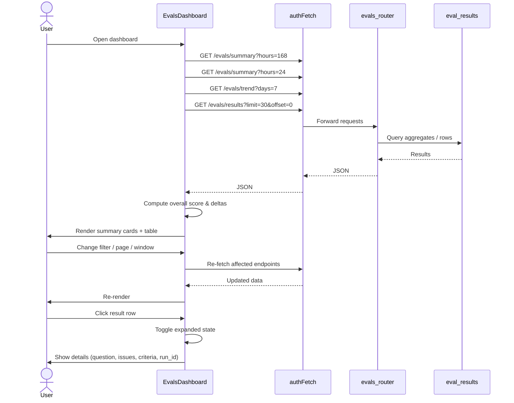
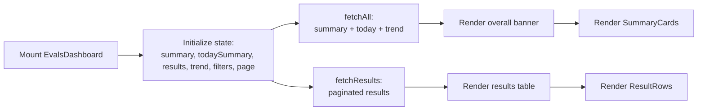
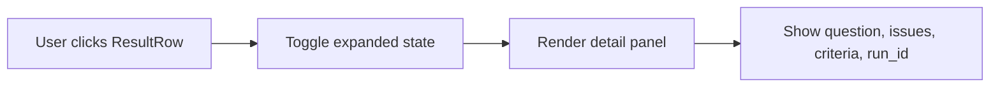
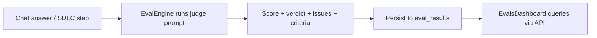

# Evals Dashboard

The **Evals Dashboard** is the AI-quality monitoring surface of the `ai-ui` frontend. It gives operators, developers, and administrators a real-time, drillable view into how well the platform's LLM outputs are performing across six automated quality checks. The dashboard consumes evaluation results produced by the backend `EvalEngine` and exposed through the `evals_router` API.

---

## 1. Purpose & Core Functionality

Every time the platform generates an answer, writes code, or advances an SDLC pipeline, a second LLM-as-judge run evaluates the output. The Evals Dashboard surfaces those judgments so teams can:

- **Detect regressions** in retrieval, groundedness, relevance, and code safety.
- **Compare today's quality** against the trailing window via delta badges and trend sparklines.
- **Inspect individual failures** with the judge's reasoning, criteria breakdown, and linked SDLC runs.
- **Filter and paginate** through historical results by check type and pass/warn/fail status.

The dashboard is read-only analytics; it does not trigger evaluations itself. Evaluation execution is handled by `core/evals.py` and persisted in the `eval_results` table.

---

## 2. Architecture Overview

```mermaid
flowchart TB
    subgraph Frontend["ai-ui Frontend"]
        ED["EvalsDashboard.jsx"]
        SC["SummaryCard"]
        RR["ResultRow"]
        TS["TrendSparkline"]
        AF[(authFetch)]
    end

    subgraph API["Shared API Routers"]
        ER["evals_router.py"]
    end

    subgraph Engine["Evaluation Engine"]
        EE["EvalEngine"]
    end

    subgraph Storage[("PostgreSQL")]
        DB["eval_results table"]
    end

    ED -->|GET /evals/summary| ER
    ED -->|GET /evals/trend| ER
    ED -->|GET /evals/results| ER
    ER --> DB
    EE -->|persist| DB
    ED --> AF
    AF --> ER
    ED --> SC
    ED --> RR
    ED --> TS
```

### Component Responsibilities

| Component | Responsibility |
|-----------|----------------|
| `EvalsDashboard` | Orchestrates data fetching, filtering, pagination, and overall score banner. |
| `SummaryCard` | Renders one quality-metric card with score, flag, counts, delta badge, and 7-day sparkline. |
| `ResultRow` | Renders a single evaluation result and an expandable detail panel. |
| `TrendSparkline` | Draws a 7-point SVG sparkline from daily average scores. |
| `ScoreBar` / `DeltaBadge` / `EmptyState` | Small presentational helpers for score bars, day-over-day deltas, and zero-data states. |
| `evals_router.py` | Exposes `/evals/summary`, `/evals/trend`, `/evals/results`, and run-scoped endpoints. |
| `EvalEngine` | Runs LLM-as-judge prompts and persists results. |

---

## 3. Data Model

Evaluations are stored in the `eval_results` table (see `db/models.py`):

| Field | Type | Description |
|-------|------|-------------|
| `id` | UUID | Primary key. |
| `eval_type` | String | One of the six check types. |
| `score` | Float | 0.0–1.0 score returned by the judge. |
| `reason` | Text | One-sentence explanation. |
| `session_id` | String | Chat session when applicable. |
| `run_id` | String | SDLC run when applicable. |
| `question` | Text | Truncated user question or ticket description. |
| `metadata_` | JSONB | Verdict, issues list, and criteria map. |
| `created_at` | DateTime | UTC timestamp. |

---

## 4. Supported Evaluation Types

The dashboard recognizes six evaluation types defined in `EVAL_META`:

| Key | Icon | Title | What It Checks |
|-----|------|-------|----------------|
| `retrieval_quality` | Search | Codebase Search Quality | Were the right files/functions retrieved for the question? |
| `groundedness` | Shield | Hallucination Check | Did the AI invent non-existent paths, functions, or APIs? |
| `relevance` | Brain | Answer Usefulness | Did the answer address the question with the right detail? |
| `code_quality` | Code2 | Generated Code Safety | Is generated code free of secrets, injection risks, and OWASP issues? |
| `sdlc_classification` | Layers | Ticket Classification Accuracy | Did the SDLC pipeline identify the real affected files? |
| `sdlc_solution` | GitBranch | Solution Design Validity | Are proposed solution paths real and the approach feasible? |

Each type maps to a color theme (`COLOR_MAP`) and a pass/warn/fail flag derived from the score:

- **PASS**: `score >= 0.70`
- **WARN**: `0.40 <= score < 0.70`
- **FAIL**: `score < 0.40`

---

## 5. API Endpoints Consumed

The dashboard calls three authenticated endpoints provided by [`evals_router.py`](evals_router.md):

### `GET /evals/summary?hours={hours}`

Returns aggregate pass/warn/fail counts and average score per `eval_type` for the selected lookback window. The dashboard fetches this twice:

1. With the user-selected window (default 168 hours) for the summary cards.
2. With `hours=24` for the "today" delta badges.

### `GET /evals/trend?days=7`

Returns daily average scores per `eval_type` for the last 7 days, used by `TrendSparkline`.

### `GET /evals/results?limit=30&offset={page*30}&eval_type={type}&min_score={x}&max_score={y}`

Returns paginated individual evaluation results. The dashboard maps the `filterFlag` value to score ranges:

| Filter | Query Params |
|--------|--------------|
| PASS | `min_score=0.7` |
| WARN | `min_score=0.4&max_score=0.699` |
| FAIL | `max_score=0.399` |

All requests are made through `authFetch`, which attaches credentials and a correlation header.

---

## 6. Component Interaction



---

## 7. Process Flows

### 7.1 Dashboard Load



### 7.2 Result Inspection



### 7.3 Evaluation Lifecycle (Backend Context)



---

## 8. Dependencies

### Frontend Dependencies

| Dependency | Module | Purpose |
|------------|--------|---------|
| `authFetch` | `ai-ui/src/config.js` | Authenticated HTTP client with credentials and retry logic. |
| `API_BASE` | `ai-ui/src/config.js` | Base URL for API calls. |
| `toIST` | `ai-ui/src/utils/time` | Converts UTC timestamps to IST for display. |
| `lucide-react` icons | External | Visual indicators for flags, check types, and trends. |

### Backend Dependencies

| Dependency | Module | Purpose |
|------------|--------|---------|
| `evals_router.py` | [`shared_api_routers`](evals_router.md) | Serves `/evals/*` endpoints. |
| `EvalEngine` | `core/evals.py` | Runs LLM-as-judge evaluations and writes to the database. |
| `EvalResult` model | `db/models.py` | Persistence schema for evaluation results. |

---

## 9. How It Fits Into the System

The Evals Dashboard is one of several analytics surfaces in `ai-ui`. It complements:

- **[`AgentAnalytics`](../agents/agent_analytics.md)** — focuses on per-agent usage and cost, whereas Evals Dashboard focuses on output quality.
- **[`Monitoring`](monitoring.md)** — tracks queue health and circuit breakers, not LLM judgment scores.
- **[`Coach`](../coach/coach.md)** — provides user-facing coaching recommendations derived from similar quality signals.
- **[`SDLCPipeline`](../sdlc/sdlc_pipeline.md)** — produces `sdlc_classification` and `sdlc_solution` evaluations that appear in the dashboard.
- **[`Chat`](../chat/chat.md)** / **[`KbChat`](../knowledge/kb_chat.md)** — generate `retrieval_quality`, `groundedness`, `relevance`, and `code_quality` evaluations in the background.

The dashboard is a pure consumer of the evaluation pipeline. It does not write evaluations, trigger retries, or modify SDLC state. For blocking SDLC quality gates, see `EvalEngine.eval_sdlc_classification` and `EvalEngine.eval_sdlc_solution`.

---

## 10. Configuration & Extensibility

### Adding a New Evaluation Type

1. Add the new type to `EVAL_META` in `EvalsDashboard.jsx` with `icon`, `color`, `title`, `what`, `good`, and `bad`.
2. Add a corresponding color entry to `COLOR_MAP` if a new color is introduced.
3. Ensure the backend `EvalEngine` persists results with the matching `eval_type` string.
4. The filter dropdown and summary cards will automatically include the new type.

### Score Thresholds

The dashboard shares its PASS/WARN/FAIL thresholds with the backend:

- `score >= 0.70` → PASS
- `0.40 <= score < 0.70` → WARN
- `score < 0.40` → FAIL

These thresholds are hardcoded in both `EvalsDashboard.jsx` (`scoreFlag`) and `evals_router.py` (flag logic). Keep them in sync when changing quality gates.

---

## 11. References

- [`evals_router.md`](evals_router.md) — Backend API for evaluation data.
- `core_evals.md` — LLM-as-judge evaluation engine.
- `db_models.md` — Database models including `EvalResult`.
- `ai_ui_frontend_config.md` — `authFetch` and `API_BASE` configuration.
- [`agent_analytics.md`](../agents/agent_analytics.md) — Related agent usage analytics.
- [`sdlc_pipeline.md`](../sdlc/sdlc_pipeline.md) — SDLC pipeline that produces SDLC evals.
- [`chat.md`](../chat/chat.md) / [`kb_chat.md`](../knowledge/kb_chat.md) — Chat surfaces that produce chat evals.
