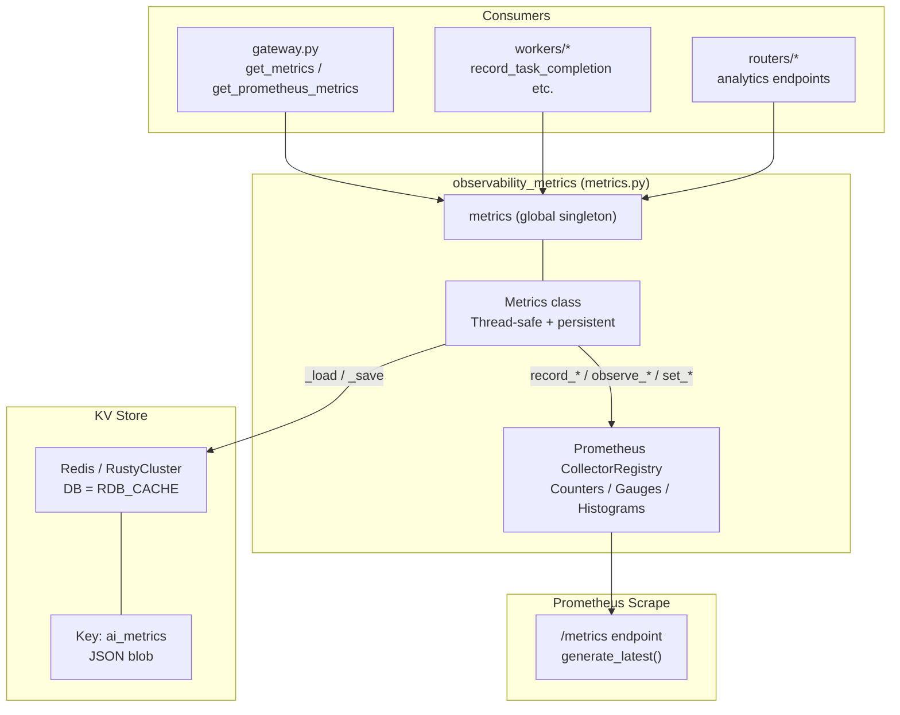
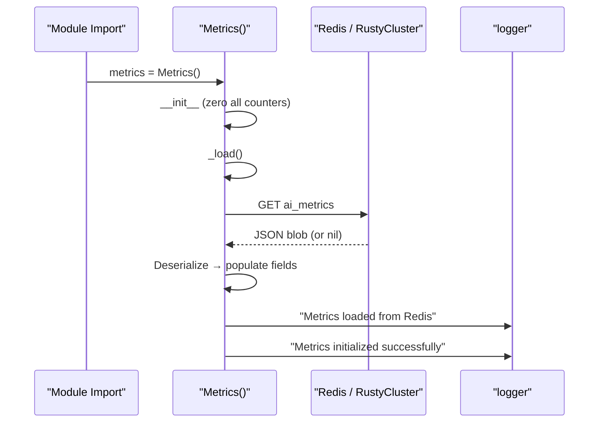
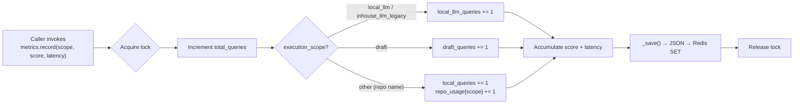
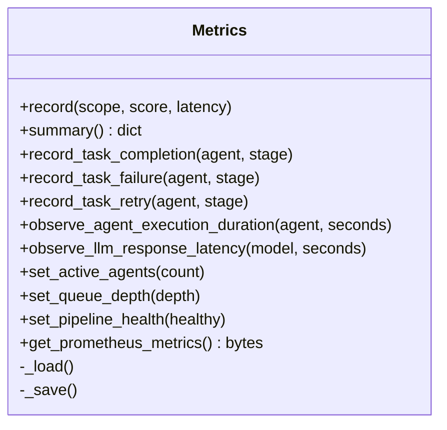
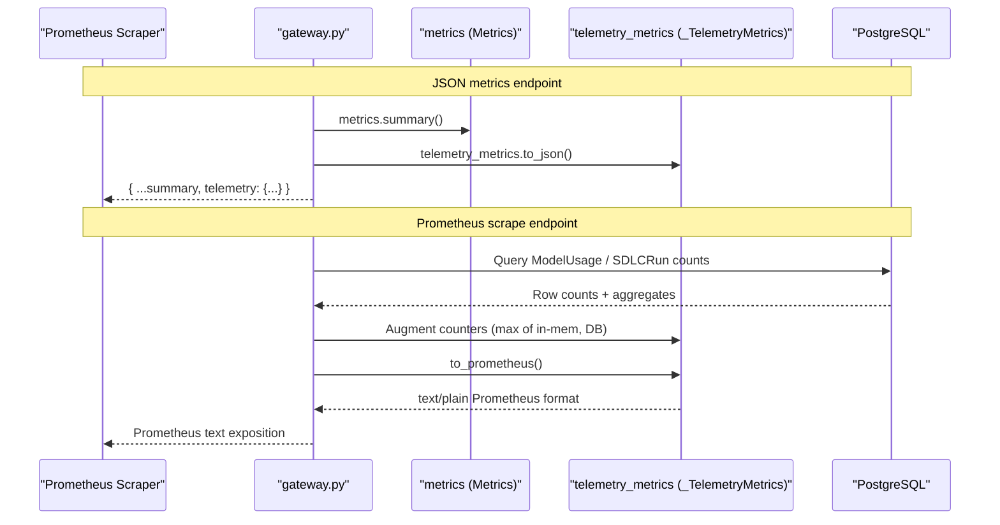
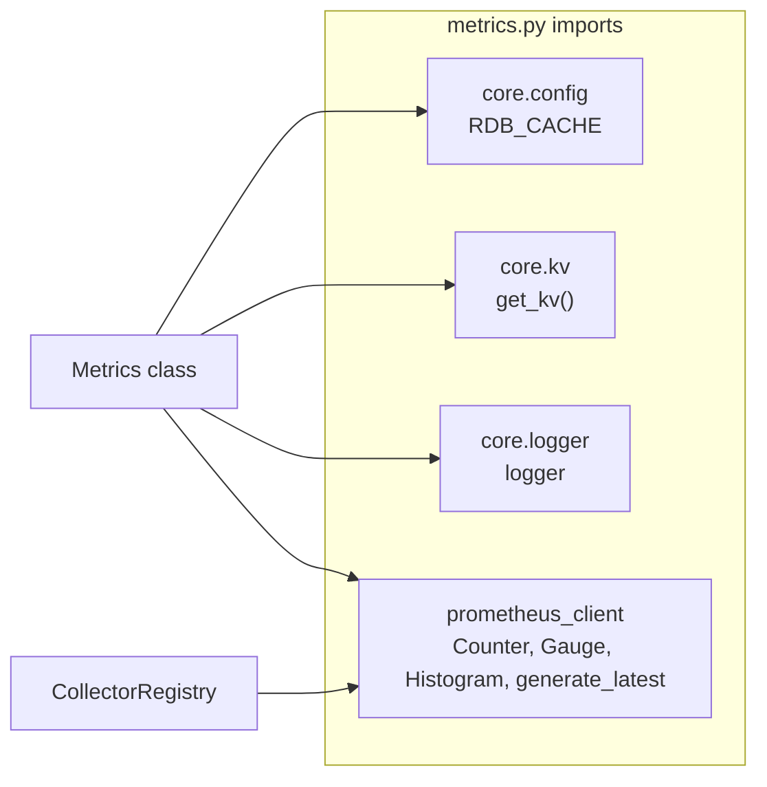
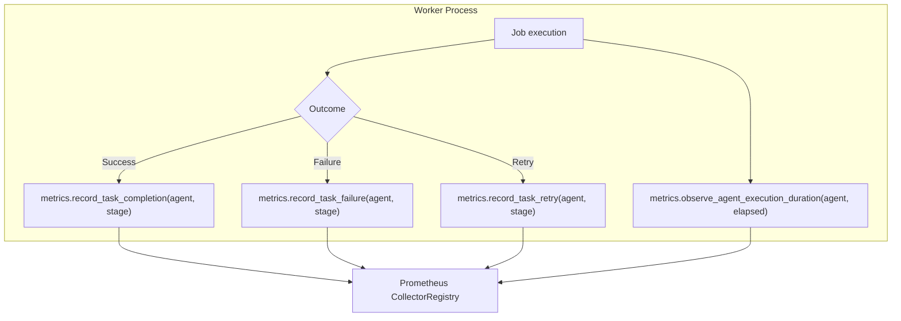
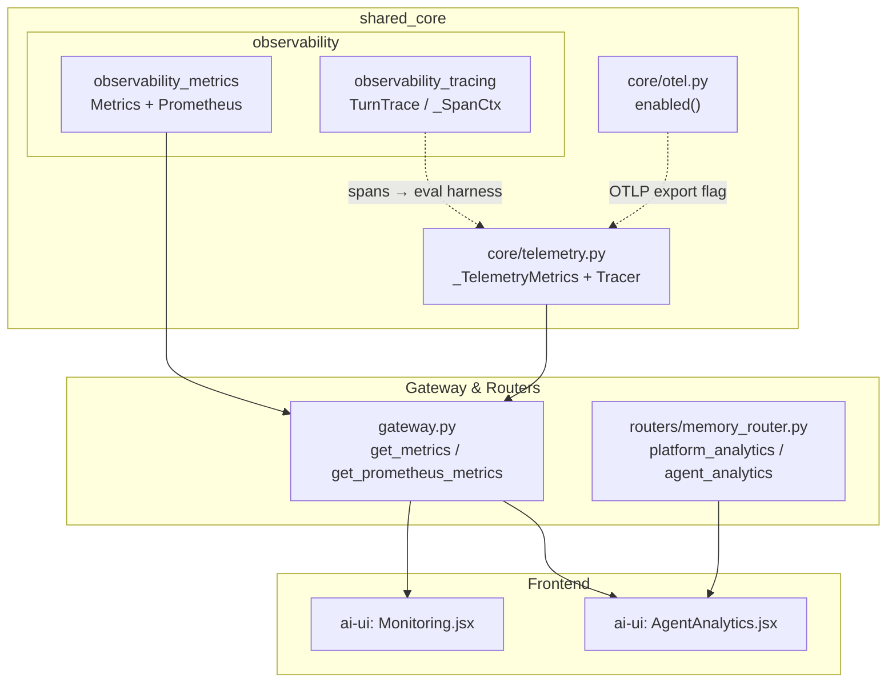

# Observability Metrics Module

## Introduction

The **observability_metrics** module (`metrics.py`) provides a thread-safe, persistent metrics collection layer for the platform. It combines two complementary observability strategies:

1. **Redis/RustyCluster-backed business metrics** — query counts, retrieval scores, latency, and per-repo usage that survive process restarts.
2. **Prometheus instrumentation** — counters, gauges, and histograms for task completions/failures, agent execution duration, LLM response latency, queue depth, pipeline health, and rate-limit rejections, all exposed via a standard `/metrics` scrape endpoint.

A single global `Metrics` instance (`metrics`) is instantiated at import time and shared across the gateway, routers, and worker processes.

---

## Architecture Overview



### Relationship to Sibling Observability Modules

The `observability` parent module contains two children:

| Child | File | Responsibility |
|-------|------|----------------|
| **observability_tracing** | `observability/trace.py` | Per-turn span collection (`TurnTrace`) correlated by `request_id`. See [observability_tracing.md](observability_tracing.md). |
| **observability_metrics** (this module) | `metrics.py` | Aggregate counters, gauges, histograms, and Redis-persisted business metrics. |

Additionally, `core/telemetry.py` provides a **separate** `_TelemetryMetrics` object (`telemetry_metrics`) that tracks request/agent/workflow counters, latency percentiles, and per-model cost. The gateway merges both in its `get_metrics` JSON endpoint. See [core_infrastructure.md](../core/core_infrastructure.md) for details on the telemetry layer.

---

## Core Component: `Metrics` Class

### Design Principles

- **Thread-safe** — all mutable state mutations are guarded by `threading.Lock`.
- **Persistent** — business counters are serialized to JSON and stored under the Redis key `ai_metrics` on every `record()` call; they are rehydrated from Redis on construction.
- **Fail-safe** — every public method wraps its body in `try/except` and logs via `core.logger`; metrics never crash a request.
- **Dual-mode** — business metrics (Redis) + Prometheus instrumentation (in-process registry) coexist in the same class.

### Initialization & Persistence



On startup the global singleton loads any previously persisted state. If the key is absent or deserialization fails, the instance starts from zero and logs the error — it never raises.

### State Fields

| Field | Type | Description |
|-------|------|-------------|
| `total_queries` | `int` | All recorded queries across all scopes. |
| `local_queries` | `int` | Queries routed to local retrieval (repo-scoped). |
| `local_llm_queries` | `int` | Queries escalated to a local LLM (`local_llm` / `inhouse_llm_legacy` scope). |
| `draft_queries` | `int` | Queries served from a draft cache (`draft` scope). |
| `repo_usage` | `defaultdict(int)` | Per-repo (execution-scope) query counts. |
| `total_retrieval_score` | `float` | Cumulative retrieval-strength scores. |
| `total_latency` | `float` | Cumulative latency (seconds). |

---

## Data Flow: Recording a Metric



The `record()` method is the primary entry point for business metrics. Each call:
1. Increments the appropriate scope counter.
2. Accumulates retrieval score and latency.
3. Persists the full state to Redis immediately (write-through).

---

## Prometheus Instrumentation

The module defines a dedicated `CollectorRegistry` (not the global default) with the following instruments:

### Counters

| Metric | Labels | Description |
|--------|--------|-------------|
| `task_completions_total` | `agent_name`, `pipeline_stage` | Successful task completions. |
| `task_failures_total` | `agent_name`, `pipeline_stage` | Failed tasks. |
| `task_retries_total` | `agent_name`, `pipeline_stage` | Retried tasks. |
| `rate_limit_exceeded_total` | `prefix`, `scope` | HTTP 429 rejections by endpoint prefix and scope. |

### Histograms

| Metric | Labels | Description |
|--------|--------|-------------|
| `agent_execution_duration_seconds` | `agent_name` | Wall-clock duration of agent runs. |
| `llm_response_latency_seconds` | `model` | LLM round-trip latency per model. |

### Gauges

| Metric | Labels | Description |
|--------|--------|-------------|
| `active_agents` | — | Current number of concurrently active agents. |
| `queue_depth` | — | Current job-queue depth. |
| `pipeline_health` | — | Binary health flag (1 = healthy, 0 = degraded). |

### Recording Methods



The Prometheus recording methods (`record_task_completion`, `observe_agent_execution_duration`, etc.) delegate directly to the `prometheus_client` instruments. Unlike the business metrics, these are **in-process only** — they reset on restart. The gateway's `get_prometheus_metrics` endpoint augments them with DB-backed values to avoid losing historical totals after a restart.

---

## Summary Endpoint

The `summary()` method returns a JSON snapshot of all business metrics:

```json
{
  "total_queries": 15234,
  "local_queries": 12000,
  "local_llm_queries": 2000,
  "draft_queries": 1234,
  "escalation_rate": 0.1313,
  "average_retrieval_score": 0.7821,
  "average_latency_ms": 342.50,
  "repo_usage": {
    "payments-service": 5000,
    "auth-gateway": 3000
  }
}
```

Key derived fields:
- **`escalation_rate`** — `local_llm_queries / total_queries` (fraction of queries that needed LLM escalation beyond local retrieval).
- **`average_retrieval_score`** — mean retrieval strength across all queries.
- **`average_latency_ms`** — mean latency converted to milliseconds.

---

## Integration with the Gateway



The gateway exposes two endpoints that consume this module:

1. **`get_metrics()`** — Returns `metrics.summary()` merged with `telemetry_metrics.to_json()` as a JSON payload. Used by the admin Monitoring dashboard.
2. **`get_prometheus_metrics()`** — Returns Prometheus text-format exposition from `telemetry_metrics.to_prometheus()`, augmented with DB-backed counts so a fresh restart never zeroes out historical totals.

> **Note:** The `Metrics.get_prometheus_metrics()` method (which calls `generate_latest()` on this module's private registry) is available for direct use, but the gateway's scrape endpoint currently delegates to the telemetry registry. Both registries can coexist; the module's registry is used by worker processes that call `record_task_completion` etc.

---

## Dependencies



| Dependency | Purpose |
|------------|---------|
| `core.config.RDB_CACHE` | Redis database index for the metrics cache. |
| `core.kv.get_kv()` | Factory that returns a Redis or RustyCluster client based on configuration. See [kv_store.md](../storage/kv_store.md). |
| `core.logger.logger` | Structured logging; all errors are caught and logged, never raised. See [core_infrastructure.md](../core/core_infrastructure.md). |
| `prometheus_client` | Standard Prometheus client library for counters, gauges, histograms, and text exposition. |

---

## Usage by Workers

Background workers (see [worker_orchestration.md](../workers/worker_orchestration.md)) call the Prometheus recording methods to instrument task lifecycle events:



Because each worker process has its own in-memory `CollectorRegistry`, Prometheus counters are process-local. The scrape endpoint on the gateway aggregates from the gateway process; for multi-process setups, a push gateway or shared exposition is recommended.

---

## Module Position in the System



The module sits within the `shared_core > observability` namespace alongside [observability_tracing.md](observability_tracing.md). While tracing captures per-request span trees, this module captures aggregate counters and time-series. The `core/telemetry.py` layer (see [core_infrastructure.md](../core/core_infrastructure.md)) provides a third, overlapping telemetry surface focused on request/agent/workflow counts and per-model cost — the gateway merges all three for its JSON and Prometheus endpoints.

---

## Key Design Decisions

| Decision | Rationale |
|----------|-----------|
| **Private `CollectorRegistry`** | Avoids polluting the global default registry; allows independent exposition and testing. |
| **Write-through persistence** | Every `record()` call saves to Redis immediately, ensuring no metric loss between saves. |
| **Lock-guarded mutations** | The global singleton is shared across threads in async gateways and worker processes. |
| **Fail-safe methods** | Observability must never break production traffic; all exceptions are caught and logged. |
| **Separation from telemetry** | `Metrics` tracks retrieval/query business metrics; `_TelemetryMetrics` tracks platform execution metrics. Both are surfaced together at the gateway. |
| **DB augmentation on scrape** | The Prometheus endpoint queries PostgreSQL to backfill in-memory counters after restarts, preventing historical data loss. |
