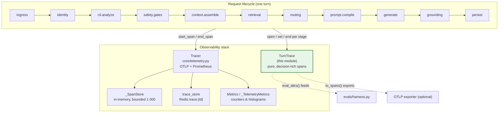
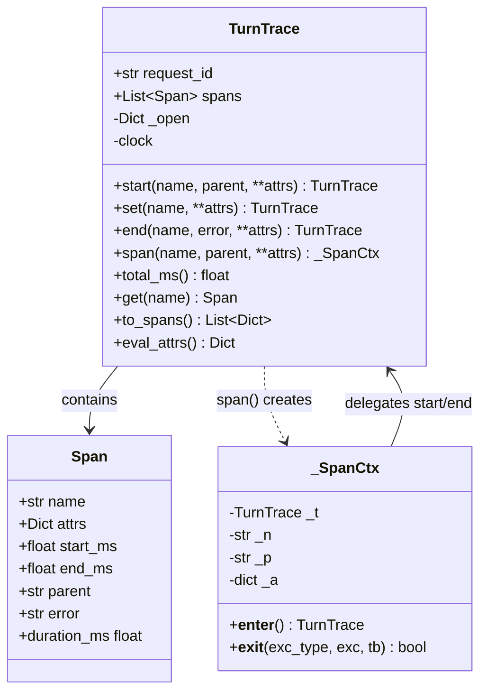
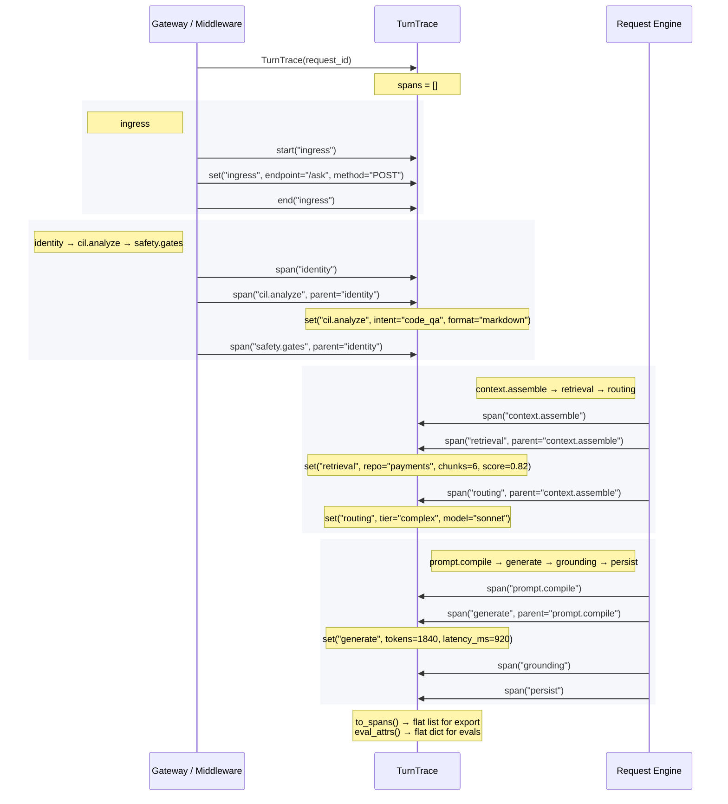
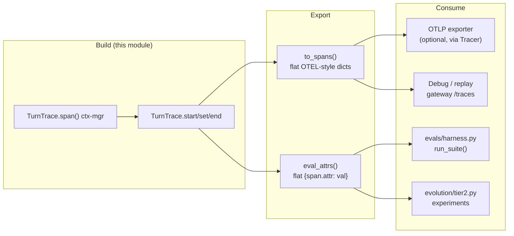
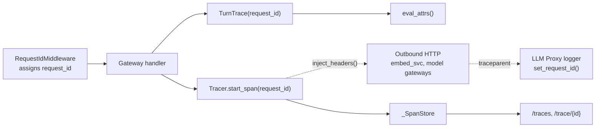
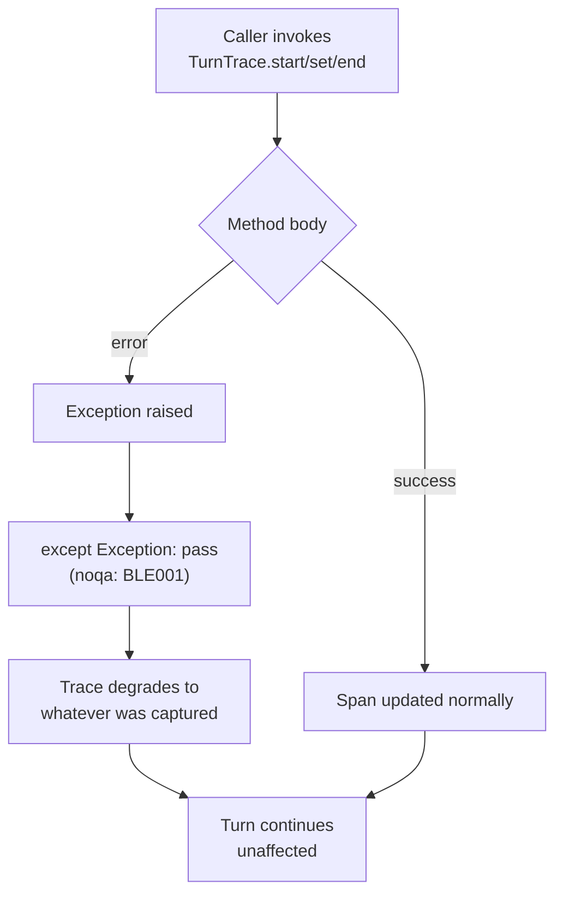

# Observability — Tracing (`observability_tracing`)

> **Module file:** `observability/trace.py`
> **Core components:** `TurnTrace`, `_SpanCtx`
> **Parent module:** [observability](observability.md) (sibling: [observability_metrics](observability_metrics.md))

## 1. Introduction

The `observability_tracing` module provides a **pure, in-memory per-turn trace builder** that captures the full decision lifecycle of a single request as a tree of correlated spans. Unlike a generic timing profiler, every span records its *decision inputs and outputs* — not just wall-clock duration — so the same instrumentation substrate can be used three ways:

1. **Debug** — reconstruct exactly what happened in a failed turn.
2. **Evaluate** — feed decision attributes into the eval harness (§18).
3. **Improve** — drive evolution / prompt-tuning experiments (§21).

This is the "instrument once, use three ways" principle described in `docs/architecture/19-observability.md §19.3 (O1)`.

The module is deliberately **decoupled from the OpenTelemetry (OTLP) export stack**. It assembles a `TurnTrace` structure that can be exported as a flat OTEL-style span list, but it does *not* import `core/otel.py` or any OTLP exporter. This keeps it importable offline and unit-testable in isolation. The heavier, network-bound tracing — real OTel spans, W3C context propagation, Prometheus histograms — lives in [core_infrastructure](../core/core_infrastructure.md) (`core/telemetry.py::Tracer`).

### Design tenets

| Tenet | How it is enforced |
|-------|--------------------|
| **Instrumentation must never fail a turn** | Every public method wraps its body in `try/except` and swallows errors; the trace silently degrades to whatever it managed to capture. |
| **Pure model, no I/O** | No imports of Redis, Postgres, OTLP, or logging backends. A custom `clock` callable can be injected for deterministic tests. |
| **1:1 with the request lifecycle** | The canonical `STAGES` list mirrors the request lifecycle stages (§3): `ingress → identity → cil.analyze → safety.gates → context.assemble → retrieval → routing → prompt.compile → generate → grounding → persist`. |
| **Correlation by `request_id`** | Every span carries the turn's `request_id`, so traces can be joined with metrics, audit logs, and chat history. |

---

## 2. Architecture

### 2.1 Where this module sits

`TurnTrace` is the *decision-rich* layer of the observability stack. It complements — but does not replace — the operational tracer in `core/telemetry.py`:



### 2.2 Relationship to sibling observability modules

| Module | Role | Relationship to `TurnTrace` |
|--------|------|------------------------------|
| [observability_metrics](observability_metrics.md) (`metrics.py::Metrics`) | Aggregate counters (queries, repo usage, latency) persisted to Redis. | `TurnTrace` captures *per-turn* decision detail; `Metrics` captures *aggregate* trends. `eval_attrs()` can be folded into metrics over time. |
| [core_infrastructure](../core/core_infrastructure.md) (`core/telemetry.py`) | `Tracer` emits real OTel spans + Prometheus histograms; `_SpanStore` keeps last 1 000 spans for the `/traces` endpoint. | `TurnTrace` is the *pure model*; `Tracer` is the *export side*. `TurnTrace.to_spans()` produces the same flat dict shape `Tracer` stores, so they interoperate. |
| [core_infrastructure](../core/core_infrastructure.md) (`core/otel.py`) | Feature flag `enabled()` for OTLP. | `TurnTrace` does **not** depend on it — it stays importable when OTLP is off. |
| [core_infrastructure](../core/core_infrastructure.md) (`core/trace_store.py`) | Redis-backed `trace:{request_id}` store + `delete_trace`. | Gateway reads/writes traces here; `TurnTrace` is the in-flight builder that feeds it. |

---

## 3. Core Components

### 3.1 `Span` (internal dataclass)

A single span within a turn. Not exported as a top-level component but central to the model.

| Field | Type | Description |
|-------|------|-------------|
| `name` | `str` | Stage name (e.g. `"routing"`, `"generate"`). |
| `attrs` | `Dict[str, Any]` | Decision attributes — the *what was decided*, not just timing. |
| `start_ms` / `end_ms` | `float` | Monotonic-millisecond timestamps (from the injected clock). |
| `parent` | `Optional[str]` | Name of the parent span, enabling a span *tree*. |
| `error` | `str` | Non-empty if the stage raised; recorded without suppressing the exception. |
| `duration_ms` | `float` (property) | `max(0, end - start)`; `0.0` if not yet closed. |

### 3.2 `TurnTrace`

The collector for one turn. **Not a dataclass** because it carries behaviour (open/close spans) and a clock.



#### Public API

| Method | Purpose | Fail-safe behaviour |
|--------|---------|---------------------|
| `start(name, *, parent=None, **attrs)` | Open a span, record start time + initial attrs. Returns `self` for chaining. | Swallows all exceptions; span simply isn't added. |
| `set(name, **attrs)` | Merge decision attributes onto an open *or* already-closed span. | No-op if span not found. |
| `end(name, *, error="", **attrs)` | Close a span: stamp end time, record final attrs / error. | No-op if span not found. |
| `span(name, *, parent=None, **attrs)` | Context-manager helper returning a `_SpanCtx`. | On `__exit__`, records `error=str(exc)` if an exception propagated, but **returns `False`** so the real exception is never suppressed. |
| `total_ms()` | Wall-clock span of the entire turn (max end − min start). | Returns `0.0` on any error. |
| `get(name)` | Look up the most-recent span by name. | Returns `None` if absent. |
| `to_spans()` | **Flat OTEL-style export** — one dict per span, each carrying `request_id`, `name`, `parent`, `duration_ms`, `error`, and `attr.<key>` entries. | Always returns a list (possibly partial). |
| `eval_attrs()` | Flatten all decision attrs to `{span.attr: value}` — the substrate for the eval harness and evolution experiments. | Always returns a dict. |

#### Clock injection

```python
TurnTrace(request_id, clock=lambda: time.monotonic() * 1000.0)
```

The default clock uses `time.monotonic()` (immune to wall-clock adjustments). Tests inject a controllable callable so span timings are deterministic.

### 3.3 `_SpanCtx`

A thin context manager returned by `TurnTrace.span()`. It delegates to `start()` on `__enter__` and `end()` on `__exit__`, recording any propagated exception as the span's `error` while **never suppressing it** (`__exit__` returns `False`).

```python
with trace.span("routing", parent="context.assemble", tier="complex") as t:
    decision = route(request)
    t.set("routing", chosen_model="sonnet", reason="complex-intent")
# span auto-closed here; if route() raised, error is captured but re-raised
```

---

## 4. Canonical Lifecycle Stages

The `STAGES` constant defines the eleven canonical stages that map 1:1 to the request lifecycle. Instrumentation code opens a span per stage:



---

## 5. Data Flow

### 5.1 Build → Export → Consume



### 5.2 The "instrument once, use three ways" substrate

`eval_attrs()` is the key bridge. It flattens every span's decision attributes into a single dict keyed by `"{span_name}.{attr}"`:

```
{
  "cil.analyze.intent": "code_qa",
  "cil.analyze.format": "markdown",
  "routing.tier": "complex",
  "routing.model": "sonnet",
  "retrieval.chunks": 6,
  "retrieval.score": 0.82,
  "generate.tokens": 1840,
  ...
}
```

This dict is consumed by:

- **[evals_evolution](evals_evolution.md)** (`evals/harness.py::run_suite`) — probes assert on decision attributes (e.g. "did routing choose `complex` tier for this input?").
- **[evals_evolution](evals_evolution.md)** (`evolution/tier2.py`) — experiments compare decision patterns across prompt versions.
- **Debug replay** — the gateway's `get_request_trace` / `list_traces` endpoints surface the same span data.

---

## 6. Integration Points

### 6.1 Gateway trace endpoints

The [gateway](../core/gateway.md) exposes trace data through its `audit_and_tracing` sub-module:

| Endpoint | Source | What it returns |
|----------|--------|-----------------|
| `trace(request_id)` | `trace_store` (Redis) + `get_trace()` | The persisted trace for a request. |
| `get_request_trace(request_id)` | `_SpanStore.get_by_request()` + `trace_store` | Telemetry spans (from `Tracer`) + the persisted trace. |
| `list_traces(limit)` | `_SpanStore.list_recent()` | Recent execution traces (default 50). |

`TurnTrace.to_spans()` produces dicts in the same shape that `Tracer.end_span()` stores in `_SpanStore`, so data from both sources is uniform.

### 6.2 Request-ID correlation

All spans are correlated by `request_id`, which flows through the system via:

- **[middleware](../core/middleware.md)** (`request_id_middleware.py`) — assigns / propagates the ID on inbound HTTP.
- **[core_infrastructure](../core/core_infrastructure.md)** (`Tracer.inject_headers()` / `extract_context()`) — W3C `traceparent` propagation to outbound calls (embed_svc, model gateways).
- **[llm_proxy](../llm/llm_proxy.md)** (`core/logger.py`) — `set_request_id()` / `set_span_id()` bind the ID into structured logs.



### 6.3 ReAct engine instrumentation

The [agent_system](../agents/agent_system.md) (`agents/react_engine.py::ReactEngine`) is a primary consumer of per-turn tracing. Its iterative retrieve → analyze → critique → synthesize loop maps naturally onto spans:

```
retrieval (per iteration)  →  trace.set("retrieval", chunks=N, score=X)
routing  (per iteration)   →  trace.set("routing", tier="complex", model="sonnet")
generate (synthesis)       →  trace.set("generate", tokens=N, model="opus")
```

The `Tracer` in `core/telemetry.py` also exposes `record_react_iteration()` and `record_confidence()` Prometheus helpers that complement the decision-level detail captured by `TurnTrace`.

---

## 7. Fail-Safe Guarantees

The module's contract is explicit: **tracing must never fail a turn.** This is enforced at every boundary:



| Scenario | Behaviour |
|----------|-----------|
| `start()` fails (e.g. bad attr type) | Span not added; no exception propagated. |
| `set()` targets a non-existent span | No-op. |
| `end()` targets a non-existent span | No-op. |
| `span()` context manager body raises | `__exit__` records `error=str(exc)` but returns `False` — the exception propagates normally. |
| Clock callable raises | `_now()` returns `0.0`. |
| `total_ms()` / `eval_attrs()` encounter bad data | Return `0.0` / partial dict. |

---

## 8. Usage Examples

### 8.1 Basic span lifecycle

```python
from observability.trace import TurnTrace

trace = TurnTrace("req-abc-123")

trace.start("ingress", endpoint="/ask", method="POST")
trace.end("ingress")

trace.start("routing", parent="context.assemble")
trace.set("routing", tier="complex", model="sonnet", reason="multi-intent")
trace.end("routing")

print(trace.total_ms())        # e.g. 142.5
print(trace.eval_attrs())      # {"routing.tier": "complex", ...}
```

### 8.2 Context-manager style

```python
trace = TurnTrace("req-abc-123")

with trace.span("retrieval", parent="context.assemble", repo="payments"):
    chunks = retrieve(query)
    trace.set("retrieval", chunks=len(chunks), score=0.82)
# span auto-closed; if retrieve() raised, error is captured
```

### 8.3 Exporting for OTLP / debug

```python
flat_spans = trace.to_spans()
# [
#   {"request_id": "req-abc-123", "name": "ingress", "parent": None,
#    "duration_ms": 0.3, "error": "", "attr.endpoint": "/ask", "attr.method": "POST"},
#   {"request_id": "req-abc-123", "name": "routing", "parent": "context.assemble",
#    "duration_ms": 12.1, "error": "", "attr.tier": "complex", "attr.model": "sonnet"},
#   ...
# ]
```

### 8.4 Feeding the eval harness

```python
from evals.harness import run_suite, Probe

decide_attrs = trace.eval_attrs()

result = run_suite(
    name="routing-tier",
    probes=[Probe(id="p1", kind="routing", inputs=query, expected="complex")],
    decide=lambda q: decide_attrs.get("routing.tier"),
)
```

### 8.5 Deterministic testing with an injected clock

```python
ticks = iter([100.0, 150.0, 300.0, 350.0])
trace = TurnTrace("req-test", clock=lambda: next(ticks))

trace.start("a")
trace.end("a")          # duration = 50.0
trace.start("b")
trace.end("b")          # duration = 50.0

assert trace.get("a").duration_ms == 50.0
```

---

## 9. Module Dependency Map

```mermaid
flowchart TD
    TT["observability/trace.py<br/>TurnTrace, _SpanCtx<br/>(this module)"]

    %% No hard dependencies — pure stdlib only
    TT -->|stdlib only| STD["dataclasses, time, typing"]

    %% Soft consumers (read TurnTrace output)
    TT -.->|to_spans()| TRACER["core/telemetry.py::Tracer<br/>(same dict shape)"]
    TT -.->|eval_attrs()| EVAL["evals/harness.py::run_suite"]
    TT -.->|eval_attrs()| EVO["evolution/tier2.py"]
    TT -.->|to_spans()| GW["gateway.py<br/>trace / list_traces"]

    %% Siblings
    TT ~~~ METRICS["metrics.py::Metrics<br/>(observability_metrics)"]
    TT ~~~ OTEL["core/otel.py::enabled<br/>(feature flag, not imported)"]

    classDef thisMod fill:#e8f5e9,stroke:#2e7d32,stroke-width:2px
    class TT thisMod
```

**Key property:** `observability/trace.py` has **zero hard dependencies** beyond the Python standard library. All arrows to other modules are *soft* (data-shape compatibility or downstream consumption), not import-time dependencies. This is what makes it importable offline and unit-testable in isolation.

---

## 10. Summary

| Aspect | Detail |
|--------|--------|
| **Purpose** | Pure, in-memory per-turn trace builder capturing decision-rich spans. |
| **Core class** | `TurnTrace` — collects spans for one request, correlated by `request_id`. |
| **Helper** | `_SpanCtx` — context-manager wrapper for `start`/`end`. |
| **Stages** | 11 canonical lifecycle stages (`STAGES` constant). |
| **Exports** | `to_spans()` (flat OTEL-style list), `eval_attrs()` (flat decision dict). |
| **Fail-safe** | Every method swallows exceptions; tracing never fails a turn. |
| **Dependencies** | Stdlib only (`dataclasses`, `time`, `typing`). No OTLP / Redis / DB imports. |
| **Companion** | [core_infrastructure](../core/core_infrastructure.md) `Tracer` handles OTLP export + Prometheus; [observability_metrics](observability_metrics.md) handles aggregate counters. |
| **Consumers** | [evals_evolution](evals_evolution.md) harness, [gateway](../core/gateway.md) trace endpoints, debug replay, evolution experiments. |
