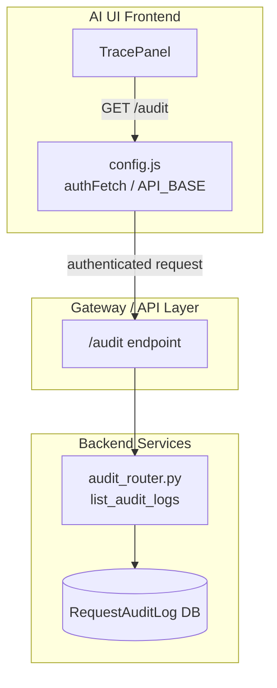
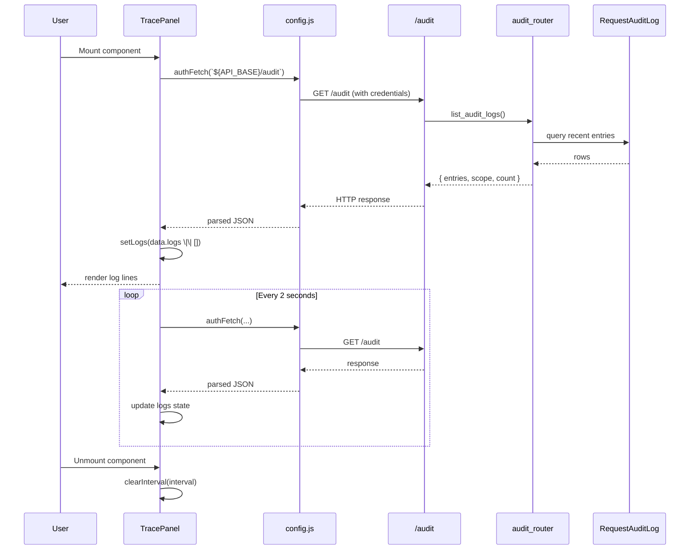

# Trace Panel Module

## Brief Introduction

The `trace_panel` module provides a lightweight, real-time audit log viewer for the AI UI frontend. It renders a scrollable, monospace log panel that periodically fetches recent audit entries from the backend and displays them to the user. This module is primarily used for observability and debugging, allowing users to see a live stream of system audit events without leaving the application.

---

## Module Purpose and Core Functionality

The `trace_panel` module is a React component (`TracePanel`) responsible for:

- **Fetching audit logs**: It makes authenticated GET requests to the backend `/audit` endpoint.
- **Auto-refreshing**: It polls the backend every 2 seconds to keep the displayed logs up to date.
- **Rendering logs**: It displays each log entry as a plain text line in a scrollable, fixed-width font panel.

### Core Component

| Component | File | Responsibility |
|-----------|------|----------------|
| `TracePanel` | `ai-ui/src/components/TracePanel.jsx` | Fetches and renders live audit log entries. |

### Key Behaviors

- Uses React `useState` to store the list of log lines.
- Uses React `useEffect` to trigger the initial fetch and start a polling interval.
- Cleans up the polling interval on component unmount to prevent memory leaks.
- Uses `authFetch` from the shared [config](../core/config.md) module for authenticated, retry-aware HTTP requests.
- Expects the backend response to contain a `logs` array (`data.logs`).

---

## Architecture and Component Relationships

The `TracePanel` is a pure presentation component with minimal local state. It depends on the shared configuration layer for API communication and on the backend audit infrastructure for data.

### High-Level Architecture



### Component Interaction



### Data Flow

```mermaid
flowchart LR
    A[Component Mount] --> B[useEffect triggers fetchLogs]
    B --> C[authFetch GET /audit]
    C --> D[Backend returns audit payload]
    D --> E[setLogs(data.logs || [])]
    E --> F[Render log lines]
    F --> G[setInterval 2000ms]
    G --> B
    H[Component Unmount] --> I[clearInterval]
```

---

## How It Fits into the Overall System

The `trace_panel` module is part of the `ai_ui_frontend` observability surface. It consumes the same audit infrastructure that powers backend tracing, compliance, and operational monitoring.

### Related Modules

| Module | Relationship |
|--------|--------------|
| [config](../core/config.md) | Provides `authFetch` and `API_BASE` for authenticated API calls. |
| [audit_router](../security/audit_router.md) | Backend router exposing the `/audit` endpoint and `list_audit_logs` logic. |
| [gateway](../core/gateway.md) | Hosts the `/audit` route and forwards requests to the audit router. |

### Integration Notes

- The panel is designed to be embedded anywhere in the AI UI that needs a live audit stream.
- It relies on the user's session cookie for authentication (via `credentials: 'include'` in `authFetch`).
- The backend scopes results by the current user; admins may see all entries depending on the audit router implementation.
- Polling is simple and stateless; there is no WebSocket or server-sent event connection.

---

## Process Flow

### Log Fetching and Rendering

```mermaid
flowchart TD
    Start([TracePanel renders]) --> InitState[Initialize logs = []]
    InitState --> UseEffect[useEffect invoked]
    UseEffect --> Fetch[fetchLogs]
    Fetch --> AuthFetch[authFetch `${API_BASE}/audit`]
    AuthFetch --> Success{Response OK?}
    Success -->|Yes| Parse[Parse JSON]
    Parse --> SetLogs[setLogs data.logs]
    SetLogs --> Render[Render each line]
    Success -->|No| Error[console.error]
    Error --> Schedule[setInterval 2000ms]
    Render --> Schedule
    Schedule --> Fetch
    Unmount([Component unmounts]) --> Cleanup[clearInterval]
```

---

## Implementation Details

### State Management

- `logs`: array of strings representing audit log lines.

### Polling Lifecycle

1. On mount, `fetchLogs` is called immediately.
2. A `setInterval` is registered with a 2000 ms period.
3. On unmount, the interval is cleared to prevent orphaned timers.

### Rendering

- The panel uses Tailwind utility classes for layout:
  - `h-full overflow-auto` for full-height scrolling.
  - `p-4 text-xs font-mono` for compact monospace log styling.
- Each log line is rendered as a `<div>` with an array index key.

### Error Handling

- Fetch failures are caught and logged to the browser console.
- The panel continues polling even after an error.

---

## References

- [config](../core/config.md) — Authentication and API base configuration.
- [audit_router](../security/audit_router.md) — Backend audit log retrieval.
- [gateway](../core/gateway.md) — API gateway routing and middleware.
