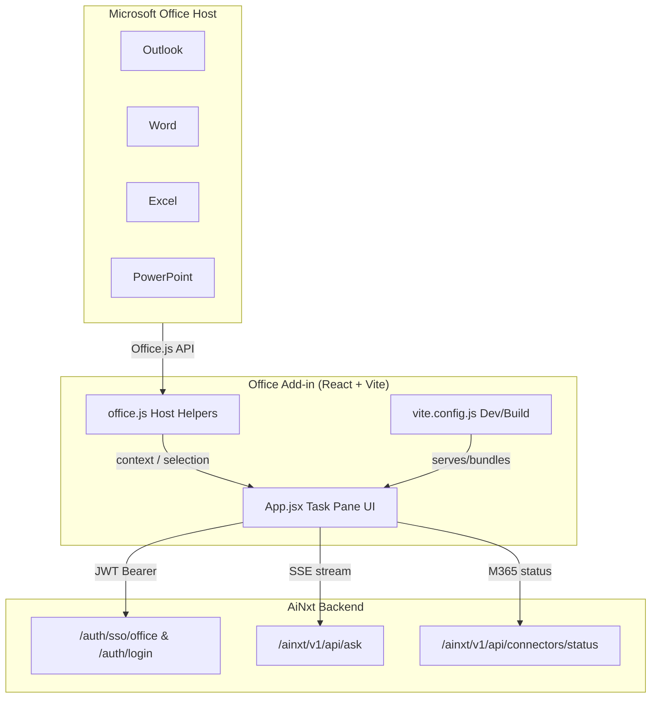
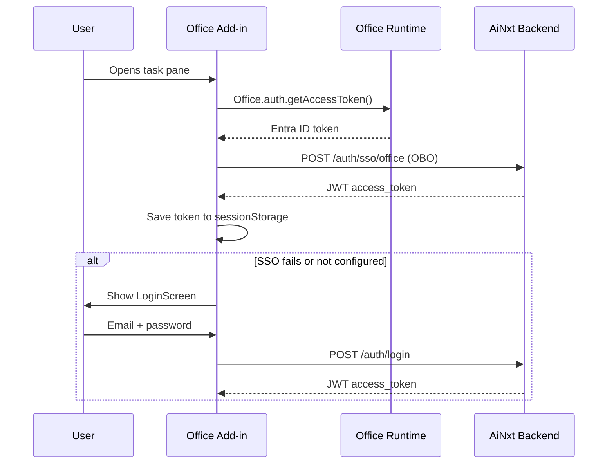
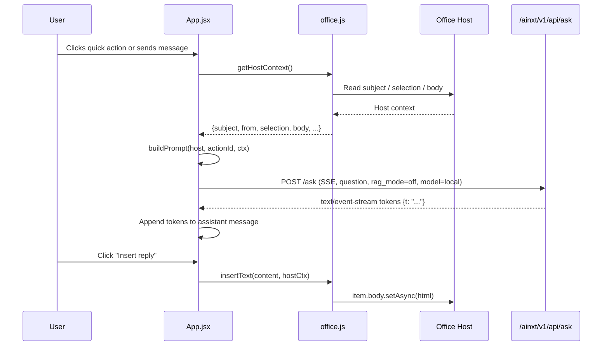

# Office Add-in Module

## Overview

The **Office Add-in** module is a Microsoft Office task pane add-in that embeds the AiNxt AI assistant directly into Outlook, Word, Excel, and PowerPoint. It allows users to ask questions about the current document or email, run host-specific quick actions (e.g., draft a reply, summarize, rewrite), and insert the generated response back into the Office host application.

The add-in is built as a React + Vite single-page application and communicates with the AiNxt backend over HTTPS using JWT Bearer authentication. It supports both Microsoft Entra SSO (via Office’s `getAccessToken`) and a fallback email/password login screen.

---

## Architecture



### Component Responsibilities

| File | Responsibility |
|------|----------------|
| `src/taskpane/App.jsx` | Main React component: authentication, chat UI, quick actions, SSE streaming, message state, and host-context handling. |
| `src/taskpane/office.js` | Office.js helpers: detect host type, read Outlook email context, insert/prepend HTML into compose items. |
| `vite.config.js` | Vite build/dev configuration; loads trusted Office dev certs so the dev server can run HTTPS on `localhost:3100`. |

---

## Authentication Flow



- **SSO first**: On mount, `officeSSO()` requests an Office identity token and exchanges it with `/auth/sso/office`.
- **Fallback**: If SSO fails (Office error codes 13xxx or missing Azure configuration), the add-in shows a password login screen.
- **Token storage**: The JWT is stored in `sessionStorage` under `ainxt_addin_token` and attached as an `Authorization: Bearer` header on every backend call.

---

## Runtime Data Flow



---

## Core Components

### `App.jsx`

The main React application exported as the task pane entry point.

#### `resolveBackendBase()`
Determines the AiNxt backend URL at runtime:
1. `window.__AINXT_API__` override (useful for embedded/index.html configuration).
2. `window.location.origin` if loaded over HTTPS (co-hosted add-in + API).
3. Fallback to `http://localhost:8000` for local development on Mac/Windows.

#### `LoginScreen`
Fallback email/password login component. Calls `POST /auth/login`, stores the returned token, and notifies the parent `App` via `onLogin`.

#### `hostFromOffice()`
Maps `Office.context.host` to a human-readable host label: Outlook, Word, Excel, PowerPoint, or generic "Office".

#### `App` (default export)
Manages the full task pane lifecycle:
- **State**: `host`, `token`, `hostCtx`, `m365`, `messages`, `input`, `busy`, `insertDone`, `ssoState`.
- **SSO on mount**: Attempts `officeSSO(AUTH_URL)`; falls back to `LoginScreen` on failure.
- **Host context refresh**: Calls `getHostContext()` after login and on Outlook `ItemChanged` events.
- **M365 connector check** (Outlook only): Polls `/connectors/status` to show whether the Microsoft 365 connector is connected.
- **Chat**: Streams assistant replies via Server-Sent Events and renders a chat-style UI.
- **Quick actions**: Host-specific one-click prompts defined in `host-helpers.js` (`QUICK_ACTIONS`).
- **Insert reply**: Writes the last assistant message into the Office host using `insertText()`.

### `office.js`

Office.js helper module for host interaction.

#### `getHostType()`
Safely returns `Office.context.host`, catching environments where the Office runtime is unavailable.

#### `getEmailContext()`
Reads the current Outlook item asynchronously:
- Subject
- Sender (`from`)
- To recipients
- Plain-text body (truncated to 4,000 characters)
- Item type and read/compose mode

#### `insertTextToCompose(text)`
Inserts HTML into the body of an Outlook compose item using `item.body.setAsync` with `CoercionType.Html`.

#### `prependToCompose(text)`
Prepends a styled HTML block to the Outlook compose body.

### `vite.config.js`

Vite configuration for the add-in.

#### `loadOfficeDevCerts()`
Loads the self-signed certificates generated by `npx office-addin-dev-certs install` from `~/.office-addin-dev-certs/`. Office desktop clients refuse mixed content, so HTTPS is mandatory during development. If certificates are missing, the function logs a warning and Vite falls back to HTTP (Office will refuse to load until certs are installed).

Key build settings:
- `base: "./"` — relative paths so the add-in works when sideloaded from a local server.
- `build.outDir: "dist"`
- Rollup input: `src/taskpane/index.html`
- Dev server: `localhost:3100` over HTTPS.

---

## Host Context & Quick Actions

The add-in adapts its behavior per Office host:

| Host | Context captured | Typical quick actions |
|------|------------------|-----------------------|
| **Outlook** | Subject, from, to, body | Draft reply, summarize thread, formalize, etc. |
| **Word** | Current selection | Rewrite, expand, summarize selection |
| **Excel** | Current selection | Explain data, generate formula, summarize |
| **PowerPoint** | Current selection | Slide notes, rewrite bullet, suggest image |

Context is refreshed at send time so prompts always reflect the user’s current selection or email.

---

## Backend Integration

The add-in consumes the following AiNxt backend endpoints (all under `/ainxt/v1/api`):

| Endpoint | Method | Purpose |
|----------|--------|---------|
| `/auth/sso/office` | POST | Exchange Office identity token for AiNxt JWT |
| `/auth/login` | POST | Email/password login fallback |
| `/ask` | POST | Streaming question/answer endpoint (`Accept: text/event-stream`) |
| `/connectors/status` | GET | Check whether Microsoft 365 connector is connected |

The `ask` request body currently uses:
- `rag_mode: "off"`
- `model: "local"`
- `ephemeral: true`

The response is parsed as SSE frames containing JSON objects. Token frames have the shape `{"t": "<chunk>"}`; a final `{"__meta__": {...}}` frame carries end-of-stream metadata and is ignored by the UI.

---

## Security & Deployment Notes

- **HTTPS only in production and dev**: Office desktop hosts block mixed content; the dev server must run HTTPS with a trusted certificate.
- **Token scope**: The JWT is kept in `sessionStorage` and cleared on logout or 401 responses.
- **No local model execution**: The add-in is a thin client; all LLM inference happens on the AiNxt backend.
- **M365 connector gating**: Outlook quick actions that need Graph API access disable themselves when the Microsoft 365 connector is not connected.

---

## Relationship to Other Modules

- **[gateway](gateway.md)**: The add-in’s backend calls are routed through the AiNxt gateway, which proxies authentication and the `/ask` endpoint.
- **[ai_ui_frontend](ai_ui_frontend.md)**: Shares the same AiNxt backend and authentication model but is a standalone web UI rather than an Office-embedded task pane.
- **[abstudio_frontend](abstudio_frontend.md)**: Separate React frontend for the ABStudio workflow/agent builder; the add-in does not depend on it.
- **[shared_integrations](shared_integrations.md)**: The Microsoft 365 connector status checked by the add-in is managed by the shared connector infrastructure.

---

## Development Quick Reference

```bash
# One-time: install trusted Office dev certs
npx office-addin-dev-certs install

# Start the dev server on https://localhost:3100
npm run dev

# Build for sideloading
npm run build
```

After starting the server, sideload the manifest in Outlook/Word/Excel/PowerPoint to open the task pane.
