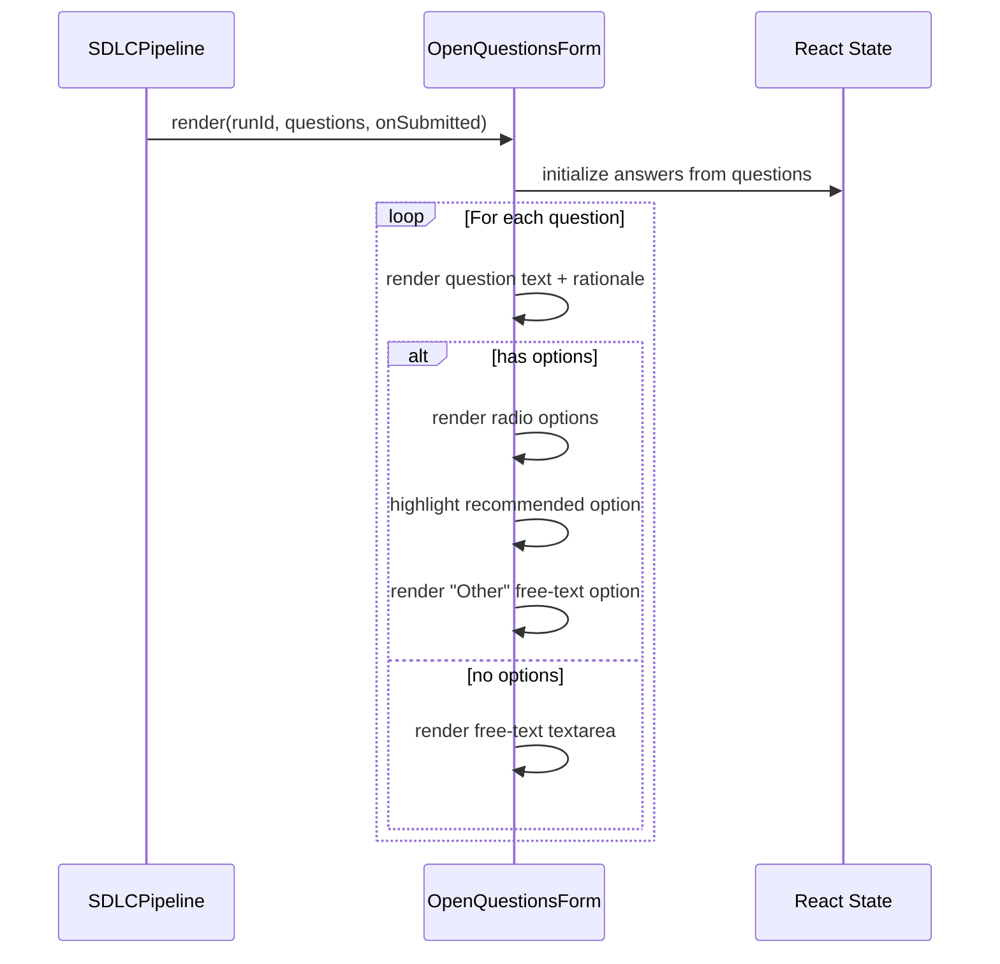
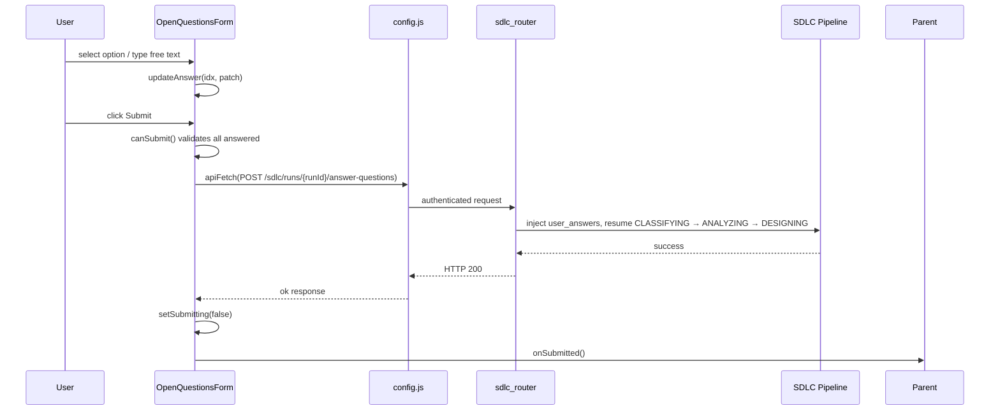
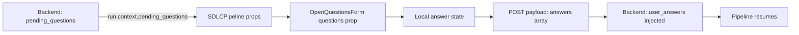
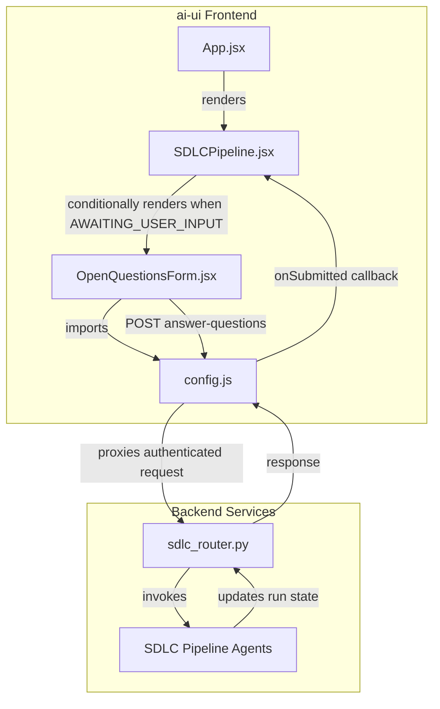

# Open Questions Module

## Brief Introduction

The **Open Questions** module is a frontend React component (`OpenQuestionsForm`) in the `ai-ui` application that handles human-in-the-loop clarification during the [SDLC pipeline](sdlc_pipeline.md). When the pipeline reaches a state where JIRA descriptions and code context are insufficient to make a design decision, the analyst raises clarifying questions. This module renders those questions, lets the user select from recommended options or provide free-text answers, and submits the answers back to the backend to resume the pipeline through `CLASSIFYING → ANALYZING → DESIGNING`.

---

## Core Purpose

- Surface clarifying questions raised by the SDLC analyst agent when `run.state === "AWAITING_USER_INPUT"`.
- Let users pick from pre-defined options (with a recommended option highlighted) or enter a free-text override.
- Validate that every question is answered before submission.
- POST answers to `/sdlc/runs/{runId}/answer-questions` and notify the parent component to refresh the run state.

---

## Architecture

```mermaid
flowchart TB
    subgraph "SDLC Pipeline UI"
        SDLCPipeline[SDLCPipeline Component]
    end

    subgraph "Open Questions Module"
        OpenQuestionsForm[OpenQuestionsForm]
        handleSubmit[handleSubmit]
    end

    subgraph "Shared Infrastructure"
        Config[config.js - API_BASE / apiFetch]
    end

    subgraph "Backend API"
        SDLCRouter[sdlc_router - answer_questions]
        SDLCPipelineBackend[SDLC Pipeline Backend]
    end

    SDLCPipeline -->|run.state == AWAITING_USER_INPUT| OpenQuestionsForm
    SDLCPipeline -->|questions + runId props| OpenQuestionsForm
    OpenQuestionsForm -->|user selections| handleSubmit
    handleSubmit -->|POST /sdlc/runs/{runId}/answer-questions| Config
    Config -->|authenticated fetch| SDLCRouter
    SDLCRouter -->|resume pipeline| SDLCPipelineBackend
    SDLCPipelineBackend -->|updated run state| SDLCPipeline
    handleSubmit -->|onSubmitted callback| SDLCPipeline
```

---

## Component Overview

### `OpenQuestionsForm`

| Property | Type | Description |
|----------|------|-------------|
| `runId` | `string` | The SDLC run identifier used in the resume endpoint. |
| `questions` | `Array<PendingQuestion>` | Clarifying questions from the analyst. |
| `onSubmitted` | `() => void` | Optional callback invoked after successful submission so the parent can refresh run state. |

### `PendingQuestion` Shape

```javascript
{
  id: string,
  question: string,
  options: string[],
  recommended: number | null,  // index into options
  rationale: string
}
```

### Internal State

| State | Type | Purpose |
|-------|------|---------|
| `answers` | `Array<{selectedOption, freeText, useOther}>` | Tracks the user's answer for each question. |
| `submitting` | `boolean` | Disables the submit button and shows a loading label. |
| `error` | `string \| null` | Displays backend or network errors. |

---

## Process Flow

### Rendering Questions



### Answering and Submitting



---

## Dependencies

### Internal Frontend Dependencies

| Module | File | Usage |
|--------|------|-------|
| [ai_ui_frontend_app_core](ai_ui_frontend_app_core.md) | `ai-ui/src/App.jsx` | Hosts the top-level routing/rendering context where `SDLCPipeline` is mounted. |
| [sdlc_pipeline](sdlc_pipeline.md) | `ai-ui/src/components/SDLCPipeline.jsx` | Parent component that renders `OpenQuestionsForm` when `run.state === "AWAITING_USER_INPUT"`. |
| [config](config.md) | `ai-ui/src/config.js` | Provides `API_BASE` and `apiFetch` for authenticated backend calls. |

### Backend Dependencies

| Module | File | Usage |
|--------|------|-------|
| [shared_api_routers_sdlc_router](shared_api_routers_sdlc_router.md) | `routers/sdlc_router.py` | Exposes `answer_questions` endpoint that receives the payload and resumes the pipeline. |
| [shared_core_sdlc_pipeline](shared_core_sdlc_pipeline.md) | `agents/sdlc_pipeline.py` | Backend SDLC pipeline logic that consumes `user_answers` and continues through classification, analysis, and design. |

---

## Data Flow



### Payload Shape

```javascript
{
  answers: [
    {
      selected_option: number | null,
      answer: string
    }
  ]
}
```

- If the user picks a pre-defined option, `selected_option` is the option index and `answer` is the option text.
- If the user selects "Other" or the question has no options, `selected_option` is `null` and `answer` contains the free-text value.

---

## Component Interaction



---

## Key Behaviors

### Recommended Option

The analyst can suggest a recommended option via `recommended: number` (index into `options`). The UI highlights this option with a "Recommended" badge using the `Sparkles` icon from `lucide-react`.

### Free-Text Override

Every question with options also provides an "Other" radio button. Selecting it reveals a textarea so the user can override the provided options. Questions without options render only the textarea.

### Validation

`canSubmit()` ensures:
- For "Other" answers, the free-text field is non-empty.
- For option-based answers, a valid option index is selected.

The submit button is disabled until all questions pass validation or while the request is in flight.

### Error Handling

If the backend returns a non-OK response, the component attempts to parse `detail` from the JSON error body and falls back to the raw response text or HTTP status. The error is displayed in a red banner.

---

## Integration Points

- **Mount condition**: Rendered by `SDLCPipeline` only when `run.state === "AWAITING_USER_INPUT"`.
- **Resume endpoint**: `POST {API_BASE}/sdlc/runs/{runId}/answer-questions`.
- **State refresh**: After success, `onSubmitted()` is called so the parent can re-fetch the run and transition the UI out of the question form.

---

## Related Documentation

- [sdlc_pipeline](sdlc_pipeline.md) — Parent UI component and overall SDLC pipeline user experience.
- [shared_api_routers_sdlc_router](shared_api_routers_sdlc_router.md) — Backend router handling `answer_questions` and other SDLC endpoints.
- [shared_core_sdlc_pipeline](shared_core_sdlc_pipeline.md) — Backend SDLC pipeline implementation that consumes the submitted answers.
- [config](config.md) — Frontend configuration and authenticated fetch utilities.
