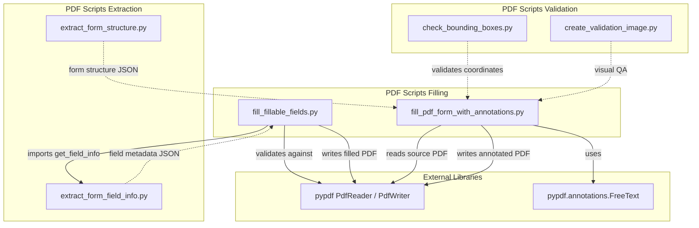
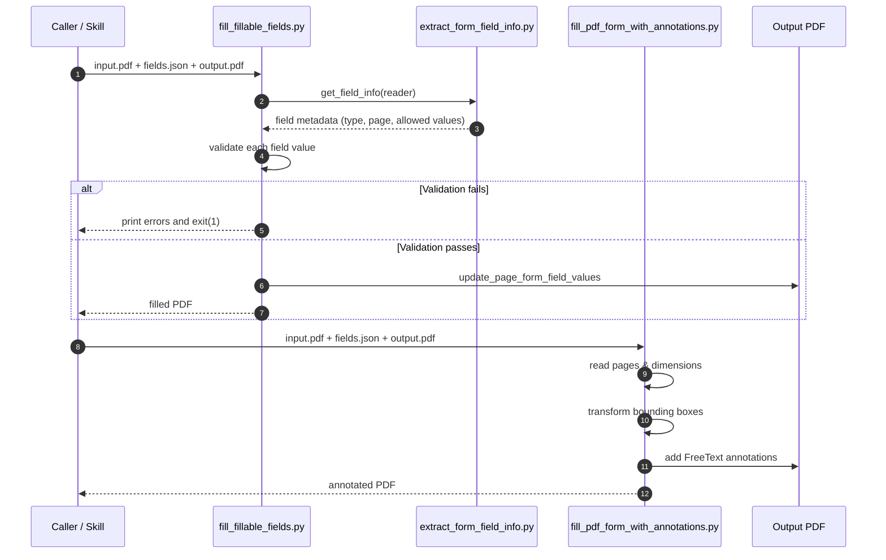
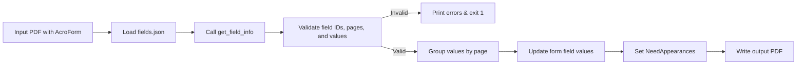
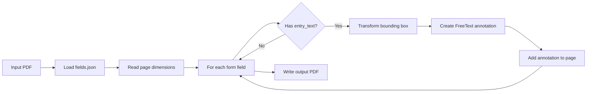
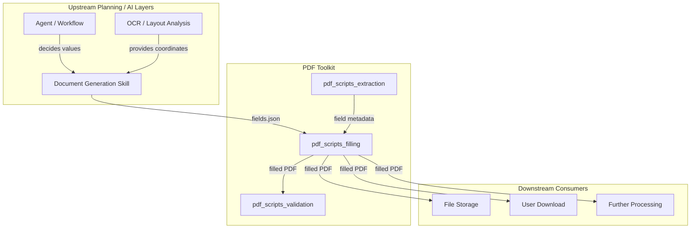
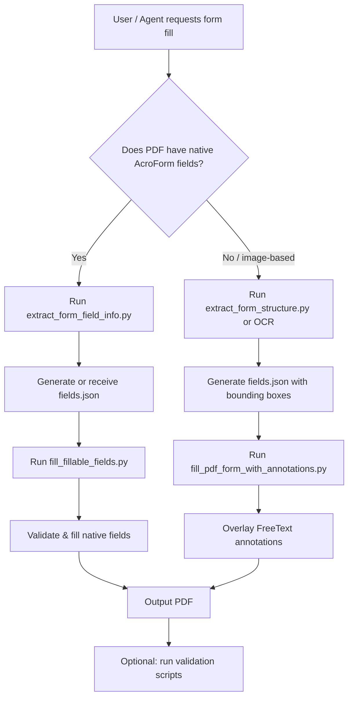

# PDF Scripts Filling Module

## Brief Introduction

The `pdf_scripts_filling` module is a specialized utility within the legacy Anthropic DocSkills PDF toolkit. It provides two complementary strategies for populating PDF forms with data: a native AcroForm field-filling path for fillable PDFs, and an annotation-based overlay path for non-fillable or image-derived forms. The module is designed to be invoked as a command-line script or imported as a library by higher-level skills, workers, or document-generation pipelines.

This module is part of the broader `docskills_legacy` PDF subsystem. For related capabilities, see the extraction and validation sibling modules.

---

## Module Purpose and Core Functionality

The primary responsibility of `pdf_scripts_filling` is to take a source PDF, a JSON payload describing the desired field values, and produce a filled output PDF. It supports two distinct workflows:

1. **Native Form Field Filling** (`fill_fillable_fields.py`)  
   Uses `pypdf` to update existing AcroForm fields (text, checkbox, radio group, choice/dropdown). It validates the input JSON against the actual field metadata before writing, ensuring page numbers and allowed values are correct.

2. **Annotation-Based Filling** (`fill_pdf_form_with_annotations.py`)  
   For PDFs that do not contain native form fields, this script overlays `FreeText` annotations at coordinates derived from image or PDF coordinate bounding boxes. This is commonly used when forms are detected via OCR or visual layout analysis.

Both scripts are self-contained, accept CLI arguments, and can be embedded in larger document-automation skills.

---

## Core Components

### `fill_fillable_fields.py`

| Component | Responsibility |
|-----------|----------------|
| `fill_pdf_fields(input_pdf_path, fields_json_path, output_pdf_path)` | Loads the field-value JSON, validates it against the PDF's real form fields, groups values by page, and writes the filled PDF using `PdfWriter.update_page_form_field_values`. |
| `validation_error_for_field_value(field_info, field_value)` | Validates a proposed value for a specific field type: checkboxes must match checked/unchecked values, radio groups and choice fields must select from allowed options. |
| `monkeypatch_pydpf_method()` | Patches `pypdf.generic.DictionaryObject.get_inherited` so that choice option arrays returned as `[[export, display], ...]` are flattened to their export values, working around a pypdf parsing quirk. |

### `fill_pdf_form_with_annotations.py`

| Component | Responsibility |
|-----------|----------------|
| `fill_pdf_form(input_pdf_path, fields_json_path, output_pdf_path)` | Reads a JSON description of form fields with bounding boxes and text styling, converts coordinates into PDF space, and adds a `FreeText` annotation for each non-empty entry. |
| `transform_from_image_coords(...)` | Converts a bounding box from image pixel coordinates to PDF page coordinates, flipping the Y axis to match pypdf's coordinate system. |
| `transform_from_pdf_coords(...)` | Converts a bounding box already in PDF coordinates into the pypdf annotation rectangle format. |

---

## Architecture and Component Relationships



### Component Interaction



---

## Data Flow

### Native Field Filling Flow



### Annotation-Based Filling Flow



---

## Input / Output Contracts

### Native Filling JSON (`fields.json`)

An array of field entries. Only fields containing a `"value"` key are filled.

```json
[
  {
    "field_id": "name.first",
    "page": 1,
    "value": "Alice"
  },
  {
    "field_id": "consent",
    "page": 1,
    "value": "Yes"
  }
]
```

Validation rules:

- `field_id` must exist in the PDF.
- `page` must match the page recorded in the field metadata.
- Checkbox values must equal the recorded `checked_value` or `unchecked_value`.
- Radio group and choice values must be one of the allowed options.

### Annotation Filling JSON (`fields.json`)

A document describing pages and detected form fields with bounding boxes.

```json
{
  "pages": [
    {
      "page_number": 1,
      "image_width": 612,
      "image_height": 792
    }
  ],
  "form_fields": [
    {
      "page_number": 1,
      "entry_bounding_box": [100, 200, 300, 220],
      "entry_text": {
        "text": "Alice",
        "font": "Arial",
        "font_size": 14,
        "font_color": "000000"
      }
    }
  ]
}
```

If a page object contains `pdf_width`, coordinates are assumed to be in PDF space; otherwise they are treated as image pixel coordinates.

---

## How It Fits into the Overall System

`pdf_scripts_filling` sits at the bottom of the document-generation stack. It is consumed by:

- **Higher-level document skills** in `shared_skills` and `docskills_legacy` that generate or complete PDF forms.
- **Agent and workflow workers** that need to produce filled government, legal, or HR forms as deliverables.
- **Validation scripts** in `pdf_scripts_validation` that verify the output visually or programmatically.

The module is intentionally low-level: it does not decide what values to write, nor does it perform OCR or layout detection. Those responsibilities live in the extraction and AI planning layers. This module's job is to reliably and safely materialize a data payload into a PDF.



---

## Process Flow: End-to-End Form Fill



---

## Error Handling and Safety

- **Native filling** performs strict pre-flight validation and exits with code `1` if any field is unknown, on the wrong page, or has an illegal value. This prevents producing silently broken forms.
- **Annotation filling** skips fields that lack `entry_text` or contain empty text, ensuring only meaningful annotations are added.
- The `monkeypatch_pydpf_method` workaround is applied at CLI entry time to normalize pypdf's handling of choice option arrays, preventing dropdown fills from failing on certain PDFs.

---

## References

- [pdf_scripts_extraction.md](pdf_scripts_extraction.md) — Field metadata and form structure extraction.
- [pdf_scripts_validation.md](pdf_scripts_validation.md) — Bounding-box and visual validation of filled PDFs.
- [pdf_skills_filling.md](pdf_skills_filling.md) — The ABStudio/Anthropic PDF filling counterpart.
- [docskills_legacy.md](docskills_legacy.md) — Overview of the legacy DocSkills document toolkit.
- [shared_skills.md](shared_skills.md) — Broader skill ecosystem including docx, pptx, xlsx, and PDF skills.
