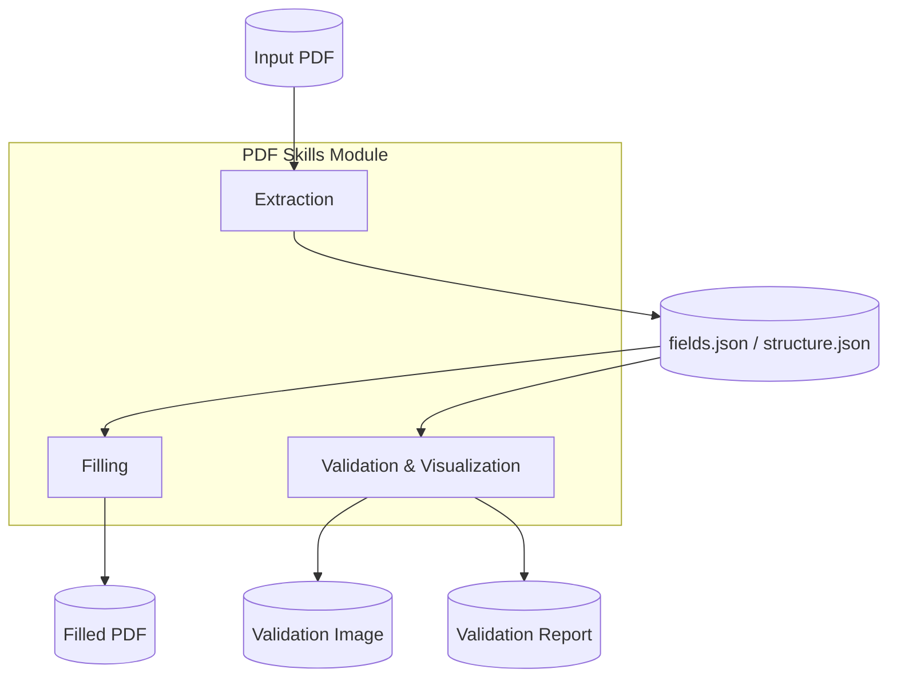
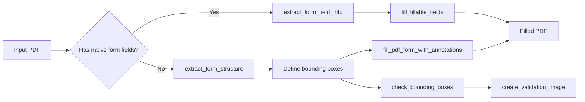

# PDF Skills Module

## Overview

The `pdf_skills` module is a specialized skill set within the broader `shared_skills` ecosystem. It provides a collection of Python scripts for extracting, filling, and validating PDF forms. The module is designed to handle both fillable (AcroForm) PDFs and non-fillable (flat) PDFs by combining PDF parsing libraries (`pypdf`, `pdfplumber`) with image-based coordinate mapping and annotation rendering.

These scripts are typically invoked as standalone utilities or orchestrated by higher-level agent workflows in the ABStudio/agent factory pipelines. They enable automated document processing use cases such as form population, field discovery, coordinate validation, and visual verification.

## Purpose

- Extract structured form information from PDF documents.
- Fill PDF forms programmatically, whether they expose native AcroForm fields or require annotation-based overlays.
- Validate field bounding boxes and text sizing to prevent rendering errors.
- Generate visual validation images to inspect field placement before final output.

## Architecture

The module is organized around three functional concerns:

1. **Extraction** — Discover form fields or structural elements from PDF pages.
2. **Filling** — Write values into discovered fields using native form updates or FreeText annotations.
3. **Validation & Visualization** — Check geometry and produce annotated preview images.



### Fillable vs. Non-Fillable PDF Workflows



## Sub-Modules

| Sub-Module | Purpose | Documentation |
|------------|---------|---------------|
| `pdf_skills_extraction` | Extract native AcroForm field metadata and geometric structure from flat PDFs. | [pdf_skills_extraction.md](pdf_skills_extraction.md) |
| `pdf_skills_filling` | Populate fillable PDFs natively or overlay text annotations on non-fillable PDFs. | [pdf_skills_filling.md](pdf_skills_filling.md) |
| `pdf_skills_validation` | Validate bounding-box geometry and generate preview images for human review. | [pdf_skills_validation.md](pdf_skills_validation.md) |

Detailed component descriptions, responsibilities, and data-flow diagrams for each concern are available in the sub-module documents linked above.

## Core Data Format

Many scripts share a `fields.json` representation. The canonical shape used by the filling and validation scripts is:

```json
{
  "pages": [
    {"page_number": 1, "pdf_width": 612, "pdf_height": 792}
  ],
  "form_fields": [
    {
      "description": "Full Name",
      "page_number": 1,
      "label_bounding_box": [100, 700, 200, 715],
      "entry_bounding_box": [210, 700, 400, 720],
      "entry_text": {
        "text": "Jane Doe",
        "font": "Arial",
        "font_size": 14,
        "font_color": "000000"
      }
    }
  ]
}
```

For fillable PDFs, `extract_form_field_info.py` emits a flatter array of field objects containing `field_id`, `type`, `page`, `rect`, and option metadata.

## Dependencies

- `pypdf` — Reading, writing, and updating AcroForm fields.
- `pdfplumber` — Extracting words, lines, and rectangles from flat PDFs.
- `Pillow` — Drawing validation preview images.

## Integration with the System

The `pdf_skills` module is a leaf skill package under `shared_skills`. It is consumed by:

- **ABStudio backend** — Agent factory and workflow factory pipelines can invoke these scripts as tool steps when building document-automation agents.
- **Agent runtime** — Agents that need to fill forms can call `fill_pdf_fields` or `fill_pdf_form` as part of a tool-use loop.
- **Skill creator tooling** — The scripts can be packaged as reusable skills via the skill-creator pipeline.

For broader document-processing capabilities, see also:

- [docx_skills.md](docx_skills.md) — Microsoft Word document manipulation.
- [pptx_skills.md](pptx_skills.md) — PowerPoint slide generation and editing.
- [xlsx_skills.md](xlsx_skills.md) — Excel workbook processing.
- [doc_generator.md](doc_generator.md) — Higher-level document generation tools.

## Usage Example

### Fill a fillable PDF

```bash
python extract_form_field_info.py input.pdf fields.json
# Edit fields.json to add "value" keys
python fill_fillable_fields.py input.pdf fields.json output.pdf
```

### Fill a non-fillable PDF

```bash
python extract_form_structure.py input.pdf structure.json
# Build fields.json with bounding boxes and text
python check_bounding_boxes.py fields.json
python fill_pdf_form_with_annotations.py input.pdf fields.json output.pdf
python create_validation_image.py 1 fields.json page.png validation.png
```
