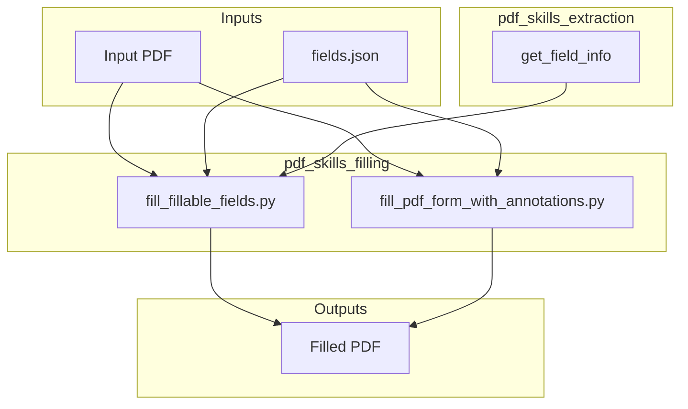
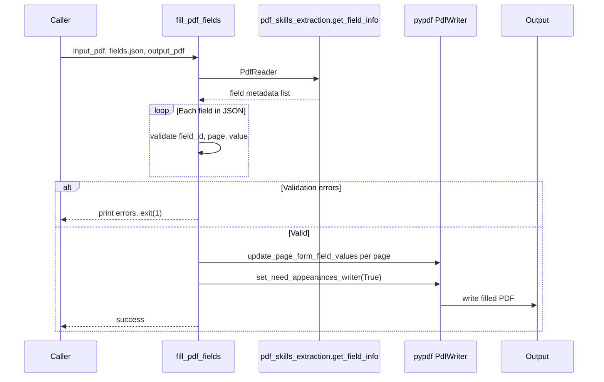
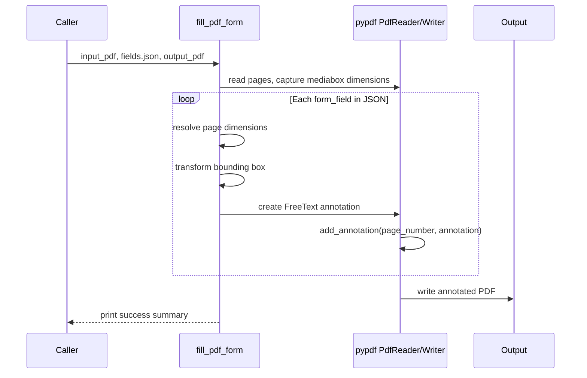

# PDF Skills Filling Module

## Brief Introduction

The `pdf_skills_filling` module is a specialized component within the broader [PDF skills](pdf_skills.md) ecosystem under `shared_skills`. It provides programmatic capabilities to populate PDF forms with structured data. The module supports two distinct filling strategies:

1. **Native AcroForm field filling** (`fill_fillable_fields.py`) — writes values directly into interactive PDF form fields (text boxes, checkboxes, radio groups, choice lists) using the `pypdf` library.
2. **Annotation-based filling** (`fill_pdf_form_with_annotations.py`) — overlays `FreeText` annotations onto non-interactive or image-based PDF pages, enabling form-like completion even when no native form fields exist.

These scripts are typically invoked by the ABStudio skill runtime or by backend document-generation pipelines that need to produce completed PDF documents from templates and JSON payloads.

---

## Core Functionality

### 1. Native Form Field Filling (`fill_pdf_fields`)

The `fill_pdf_fields` function in `fill_fillable_fields.py` takes:

- An input PDF containing interactive form fields.
- A JSON file describing the fields to fill and their values.
- An output path for the completed PDF.

It performs the following steps:

1. **Load and group field values** by page number.
2. **Validate field metadata** by calling [`get_field_info`](pdf_skills_extraction.md) from the [PDF skills extraction module](pdf_skills_extraction.md).
3. **Validate each value** against the field type:
   - **Checkbox**: value must match either the checked or unchecked value.
   - **Radio group**: value must be one of the defined radio options.
   - **Choice**: value must be one of the defined choice options.
4. **Abort on validation errors** by printing diagnostics and exiting with code `1`.
5. **Write values** into the PDF using `PdfWriter.update_page_form_field_values`.
6. **Set the NeedAppearances flag** so PDF viewers render the filled values correctly.

### 2. pypdf Compatibility Patch (`monkeypatch_pydpf_method`)

Some PDF producers encode choice-field options as pairs `[[export, display], ...]`. The `pypdf` library may return these pairs directly, causing comparison failures during validation. The `monkeypatch_pydpf_method` function patches `DictionaryObject.get_inherited` so that when the `Opt` key is requested, only the export values are returned.

### 3. Annotation-Based Filling (`fill_pdf_form`)

The `fill_pdf_form` function in `fill_pdf_form_with_annotations.py` is designed for PDFs that do not contain native form fields. It:

1. Reads the input PDF and clones its pages into a new `PdfWriter`.
2. Reads a JSON payload containing page dimensions and per-field bounding boxes.
3. Transforms coordinates from image or PDF space into `pypdf` annotation coordinates.
4. Creates a `FreeText` annotation for each non-empty text entry.
5. Writes the annotated PDF to the output path.

Coordinate transformation supports two input conventions:

- **Image coordinates** (top-left origin): scaled to PDF media box dimensions and flipped to PDF coordinates.
- **PDF coordinates** (bottom-left origin): flipped to `pypdf`'s annotation coordinate system.

---

## Architecture

### Module Placement

```text
shared_skills
└── pdf_skills
    ├── pdf_skills_extraction      # Field discovery and metadata extraction
    ├── pdf_skills_filling         # This module
    └── pdf_skills_validation      # Bounding-box and visual validation
```

The filling module sits between extraction and validation. It consumes metadata produced by [PDF skills extraction](pdf_skills_extraction.md) and produces output that can be inspected by [PDF skills validation](pdf_skills_validation.md).

### Component Overview



---

## Data Flow

### Native Form Field Filling Flow



### Annotation-Based Filling Flow



---

## Component Interaction

### `fill_pdf_fields` interactions

| Dependency | Purpose |
|------------|---------|
| `pypdf.PdfReader` | Reads the source PDF and its form dictionary. |
| `pypdf.PdfWriter` | Clones the reader and writes filled field values. |
| `extract_form_field_info.get_field_info` | Retrieves canonical field metadata for validation. |
| `json` / `sys` | Loads the payload and handles fatal validation errors. |

### `fill_pdf_form` interactions

| Dependency | Purpose |
|------------|---------|
| `pypdf.PdfReader` | Reads source pages and media box dimensions. |
| `pypdf.PdfWriter` | Builds the output document with added annotations. |
| `pypdf.annotations.FreeText` | Creates text annotations at computed locations. |
| `json` / `sys` | Loads the payload and handles CLI invocation. |

---

## Process Flows

### CLI Usage

Both scripts are executable as standalone CLI tools:

```bash
# Native form field filling
python fill_fillable_fields.py input.pdf fields.json output.pdf

# Annotation-based filling
python fill_pdf_form_with_annotations.py input.pdf fields.json output.pdf
```

### JSON Payload Examples

**Native filling payload** (`fill_fillable_fields.py`):

```json
[
  {
    "field_id": "name",
    "page": 1,
    "value": "Alice Smith"
  },
  {
    "field_id": "subscribe",
    "page": 1,
    "value": "Yes"
  }
]
```

**Annotation filling payload** (`fill_pdf_form_with_annotations.py`):

```json
{
  "pages": [
    {
      "page_number": 1,
      "image_width": 612,
      "image_height": 792
    }
  ],
  "form_fields": [
    {
      "page_number": 1,
      "entry_bounding_box": [100, 100, 300, 130],
      "entry_text": {
        "text": "Alice Smith",
        "font": "Arial",
        "font_size": 14,
        "font_color": "000000"
      }
    }
  ]
}
```

---

## How It Fits into the Overall System

The `pdf_skills_filling` module is part of the document-automation skill set used by ABStudio and the broader AI platform. It is typically invoked in the following contexts:

- **ABStudio skill runtime**: A skill that fills PDF templates based on extracted user data or LLM-generated values.
- **Document generation workers**: Backend workers such as [`doc_worker`](../workers/document_knowledge_workers.md) and [`doc_worker_agent`](../workers/document_knowledge_workers.md) may use these utilities when producing PDF outputs.
- **Agent tool calls**: Agents equipped with document tools can call filling scripts to complete forms as part of a workflow.

The module relies on:

- [pdf_skills_extraction](pdf_skills_extraction.md) for field metadata discovery.
- [pdf_skills_validation](pdf_skills_validation.md) for post-fill visual verification.

It also shares the same Office/PDF tooling infrastructure as the [docx_skills](docx_skills.md), [pptx_skills](pptx_skills.md), and [xlsx_skills](xlsx_skills.md) modules.

---

## Dependencies

### Internal Modules

- [pdf_skills_extraction](pdf_skills_extraction.md) — provides `get_field_info` used by `fill_pdf_fields`.
- [pdf_skills_validation](pdf_skills_validation.md) — may be used after filling to validate rendered output.

### External Libraries

- `pypdf` — PDF reading, writing, form field updates, and annotation creation.

### Related System Components

- [shared_skills](shared_skills.md) — parent module containing all reusable skills.
- [ABStudio backend document APIs](../abstudio_backend/api_documents.md) — HTTP endpoints that handle document attachments and extraction.
- [workers/document_knowledge_workers](../workers/document_knowledge_workers.md) — background workers that generate and manipulate documents.

---

## Error Handling and Validation

### Native Filling

- Missing `field_id` → error and exit.
- Incorrect page number → error and exit.
- Invalid checkbox/radio/choice value → error and exit.
- All validation errors are collected and printed before aborting.

### Annotation Filling

- Fields without `entry_text.text` are skipped silently.
- Empty text values are skipped.
- Coordinate transformation adapts to whether the input bounding box uses image or PDF coordinates.

---

## Notes for Maintainers

- The `monkeypatch_pydpf_method` patch is applied only at CLI entry time. If `fill_pdf_fields` is imported as a library, callers may need to invoke the patch explicitly if they encounter choice-option pair encoding.
- `auto_regenerate=False` is used when updating form field values to avoid `pypdf` automatically rebuilding appearances, which can fail for complex fonts. The `NeedAppearances` flag is set instead.
- Annotation-based filling does not create interactive form data; it only overlays visible text. Use native filling when editable form fields are required.
