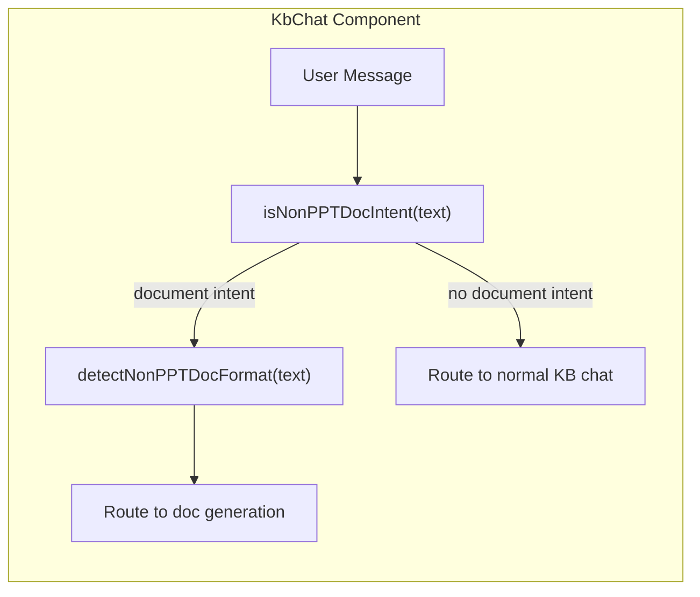
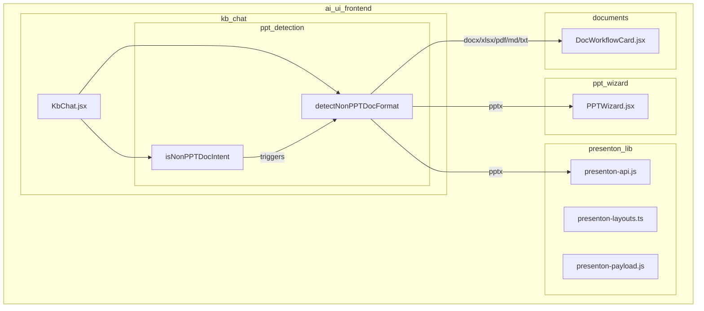
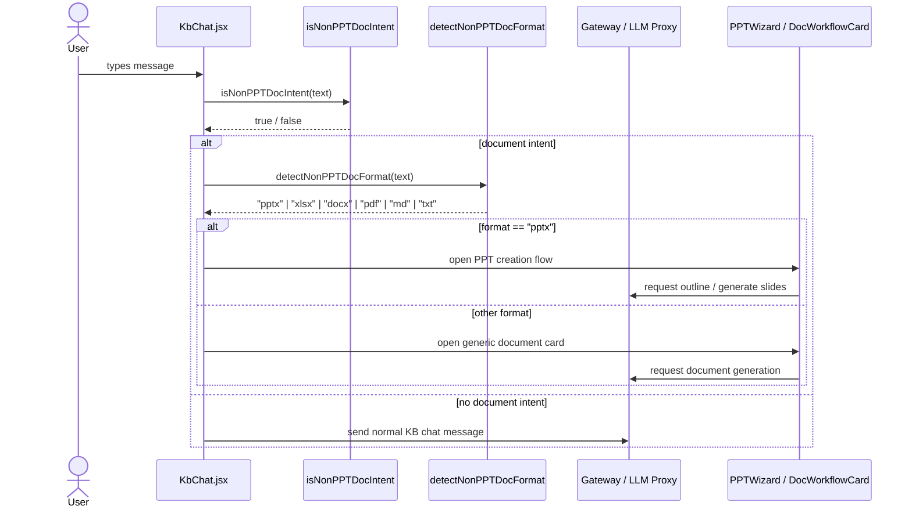

# ppt_detection

## Brief Introduction

The `ppt_detection` module is a lightweight client-side intent classifier embedded in the Knowledge-Base Chat UI (`KbChat`). Despite its name, it detects **general document-generation intents** in user messages and resolves the requested output format. It enables the chat component to distinguish casual KB questions from requests that should produce a downloadable artifact (PPT, Excel, Word, PDF, Markdown, or plain text) and to route those requests to the appropriate document-generation pipeline.

The module lives entirely in the frontend and mirrors the intent-detection patterns used by the backend chat worker, ensuring consistent behavior between what the user types and what the server eventually executes.

---

## Core Functionality

| Function | Purpose |
|----------|---------|
| `isNonPPTDocIntent(text)` | Returns `true` when the user message looks like a request to generate, create, download, or export a document. |
| `detectNonPPTDocFormat(text)` | Returns the inferred document format (`pptx`, `xlsx`, `docx`, `pdf`, `md`, `txt`). Defaults to `pdf` when no specific format is found. |

### Intent Detection Rules (`isNonPPTDocIntent`)

The classifier uses three complementary regular expressions:

1. **Verb + format pattern** — matches action verbs (`generate`, `create`, `make`, `write`, `export`, `produce`, `draft`, `build`, `prepare`, `give`, `get`, `need`, `show`, `provide`, `send`, `share`, `download`, `fetch`, `output`) followed within 80 characters by a document noun (`document`, `report`, `presentation`, `slides`, `powerpoint`, `excel`, `spreadsheet`, `markdown`).
2. **Extension / download pattern** — matches explicit file extensions (`pptx`, `pdf`, `docx`, `xlsx`, `txt`, `md`) or phrases like `downloadable` / `download the file`.
3. **Noun pattern** — matches standalone format nouns (`pptx`, `docx`, `xlsx`) or phrases like `a ppt`, `the slide deck`, `word document`.

A match on any of the three patterns is enough to flag the message as a document intent.

### Format Resolution (`detectNonPPTDocFormat`)

After intent is detected, the text is lower-cased and checked in priority order:

```text
ppt/pptx/presentation/slides/slide-deck/powerpoint → "pptx"
xlsx/excel/spreadsheet                              → "xlsx"
docx/word doc/document/file                         → "docx"
pdf                                                 → "pdf"
markdown/.md                                        → "md"
text/.txt                                           → "txt"
otherwise                                           → "pdf" (default)
```

---

## Architecture



The module is not a standalone file; it is a focused functional unit inside `KbChat.jsx`. It has no local state and no external dependencies beyond the JavaScript standard library (`RegExp`, `String.prototype.toLowerCase`).

---

## Component Relationships



- **KbChat** owns the detection helpers and calls them on incoming user messages.
- **presenton_lib** provides the backend-facing presentation-generation API used when the resolved format is `pptx`.
- **ppt_wizard** is the dedicated UI flow for building slide decks.
- **documents** handles generic document cards and workflows for non-PPT formats.

For details on the surrounding chat logic, see [kb_chat.md](kb_chat.md). For the presentation-generation stack, see [presenton_lib.md](presenton_lib.md) and [ppt_wizard.md](ppt_wizard.md).

---

## Data Flow



---

## How It Fits into the System

`ppt_detection` sits at the boundary between **conversational KB search** and **structured artifact generation** in the AI UI frontend. Its responsibilities are intentionally narrow:

1. **Keep the chat UX coherent** — Users can type naturally (`"create a Q3 presentation"`, `"download the report as pdf"`) without switching to a separate tool first.
2. **Mirror server-side intent detection** — The regex patterns are aligned with the backend chat worker so that the same message is interpreted consistently on both sides.
3. **Enable format-aware routing** — Once a format is resolved, the UI can surface the right next-step component (PPT wizard, document card, etc.).

The module does **not** perform LLM-based classification; it relies on fast, deterministic regex matching so that intent classification adds no latency to the chat input path.

---

## Related Modules

- [kb_chat.md](kb_chat.md) — Parent chat component that hosts the detection helpers.
- [presenton_lib.md](presenton_lib.md) — Presentation-generation library used for `pptx` output.
- [ppt_wizard.md](ppt_wizard.md) — UI wizard for building PowerPoint decks.
- [documents.md](documents.md) — Generic document generation and preview components.
- [chat.md](chat.md) — Main chat component in the AI UI for non-KB conversations.
