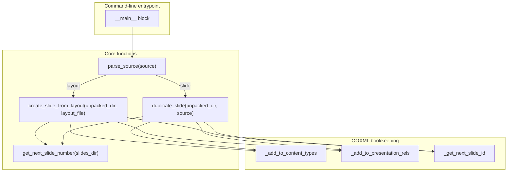
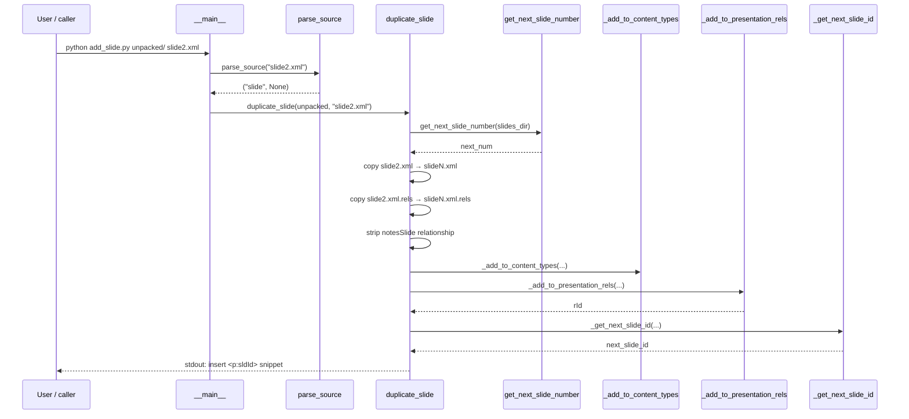
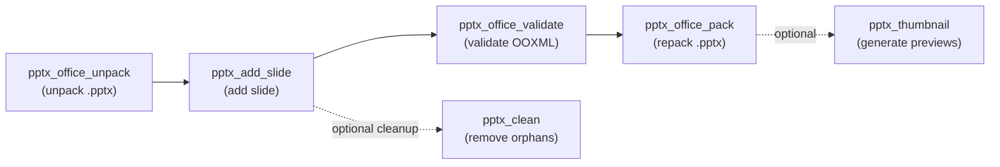

# pptx_add_slide

## Brief Introduction

`pptx_add_slide` is a low-level PowerPoint manipulation utility in the `ainxt_docskills` PPTX skill family. It operates on an **unpacked PPTX directory** (the ZIP-expanded form of a `.pptx` file) and adds a new slide by either:

1. **Duplicating an existing slide** (`slideN.xml`), or
2. **Creating a blank slide from a layout template** (`slideLayoutN.xml`).

The script performs all the bookkeeping required by the OOXML package format: assigning the next slide filename, registering the new slide in `[Content_Types].xml`, adding a relationship entry in `ppt/_rels/presentation.xml.rels`, and computing the next available slide identifier in `ppt/presentation.xml`. It is intended to be used as a command-line tool inside a larger PPTX editing pipeline (unpack → modify → validate → pack).

---

## Core Functionality

### Supported Operations

| Source type | Example argument | Result |
|-------------|------------------|--------|
| Existing slide | `slide2.xml` | Creates `slide5.xml` (or next available number) as a copy of `slide2.xml` |
| Layout template | `slideLayout2.xml` | Creates a new blank `slideN.xml` wired to `slideLayout2.xml` |

### What the script updates

When a new slide is added, the following OOXML artifacts are kept consistent:

- **`ppt/slides/slideN.xml`** — the new slide XML file.
- **`ppt/slides/_rels/slideN.xml.rels`** — slide-level relationships (layout reference for layout-created slides; copied and cleaned for duplicated slides).
- **`[Content_Types].xml`** — an `<Override>` entry so the package knows the new part.
- **`ppt/_rels/presentation.xml.rels`** — a new `rId` relationship pointing at the slide.
- **`ppt/presentation.xml`** — the script prints the `<p:sldId>` element the caller must insert into `<p:sldIdLst>`.

> **Note:** The script does **not** rewrite `presentation.xml` automatically. It prints the required XML snippet to stdout so the caller can insert it into `<p:sldIdLst>`.

---

## Architecture

### Component Overview



### Component Responsibilities

| Component | Responsibility |
|-----------|----------------|
| `parse_source` | Classifies the user-supplied source string as either a `slideLayout*.xml` or a `slide*.xml`. |
| `create_slide_from_layout` | Generates a minimal blank slide XML and wires it to the requested layout via slide-level relationships. |
| `duplicate_slide` | Copies an existing slide XML and its `.rels` file, stripping any `notesSlide` relationship to avoid shared notes. |
| `get_next_slide_number` | Scans `ppt/slides/` to determine the next `slideN.xml` filename. |
| `_add_to_content_types` | Adds an `<Override>` entry to `[Content_Types].xml` if not already present. |
| `_add_to_presentation_rels` | Adds a new `rIdN` relationship to `ppt/_rels/presentation.xml.rels` and returns the new `rId`. |
| `_get_next_slide_id` | Reads `ppt/presentation.xml` and returns `max(slide_id) + 1` (defaulting to `256`). |

---

## Data Flow

### Adding a slide from a layout

```mermaid
sequenceDiagram
    participant User as User / caller
    participant Main as __main__
    participant Parse as parse_source
    participant Create as create_slide_from_layout
    participant Next as get_next_slide_number
    participant CT as _add_to_content_types
    participant PRels as _add_to_presentation_rels
    participant SId as _get_next_slide_id

    User->>Main: python add_slide.py unpacked/ slideLayout2.xml
    Main->>Parse: parse_source("slideLayout2.xml")
    Parse-->>Main: ("layout", "slideLayout2.xml")
    Main->>Create: create_slide_from_layout(unpacked, "slideLayout2.xml")
    Create->>Next: get_next_slide_number(slides_dir)
    Next-->>Create: next_num (e.g. 5)
    Create->>Create: write slide5.xml + slide5.xml.rels
    Create->>CT: _add_to_content_types(unpacked, "slide5.xml")
    CT-->>Create: updated [Content_Types].xml
    Create->>PRels: _add_to_presentation_rels(unpacked, "slide5.xml")
    PRels-->>Create: rId (e.g. rId12)
    Create->>SId: _get_next_slide_id(unpacked)
    SId-->>Create: next_slide_id (e.g. 257)
    Create-->>User: stdout: Created slide5.xml... Add <p:sldId id="257" r:id="rId12"/>
```

### Duplicating an existing slide



---

## Component Relationships

### Within the PPTX skill family

`pptx_add_slide` is one step in a typical unpack-modify-pack workflow. It expects an unpacked PPTX directory produced by [pptx_office_unpack](pptx_office_unpack.md) and is usually followed by validation ([pptx_office_validate](pptx_office_validate.md)) and repacking ([pptx_office_pack](pptx_office_pack.md)).



### Relationship to higher-level document generation

The module is a **manual, file-system-level tool** and is distinct from the platform's higher-level presentation generation services:

- [doc_generator](doc_generator.md) — generates simple `.pptx` files from slide dictionaries using `python-pptx`.
- [presenton_router](presenton_router.md) / [presenton_worker](presenton_worker.md) — orchestrates AI-driven presentation generation via the Presenton service.
- [doc_download_router](doc_download_router.md) — exposes user-facing endpoints for document generation jobs.

`pptx_add_slide` is useful when an agent or script needs to surgically modify an existing deck (for example, inserting a generated slide into a template) rather than building a deck from scratch.

---

## Process Flows

### Typical CLI usage

```bash
# 1. Unpack a PPTX file
python -m skills.ainxt_docskills.pptx.scripts.office.unpack mydeck.pptx mydeck_unpacked

# 2. Add a slide from a layout
python -m skills.ainxt_docskills.pptx.scripts.add_slide mydeck_unpacked slideLayout2.xml
# Output:
# Created slide5.xml from slideLayout2.xml
# Add to presentation.xml <p:sldIdLst>: <p:sldId id="257" r:id="rId12"/>

# 3. Manually insert the printed <p:sldId> into mydeck_unpacked/ppt/presentation.xml

# 4. Validate and repack
python -m skills.ainxt_docskills.pptx.scripts.office.validate mydeck_unpacked --original mydeck.pptx
python -m skills.ainxt_docskills.pptx.scripts.office.pack mydeck_unpacked mydeck_updated.pptx --original mydeck.pptx
```

### Error handling

The script validates the existence of the unpacked directory and the source file/layout before making any changes. On failure it writes to `stderr` and exits with a non-zero status code.

---

## How It Fits into the Overall System

`pptx_add_slide` belongs to the **shared_skills** layer, specifically the `ainxt_docskills` PPTX utilities. These utilities are reusable building blocks for agentic document editing workflows. While the platform's primary presentation generation path goes through [presenton_router](presenton_router.md) → [presenton_worker](presenton_worker.md) → Presenton service, the `ainxt_docskills` PPTX scripts provide fine-grained OOXML manipulation capabilities for scenarios such as:

- Merging slides from multiple decks.
- Inserting AI-generated content into an existing corporate template.
- Repairing or extending a presentation produced by another tool.

Because the script operates directly on the unpacked OOXML package, it is independent of the `python-pptx` library used by [doc_generator](doc_generator.md) and can handle layouts and relationships that higher-level libraries may not expose.

---

## References

- [pptx_office_unpack](pptx_office_unpack.md) — unpacks a `.pptx` into the directory format this script consumes.
- [pptx_office_pack](pptx_office_pack.md) — repacks the modified directory back into a `.pptx`.
- [pptx_office_validate](pptx_office_validate.md) — validates the OOXML package after modification.
- [pptx_clean](pptx_clean.md) — removes orphaned slides and relationships after edits.
- [pptx_thumbnail](pptx_thumbnail.md) — generates thumbnail grids from a finished deck.
- [doc_generator](doc_generator.md) — high-level document/PPTX generation tool.
- [presenton_router](presenton_router.md) — API router for AI presentation generation.
- [presenton_worker](presenton_worker.md) — background worker that drives the Presenton service.
- [doc_download_router](doc_download_router.md) — user-facing endpoints for document generation jobs.
