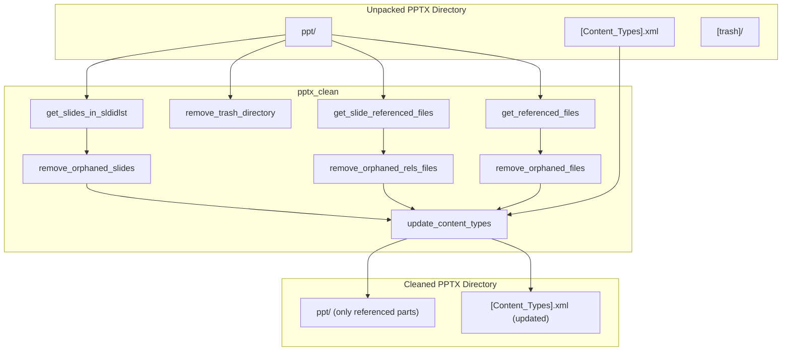
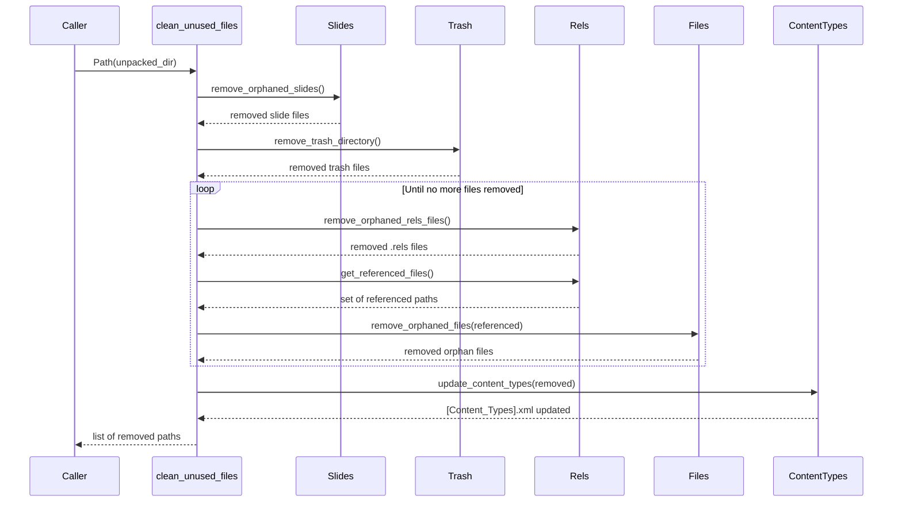
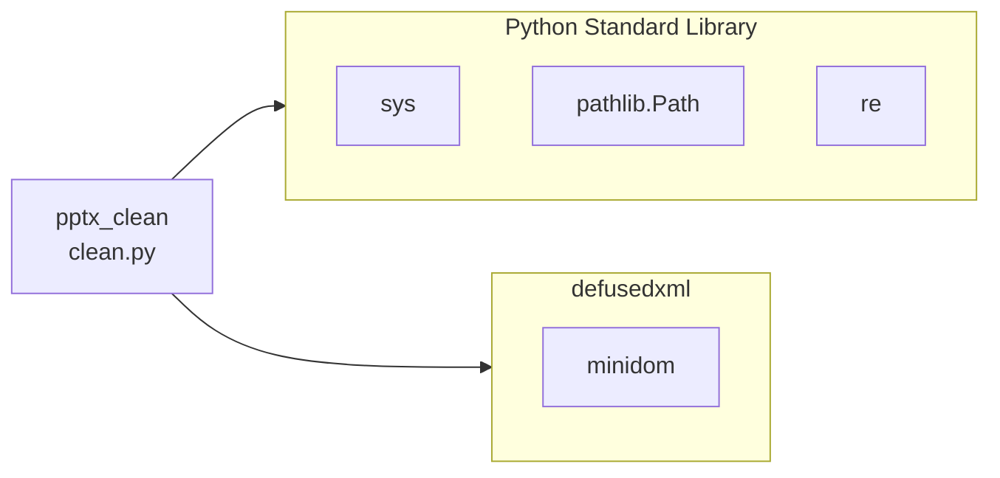

# pptx_clean

## Brief Introduction

`pptx_clean` is a utility module in the legacy Anthropic docskills PPTX toolchain. It removes unreferenced and orphaned files from an **unpacked PPTX directory** (the exploded OOXML package structure) so that the package can be safely repacked into a valid `.pptx` file. The module is typically used after slide duplication, deletion, or other editing operations that may leave behind stale slides, media, charts, diagrams, themes, notes, or relationship files.

The module is intentionally small and focused: it takes a directory path, analyzes the OOXML relationship graph, deletes anything that is no longer reachable from the active slide list, and updates `[Content_Types].xml` accordingly.

---

## Comprehensive Documentation

### 1. Purpose and Scope

PowerPoint files (`.pptx`) are ZIP archives of OOXML parts connected by `.rels` relationship files. When a PPTX is unpacked, edited, and then repacked, leftover parts can cause:

- Bloated file sizes
- Validation errors
- Broken relationships
- Unexpected content appearing in the final presentation

`pptx_clean` solves this by performing a **reachability-based garbage collection** pass over the unpacked package. It keeps only the parts that are actually referenced by the presentation's active slide list and their transitive dependencies.

> **Note:** This module operates on an already-unpacked PPTX directory. For unpacking and repacking logic, see [pptx_office_unpack](pptx_office_unpack.md) and [pptx_office_pack](pptx_office_pack.md). For slide creation and duplication, see [pptx_add_slide](pptx_add_slide.md).

---

### 2. Architecture



---

### 3. Component Overview

| Function | Responsibility |
|----------|----------------|
| `get_slides_in_sldidlst` | Reads `presentation.xml` and `presentation.xml.rels` to determine which `slide*.xml` files are actually referenced by the slide ID list. |
| `remove_orphaned_slides` | Deletes slide XML files (and their per-slide `.rels`) that are not in the active slide list, then updates `presentation.xml.rels`. |
| `remove_trash_directory` | Removes the `[trash]` directory and any files inside it. |
| `get_slide_referenced_files` | Collects all files reachable from the per-slide `.rels` files under `ppt/slides/_rels/`. |
| `remove_orphaned_rels_files` | Deletes `.rels` files in `charts/`, `diagrams/`, and `drawings/` whose corresponding resource no longer exists or is unreferenced. |
| `get_referenced_files` | Collects all files reachable from **any** `.rels` file in the package. |
| `remove_orphaned_files` | Deletes unreferenced files in `media/`, `embeddings/`, `charts/`, `diagrams/`, `tags/`, `drawings/`, `ink/`, plus unused themes and notes slides. |
| `update_content_types` | Removes `<Override>` entries from `[Content_Types].xml` for deleted parts. |
| `clean_unused_files` | Orchestrates the full cleanup pipeline and returns a list of removed relative paths. |

---

### 4. Data Flow



---

### 5. Cleanup Rules

The module applies the following deletion rules:

1. **Orphaned slides**
   - A slide is orphaned if its relationship ID is not listed in `<p:sldIdLst>` inside `ppt/presentation.xml`.
   - Deletes `ppt/slides/slide*.xml`, `ppt/slides/_rels/slide*.xml.rels`, and the relationship entry in `ppt/_rels/presentation.xml.rels`.

2. **Trash directory**
   - Deletes the entire `[trash]` directory and its contents.

3. **Orphaned resource relationship files**
   - For `charts/`, `diagrams/`, and `drawings/`, deletes `.rels` files whose base resource file no longer exists or is not referenced by any slide.

4. **Unreferenced media and resources**
   - Scans `media/`, `embeddings/`, `charts/`, `diagrams/`, `tags/`, `drawings/`, and `ink/`.
   - Deletes any file not reachable through the relationship graph.

5. **Unreferenced themes**
   - Deletes `ppt/theme/theme*.xml` files not referenced by any relationship.
   - Also deletes their corresponding `ppt/theme/_rels/theme*.xml.rels` files.

6. **Unreferenced notes slides**
   - Deletes `ppt/notesSlides/notesSlide*.xml` files not referenced.
   - Deletes orphaned `.rels` files in `ppt/notesSlides/_rels/`.

7. **Content type overrides**
   - Removes `<Override PartName="..."/>` entries from `[Content_Types].xml` for every deleted file.

---

### 6. Dependencies



- **`defusedxml.minidom`**: Used for safe XML parsing of OOXML relationship and content-type files.
- **`pathlib.Path`**: Used for filesystem traversal and path manipulation.
- **`re`**: Used to extract `r:id` attributes from `presentation.xml` for slide ID discovery.
- **`sys`**: Used only by the CLI entry point for argument handling and exit codes.

---

### 7. Relationship to the Broader System

`pptx_clean` is one small step in the PPTX document-generation and editing pipeline. It does not generate content, call LLMs, or interact with the ABStudio backend directly. Instead, it is invoked by skill scripts or worker jobs after a PPTX package has been unpacked and modified.


Related modules:

- [pptx_office_unpack](pptx_office_unpack.md) — Explodes a `.pptx` into an editable directory.
- [pptx_office_pack](pptx_office_pack.md) — Re-zips the cleaned directory back into `.pptx`.
- [pptx_office_validate](pptx_office_validate.md) — Validates OOXML schema after packing.
- [pptx_add_slide](pptx_add_slide.md) — Duplicates or creates slides in the unpacked package.
- [doc_generator](doc_generator.md) — Higher-level document generation that may orchestrate PPTX creation.
- [presenton_lib](presenton_lib.md) — Presentation generation library used by the AI UI frontend.

---

### 8. Usage Example

```bash
python skills/ainxt_docskills/pptx/scripts/clean.py unpacked/
```

Example output:

```text
Removed 12 unreferenced files:
  ppt/slides/slide3.xml
  ppt/slides/_rels/slide3.xml.rels
  ppt/media/image5.png
  ppt/charts/chart2.xml
  ppt/charts/_rels/chart2.xml.rels
  ...
```

Programmatic usage:

```python
from pathlib import Path
from skills.ainxt_docskills.pptx.scripts.clean import clean_unused_files

removed = clean_unused_files(Path("unpacked/"))
print(f"Removed {len(removed)} files")
```

---

### 9. Important Considerations

- **Idempotent**: Running `clean_unused_files` multiple times on the same directory is safe; subsequent runs will report no files removed if the package is already clean.
- **Destructive**: The function deletes files in-place. Callers should operate on a copy of the unpacked package if the original must be preserved.
- **Reachability closure**: The loop continues until a fixed point is reached, so cascading orphans (e.g., a deleted slide referencing a chart referencing a media file) are fully removed.
- **No rollback**: There is no built-in undo mechanism. Backups are the caller's responsibility.
- **External targets**: Relationship targets that resolve outside the unpacked directory are ignored during reference collection.

---

### 10. Module Boundaries

`pptx_clean` does **not**:

- Parse or modify slide content beyond relationship cleanup.
- Generate thumbnails (see [pptx_thumbnail](pptx_thumbnail.md)).
- Merge text runs or simplify redlines (see [pptx_office_merge_runs](pptx_office_merge_runs.md) and [pptx_office_simplify_redlines](pptx_office_simplify_redlines.md)).
- Interact with the ABStudio backend, database, or LLM proxy.

It is a pure filesystem/OOXML utility focused exclusively on package hygiene.
