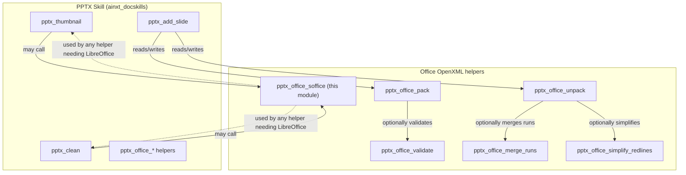
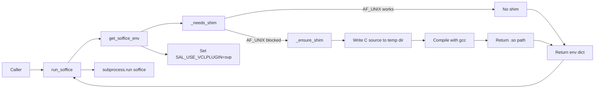
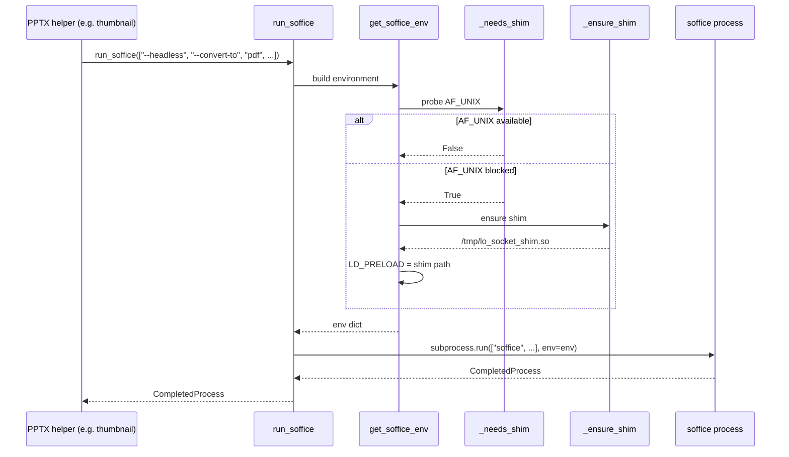

# pptx_office_soffice

## Brief Introduction

`pptx_office_soffice` is a low-level runtime helper inside the PowerPoint (`.pptx`) document-skills toolchain. Its single responsibility is to **execute LibreOffice (`soffice`) reliably in restricted environments** — especially sandboxed VMs or hardened containers where `AF_UNIX` domain sockets are blocked. The module detects the restriction at runtime, compiles a tiny `LD_PRELOAD` shim on demand, and then invokes `soffice` with the correct environment so that higher-level `.pptx` operations (conversion, rendering, repair, etc.) can proceed without modification.

This module is part of the legacy `ainxt_docskills` PPTX skill set and is reused by any PPTX script that needs to shell out to LibreOffice.

---

## Comprehensive Documentation

### 1. Purpose and Core Functionality

LibreOffice’s headless mode normally creates `AF_UNIX` sockets for internal IPC. In some deployment environments (locked-down Kubernetes pods, sandboxed CI runners, restricted VMs), creating such sockets is denied by seccomp/AppArmor policies. When that happens a plain `subprocess.run(["soffice", ...])` fails with permission errors that have nothing to do with the actual document task.

`pptx_office_soffice` solves this transparently:

1. **Detection** — `_needs_shim()` tries to create an `AF_UNIX` socket. If it succeeds, no shim is needed. If it fails (`OSError`), the environment is flagged as restricted.
2. **Shim compilation** — `_ensure_shim()` writes a small C source file and compiles it into a shared object with `gcc`. The shim intercepts `socket(AF_UNIX, …)`, `listen`, `accept`, and `close` and replaces the blocked Unix socket with a `socketpair()` plus a pipe, which is enough for LibreOffice to finish a short-lived conversion/repair task.
3. **Environment preparation** — `get_soffice_env()` returns an environment dict that:
   - Disables the GUI plugin (`SAL_USE_VCLPLUGIN=svp`).
   - Preloads the shim via `LD_PRELOAD` only when required.
4. **Execution** — `run_soffice(args, **kwargs)` is a thin wrapper around `subprocess.run(["soffice"] + args, env=env, **kwargs)`.

The module can also be invoked as a CLI (`python -m office.soffice --headless …`) for quick testing.

### 2. Architecture and Component Relationships

#### 2.1 Module placement



`pptx_office_soffice` sits at the bottom of the dependency stack. It is not concerned with `.pptx` XML semantics; it only guarantees that the external `soffice` binary can run. Other modules in the same `office/` package — `unpack`, `pack`, `validate`, `merge_runs`, `simplify_redlines` — operate on the OpenXML tree and may call `soffice` indirectly for tasks such as PDF conversion or file repair.

#### 2.2 Internal component diagram



### 3. Core Components

#### 3.1 `get_soffice_env()`

Builds a copy of the current process environment, forces LibreOffice to use the SVP (headless) VCL plugin, and conditionally injects the socket shim via `LD_PRELOAD`.

#### 3.2 `run_soffice(args: list[str], **kwargs)`

Convenience wrapper. Prepares the environment and runs `soffice` with the supplied arguments. Extra keyword arguments are forwarded to `subprocess.run`, so callers can set `check`, `capture_output`, `timeout`, `cwd`, etc.

#### 3.3 `_needs_shim() -> bool`

Runtime probe. Attempts to create and immediately close an `AF_UNIX` stream socket. Returns `False` on success, `True` on `OSError`. This is evaluated every time `get_soffice_env()` is called, so the module adapts automatically if the process moves between environments.

#### 3.4 `_ensure_shim() -> Path`

Idempotent shim builder. The compiled shared object is cached at `<tempdir>/lo_socket_shim.so`. If it already exists, the path is returned immediately. Otherwise:

1. Writes `lo_socket_shim.c` to the system temp directory.
2. Compiles it with `gcc -shared -fPIC -o lo_socket_shim.so lo_socket_shim.c -ldl`.
3. Deletes the C source and returns the `.so` path.

The shim itself is a small `LD_PRELOAD` library that:

- Intercepts `socket(AF_UNIX, …)` and falls back to `socketpair()` when the real call fails.
- Intercepts `listen()` on shimmed file descriptors and records the listener.
- Intercepts `accept()` to block until the listener is closed, then returns `ECONNABORTED`.
- Intercepts `close()` to wake any blocked `accept()`, close paired FDs, and — if the closed FD was the listener — terminate the process with `_exit(0)` so LibreOffice considers the conversion complete.

> **Note:** The shim uses a fixed-size table for file descriptors 0–1023 and passes through higher FDs unchanged. This is sufficient for headless LibreOffice conversion tasks but is not a general-purpose Unix-socket replacement.

### 4. Data Flow

#### 4.1 Typical conversion/repair flow



### 5. How the Module Fits into the Overall System

`pptx_office_soffice` is one of many small utilities under `shared_skills` → `docskills_legacy` → `pptx_skills` → `pptx_office_*`. It supports the broader document-generation and document-manipulation capabilities of the platform:

- **ABStudio backend** uses document skills when agents or workflows need to create, modify, or convert Office files. See [`abstudio_backend`](abstudio_backend.md) for the orchestration layer.
- **AI UI frontend** exposes PPT wizards, document previews, and download flows that ultimately rely on these skills. See [`ai_ui_frontend`](ai_ui_frontend.md).
- **Shared skills** such as [`pptx_add_slide`](pptx_add_slide.md), [`pptx_thumbnail`](pptx_thumbnail.md), [`pptx_clean`](pptx_clean.md), [`pptx_office_pack`](pptx_office_pack.md), and [`pptx_office_unpack`](pptx_office_unpack.md) perform the actual OpenXML work and may delegate to LibreOffice through this module.
- **Shared integrations** such as [`doc_generator`](doc_generator.md) produce `.pptx` output and may invoke conversion helpers that depend on `soffice`.

Because the shim is compiled on first use, no extra system packages are required at install time beyond a working `gcc` toolchain. If `gcc` is unavailable and the environment blocks `AF_UNIX`, `run_soffice` will raise a normal `subprocess.CalledProcessError` or `FileNotFoundError`, which callers should handle like any other external-tool failure.

### 6. Usage Example

```python
from office.soffice import run_soffice, get_soffice_env

# Direct execution
result = run_soffice(
    ["--headless", "--convert-to", "pdf", "--outdir", "/tmp", "deck.pptx"],
    check=True,
    capture_output=True,
    text=True,
)

# Or build the environment for a custom subprocess call
import subprocess
env = get_soffice_env()
subprocess.run(
    ["soffice", "--headless", "--convert-to", "pdf", "deck.pptx"],
    env=env,
    check=True,
)
```

### 7. Security and Operational Notes

- The shim is written to the system temporary directory and is world-readable while it exists. It contains no secrets and only intercepts the four libc calls listed above.
- `SAL_USE_VCLPLUGIN=svp` prevents LibreOffice from trying to open an X display, which is essential in containerized deployments.
- The shim calls `_exit(0)` when the listener socket is closed. This is intentional for short-lived conversion processes but means the shim must not be loaded into long-running services.
- Callers should treat `run_soffice` as an external process call and apply appropriate timeouts and output limits.

### 8. Related Modules

- [`pptx_add_slide`](pptx_add_slide.md) — creates new slides from layouts.
- [`pptx_thumbnail`](pptx_thumbnail.md) — generates thumbnail grids from `.pptx` files.
- [`pptx_clean`](pptx_clean.md) — removes unused files from `.pptx` packages.
- [`pptx_office_pack`](pptx_office_pack.md) — repacks an unpacked OpenXML tree into `.pptx`.
- [`pptx_office_unpack`](pptx_office_unpack.md) — unpacks `.pptx` into an editable XML tree.
- [`pptx_office_validate`](pptx_office_validate.md) — validates OpenXML structure and relationships.
- [`pptx_office_merge_runs`](pptx_office_merge_runs.md) — consolidates adjacent text runs.
- [`pptx_office_simplify_redlines`](pptx_office_simplify_redlines.md) — simplifies tracked changes.
- [`doc_generator`](doc_generator.md) — higher-level document generation that may produce `.pptx`.
- [`abstudio_backend`](abstudio_backend.md) — backend that orchestrates agent and workflow execution.
- [`ai_ui_frontend`](ai_ui_frontend.md) — frontend exposing document-generation UIs.
