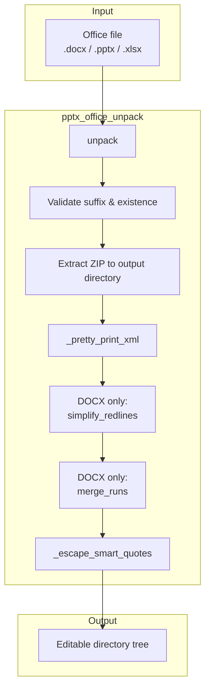
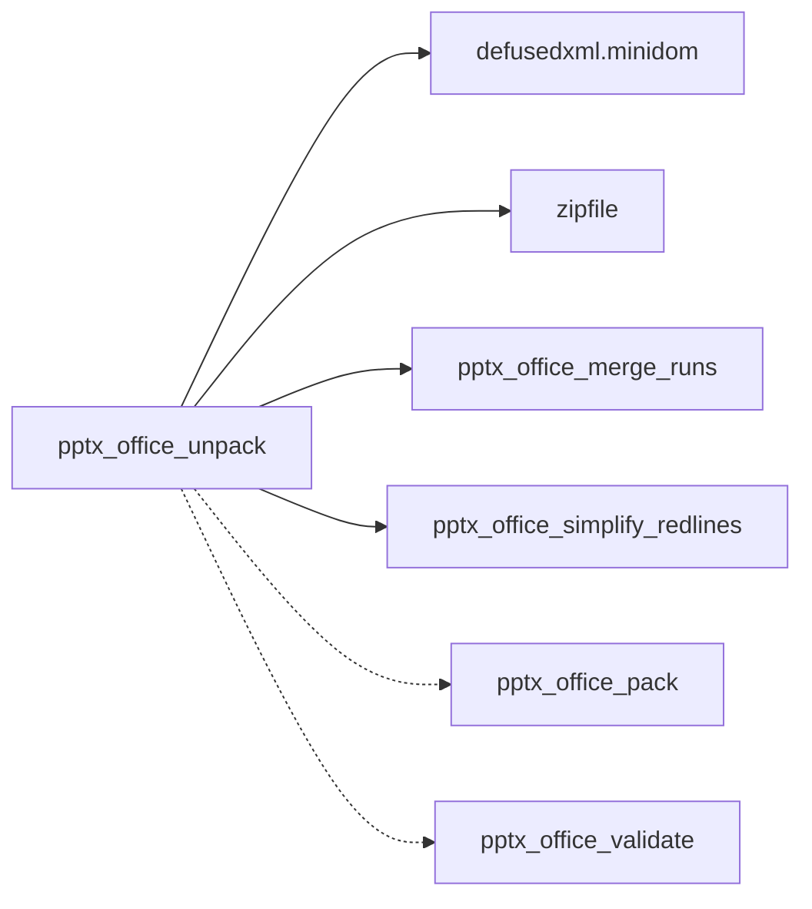
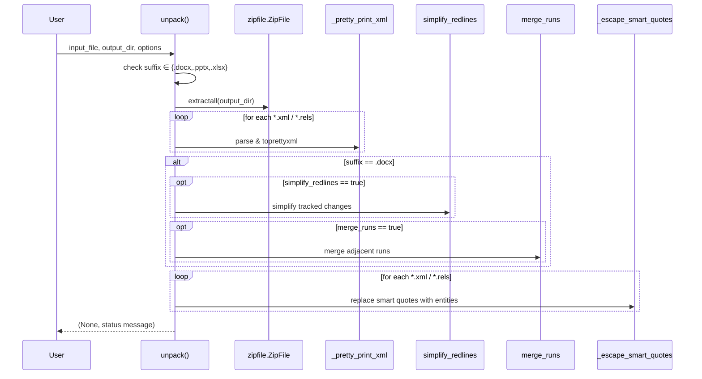

# pptx_office_unpack

## Brief Introduction

`pptx_office_unpack` is a utility module for extracting Office Open XML files—specifically **DOCX**, **PPTX**, and **XLSX**—into editable directory trees. It is part of the `ainxt_docskills` PPTX skill set and provides the inverse operation to [`pptx_office_pack`](pptx_office_pack.md). The module unzips the Office archive, pretty-prints all XML and `.rels` files, escapes Unicode smart quotes to XML entities, and (for DOCX only) optionally merges adjacent formatting runs and simplifies tracked changes.

This module is intended to be invoked as a CLI script or imported as a helper when a skill needs to inspect or mutate the internal structure of an Office document before repacking it.

---

## Comprehensive Documentation

### 1. Purpose and Core Functionality

Office documents are ZIP archives containing XML parts, relationships (`.rels`), and embedded media. Editing them reliably requires:

1. Extracting the archive to a working directory.
2. Formatting the XML so it is human-readable and diff-friendly.
3. Normalizing content so downstream edits are stable.

`pptx_office_unpack` performs all three steps. It supports the same file formats as its sibling packer and validator modules, ensuring a consistent round-trip workflow:

```text
.pptx/.docx/.xlsx  --unpack-->  editable directory  --pack-->  .pptx/.docx/.xlsx
```

The module is deliberately conservative: if an XML file cannot be parsed or a smart-quote escape fails, the error is swallowed and processing continues, leaving the file in its original state. This prevents a single malformed part from aborting the entire unpack operation.

### 2. Architecture and Component Relationships

#### 2.1 Module Location

```text
skills/
└── ainxt_docskills/
    └── pptx/
        └── scripts/
            └── office/
                ├── unpack.py          <-- this module
                ├── pack.py            <-- inverse operation
                ├── soffice.py         <-- LibreOffice integration
                ├── validate.py        <-- schema validation
                └── helpers/
                    ├── merge_runs.py    <-- DOCX run normalization
                    └── simplify_redlines.py  <-- tracked-change normalization
```

#### 2.2 Component Overview

| Component | Responsibility |
|-----------|----------------|
| `unpack` | Main entry point. Validates input, extracts ZIP, formats XML, applies optional DOCX normalizations, escapes smart quotes. |
| `_pretty_print_xml` | Parses an XML or `.rels` file with `defusedxml.minidom` and rewrites it with two-space indentation. |
| `_escape_smart_quotes` | Replaces curly single/double quotes with numeric XML entities to avoid encoding issues on repack. |

#### 2.3 Architecture Diagram



### 3. Dependencies

#### 3.1 Internal Dependencies

| Dependency | Module | Role |
|------------|--------|------|
| `do_merge_runs` | [`pptx_office_merge_runs`](pptx_office_merge_runs.md) | Merges adjacent `<w:r>` runs with identical formatting in `word/document.xml`. |
| `do_simplify_redlines` | [`pptx_office_simplify_redlines`](pptx_office_simplify_redlines.md) | Merges adjacent tracked insertions/deletions from the same author. |

Both helpers are imported from the `helpers/` package and are applied **only** when the input suffix is `.docx`.

#### 3.2 External Dependencies

- `defusedxml.minidom` — secure XML parsing and pretty-printing.
- `zipfile` — extraction of the Office Open XML container.
- `pathlib`, `argparse`, `sys` — standard library utilities.

#### 3.3 Dependency Diagram



### 4. Data Flow



### 5. Component Details

#### 5.1 `unpack(input_file, output_directory, merge_runs=True, simplify_redlines=True)`

The primary API. Returns a tuple `(None, message)` so that callers can consistently pattern-match on the second element for success or error strings.

**Parameters**

| Name | Type | Default | Description |
|------|------|---------|-------------|
| `input_file` | `str` | — | Path to the Office file to unpack. |
| `output_directory` | `str` | — | Destination directory for extracted contents. |
| `merge_runs` | `bool` | `True` | Merge adjacent runs in DOCX `word/document.xml`. Ignored for PPTX/XLSX. |
| `simplify_redlines` | `bool` | `True` | Simplify tracked changes in DOCX `word/document.xml`. Ignored for PPTX/XLSX. |

**Behavior**

1. Validates that `input_file` exists and has a supported suffix.
2. Creates `output_directory` if it does not exist.
3. Extracts the ZIP archive into `output_directory`.
4. Pretty-prints every `*.xml` and `*.rels` file found recursively.
5. For `.docx` files only:
   - Optionally simplifies tracked changes.
   - Optionally merges adjacent runs.
6. Escapes smart quotes in every XML/`.rels` file.
7. Returns a summary message including the number of XML files processed and, for DOCX, the counts of simplified redlines and merged runs.

**Error Handling**

- Missing file → `"Error: <file> does not exist"`
- Unsupported suffix → `"Error: <file> must be a .docx, .pptx, or .xlsx file"`
- Corrupted ZIP → `"Error: <file> is not a valid Office file"`
- Unexpected exception → `"Error unpacking: <e>"`

#### 5.2 `_pretty_print_xml(xml_file: Path)`

Reads an XML file, parses it with `defusedxml.minidom.parseString`, and overwrites it with `toprettyxml(indent="  ", encoding="utf-8")`. Any parse or I/O exception is silently ignored so that non-XML files or malformed parts do not halt the process.

#### 5.3 `_escape_smart_quotes(xml_file: Path)`

Re-inlines curly quotation marks as numeric XML character entities:

| Character | Unicode | Replacement |
|-----------|---------|-------------|
| Left double quotation mark | `U+201C` | `&#x201C;` |
| Right double quotation mark | `U+201D` | `&#x201D;` |
| Left single quotation mark | `U+2018` | `&#x2018;` |
| Right single quotation mark | `U+2019` | `&#x2019;` |

This step runs after pretty-printing and after DOCX normalization so that any newly introduced smart quotes are also escaped before the directory is handed off for editing or repacking.

### 6. CLI Usage

The module can be executed directly:

```bash
python unpack.py presentation.pptx ./unpacked_pptx
python unpack.py document.docx ./unpacked_docx
python unpack.py workbook.xlsx ./unpacked_xlsx
```

Optional flags control DOCX-specific normalization:

```bash
python unpack.py document.docx ./unpacked_docx --merge-runs false --simplify-redlines false
```

The CLI exits with code `1` if the returned message contains `"Error"`.

### 7. Integration with the Broader System

`pptx_office_unpack` is one node in a round-trip document-editing pipeline used by the `ainxt_docskills` PPTX skill set and related document skills:


- [`pptx_office_pack`](pptx_office_pack.md) reverses the operation by condensing XML and rebuilding the ZIP archive.
- [`pptx_office_validate`](pptx_office_validate.md) checks the unpacked or repacked tree against Office Open XML schema rules.
- [`pptx_office_soffice`](pptx_office_soffice.md) provides LibreOffice integration for conversions that are not handled by direct XML manipulation.
- [`pptx_add_slide`](pptx_add_slide.md), [`pptx_clean`](pptx_clean.md), and [`pptx_thumbnail`](pptx_thumbnail.md) operate on the unpacked tree to add slides, remove unused assets, or generate thumbnails.

Equivalent unpack modules exist for DOCX and XLSX under the same `ainxt_docskills` layout; they share the same helper utilities and follow the same conventions.

### 8. Design Notes and Constraints

- **Format support**: DOCX, PPTX, and XLSX are treated uniformly for extraction and XML formatting. DOCX-specific normalizations are gated by suffix.
- **Fail-soft XML handling**: `_pretty_print_xml` and `_escape_smart_quotes` swallow exceptions. This is intentional for robustness when archives contain unusual or partially corrupted parts.
- **Return signature**: The `(None, message)` tuple mirrors the convention used by [`pptx_office_pack`](pptx_office_pack.md), making it easy to chain calls in skill scripts.
- **No media transformation**: Images, fonts, and other binary parts are extracted verbatim; only XML parts are reformatted.
- **Security**: Uses `defusedxml.minidom` instead of the standard library `xml.dom.minidom` to mitigate XML entity expansion and other parsing attacks.

### 9. References

- [`pptx_office_pack`](pptx_office_pack.md) — repacks an unpacked directory into a DOCX/PPTX/XLSX file.
- [`pptx_office_validate`](pptx_office_validate.md) — validates Office Open XML structure.
- [`pptx_office_soffice`](pptx_office_soffice.md) — LibreOffice wrapper for conversions.
- [`pptx_office_merge_runs`](pptx_office_merge_runs.md) — DOCX run-merging helper.
- [`pptx_office_simplify_redlines`](pptx_office_simplify_redlines.md) — DOCX tracked-change simplification helper.
- [`docx_office_unpack`](docx_office_unpack.md) — equivalent unpacker for DOCX skill set.
- [`xlsx_office_unpack`](xlsx_office_unpack.md) — equivalent unpacker for XLSX skill set.
