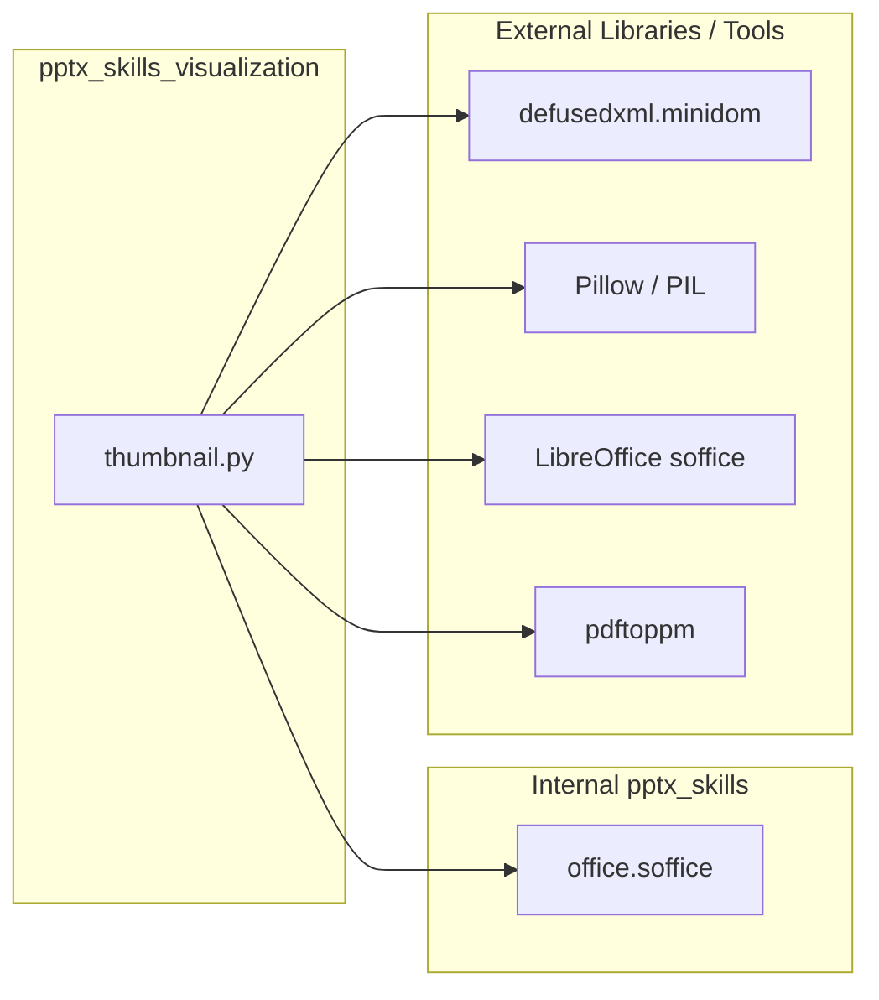
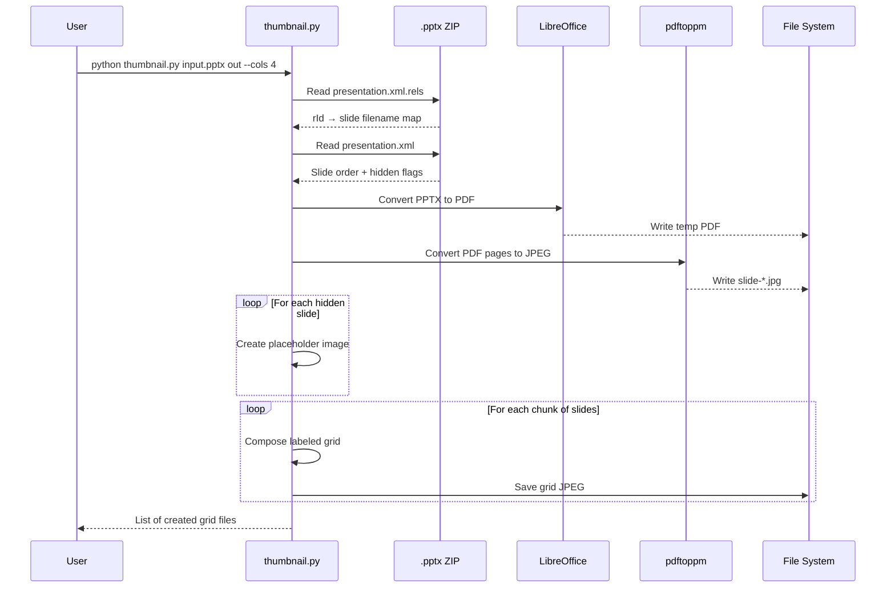

# pptx_skills_visualization

## Brief Introduction

The `pptx_skills_visualization` module provides a command-line utility for generating thumbnail grids from PowerPoint (`.pptx`) presentations. It converts slides into a single composite JPEG image arranged in a labeled grid, making it easy to visually scan, preview, or catalog slide decks. The module handles both visible and hidden slides, supports configurable grid dimensions, and automatically paginates large decks into multiple grid images.

This module is part of the broader [`pptx_skills`](pptx_skills.md) skill set under [`shared_skills`](shared_skills.md), which provides programmatic manipulation, packaging, and validation of PowerPoint files.

---

## Comprehensive Documentation

### Purpose and Core Functionality

`pptx_skills_visualization` is implemented in `ABStudio/skills/ainxt-skills/pptx/scripts/thumbnail.py`. Its primary purpose is to produce a visual summary of a `.pptx` file by rendering each slide as a thumbnail and arranging the thumbnails into a grid image.

Key capabilities include:

- **Slide-to-image conversion**: Converts a `.pptx` file to PDF using LibreOffice (`soffice`) and then extracts each page to a JPEG using `pdftoppm`.
- **Hidden slide handling**: Detects hidden slides from `ppt/presentation.xml` and renders them as placeholder images with a diagonal cross-hatch pattern.
- **Labeled grid layout**: Arranges thumbnails into rows and columns, labeling each with its source XML filename (e.g., `slide1.xml`).
- **Configurable output**: Supports custom output prefixes and column counts (up to a maximum).
- **Automatic pagination**: Splits large decks into multiple grid images when the slide count exceeds the capacity of a single grid.

### Architecture

The module is a self-contained script with a small set of focused functions orchestrated by a `main` entry point.

```mermaid
flowchart TB
    subgraph CLI["Command Line Interface"]
        A[Parse arguments: input.pptx, output_prefix, --cols]
    end

    subgraph Extraction["Slide Extraction"]
        B[Read ppt/_rels/presentation.xml.rels]
        C[Read ppt/presentation.xml]
        D[Build slide metadata list with hidden flags]
    end

    subgraph Conversion["Image Conversion"]
        E[Convert PPTX to PDF via soffice]
        F[Convert PDF pages to JPEG via pdftoppm]
    end

    subgraph Composition["Grid Composition"]
        G[Build slide list with hidden placeholders]
        H[Create grid image(s) with labels]
        I[Save JPEG output]
    end

    A --> B --> C --> D
    D --> E --> F --> G --> H --> I
```

### Component Relationships

| Function | Responsibility |
|----------|----------------|
| `main` | Entry point. Parses CLI arguments, validates input, orchestrates extraction/conversion/composition, and reports output files. |
| `get_slide_info` | Parses the `.pptx` ZIP archive to extract slide relationships and hidden-slide flags. |
| `convert_to_images` | Converts the `.pptx` to PDF and then to individual JPEG slide images using external tools. |
| `build_slide_list` | Combines metadata and image paths, generating placeholder images for hidden slides. |
| `create_hidden_placeholder` | Renders a gray placeholder with diagonal lines for hidden slides. |
| `create_grids` | Paginates slides into chunks and delegates grid creation for each chunk. |
| `create_grid` | Composes a single grid image: labels, thumbnails, borders, and padding. |

### Dependencies

The module relies on the following components:

- [`office.soffice`](pptx_skills_office_packaging.md) — Provides `get_soffice_env()` for configuring the LibreOffice execution environment.
- `defusedxml.minidom` — Secure XML parsing for reading OOXML relationship and presentation files.
- `PIL` (Pillow) — Image creation, resizing, drawing, and JPEG encoding.
- External system tools:
  - `soffice` (LibreOffice) — Headless conversion from PPTX to PDF.
  - `pdftoppm` — PDF page rasterization to JPEG.



### Data Flow

The following diagram illustrates how slide data flows from the raw `.pptx` archive to the final grid image(s).

```mermaid
flowchart LR
    A[Input .pptx file] --> B{ZIP archive}
    B --> C[ppt/_rels/presentation.xml.rels]
    B --> D[ppt/presentation.xml]
    C --> E[rId to slide filename mapping]
    D --> F[Slide order and hidden flags]
    E --> G[Slide metadata list]
    F --> G
    G --> H[Visible slides: convert to PDF then JPEG]
    G --> I[Hidden slides: generate placeholder JPEG]
    H --> J[Slide list: (image_path, label)]
    I --> J
    J --> K[Grid composer]
    K --> L[Output JPEG grid(s)]
```

### Process Flow

A typical execution proceeds as follows:

1. **Argument parsing**: Validate that the input file exists and has a `.pptx` extension. Clamp `--cols` to the configured maximum.
2. **Metadata extraction**: Open the `.pptx` as a ZIP archive and parse `ppt/_rels/presentation.xml.rels` to map relationship IDs to slide filenames. Then parse `ppt/presentation.xml` to determine slide order and whether each slide is hidden (`show="0"`).
3. **Image conversion**: Use `soffice --headless --convert-to pdf` to produce a PDF, then `pdftoppm -jpeg` to produce one JPEG per visible slide.
4. **Slide list assembly**: Pair each visible slide with its XML filename. For hidden slides, generate a placeholder image and label it as hidden.
5. **Grid creation**: Split slides into chunks (capacity = `cols * (cols + 1)`). For each chunk, compose a grid with labels, thumbnails, borders, and padding, then save as JPEG.
6. **Output reporting**: Print the list of generated grid files.



### Configuration and Constants

| Constant | Default | Description |
|----------|---------|-------------|
| `THUMBNAIL_WIDTH` | 300 px | Width of each thumbnail in the grid. |
| `CONVERSION_DPI` | 100 | DPI used when rasterizing PDF pages. |
| `MAX_COLS` | 6 | Maximum number of columns allowed. |
| `DEFAULT_COLS` | 3 | Default number of columns. |
| `JPEG_QUALITY` | 95 | JPEG output quality. |
| `GRID_PADDING` | 20 px | Padding between grid cells. |
| `BORDER_WIDTH` | 2 px | Thumbnail border width. |
| `FONT_SIZE_RATIO` | 0.10 | Label font size relative to thumbnail width. |
| `LABEL_PADDING_RATIO` | 0.4 | Label padding relative to font size. |

### Error Handling

The module performs basic validation and error reporting:

- Exits with an error if the input file is missing or does not end with `.pptx`.
- Exits with an error if no slides are found and no hidden slides exist.
- Raises `RuntimeError` if PDF conversion or image conversion fails.
- Catches unexpected exceptions in `main`, prints the error, and exits with code `1`.

### Usage Examples

```bash
# Generate thumbnails.jpg with default 3-column grid
python thumbnail.py presentation.pptx

# Generate grid.jpg with a 4-column grid
python thumbnail.py template.pptx grid --cols 4
```

For large decks, the output is paginated (e.g., `grid-1.jpg`, `grid-2.jpg`).

### Integration with the Broader System

This visualization utility is designed to be invoked as a standalone script within the [`pptx_skills`](pptx_skills.md) ecosystem. It complements other `pptx_skills` modules:

- [`pptx_skills_slide_ops`](pptx_skills_slide_ops.md) — Adds, duplicates, or cleans slides before visualization.
- [`pptx_skills_office_packaging`](pptx_skills_office_packaging.md) — Unpacks and repacks the `.pptx` archive; provides the `soffice` environment helper used here.
- [`pptx_skills_office_validation`](pptx_skills_office_validation.md) — Validates the structural integrity of the `.pptx` before or after modifications.

It is also related to the higher-level [`doc_generator`](shared_integrations.md) and [`presenton_lib`](ai_ui_frontend.md) components that produce `.pptx` artifacts, where thumbnail previews can aid in content review and cataloging.

---

## References

- [`pptx_skills`](pptx_skills.md) — Parent skill set for PowerPoint manipulation.
- [`pptx_skills_slide_ops`](pptx_skills_slide_ops.md) — Slide-level operations (add, duplicate, clean).
- [`pptx_skills_office_packaging`](pptx_skills_office_packaging.md) — OOXML archive packaging and `soffice` integration.
- [`pptx_skills_office_helpers`](pptx_skills_office_helpers.md) — Text-run merging and redline simplification helpers.
- [`pptx_skills_office_validation`](pptx_skills_office_validation.md) — OOXML schema and redlining validation.
- [`shared_skills`](shared_skills.md) — Overview of all reusable document-processing skills.
