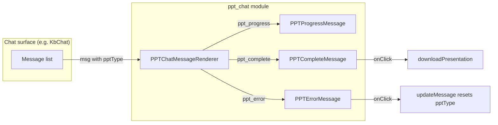
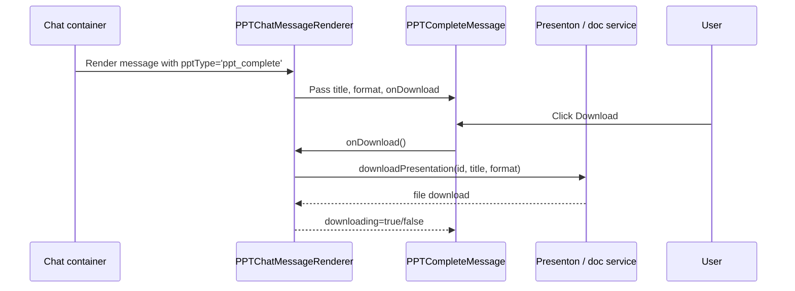
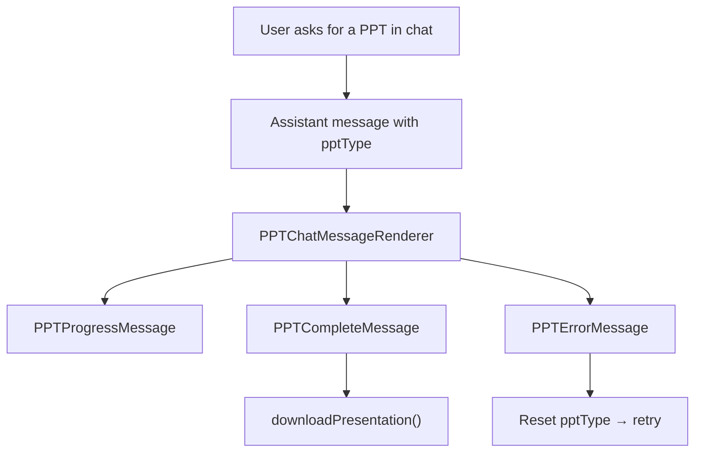

# ppt_chat Module

## Overview

The `ppt_chat` module provides the frontend React components that render rich, interactive cards for PowerPoint (PPT) generation inside the AI chat interface. It is a thin presentation layer: it does not generate presentations itself, but displays the status of an ongoing PPT generation job and lets the user download the finished file or retry a failed attempt.

Outlines and plan text are intentionally **not** rendered by this module; they appear as normal assistant chat messages with markdown formatting. This module only handles three specialized card types:

- **Progress card** – shows a spinner and a progress bar while the presentation is being generated.
- **Complete card** – shows a download button once the presentation is ready.
- **Error card** – shows the failure reason and a retry button.

The module lives in the `ai-ui` frontend application and is consumed by the broader chat components (see ai_ui_frontend).

---

## Architecture

### Component responsibilities

| Component | File | Responsibility |
|-----------|------|----------------|
| `PPTChatMessageRenderer` | `PPTChatMessageRenderer.jsx` | Dispatcher that inspects `msg.pptType` and renders the matching card. Also owns local loading state for the download action and provides a helper to mutate the current message in the chat store. |
| `PPTProgressMessage` | `PPTChatMessage.jsx` | Visual feedback during generation: spinner, progress bar capped at 90 %, and percentage text. |
| `PPTCompleteMessage` | `PPTChatMessage.jsx` | Success card that displays a cleaned title and a download button for the generated `.pptx` (or other format). |
| `PPTErrorMessage` | `PPTChatMessage.jsx` | Failure card that displays the error message and a retry button. |

---

## Data Flow

1. A parent chat component (such as `KbChat`) stores messages in its local `chats` array.
2. When a message has a `pptType` field, the parent renders `PPTChatMessageRenderer` instead of the default message bubble.
3. The renderer reads `msg.pptType` and chooses the appropriate card.
4. For completed presentations, the renderer sanitizes the title and calls the `downloadPresentation` callback injected by the parent.
5. For errors, the renderer resets `pptType` and `pptError` on the message so the parent can re-run generation.

---

## Core Components

### `PPTChatMessageRenderer`

The single entry point of the module. It receives the following props from its parent:

- `msg` – the message object to render.
- `activeChatId` – id of the currently selected chat, used to update the correct chat in `setChats`.
- `setChats` – state setter for the chat list.
- `generateOutline`, `confirmAndGenerate`, `downloadPresentation` – action callbacks supplied by the parent chat component.
- `pptState`, `pptConversation` – global PPT generation state and conversation context.

The renderer maintains local state for the download button (`loading`, `downloading`) and exposes `updateMessage(messageId, updates)`, which immutably patches a single message inside the active chat.

Title sanitization rules applied before rendering a complete card:

- If the title contains `Previous outline:`, only the human-readable prefix is kept.
- If the title starts with `{` (raw JSON), it is replaced with `"Presentation"`.

### `PPTProgressMessage`

Displays generation progress. The progress bar width is `Math.min(progress, 90)` so the bar never appears fully complete while the backend may still be finalizing the file.

### `PPTCompleteMessage`

Renders a download button. The button label includes the cleaned title and lower-cased file extension. While downloading, the button shows a spinner and the text "Downloading...".

### `PPTErrorMessage`

Renders the error text and a "Try Again" button. Clicking it clears `pptType` and `pptError` on the message, allowing the parent to treat the message as a normal user prompt and retry generation.

---

## Integration with the Rest of the System

- **Parent chat surface**: `PPTChatMessageRenderer` is invoked from the general chat rendering path in `ai-ui`. The most likely consumer is the knowledge-base chat component documented in [kb_chat](../knowledge/kb_chat.md), which handles PPT intents and supplies the `downloadPresentation` callback.
- **Presentation generation backend**: The actual generation is performed by the Presenton service and the document-generation workers. The frontend module only receives the result id/title/format and triggers the download. See [presenton_lib](presenton_lib.md) for the client library that streams outlines and polls generation status, and [workers](../workers/workers.md) for the backend job that builds the PPTX file.
- **PPT wizard**: A separate, dedicated PPT creation UI is provided by [ppt_wizard](ppt_wizard.md). The chat-based PPT flow (`ppt_chat`) is the lightweight alternative that keeps the user inside the conversation.

---

## Visual Summary

---

## Notes for Maintainers

- This module intentionally does **not** render outlines. If you need to change how outlines appear, update the regular assistant message rendering path in the parent chat component, not this module.
- The progress bar is capped at 90 % to avoid a false "done" state before the backend confirms completion.
- Title sanitization is defensive: the backend may append JSON context to the title, and this module strips it before showing it to the user or using it as a filename.
- Keep the component props stable; parent chat components pass callbacks by reference, and changing the prop contract requires updates in every chat surface that uses PPT cards.
