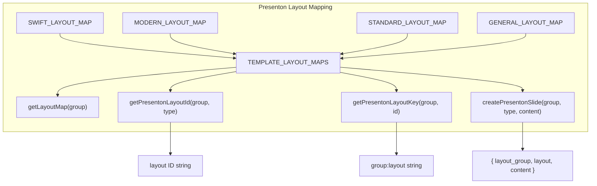
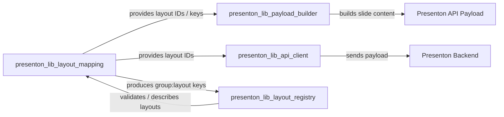
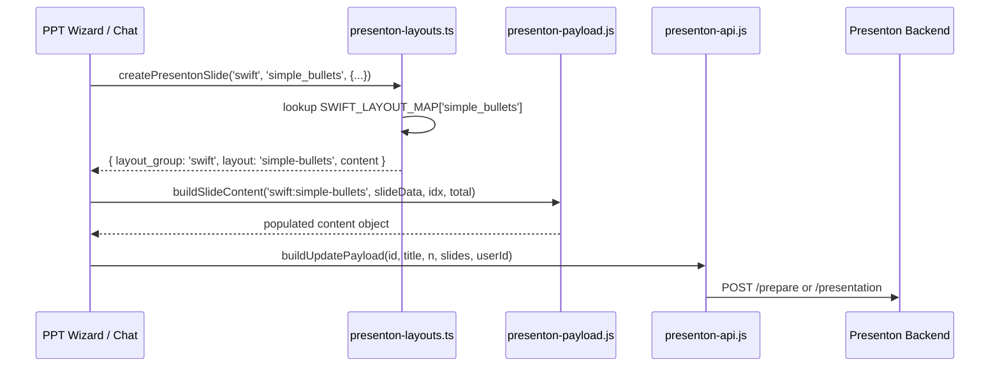
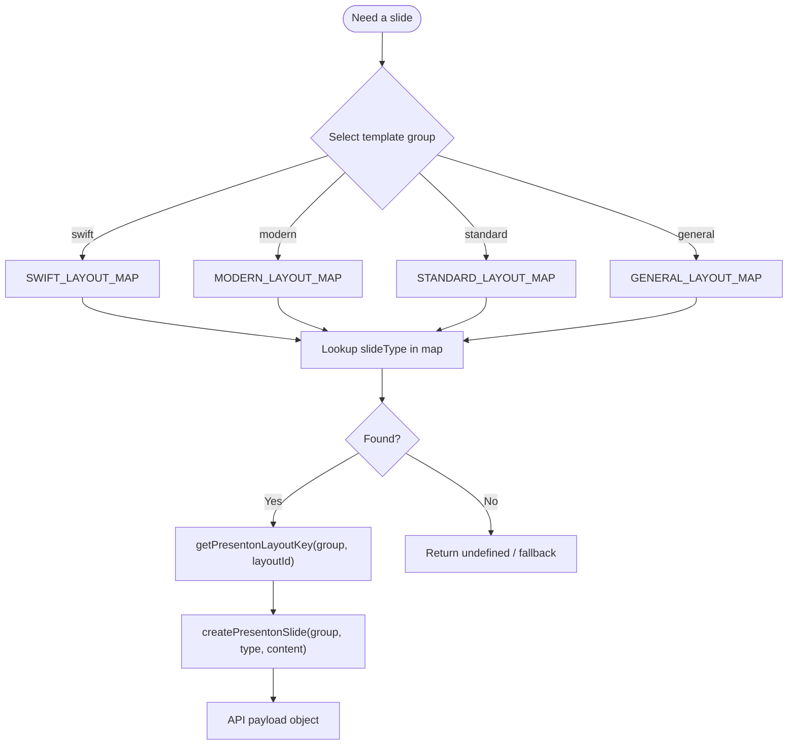
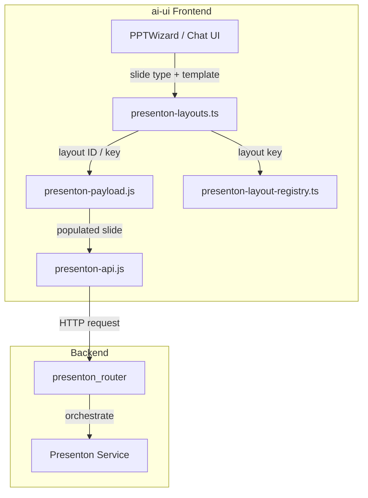

# Presenton Layout Mapping

## Brief Introduction

The **Presenton Layout Mapping** module (`ai-ui/src/lib/presenton-layouts.ts`) is a small, type-safe TypeScript library that maps AiNxt's internal slide types to the layout identifiers expected by the **Presenton** presentation-generation backend. It is part of the larger [`presenton_lib`](presenton_lib.md) frontend library and provides the canonical lookup tables and helper functions used when building payloads for the Presenton `/prepare` API.

In short, this module answers the question: *"For a given template theme and slide type, what Presenton layout ID should we send?"*

---

## Core Responsibilities

1. **Define layout maps per template group** — four template families (`swift`, `modern`, `standard`, `general`) each have their own set of supported slide types and corresponding Presenton layout IDs.
2. **Provide type-safe lookups** — exported TypeScript types (`SwiftLayoutType`, `ModernLayoutType`, etc.) ensure consumers can only request slide types that exist for a given template group.
3. **Construct slide objects** — `createPresentonSlide` packages a slide's layout group, layout ID, and content into the exact shape the Presenton API expects.
4. **Generate composite layout keys** — `getPresentonLayoutKey` produces fully-qualified keys such as `swift:simple-bullets`, which are used by the layout registry and payload builder elsewhere in the system.

---

## Supported Template Groups

| Template Group | Description | Example Slide Types |
|---|---|---|
| `swift` | Fast, minimal pitch-style layouts | `intro`, `simple_bullets`, `metrics`, `timeline`, `table_or_chart` |
| `modern` | Modern pitch-deck layouts | `intro`, `problem`, `solution`, `market_size`, `team`, `thank_you` |
| `standard` | Classic corporate presentation layouts | `intro`, `heading_bullet_image`, `icon_bullets`, `contact` |
| `general` | Generic, reusable layouts | `intro`, `basic_info`, `quote`, `table_info`, `team` |

Each group is declared as a `const` object and exposed through `TEMPLATE_LAYOUT_MAPS`, the single source of truth for all lookups.

---

## Core Components

### Layout Maps

- `SWIFT_LAYOUT_MAP`
- `MODERN_LAYOUT_MAP`
- `STANDARD_LAYOUT_MAP`
- `GENERAL_LAYOUT_MAP`
- `TEMPLATE_LAYOUT_MAPS` — aggregate map keyed by `TemplateGroup`

### Types

- `SwiftLayoutType`, `ModernLayoutType`, `StandardLayoutType`, `GeneralLayoutType`
- `TemplateGroup` — union of the four group keys
- `LayoutType` — union of all supported slide-type keys

### Helper Functions

| Function | Purpose |
|---|---|
| `getLayoutMap(templateGroup)` | Returns the raw layout map for a template group. |
| `getPresentonLayoutId(templateGroup, slideType)` | Resolves a slide type to its Presenton layout ID string. |
| `getPresentonLayoutKey(templateGroup, layoutId)` | Builds a fully-qualified key such as `swift:simple-bullets`. |
| `createPresentonSlide(templateGroup, slideType, content)` | Returns a `{ layout_group, layout, content }` object ready for the API. |

---

## Architecture



The module is intentionally stateless. All data lives in immutable `const` maps, and every helper derives its result from `TEMPLATE_LAYOUT_MAPS`.

---

## Dependencies & Relationships

This module is one of five cooperating modules in the frontend Presenton library. It does **not** perform network I/O or stream parsing itself; instead, it supplies layout identifiers to the modules that do.



### Related Modules

| Module | Role | How It Uses Layout Mapping |
|---|---|---|
| [`presenton_lib_api_client`](presenton_lib_api_client.md) | HTTP client for Presenton endpoints | Uses resolved layout IDs when preparing API requests. |
| [`presenton_lib_layout_registry`](presenton_lib_layout_registry.md) | Layout metadata registry | Consumes fully-qualified keys (`group:layout`) produced by `getPresentonLayoutKey` and `getSlideLayout`. |
| [`presenton_lib_payload_builder`](presenton_lib_payload_builder.md) | Builds per-slide content objects | Uses layout keys to decide which content schema to generate. |
| [`presenton_lib_stream_reader`](presenton_lib_stream_reader.md) | Reads streaming Presenton responses | Receives the final payload but does not interact directly with layout maps. |
| [`presenton_router`](presenton_router.md) | Backend router for Presenton | Receives payloads containing `layout_group` and `layout` fields. |
| [`ppt_wizard`](ppt_wizard.md) | UI wizard for creating presentations | Likely triggers the flow that ultimately calls `createPresentonSlide`. |

---

## Data Flow

The typical flow from an abstract slide request to a Presenton API payload is:



1. A UI component (e.g., [`ppt_wizard`](ppt_wizard.md)) decides it needs a slide of type `simple_bullets` for the `swift` template.
2. It calls `createPresentonSlide`, which resolves the internal type to the Presenton layout ID `simple-bullets`.
3. The returned object is passed to [`presenton_lib_payload_builder`](presenton_lib_payload_builder.md), which fills in the content schema (title, statement, points, website, etc.).
4. [`presenton_lib_api_client`](presenton_lib_api_client.md) assembles the final payload and sends it to the Presenton backend.

---

## Component Interaction

### `getLayoutMap`

Returns the raw `Record<slideType, layoutId>` for a template group. Useful when a consumer needs to enumerate available layouts or build a picker UI.

### `getPresentonLayoutId`

The primary lookup function. Given a `TemplateGroup` and a `LayoutType`, it returns the string layout ID stored in the corresponding map.

```typescript
const layoutId = getPresentonLayoutId('swift', 'simple_bullets');
// => 'simple-bullets'
```

### `getPresentonLayoutKey`

Creates a fully-qualified key used by the layout registry and payload builder. This is the bridge between the layout map and the richer metadata in [`presenton_lib_layout_registry`](presenton_lib_layout_registry.md).

```typescript
const key = getPresentonLayoutKey('swift', 'simple-bullets');
// => 'swift:simple-bullets'
```

### `createPresentonSlide`

The highest-level helper. It combines group, slide type, and arbitrary content into the API-ready slide shape.

```typescript
const slide = createPresentonSlide('swift', 'simple_bullets', {
  title: 'Our Commitment',
  statement: 'We are committed to excellence...',
  points: [
    { title: 'Point 1', body: 'Description 1' },
    { title: 'Point 2', body: 'Description 2' }
  ],
  website: 'www.example.com'
});
// => { layout_group: 'swift', layout: 'simple-bullets', content: {...} }
```

---

## Process Flow: Resolving a Slide



---

## How It Fits Into the System

The Presenton Layout Mapping module sits at the boundary between the AiNxt product's abstract slide concepts and the Presenton service's concrete layout identifiers.



- **Upstream consumers** are UI features that let users create or edit presentations.
- **Downstream consumers** are the API client and payload builder that turn these abstract slides into network requests.
- **Backend counterpart** is [`presenton_router`](presenton_router.md), which exposes endpoints such as `generate_outline`, `generate_presentation`, and `download_presentation`.

---

## Type Safety

Because each layout map is declared `as const`, TypeScript can derive exact literal unions for slide types. The helper functions use these unions to prevent invalid combinations at compile time:

```typescript
// OK
getPresentonLayoutId('swift', 'simple_bullets');

// TypeScript error: 'simple_bullets' is not a valid ModernLayoutType
getPresentonLayoutId('modern', 'simple_bullets');
```

`createPresentonSlide` is generic over `TemplateGroup`, so the `slideType` parameter is constrained to the keys of the selected group's map.

---

## Extending the Module

When adding a new Presenton template group or a new slide type to an existing group:

1. Add a new `const` map (e.g., `MINIMAL_LAYOUT_MAP`) or extend an existing one.
2. Export a corresponding type (e.g., `MinimalLayoutType`).
3. Register the new map in `TEMPLATE_LAYOUT_MAPS`.
4. Update `LayoutType` and `TemplateGroup` if a new group is added.
5. Coordinate with [`presenton_lib_payload_builder`](presenton_lib_payload_builder.md) to add the matching content schema in `buildSlideContent`.
6. Coordinate with [`presenton_lib_layout_registry`](presenton_lib_layout_registry.md) if the new layout requires metadata or JSON-Schema validation.

---

## References

- [`presenton_lib`](presenton_lib.md) — parent library overview
- [`presenton_lib_api_client`](presenton_lib_api_client.md) — HTTP client for Presenton
- [`presenton_lib_layout_registry`](presenton_lib_layout_registry.md) — layout metadata registry
- [`presenton_lib_payload_builder`](presenton_lib_payload_builder.md) — slide content builder
- [`presenton_lib_stream_reader`](presenton_lib_stream_reader.md) — streaming response reader
- [`presenton_router`](presenton_router.md) — backend Presenton API router
- [`ppt_wizard`](ppt_wizard.md) — frontend presentation wizard
