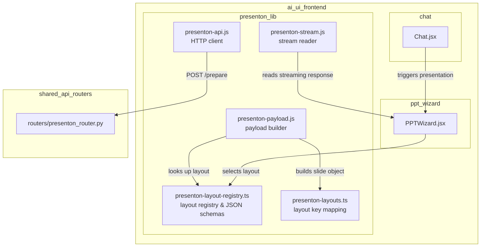
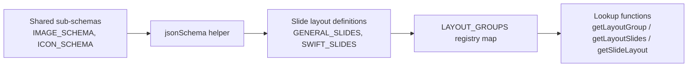
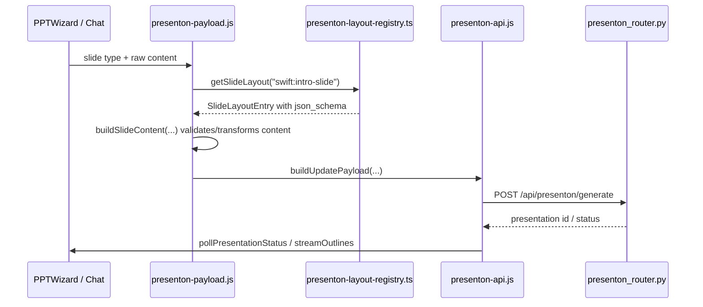

# presenton_lib_layout_registry

## Brief Introduction

`presenton_lib_layout_registry` is the static layout catalog for the **Presenton** presentation-generation subsystem in the `ai-ui` frontend. It defines the JSON Schema contracts that every slide layout must satisfy, groups those layouts by template family (e.g. `general`, `swift`), and exposes lookup helpers used by the rest of the Presenton library and by UI components that build or render presentations.

In other words, this module is the **source of truth for "what a slide can look like"** in the frontend. It does not fetch layouts from the network, nor does it render them; it only declares the available layouts and the shape of the data each one accepts.

---

## Comprehensive Documentation

### 1. Purpose and Core Functionality

The module has three responsibilities:

1. **Declare slide layout metadata** — every layout has a unique id, human-readable name, description, template group, and a JSON Schema describing its expected `content` payload.
2. **Group layouts into template families** — layouts are organized under `LayoutGroup` objects such as `general` and `swift`. Groups can be enabled or disabled independently (the registry currently ships `general` and `swift`; `modern` and `standard` are commented out).
3. **Provide lookup utilities** — `getLayoutGroup`, `getLayoutSlides`, and `getSlideLayout` let consumers retrieve layouts by group or by full id (e.g. `general:basic-info-slide`).

These schemas are consumed by the Presenton `/prepare` API path: the backend uses them to validate slide content before rendering a `.pptx`. Keeping the schemas in the frontend guarantees that the UI, payload builders, and backend all agree on the data shape.

### 2. Architecture and Component Relationships

#### 2.1 High-level placement



#### 2.2 Internal structure



### 3. Core Components

#### 3.1 Data models

| Export | Type | Description |
|--------|------|-------------|
| `SlideLayoutEntry` | `interface` | One slide layout: `id`, `name`, `description`, `json_schema`, `templateID`, `templateName`. |
| `LayoutGroup` | `interface` | A template family: `name`, `ordered` flag, and `slides: SlideLayoutEntry[]`. |

#### 3.2 Shared sub-schemas

Two reusable schema fragments are defined once and referenced by many layouts:

- **`IMAGE_SCHEMA`** — requires `__image_url__` (URI) and `__image_prompt__` (10–120 chars).
- **`ICON_SCHEMA`** — requires `__icon_url__` and `__icon_query__` (5–40 chars).

These special `__*` keys are the Presenton convention for media assets that may be generated or fetched at render time.

#### 3.3 `jsonSchema` helper

```ts
function jsonSchema(
  properties: Record<string, unknown>,
  required: string[]
): Record<string, unknown>
```

Wraps a property map and a required-field list into a JSON Schema Draft 2020-12 object with `additionalProperties: false`. This keeps every layout schema consistent and terse.

#### 3.4 Layout groups

| Group | Status | Notable layouts |
|-------|--------|-----------------|
| `general` | Active | Intro, Basic Info, Bullet Icons, Chart with Bullets, Metrics, Quote, Table Info, Table of Contents, Team |
| `swift` | Active | Intro, Table of Contents, Simple Bullets, Bullets with Icons, Metrics Numbers, Timeline, Table or Chart |
| `modern` | Commented out | Pitch-deck oriented layouts (Problem, Solution, Market Size, etc.) |
| `standard` | Commented out | Classic corporate layouts (Contact, Chart Left Text Right, etc.) |

#### 3.5 Lookup functions

| Function | Signature | Behavior |
|----------|-----------|----------|
| `getLayoutGroup` | `(group: string) => LayoutGroup` | Returns the requested group or falls back to `general`. |
| `getLayoutSlides` | `(group: string) => SlideLayoutEntry[]` | Returns all slides in a group. |
| `getSlideLayout` | `(id: string) => SlideLayoutEntry \| undefined` | Parses `"group:layoutId"` and finds the matching slide. |

### 4. Data Flow

When a user asks the AI to generate a presentation, the flow looks like this:



### 5. How It Fits into the Overall System

`presenton_lib_layout_registry` sits at the **contract layer** of the Presenton feature:

- **Upstream consumers**
  - [`presenton_lib_payload_builder`](presenton_lib_payload_builder.md) uses the registry to know which fields each slide type requires and to fill sensible defaults.
  - [`presenton_lib_api_client`](presenton_lib_api_client.md) does not directly import the registry, but the payloads it sends must conform to the schemas defined here.
  - [`ppt_wizard`](ppt_wizard.md) and [`chat`](../chat/chat.md) components initiate presentation generation and may preview available layouts.

- **Downstream consumers**
  - [`presenton_router`](presenton_router.md) on the backend receives payloads whose slide content is validated against these schemas.
  - [`workers/presenton_worker`](../workers/workers.md) renders the final `.pptx` using the layout ids and content sent from the frontend.

### 6. Key Design Decisions

1. **Static registry, not dynamic fetch**  
   Layouts are hard-coded in TypeScript so the UI can render offline-capable previews and fail fast when a layout id is unknown.

2. **JSON Schema as the contract**  
   Each layout exports a full JSON Schema Draft 2020-12 object. This lets the backend reuse the same schema for validation and lets LLM-based generators produce structurally correct slide content.

3. **`additionalProperties: false`**  
   Every schema rejects extra properties, preventing silent drift between the frontend payload builder and the backend renderer.

4. **Media assets use `__image_*` and `__icon_*` keys**  
   These double-underscore fields are reserved for asset metadata (URL + provenance prompt/query) and are treated specially by the rendering pipeline.

5. **Fallback to `general`**  
   `getLayoutGroup` returns the `general` group for unknown group names, making the registry resilient to stale or experimental template ids.

### 7. Related Modules

- [`presenton_lib_layout_mapping`](presenton_lib_layout_mapping.md) — maps high-level slide types to concrete layout ids and creates slide objects.
- [`presenton_lib_payload_builder`](presenton_lib_payload_builder.md) — transforms raw slide data into schema-compliant content payloads.
- [`presenton_lib_api_client`](presenton_lib_api_client.md) — network layer for Presenton endpoints.
- [`presenton_lib_stream_reader`](presenton_lib_stream_reader.md) — reads streaming responses from the Presenton service.
- [`ppt_wizard`](ppt_wizard.md) — UI wizard for building presentations.
- [`presenton_router`](presenton_router.md) — backend API that consumes these schemas.
