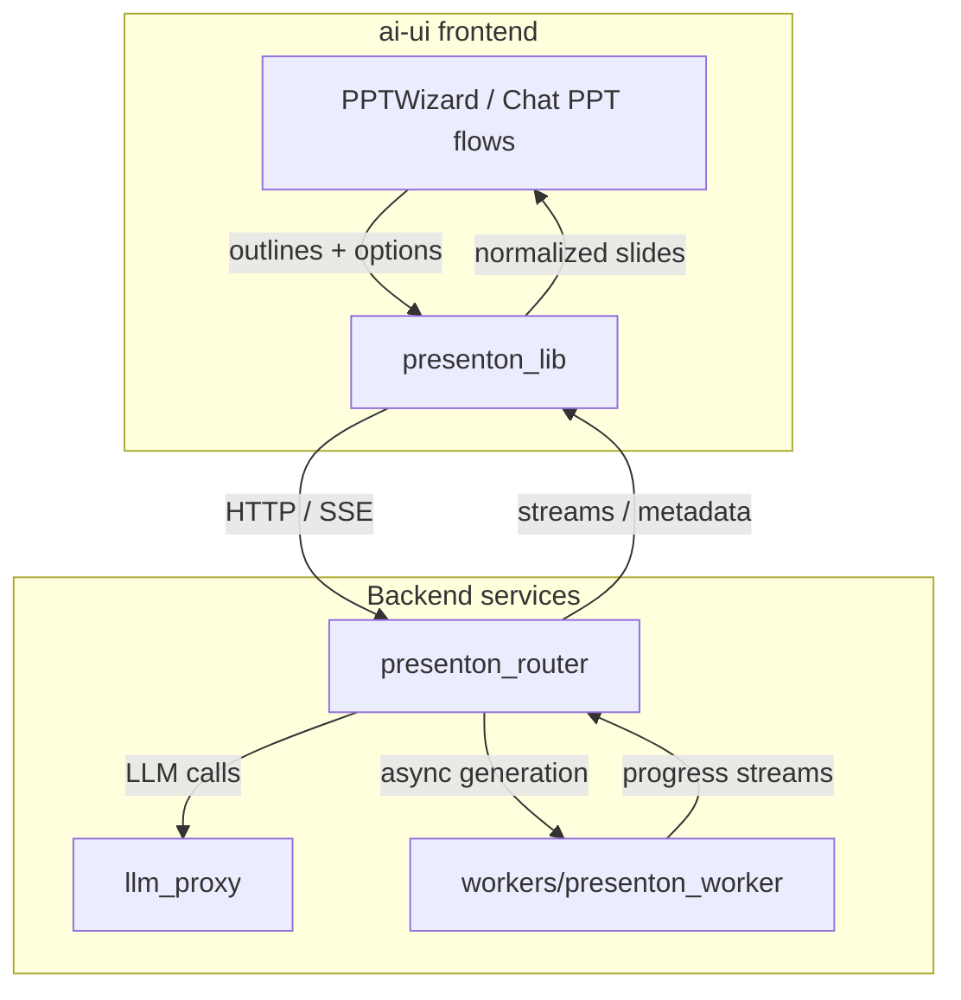
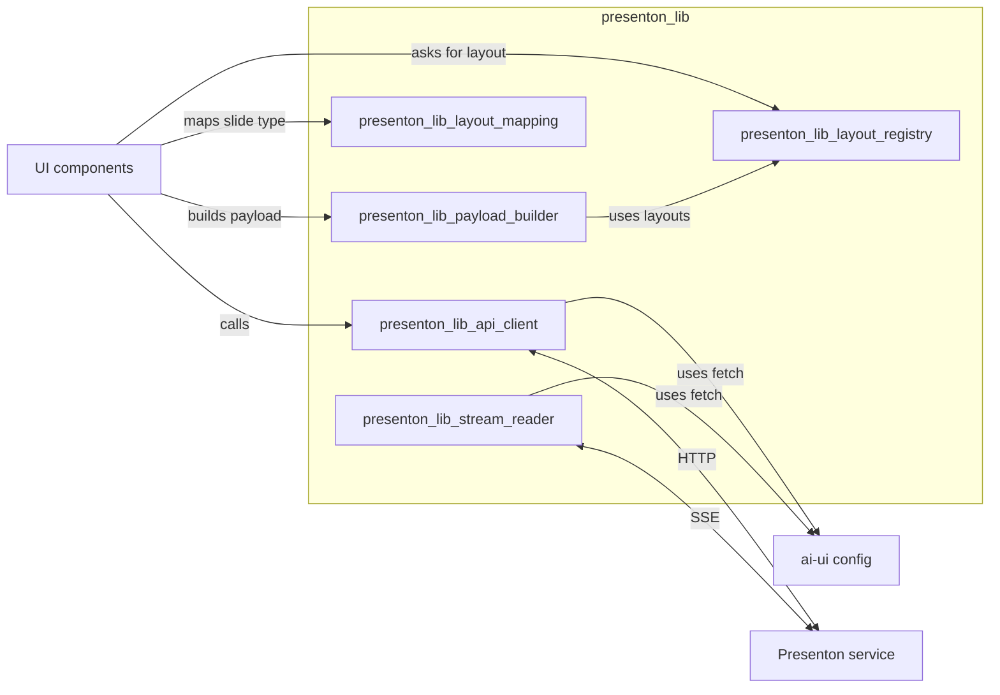
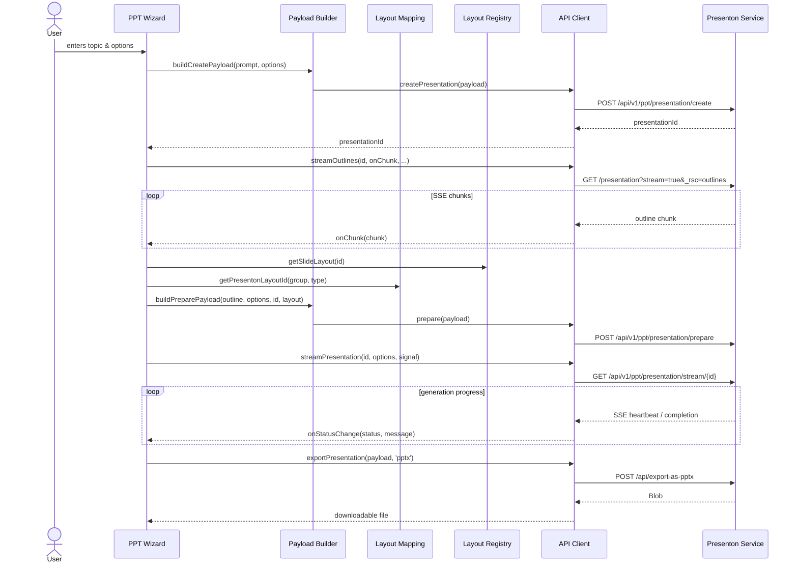

# presenton_lib

`presenton_lib` is the frontend integration library for the **Presenton** presentation-generation service. It lives inside the `ai-ui` React application (`ai-ui/src/lib/`) and provides a typed, reusable abstraction over Presenton’s HTTP and streaming endpoints.

## Purpose

The library’s main responsibilities are:

1. **API client** – communicate with Presenton endpoints for creating, preparing, updating, exporting, and polling presentations.
2. **Layout registry** – statically define every supported slide layout, its JSON Schema, and template metadata so the backend can validate generated slide content.
3. **Layout mapping** – map application-internal slide type names to Presenton layout identifiers.
4. **Payload builder** – transform user outlines and options into the canonical request bodies expected by Presenton.
5. **Stream reader** – consume server-sent / React Server Component streams that report real-time generation progress.

By centralizing these concerns, the rest of the `ai-ui` frontend (notably the PPT wizard and chat components) can generate presentations without hard-coding Presenton-specific URLs, schemas, or retry logic.

## Where It Fits in the System

- **Upstream consumers**: `PPTWizard.jsx`, `PPTChatMessageRenderer.jsx`, and any chat flow that produces a presentation. See [`ai_ui_frontend`](ai_ui_frontend.md).
- **Downstream backend**: [`presenton_router`](presenton_router.md) exposes the REST/SSE surface; [`llm_proxy`](llm_proxy.md) and [`workers/presenton_worker`](workers.md) perform the actual generation.
- **Shared configuration**: `presenton_lib` relies on `presentonFetch` and timeout constants exported from `ai-ui/src/config.js`.

## Architecture Overview

The five sub-modules are intentionally decoupled:

- **`presenton_lib_api_client`** owns all network I/O, retries, timeouts, and error classification.
- **`presenton_lib_layout_registry`** owns the source of truth for what layouts exist and what data each one requires.
- **`presenton_lib_layout_mapping`** owns the translation between the app’s semantic slide types and Presenton layout IDs.
- **`presenton_lib_payload_builder`** owns the shape of every request body sent to Presenton.
- **`presenton_lib_stream_reader`** owns the low-level mechanics of reading a `ReadableStream` and dispatching chunks.

## Typical Presentation Generation Flow

## Sub-modules

| Sub-module | File(s) | Responsibility | Documentation |
|------------|---------|----------------|---------------|
| API Client | `presenton-api.js` | Retry-aware HTTP wrapper for all Presenton endpoints | [`presenton_lib_api_client.md`](presenton_lib_api_client.md) |
| Layout Registry | `presenton-layout-registry.ts` | Static registry of slide layouts and JSON Schemas | [`presenton_lib_layout_registry.md`](presenton_lib_layout_registry.md) |
| Layout Mapping | `presenton-layouts.ts` | Maps internal slide types to Presenton layout IDs | [`presenton_lib_layout_mapping.md`](presenton_lib_layout_mapping.md) |
| Payload Builder | `presenton-payload.js` | Builds create, prepare, update, and export payloads | [`presenton_lib_payload_builder.md`](presenton_lib_payload_builder.md) |
| Stream Reader | `presenton-stream.js` | Reads Presenton `ReadableStream` responses | [`presenton_lib_stream_reader.md`](presenton_lib_stream_reader.md) |

## Key Design Decisions

- **Retry with exponential backoff** is implemented in the API client rather than the global fetch wrapper, because Presenton generation endpoints are long-running and need longer timeouts and more retries than generic API calls.
- **Layout registry is static TypeScript** so schemas are version-controlled alongside the frontend and can be validated at build time.
- **Payload builder requires an explicit layout override** for `buildPreparePayload`; this prevents accidental requests without a schema and makes the dependency on the registry explicit.
- **Streaming is separated from polling**: `streamPresentation` handles the SSE generation stream, while `pollPresentationStatus` polls metadata and optionally attaches RSC streams for UI updates.

## Related Modules

- [`ai_ui_frontend`](ai_ui_frontend.md) – the React application that consumes this library.
- [`presenton_router`](presenton_router.md) – backend router that exposes the Presenton REST/SSE API.
- [`llm_proxy`](llm_proxy.md) – LLM proxy used during slide content generation.
- [`workers`](workers.md) – includes `presenton_worker` for asynchronous PPT generation jobs.
