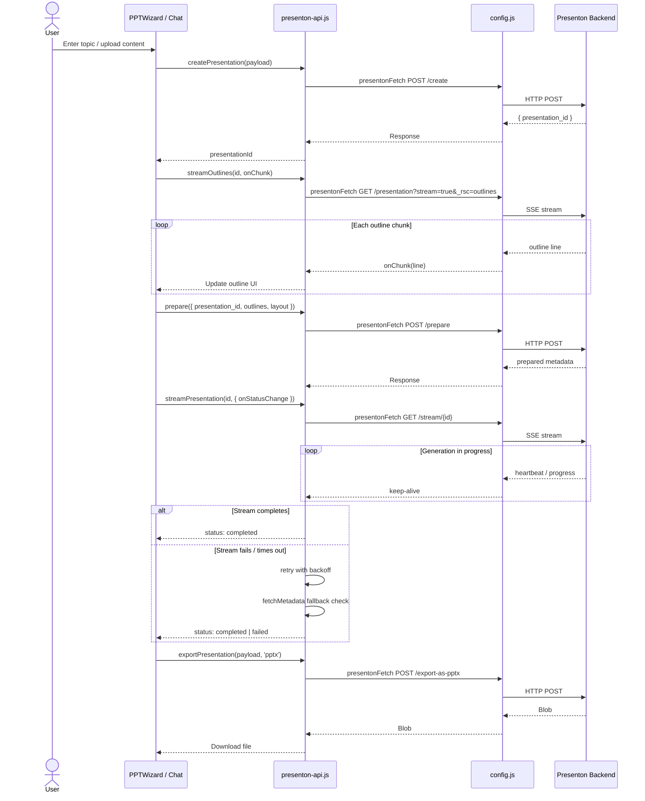
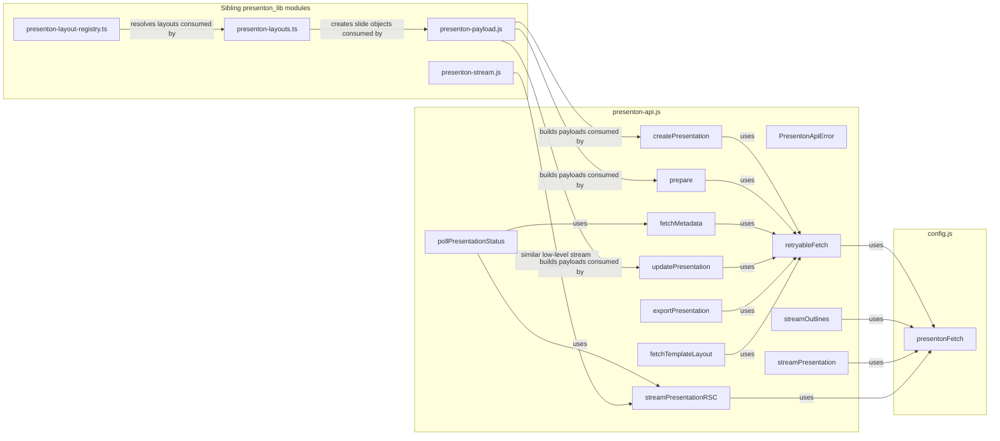
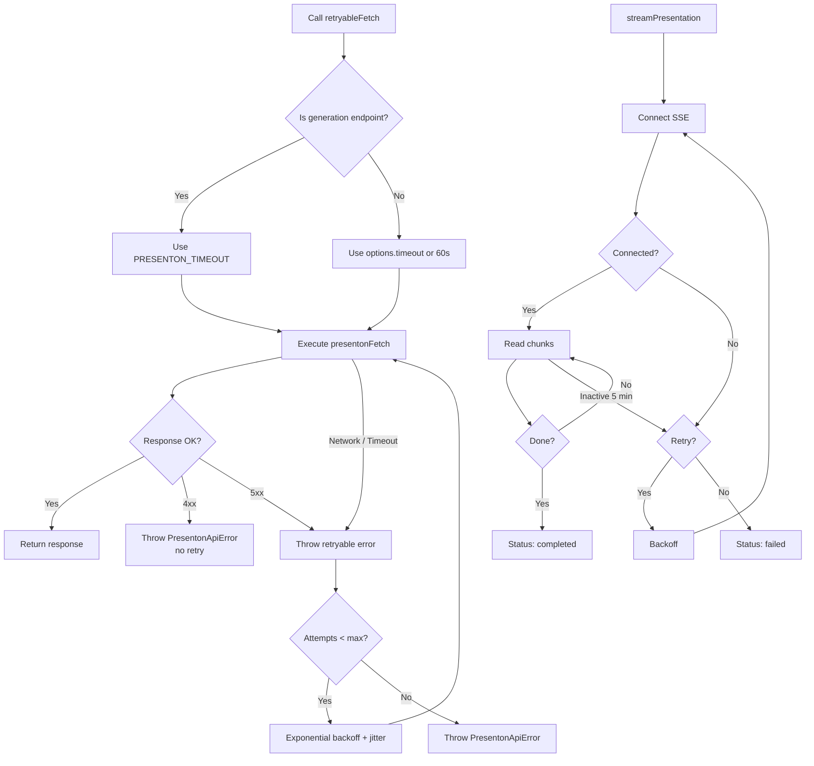

# Presenton API Client

## Brief Introduction

The `presenton_lib_api_client` module is the frontend HTTP client for the **Presenton** presentation-generation service. It lives in `ai-ui/src/lib/presenton-api.js` and exposes a small, promise-based API for creating, preparing, streaming, polling, updating, and exporting AI-generated presentations. The module is responsible for all network communication with the Presenton backend, including robust retry logic, streaming response handling, and user-context propagation.

This module is part of the larger `presenton_lib` family in the `ai_ui_frontend` application. It does not contain presentation layout logic, payload schema construction, or stream decoding utilities; those concerns are delegated to sibling modules. See the [Architecture](#architecture) and [Related Modules](#related-modules) sections for cross-references.

---

## Core Responsibilities

1. **Backend communication** – Wraps all Presenton REST/SSE endpoints (`/api/v1/ppt/presentation/*`, `/api/template`, `/api/export-as-*`).
2. **Retry resilience** – Implements exponential-backoff retries with jitter for transient failures and timeouts.
3. **Streaming support** – Reads Server-Sent Events (SSE) and React Server Component (RSC) streams using the Fetch `ReadableStream` API.
4. **Status polling** – Polls presentation metadata until every slide has content, optionally combining RSC streams for real-time UI updates.
5. **User context propagation** – Attaches `X-User-Id` headers and `user_id` query parameters where the backend expects them.
6. **Error normalization** – Converts HTTP and network errors into a typed `PresentonApiError`.

---

## Architecture

```mermaid
flowchart TB
    subgraph Frontend [ai-ui Frontend]
        UI[PPTWizard / Chat / Components]
        API[presenton-api.js<br/>API Client]
        REG[presenton-layout-registry.ts]
        MAP[presenton-layouts.ts]
        PAY[presenton-payload.js]
        STR[presenton-stream.js]
        CFG[config.js]
    end

    subgraph Backend [Presenton Service]
        REST[/api/v1/ppt/presentation/*]
        TMPL[/api/template]
        EXP[/api/export-as-*]
    end

    UI -->|calls| API
    API -->|presentonFetch| CFG
    API -->|decode streams| STR
    UI -->|resolve layout| REG
    UI -->|build slide object| MAP
    UI -->|build payload| PAY
    CFG -->|HTTP| REST
    CFG -->|HTTP| TMPL
    CFG -->|HTTP| EXP
```

The API client sits at the boundary between the React UI and the Presenton backend. Higher-level components (e.g., `PPTWizard`, chat flows) orchestrate calls into this module, while sibling libraries handle layout selection, payload shape, and stream parsing.

---

## Component Reference

### `PresentonApiError`

A custom error class that carries HTTP status, parsed response data, and a timeout flag. This allows callers to distinguish between client errors (4xx, non-retryable), server errors (5xx, retryable), and network timeouts.

### `retryableFetch(path, options, retries)`

Internal helper used by nearly every public function. It:

- Uses `presentonFetch` from `config.js` to perform the actual request.
- Applies a longer default timeout for generation endpoints (`/create`, `/prepare`, `/stream/`).
- Parses error bodies as JSON when possible.
- Retries 5xx errors and network failures with exponential backoff + jitter.
- Does **not** retry 4xx client errors.

### `fetchTemplateLayout(group, userId)`

Fetches the layout definition for a given template group from `/api/template`. Used by the UI to discover available slide layouts before building a presentation.

### `streamOutlines(presentationId, onChunk, onComplete, onError, signal)`

Streams the generated outline for a presentation via the RSC-style endpoint `/presentation?stream=true&_rsc=outlines`. Each line is delivered to `onChunk` as it arrives.

### `pollPresentationStatus(presentationId, callbacks, signal)`

Higher-level polling helper that:

- Optionally starts parallel RSC streams for real-time updates.
- Repeatedly calls `fetchMetadata` until every slide has non-empty content or the signal is aborted.
- Invokes `onMetadata`, `onRSCChunk`, `onError`, and `onComplete` callbacks.

### `createPresentation(payload, userId)`

Creates a new presentation on the backend via `POST /api/v1/ppt/presentation/create`.

### `prepare(payload, userId)`

Prepares a presentation for generation via `POST /api/v1/ppt/presentation/prepare`. Includes detailed error logging for debugging.

### `streamPresentation(presentationId, options, signal, userId)`

Opens the generation SSE stream (`GET /api/v1/ppt/presentation/stream/{id}`) and reconnects automatically up to `maxRetries` times. It suppresses retry noise from the UI and only reports major state changes: `connecting`, `connected`, `completed`, `aborted`, and `failed`.

### `fetchMetadata(id, userId)`

Retrieves presentation metadata including slide content via `GET /api/v1/ppt/presentation/{id}`.

### `updatePresentation(payload, userId)`

Sends a `PATCH /api/v1/ppt/presentation/update` request to modify an existing presentation.

### `exportPresentation(payload, format, userId, role)`

Exports a finished presentation to PPTX or PDF. The backend expects `user_id` as a query parameter and header, **not** in the request body, so the function builds a minimal body containing only `id`, `title`, `userId`, and `role`.

### `streamPresentationRSC(presentationId, rscParam, onChunk, onComplete, onError, signal)`

Low-level RSC stream reader used by `pollPresentationStatus`. Reads Next.js internal streaming responses and emits line-oriented chunks.

---

## Data Flow: Generating a Presentation



---

## Component Interaction



---

## Retry and Streaming Process Flow



---

## Error Handling

- **4xx errors** are surfaced immediately as `PresentonApiError` and are never retried.
- **5xx errors, network failures, and timeouts** are retried up to `PRESENTON_MAX_RETRIES` with exponential backoff capped at 60 seconds.
- **Streaming failures** are retried silently up to five times; the UI only sees `connecting`, `connected`, `completed`, `aborted`, or `failed`.
- **Abort signals** are respected by both `retryableFetch` and the streaming helpers, allowing users to cancel long-running generation.

---

## Related Modules

- **[presenton_lib_layout_registry](presenton_lib_layout_registry.md)** – Resolves slide layout definitions by ID and provides JSON Schema helpers.
- **[presenton_lib_layout_mapping](presenton_lib_layout_mapping.md)** – Maps template groups and slide types to concrete layout keys and creates slide objects.
- **[presenton_lib_payload_builder](presenton_lib_payload_builder.md)** – Builds per-slide content payloads and full update payloads consumed by this API client.
- **[presenton_lib_stream_reader](presenton_lib_stream_reader.md)** – Lower-level Presenton stream reader with logging; conceptually similar to `streamPresentationRSC`.
- **[config](config.md)** – Provides `presentonFetch`, `PRESENTON_POLL_INTERVAL`, `PRESENTON_MAX_RETRIES`, and `PRESENTON_TIMEOUT`.

---

## How It Fits into the System

The Presenton API client is the network gateway for all AI-generated presentation features in `ai-ui`. It is used by chat flows that detect a PowerPoint intent, by the `PPTWizard` component for guided creation, and by any feature that needs to export a finished deck. By centralizing retries, streaming, and error normalization here, the rest of the frontend can treat presentation generation as a simple async operation while still receiving rich progress callbacks.
