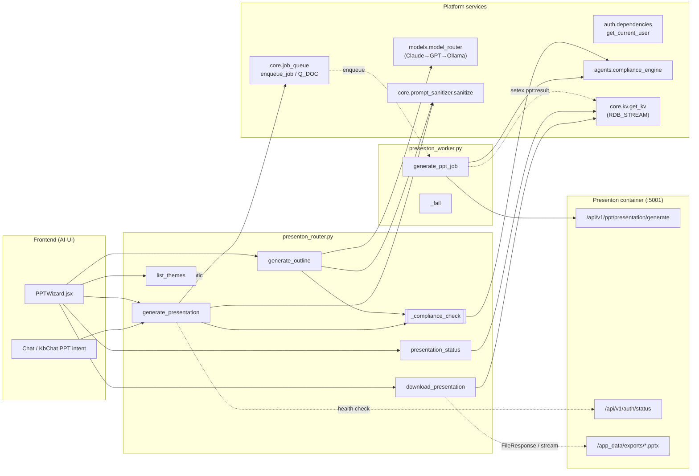
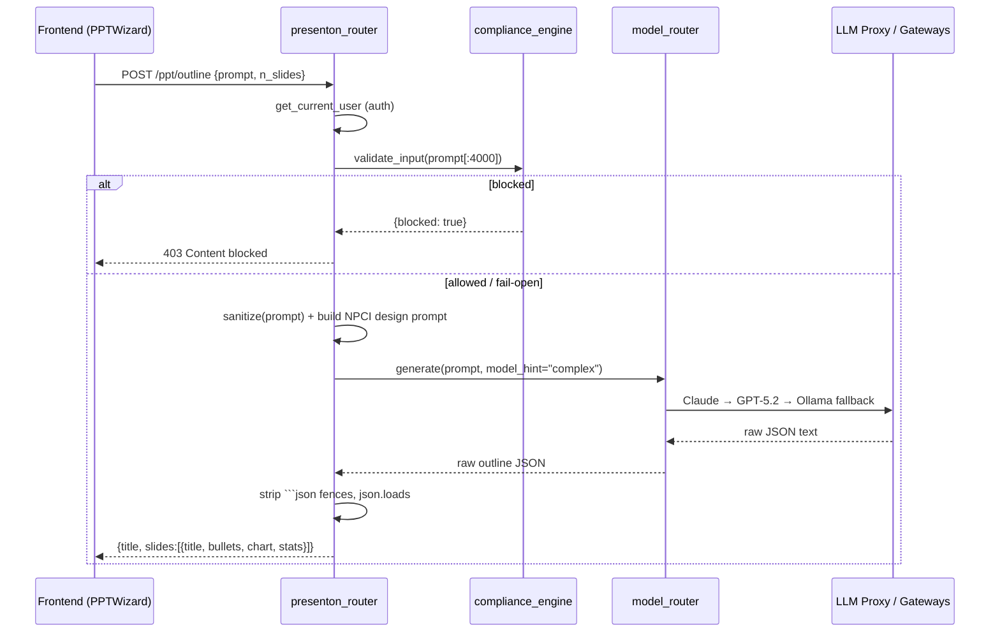
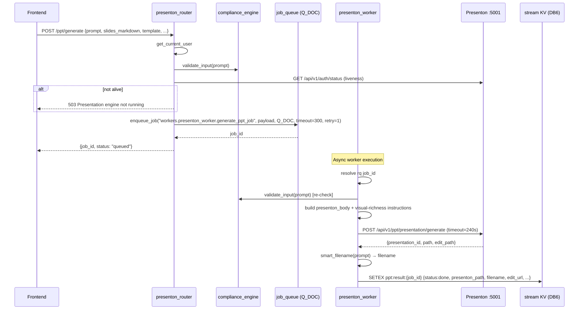
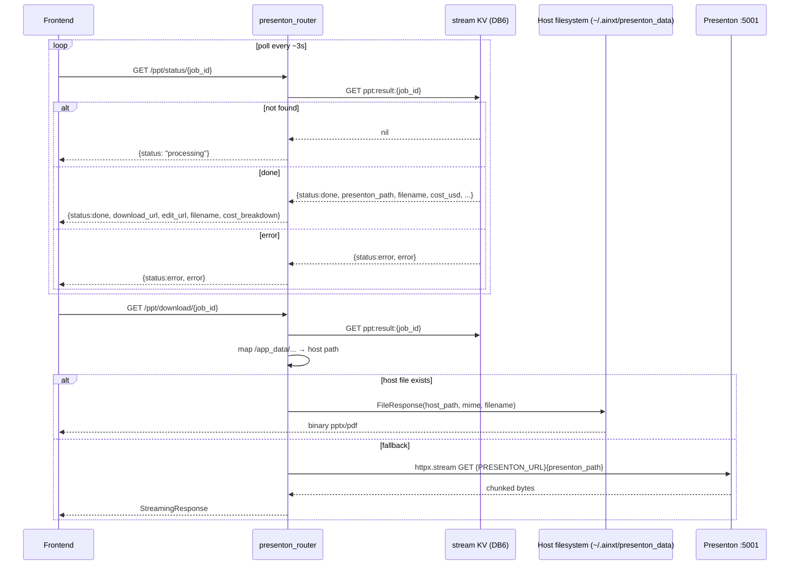
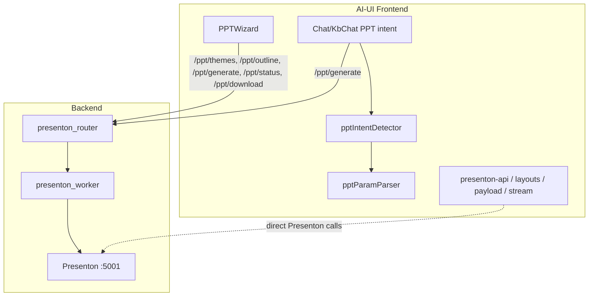

# Presenton Router

> **Module:** `routers/presenton_router.py`
> **Tag group:** `ppt`
> **Layer:** Shared API Routers

The Presenton Router is a thin FastAPI proxy that exposes the open-source
[Presenton](https://github.com/presenton/presenton) PPT-generation engine to the
platform's authenticated users. It is the single backend entry point for the
"AI presentation" feature surfaced in the AI-UI frontend's
[PPT Wizard](#frontend-integration) and the chat-driven PPT intent flow.

The router deliberately stays stateless and lightweight: it performs
**compliance gating**, **LLM-driven outline generation**, **job enqueueing**,
and **result polling / file proxying**. The heavy lifting (calling Presenton,
rendering slides, generating images) is delegated to the
[`presenton_worker`](#worker-pipeline) running on the document queue.

---

## 1. Purpose & Core Functionality

| Concern | Responsibility |
|---|---|
| **Compliance gate** | Every user-supplied `prompt` is validated through `compliance_engine.validate_input` before any LLM call or Presenton job is enqueued. Blocked content returns `403`. The gate fails *open* (logs a warning) if the compliance engine itself errors. |
| **Editable outline (Step 1)** | `generate_outline` asks the model router (Claude → GPT-5.2 → Ollama fallback) to produce a structured JSON outline — title, slide titles, bullets, optional chart specs, and KPI stats — that the user reviews and edits before generation. |
| **Async generation (Step 2)** | `generate_presentation` enqueues a `generate_ppt_job` on the `Q_DOC` queue and immediately returns a `job_id`. The worker calls Presenton's `/api/v1/ppt/presentation/generate` endpoint (up to 240s) and publishes the result to the stream KV. |
| **Status polling** | `presentation_status` reads `ppt:result:{job_id}` from the stream KV (Redis or RustyCluster, selected via `RDB_STREAM`) and returns `processing` / `done` / `error` with download metadata and a cost breakdown. |
| **File download** | `download_presentation` resolves the result record, translates the container-internal `/app_data/...` path to the host volume mount (`~/.ainxt/presenton_data`), and serves the file via `FileResponse`. Falls back to streaming from Presenton over HTTP if the host file is missing. |
| **Theme catalogue** | `list_themes` returns a static list of Presenton built-in templates (Modern, Corporate, Standard, Swift) plus NPCI brand metadata used by the wizard's theme selector. |

### Endpoints at a glance

| Method | Path | Handler | Auth | Purpose |
|---|---|---|---|---|
| `GET`  | `/ppt/themes`            | `list_themes`           | `get_current_user` | Static theme catalogue |
| `POST` | `/ppt/outline`           | `generate_outline`      | `get_current_user` | LLM-generated editable slide outline |
| `POST` | `/ppt/generate`          | `generate_presentation` | `get_current_user` | Compliance gate → enqueue Presenton job |
| `GET`  | `/ppt/status/{job_id}`   | `presentation_status`   | `get_current_user` | Poll KV for job result |
| `GET`  | `/ppt/download/{job_id}` | `download_presentation` | `get_current_user` | Proxy generated file to client |

---

## 2. Architecture



### Component relationships

```mermaid
classDiagram
    class OutlineRequest {
        +str prompt
        +int n_slides = 8
    }
    class GenerateRequest {
        +str prompt
        +Optional~list~ slides_markdown
        +str template = "general"
        +int n_slides = 8
        +str tone
        +str language
        +str verbosity
        +bool include_table_of_contents
        +str export_as = "pptx"
        +Optional~str~ chat_id
    }
    class generate_outline {
        +uses model_router.generate
        +uses compliance_engine
        +returns JSON outline
    }
    class generate_presentation {
        +uses enqueue_job(Q_DOC)
        +returns job_id
    }
    class presentation_status {
        +reads ppt:result:{job_id}
        +returns status/download_url
    }
    class download_presentation {
        +resolves host path
        +FileResponse | StreamingResponse
    }
    class list_themes {
        +returns _THEMES static list
    }

    OutlineRequest --> generate_outline
    GenerateRequest --> generate_presentation
    generate_outline ..> compliance_engine : validate_input
    generate_presentation ..> compliance_engine : validate_input
    generate_presentation ..> job_queue : enqueue_job
    presentation_status ..> kv_store : get_kv
    download_presentation ..> kv_store : get_kv
```

---

## 3. Request / Data Flow

### 3.1 Outline generation (Step 1)



The outline prompt is tuned for the NPCI (National Payments Corporation of
India) context: it mandates a minimum number of chart slides and KPI stat
slides, requires real Indian financial data (UPI volumes, RuPay, ₹ figures),
and constrains bullets to ≤14 words. The response schema includes an optional
`chart` object (`type`, `title`, `labels`, `values`) and a `stats` array of
`{label, value, delta}` metrics.

### 3.2 Presentation generation (Step 2)



### 3.3 Status polling & download



---

## 4. Core Components

### `OutlineRequest` / `GenerateRequest`

Pydantic request models. `OutlineRequest` is minimal (`prompt`, `n_slides`).
`GenerateRequest` carries the full generation configuration including the
optional `slides_markdown` list (the user-edited outline from Step 1),
`template` (theme id), `tone`, `language`, `verbosity`,
`include_table_of_contents`, `export_as` (`pptx` | `pdf`), and `chat_id` for
linking back to the originating conversation.

### `_compliance_check(text)`

Internal helper that calls `compliance_engine.validate_input` on the first
4000 characters of user text. Raises `HTTPException(403)` when blocked.
**Fails open** — if the compliance engine throws, it logs a warning and
allows the request through, prioritising availability over blocking.

### `_presenton_alive()`

Liveness probe that `GET`s `{PRESENTON_URL}/api/v1/auth/status` with a 3s
timeout. Returns `True` only if the HTTP status is `< 500`. Used by
`generate_presentation` to fail fast with a `503` and a helpful `pm2 start
presenton` hint before enqueueing a job that would immediately fail.

### `list_themes`

Returns the static `_THEMES` catalogue — four entries (Modern, Corporate,
Standard, Swift) each with `id`, `name`, `description`, `preview` (light/dark),
and `color`. The frontend's `PPTWizard` `ThemeSelector` renders these as
selectable cards.

### `generate_outline`

Synchronous LLM call via `model_router.generate(prompt, model_hint="complex")`.
The model router applies the platform's full fallback chain
(Claude → GPT-5.2 → Ollama) with circuit-breaker protection — see
[shared_core → model_routing](#dependencies). The response is cleaned of
markdown fences and parsed as JSON. On any failure, returns `500` with the
error detail.

### `generate_presentation`

The only endpoint that touches the job queue. After compliance + liveness
checks, it calls `enqueue_job` with:
- **func:** `workers.presenton_worker.generate_ppt_job`
- **queue:** `Q_DOC` (document processing lane)
- **timeout:** 300s
- **retry_count:** 1

The payload includes the sanitised prompt, edited outline, all generation
parameters, and the requesting `user_id`. Returns immediately with
`{job_id, status: "queued"}`.

### `presentation_status`

Reads `ppt:result:{job_id}` from the stream KV (`RDB_STREAM` → Redis DB6 or
RustyCluster). Returns a normalised envelope:
- `processing` — key not yet set or status not terminal
- `done` — includes `download_url` (`/ainxt/v1/api/ppt/download/{job_id}`),
  `edit_url`, `filename`, and a `cost_breakdown` (`text_usd`, `image_usd`,
  `image_count`)
- `error` — includes the error message

### `download_presentation`

Resolves the result record, then attempts to serve the file from the **host
filesystem** by translating the container path `/app_data/exports/file.pptx`
to `~/.ainxt/presenton_data/exports/file.pptx` (configurable via
`PRESENTON_DATA_DIR`). This avoids an extra HTTP hop through Presenton when
the volume mount is accessible. If the host file is missing, it falls back to
streaming from `{PRESENTON_URL}{presenton_path}` with basic auth. MIME type
is set based on `export_as` (pptx → OpenXML presentation, pdf →
application/pdf).

---

## 5. Worker Pipeline

The router does **not** call Presenton directly for generation — that is the
job of [`workers/presenton_worker.py`](#). The worker:

1. Resolves the RQ `job_id` from the job context.
2. **Re-runs the compliance gate** (defence in depth — the prompt may have
   been queued for minutes).
3. Builds the Presenton request body, appending a `instructions` field that
   biases Presenton's internal LLM toward chart/metric/workflow/table layouts
   over plain bullet slides.
4. Converts any `slides_markdown` dict entries to rich markdown via
   `_outline_to_markdown`.
5. Calls `POST {PRESENTON_URL}/api/v1/ppt/presentation/generate` with a 240s
   timeout and basic auth.
6. On success, publishes `ppt:result:{job_id}` to the stream KV with `SETEX`
   (TTL = `RESULT_TTL`) containing `status:done`, `presentation_id`,
   `presenton_path`, `filename`, `edit_url`.
7. On any failure (connect error, timeout, API error, missing
   `presentation_id`), calls `_fail(job_id, error)` which writes
   `{status:error, error}` with a 1-hour TTL.

> **Note:** Presenton calls *back* to the platform gateway's OpenAI-compatible
> endpoint for its internal LLM inference. This means all model routing,
> circuit-breaker fallback, budget tracking, and compliance are handled
> transparently by the gateway — the router and worker never specify a model
> directly for slide content generation.

---

## 6. Frontend Integration

The AI-UI frontend consumes this router through two surfaces:

### PPT Wizard (`ai-ui/src/components/PPTWizard.jsx`)

A multi-step modal: **Theme selection** → **Outline generation & editing** →
**Generation** → **Download**. It calls `/ppt/themes`, `/ppt/outline`,
`/ppt/generate`, polls `/ppt/status/{job_id}`, and finally hits
`/ppt/download/{job_id}`.

### Chat-driven PPT intent (`Chat.jsx` / `KbChat.jsx`)

When the user's message is detected as a PPT request (via
`ai-ui/src/utils/pptIntentDetector.js`), the chat flow extracts the topic
(`extractPPTTopic`) and parameters (`extractAllParams` from
`pptParamParser.js`) and routes to the same `/ppt/generate` endpoint, linking
the result back to the originating `chat_id`.

### Presenton library (`ai-ui/src/lib/presenton-*`)

A set of frontend utilities that complement the router:
- `presenton-api.js` — `fetchTemplateLayout`, `streamOutlines`,
  `pollPresentationStatus` (used when the frontend talks to Presenton
  directly for template layout fetching and RSC streaming).
- `presenton-layouts.ts` / `presenton-layout-registry.ts` — layout key/id
  mapping and slide creation helpers.
- `presenton-payload.js` — `buildSlideContent`, `buildUpdatePayload` for
  constructing slide update requests.
- `presenton-stream.js` — `readPresentonStream` for parsing Presenton's
  streaming responses.



---

## 7. Dependencies

### Internal platform modules

| Dependency | Usage |
|---|---|
| [`auth.dependencies`](shared_core.md) → `get_current_user` | JWT/session authentication on every endpoint |
| [`agents.compliance_engine`](shared_core.md) → `compliance_engine` | Input validation / blocking before LLM and Presenton calls |
| [`core.config`](shared_core.md) → `PRESENTON_URL`, `PRESENTON_USER`, `PRESENTON_PASSWORD`, `PPT_LLM_MODEL`, `RDB_STREAM` | Service URLs, credentials, KV database selector |
| [`core.job_queue`](shared_core.md) → `enqueue_job`, `Q_DOC` | Async job dispatch to the document worker lane |
| [`core.kv`](shared_core.md) → `get_kv` | Stream KV access for result polling and download path resolution |
| [`core.logger`](shared_core.md) → `logger` | Structured logging |
| [`core.prompt_sanitizer`](shared_core.md) → `sanitize` | Prompt sanitisation before LLM calls and job enqueue |
| [`models.model_router`](shared_core.md) → `model_router` | LLM generation with Claude → GPT → Ollama fallback chain |
| [`workers.presenton_worker`](workers.md) → `generate_ppt_job`, `_fail` | Async worker that calls Presenton and publishes results |
| [`tools.doc_generator`](shared_integrations.md) → `smart_filename` | Filename generation from prompt (used by the worker) |

### External services

| Service | Endpoint | Purpose |
|---|---|---|
| **Presenton container** | `{PRESENTON_URL}/api/v1/ppt/presentation/generate` | Slide generation (called by worker) |
| **Presenton container** | `{PRESENTON_URL}/api/v1/auth/status` | Liveness probe (called by router) |
| **Presenton container** | `{PRESENTON_URL}{presenton_path}` | File download fallback (streamed by router) |
| **LLM Proxy / Gateway** | OpenAI-compatible endpoint | Presenton's internal LLM calls route back through the platform gateway |
| **Stream KV** (Redis DB6 / RustyCluster) | `ppt:result:{job_id}` | Job result storage with TTL |

### Configuration

| Env var | Default | Description |
|---|---|---|
| `PRESENTON_URL` | `http://localhost:5001` | Presenton container base URL |
| `PRESENTON_USER` | — | Basic auth username |
| `PRESENTON_PASSWORD` | — | Basic auth password |
| `PPT_LLM_MODEL` | — | Model hint for outline generation |
| `PRESENTON_DATA_DIR` | `~/.ainxt/presenton_data` | Host-side volume mount for file downloads |
| `RDB_STREAM` | — | KV database selector (Redis DB6 or RustyCluster) |

---

## 8. Security & Compliance Notes

1. **Every endpoint requires authentication** via `Depends(get_current_user)`.
2. **Double compliance gate** — the router checks the prompt before enqueueing,
   and the worker re-checks before calling Presenton. This guards against
   prompts that were queued for extended periods.
3. **Prompt sanitisation** — `sanitize()` is applied to the prompt before both
   the LLM outline call and the job payload, preventing injection of control
   characters or malformed content.
4. **Fail-open compliance** — if the compliance engine itself errors, the
   request is allowed through with a warning log. This is a deliberate
   availability trade-off; the worker's second gate provides a backstop.
5. **File path translation** — the download endpoint maps container-internal
   `/app_data/...` paths to the host volume mount, preventing path traversal
   outside the configured `PRESENTON_DATA_DIR`.
6. **Result TTL** — job results expire from the KV after `RESULT_TTL` (done)
   or 1 hour (error), limiting stale-data exposure.

---

## 9. Error Handling Summary

| Scenario | HTTP Status | Behaviour |
|---|---|---|
| Compliance block | `403` | `Content blocked by compliance policy` |
| Presenton not running | `503` | `Presentation engine is not running. Start it with: pm2 start presenton` |
| Outline LLM failure | `500` | `Outline generation failed: {exc}` |
| Status: job not found | `200` | `{status: "processing"}` (not an error) |
| Status: corrupt payload | `200` | `{status: "error", error: "Invalid result payload"}` |
| Download: not found | `404` | `Presentation not found or not ready` |
| Download: corrupt record | `500` | `Corrupt result record` |
| Download: not ready | `409` | `Presentation is not ready yet` |
| Worker: Presenton unreachable | KV `error` | `Presentation engine is not reachable...` |
| Worker: timeout | KV `error` | `Presentation engine timed out after 240s` |
