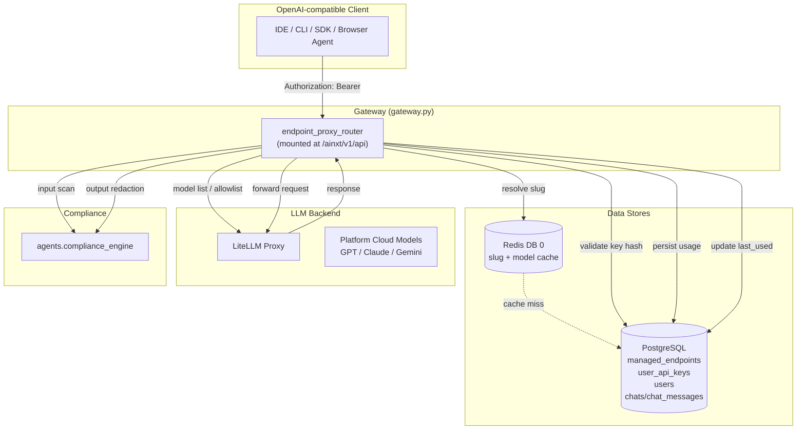
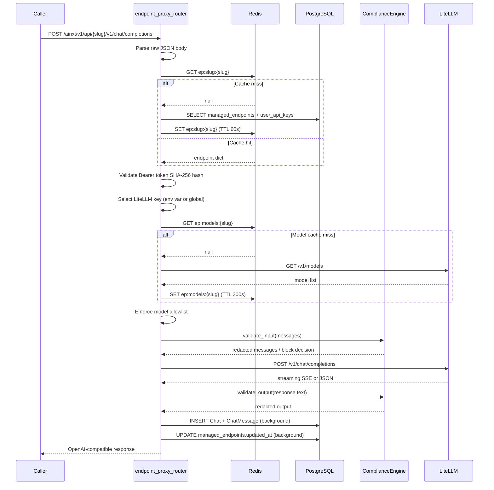
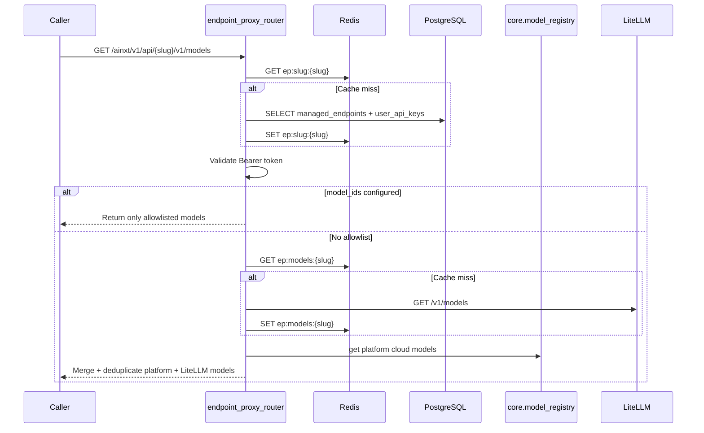

# endpoint_proxy_router

## Brief Introduction

The `endpoint_proxy_router` module exposes an **OpenAI-compatible proxy surface** for managed endpoints. Each endpoint is identified by a URL slug and forwards caller requests to a LiteLLM backend using a platform-managed API key. The module provides two routes:

- `GET  /ainxt/v1/api/{slug}/v1/models`
- `POST /ainxt/v1/api/{slug}/v1/chat/completions`

Callers authenticate with a platform-generated API key (`Authorization: Bearer <key>`). The router validates the key, resolves the endpoint configuration, enforces model allowlists, runs PCI/PII compliance gates, and proxies the full request body to LiteLLM with either streaming (SSE) or non-streaming responses.

This router is the runtime counterpart to [`endpoint_mgmt_router.md`](endpoint_mgmt_router.md), which admins use to create, update, and manage endpoints.

---

## Core Responsibilities

| Responsibility | Description |
| -------------- | ----------- |
| **OpenAI-compatible proxy** | Implements `/v1/models` and `/v1/chat/completions` under a per-endpoint slug path. |
| **Caller authentication** | Validates `Authorization: Bearer` tokens against SHA-256 hashes stored in `user_api_keys`. |
| **Endpoint resolution** | Resolves slug → endpoint config using a Redis cache fallback to PostgreSQL. |
| **Backend key selection** | Selects the LiteLLM key based on `use_env_key` (team-specific env var vs. global key). |
| **Model allowlist enforcement** | Restricts callable models to the endpoint's `model_ids` list or LiteLLM-reported models. |
| **Compliance gating** | Runs non-bypassable PCI/PII scans on input and redaction on output. |
| **Usage recording** | Persists endpoint calls as `Chat` + `ChatMessage` rows owned by the endpoint's system user. |
| **Last-used timestamp** | Fire-and-forget update of `updated_at` on the `ManagedEndpoint` row. |

---

## Architecture

---

## Component Reference

### `_get_db`

FastAPI dependency that yields a SQLAlchemy `Session` from `SessionLocal` and closes it after the request.

### `endpoint_models`

`GET /{slug}/v1/models`

Returns the list of models accessible through the endpoint in OpenAI-compatible format.

**Behavior:**
1. Resolves the endpoint by slug (Redis → DB).
2. Validates the caller's Bearer token against the stored `key_hash`.
3. If `model_ids` is set on the endpoint, returns only those models.
4. Otherwise merges:
   - The platform's cloud model list (from `core.model_registry`) so GPT/Claude/Gemini remain visible to clients.
   - The LiteLLM-reported model list for the endpoint's backend key (cached 5 minutes).

### `endpoint_chat_completions`

`POST /{slug}/v1/chat/completions`

Proxies chat completion requests to LiteLLM.

**Request flow:**
1. Reads the raw JSON body untouched.
2. Extracts only `model`, `messages`, and `stream` for internal handling.
3. Resolves and authenticates the endpoint.
4. Blocks tool calls if `tool_calls_enabled` is false.
5. Selects the LiteLLM backend key.
6. Enforces the model allowlist:
   - Explicit `model_ids` → 403 if model not in list.
   - No allowlist → validates against LiteLLM-reported models.
7. Runs compliance scan on input messages.
8. Forwards the full body (with cleaned messages) to LiteLLM.
9. Streams or returns the response, applying output redaction.
10. Records usage and updates `updated_at` in background threads.

---

## Data Flow

### Chat Completion Request

### Model List Request

---

## Authentication

The router uses the same key storage pattern as CLI API keys:

- Raw key format: `ainxt-{slug8}-{uuid4_hex}` (generated by [`endpoint_mgmt_router.md`](endpoint_mgmt_router.md)).
- Only the SHA-256 hash is stored in `user_api_keys.key_hash`.
- The hash is cached in the Redis slug entry for fast validation.
- On mismatch the router returns `401 Unauthorized`.
- If no key is configured on the endpoint, the router returns `503 Service Unavailable`.

See `auth/api_key_auth.md` for the shared validation pattern.

---

## Backend Key Selection

| `use_env_key` | Source | Use case |
| ------------- | ------ | -------- |
| `False` | `LOCAL_LLM_API_KEY` env var | Shared global LiteLLM key. |
| `True` | `os.getenv(env_key_name)` | Team-specific LiteLLM virtual key. |

If `use_env_key=True` and the environment variable is missing, the router returns `503`.

---

## Model Allowlist Logic

Endpoints can restrict callable models via `model_ids`:

- **Allowlist set**: Only those models are accepted. The list is validated at creation/update time against the local LiteLLM catalog by [`endpoint_mgmt_router.md`](endpoint_mgmt_router.md).
- **No allowlist**: The router fetches the model list LiteLLM exposes for the endpoint's key and rejects unknown models.
- **Model list endpoint**: Returns the same merged view used for enforcement.

---

## Compliance

Compliance is non-bypassable and mirrors the behavior of `gateway_openai.md`:

### Input scanning
- Joins string content fields across turns (or only the last turn, depending on `COMPLIANCE_SCAN_HISTORY`).
- Excludes non-string content (image parts, tool result arrays) from scanning.
- Raises `400 Bad Request` if any finding type is configured with `action: block`.
- Redacts string content fields in-place using `[REDACTED]` replacement.
- Preserves all other message keys (`tool_calls`, `tool_call_id`, `name`, etc.).

### Output scanning
- Controlled by `COMPLIANCE_SCAN_LLM_OUTPUT`.
- Redacts only; never blocks.
- For streaming, accumulates text tokens and scans the assembled text after the stream.
- For non-streaming, scans the assistant message content while leaving `tool_calls` untouched.

See `agents/compliance_engine.md` for detector details.

---

## Caching Strategy

| Cache key | Store | TTL | Purpose |
| --------- | ----- | --- | ------- |
| `ep:slug:{slug}` | Redis DB 0 | 60s | Endpoint config + `key_hash` for fast auth. |
| `ep:models:{slug}` | Redis DB 0 | 300s | LiteLLM model list per endpoint key. |

Cache writes are best-effort; on Redis failure the router falls back to the database or LiteLLM directly.

---

## Usage Recording

Every successful call spawns a background thread that:

1. Looks up the endpoint's `system_user_id`.
2. Creates a `Chat` row with `client_source="endpoint"` and `endpoint_slug`.
3. Inserts two `ChatMessage` rows: one `user` (joined string content) and one `assistant` (response text, model, latency).

Failures in usage recording are swallowed so they never break the caller's response.

---

## Dependencies

| Dependency | Role |
| ---------- | ---- |
| [`endpoint_mgmt_router.md`](endpoint_mgmt_router.md) | Creates and manages `ManagedEndpoint` rows, API keys, and system users. |
| `db/models.md` | `ManagedEndpoint`, `UserAPIKey`, `User`, `Chat`, `ChatMessage`. |
| `core/kv.md` | Redis access for slug and model list caching. |
| `core/model_registry.md` | Platform cloud model list for `/v1/models`. |
| `agents/compliance_engine.md` | PCI/PII scanning and redaction. |
| `auth/api_key_auth.md` | Shared SHA-256 key validation pattern. |
| [`gateway.md`](../core/gateway.md) | Mounts this router under `/ainxt/v1/api`. |
| LiteLLM / `openai` SDK | Backend LLM proxy and client. |

---

## Route Summary

| Method | Path | Handler | Purpose |
| ------ | ---- | ------- | ------- |
| GET | `/ainxt/v1/api/{slug}/v1/models` | `endpoint_models` | List accessible models. |
| POST | `/ainxt/v1/api/{slug}/v1/chat/completions` | `endpoint_chat_completions` | Proxy chat completions. |

---

## Error Responses

| Status | Scenario |
| ------ | -------- |
| `400 Bad Request` | Tool calls disabled; compliance block; invalid JSON. |
| `401 Unauthorized` | Missing/malformed Bearer token; invalid API key. |
| `403 Forbidden` | Model not allowed for this endpoint. |
| `404 Not Found` | Endpoint slug not found or disabled. |
| `422 Unprocessable Entity` | Invalid request body (missing `model` or `messages`). |
| `502 Bad Gateway` | LiteLLM call failed. |
| `503 Service Unavailable` | Endpoint has no key configured; `use_env_key` env var missing; `LITELLM_BASE_URL` not configured. |

---

## Configuration

| Environment variable | Default | Purpose |
| -------------------- | ------- | ------- |
| `LOCAL_LLM_BASE_URL` / `LITELLM_BASE_URL` | `""` | LiteLLm proxy base URL. |
| `LOCAL_LLM_API_KEY` / `LITELLM_API_KEY` | `"sk-local"` | Global LiteLLM key when `use_env_key=False`. |
| `COMPLIANCE_SCAN_HISTORY` | `False` | Scan all message turns vs. only the last. |
| `COMPLIANCE_SCAN_LLM_OUTPUT` | `False` | Enable output redaction. |

---

## Notes for Maintainers

- The router intentionally reads the **raw request body** and forwards it untouched, so new OpenAI fields (`tools`, `tool_choice`, `response_format`, `top_p`, `seed`, `n`, `stop`, etc.) pass through without code changes.
- Only `model`, `messages`, and `stream` are inspected; everything else is spread into the LiteLLM call.
- Tool call arguments in streaming responses are intentionally **not** compliance-scanned; only assembled text content is scanned.
- The module uses fire-and-forget threads for usage recording and timestamp updates; failures there are logged but never propagated.
- Redis cache invalidation is handled by [`endpoint_mgmt_router.md`](endpoint_mgmt_router.md) on endpoint updates, key regeneration, and enable/disable toggles.
