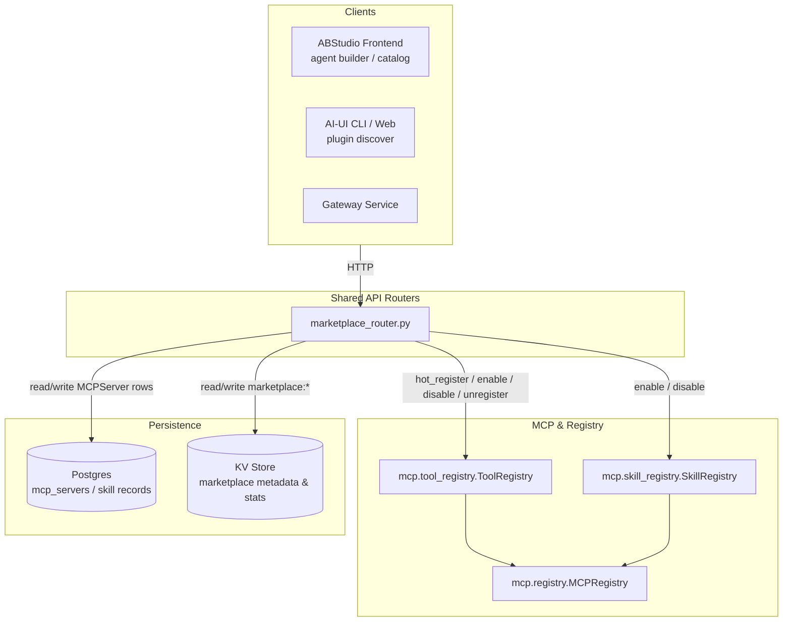
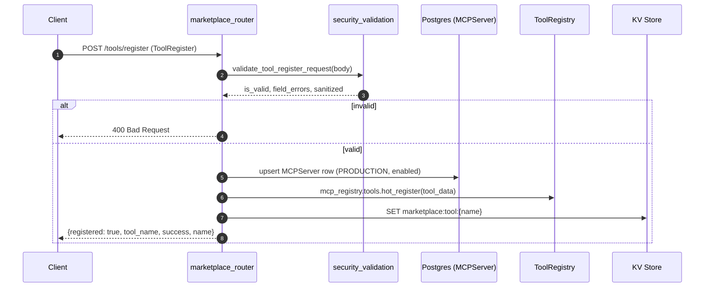
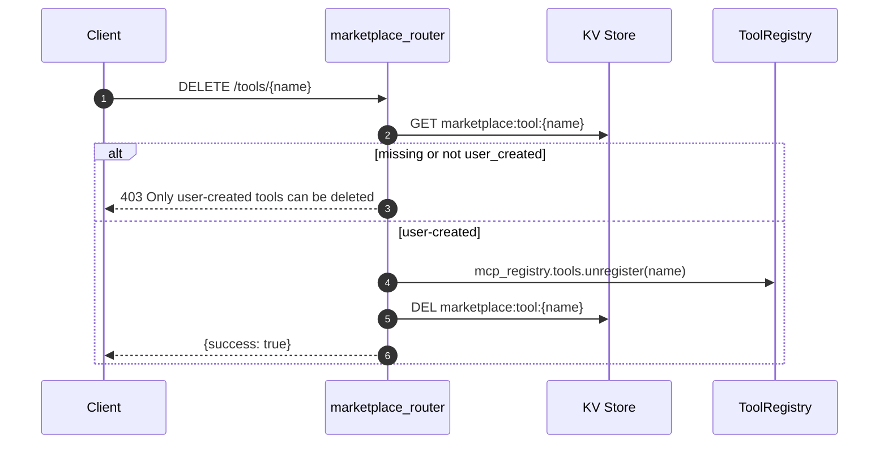
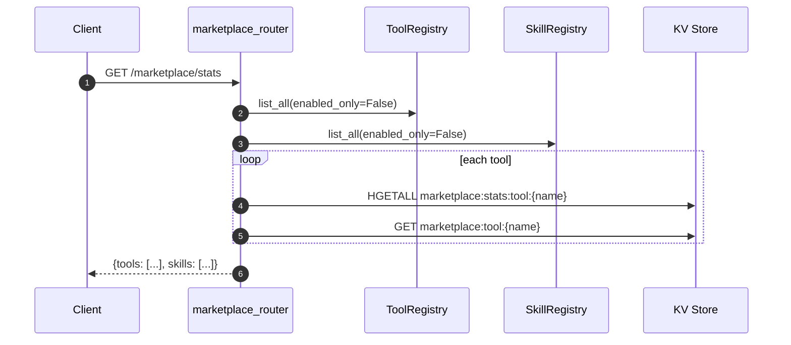
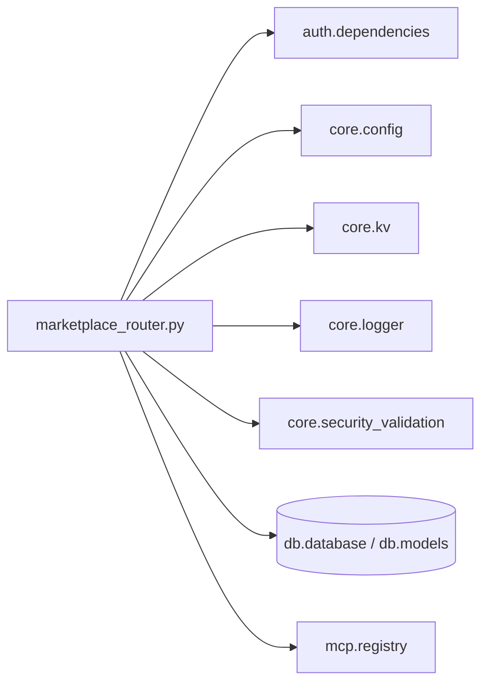

# Marketplace Router

The **Marketplace Router** exposes the `/tools`, `/skills`, and `/marketplace` REST API surface for registering, discovering, enabling, disabling, and monitoring platform tools and skills. It is the administrative and runtime entry point through which user-created HTTP tools are hot-registered into the live [MCP Registry](../mcp/mcp_system.md), persisted to Postgres, and advertised to clients such as the ABStudio agent builder and the AI-UI plugin catalog.

---

## 1. Purpose & Core Functionality

The router serves three primary purposes:

1. **Tool Lifecycle Management** — Register new HTTP tools, delete user-created tools, and toggle tool availability at runtime without restarting the platform.
2. **Skill Lifecycle Management** — Enable or disable platform skills in the in-memory skill registry.
3. **Catalog & Observability** — Return marketplace statistics (tool usage, status, criticality, visibility) and a curated plugin list produced by the external-sync worker.

All endpoints are FastAPI route handlers defined in `routers/marketplace_router.py` and tagged under the `marketplace` OpenAPI tag.

---

## 2. Architecture

### 2.1 High-level placement

### 2.2 Component responsibilities

| Component | Responsibility |
|-----------|----------------|
| `ToolRegister` (Pydantic model) | Validates incoming tool registration payloads: `name`, `description`, `url`, `method`, `tags`, `input_schema`, `visibility`, `is_critical`. |
 `_maybe_get_current_user` | Optional dependency that resolves the JWT-authenticated actor when auth is available. |
| `_get_redis` | Returns a cached KV client (DB=3) for marketplace metadata and usage statistics. |
| `make_http_tool_fn` | Factory that builds a simple JSON-over-HTTP caller for a given URL and method. |
| `register_tool` | Persists a tool to Postgres (`MCPServer`), hot-registers it in `ToolRegistry`, and writes marketplace metadata to KV. |
| `delete_tool` | Removes a user-created tool from `ToolRegistry` and KV; rejects deletion of platform-native tools. |
| `enable_tool` / `disable_tool` | Toggles the `enabled` flag of a registered tool. |
| `enable_skill` / `disable_skill` | Toggles the `enabled` flag of a registered skill. |
| `marketplace_stats` | Aggregates tool and skill catalogs with usage stats, status, visibility, and criticality. |
| `curated_plugins` | Reads `config/curated_plugins.json` and returns the curated plugin catalog. |

---

## 3. Data Flows

### 3.1 Registering a tool

Key points:

- Validation and sanitization happen first via `validate_tool_register_request` in [core/security_validation](../core/shared_core.md#core-infrastructure).
- The tool is written to the `mcp_servers` table so it survives restarts and is reloaded by `ToolRegistry.register_db_tools()` during `MCPRegistry._bootstrap()`.
- `ToolRegistry.hot_register()` creates a `ToolDefinition` backed by an HTTP endpoint, making the tool immediately callable by agents and workflows.
- Marketplace metadata is stored under `marketplace:tool:{name}` in KV for discovery and stats.

### 3.2 Deleting a tool

Only tools that have marketplace KV metadata with `user_created: true` can be deleted. Platform-native tools registered at startup are protected.

### 3.3 Marketplace statistics

Usage counters (`calls`, `errors`, `last_used`) are read from KV hashes written by the tool execution path in `ToolRegistry.execute()`.

---

## 4. Endpoints

| Method | Path | Handler | Description |
|--------|------|---------|-------------|
| `POST` | `/tools/register` | `register_tool` | Register a new HTTP tool. |
| `DELETE` | `/tools/{name}` | `delete_tool` | Delete a user-created tool. |
| `POST` | `/tools/{name}/enable` | `enable_tool` | Enable a registered tool. |
| `POST` | `/tools/{name}/disable` | `disable_tool` | Disable a registered tool. |
| `POST` | `/skills/{name}/enable` | `enable_skill` | Enable a registered skill. |
| `POST` | `/skills/{name}/disable` | `disable_skill` | Disable a registered skill. |
| `GET` | `/marketplace/stats` | `marketplace_stats` | Return tool/skill catalog with stats. |
| `GET` | `/plugins/curated` | `curated_plugins` | Return curated plugin catalog. |

---

## 5. Dependencies

### 5.1 Internal modules

- **[auth.dependencies](../auth/auth.md)** — `get_current_user` for actor resolution.
- **[core.config](../core/shared_core.md#core-infrastructure)** — `RDB_REGISTRY` constant selecting the KV database index.
- **[core.kv](../core/shared_core.md#kv-store)** — `get_kv` and `KVError` for marketplace metadata storage.
- **[core.logger](../core/shared_core.md#core-infrastructure)** — Structured logging.
- **[core.security_validation](../core/shared_core.md#core-infrastructure)** — `validate_tool_register_request` for input sanitization.
- **[db.database / db.models](../storage/database.md)** — `SessionLocal` and the `MCPServer` SQLAlchemy model.
- **[mcp.registry](../mcp/mcp_system.md)** — `mcp_registry` singleton providing `tools` and `skills` sub-registries.

### 5.2 External dependencies

- `urllib.request` for the `make_http_tool_fn` HTTP caller.
- `pydantic.BaseModel` for request validation.
- `fastapi.APIRouter`, `HTTPException`, `Depends`.

---

## 6. Security & Governance

- **Input validation**: All registration payloads are validated and sanitized by `validate_tool_register_request` before persistence or hot-registration.
- **Actor attribution**: The registering user's email or `user_id` is stored in `registered_by` / `created_by` fields.
- **Deletion guard**: Only tools flagged `user_created` in KV may be deleted, preventing accidental removal of platform-native tools.
- **State enforcement**: `MCPRegistry.execute_tool()` blocks execution of user-registered tools whose `status` is not `PRODUCTION`, routing them through the governance approval flow (see [mcp_governance_router](../mcp/mcp_governance_router.md)).
- **Endpoint SSRF guard**: `ToolRegistry.hot_register()` validates the HTTP endpoint via `_validate_tool_endpoint` before storing it.

---

## 7. Integration with the broader system

- **Agent Builder / ABStudio**: The ABStudio frontend lists and selects tools/skills from the marketplace when configuring agents. See abstudio_backend and [abstudio_frontend](../ui/abstudio_frontend.md).
- **AI-UI plugin catalog**: `GET /plugins/curated` feeds the CLI/web plugin discover view. The file is produced by [workers/external_sync_worker](../workers/workers.md#external-integration-workers).
- **MCP Server Router**: DB-registered and hot-registered tools are also reachable through the SSE/HTTP MCP server endpoints defined in [mcp_server_router](../mcp/mcp_server_router.md).
- **Governance Router**: Tools that require approval before production use flow through [mcp_governance_router](../mcp/mcp_governance_router.md).
- **Tool execution**: Runtime invocation of registered tools is handled by `ToolRegistry.execute()` and `MCPRegistry.execute_tool()` in the [mcp_system](../mcp/mcp_system.md).

---

## 8. Operational notes

- **KV backend selection**: `_get_redis()` uses `core.kv.get_kv(RDB_REGISTRY, decode_responses=True)`. The actual backend (Redis) is selected by `REDIS_CLIENT_CONFIG_DB3`; the function name is retained for backwards compatibility.
- **Graceful degradation**: If KV is unavailable, registration still persists to Postgres and hot-registers in memory; stats and metadata simply omit KV-enriched fields.
- **Curated plugins degradation**: If `config/curated_plugins.json` is absent (e.g., external sync disabled), `curated_plugins` returns an empty list without error.
- **No restart required**: Hot-registration writes the tool to the live `ToolRegistry`, so agents and workflows can use it immediately.
