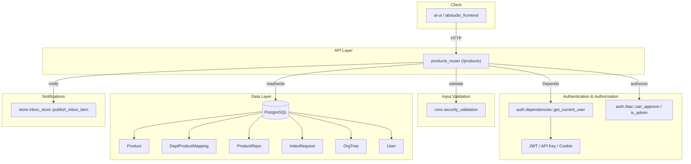
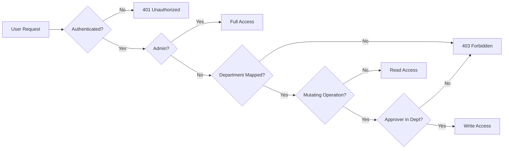
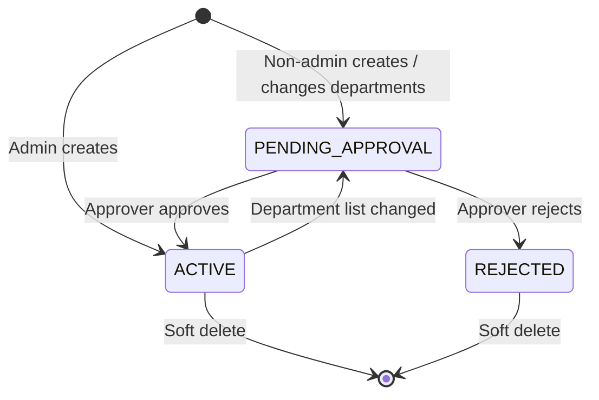
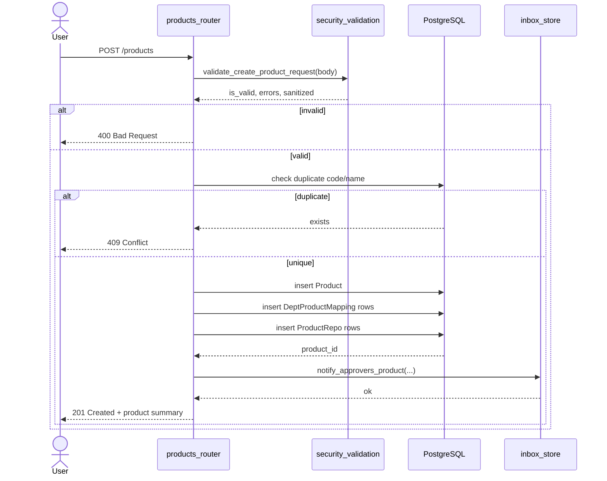
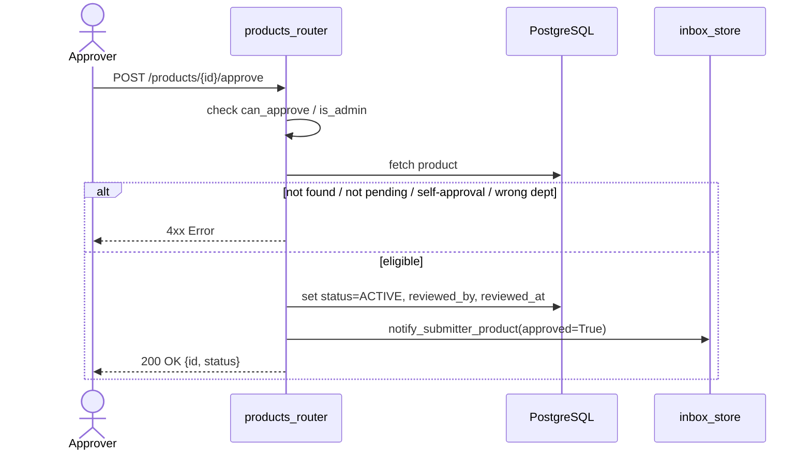

# products_router

The `products_router` module exposes the **Product Management API** for the platform. It provides REST endpoints to create, update, approve, and organize products, where each product represents a logical grouping of repositories, Jira/Confluence integrations, and department-level access. The router enforces a **two-layer access model** based on the user's department (from the org tree) and product-to-department mappings, replacing static owner/member lists with live organizational data.

---

## Overview

Products are the central organizational unit used by many downstream features (SDLC pipelines, indexing, governance, budget chargebacks, and agent workflows). The router ensures that:

- Users only see products mapped to their department.
- Product creation and structural changes (department updates) require **approval** via a built-in 4-eyes workflow.
- Admins have full visibility and can approve/reject any product.
- Repository links, Jira project keys, and Confluence space keys are parsed and stored consistently.

The module is implemented as a FastAPI `APIRouter` mounted at `/products`.

---

## Core Responsibilities

| Responsibility | Description |
| --- | --- |
| **Product CRUD** | Create, list, get detail, update, and soft-delete products. |
| **Approval Workflow** | New products and department changes enter `PENDING_APPROVAL`; approvers (ad_level ≤ 3 or admin) can approve or reject. |
| **Department Scoping** | All list/detail views filter by the caller's department unless they are an admin. |
| **Repo Management** | Link/unlink Git repositories to a product. |
| **Integration Parsing** | Extract Jira project keys and Confluence space keys from URLs or raw strings. |
| **Notifications** | Publish inbox items to approvers and submitters on state changes. |

---

## Architecture

---

## Component Breakdown

### Request Models

| Model | Purpose |
| --- | --- |
| `RepoEntry` | Represents a linked repository with name and branch. |
| `CreateProductRequest` | Payload for creating a product: name, code, description, Jira/Confluence URLs, departments, and repos. |
| `UpdateProductRequest` | Partial update payload. Setting `departments` triggers re-approval. |
| `AddRepoRequest` | Payload for linking an additional repo to an existing product. |
| `AddDeptMappingRequest` | Defined but unused; direct mapping endpoints return `410 Gone`. |

### Route Handlers

| Handler | Method | Path | Access |
| --- | --- | --- | --- |
| `list_products` | GET | `/products` | Dept-scoped; admin sees all. |
| `create_product` | POST | `/products` | Any authenticated user; non-admin goes to pending. |
| `list_pending_products` | GET | `/products/pending` | Approvers/admins only. |
| `list_departments` | GET | `/products/departments` | Any authenticated user. |
| `approve_product` | POST | `/products/{id}/approve` | Approver/admin in product's department. |
| `reject_product` | POST | `/products/{id}/reject` | Approver/admin in product's department. |
| `get_product` | GET | `/products/{id}` | Dept member or admin. |
| `update_product` | PATCH | `/products/{id}` | Dept approver/admin; department changes re-trigger approval. |
| `delete_product` | DELETE | `/products/{id}` | Dept approver/admin; soft delete. |
| `add_repo` | POST | `/products/{id}/repos` | Dept approver/admin. |
| `remove_repo` | DELETE | `/products/{id}/repos/{name}` | Dept approver/admin. |
| `list_dept_mappings` | GET | `/products/{id}/dept-mappings` | Any authenticated user. |
| `add_dept_mapping` | POST | `/products/{id}/dept-mappings` | Disabled (`410`). |
| `remove_dept_mapping` | DELETE | `/products/{id}/dept-mappings/{dept}` | Disabled (`410`). |

### Helpers

| Helper | Purpose |
| --- | --- |
| `_parse_jira_key` | Extracts a Jira project key from a URL or raw key. |
| `_parse_confluence_space` | Extracts a Confluence space key from a URL or raw key. |
| `_notify_approvers_product` | Publishes inbox notifications to eligible approvers. |
| `_notify_submitter_product` | Publishes approval/rejection result to the submitter. |
| `_product_or_404` | Fetches an active product or raises `404`. |
| `_get_product_depts` | Returns the list of departments mapped to a product. |
| `_require_dept_approver_or_admin` | Authorization guard for mutating operations. |
| `_resolve_email` | Resolves a user UUID to an email address. |

---

## Access Control Model

The router uses a **two-layer access model**:

1. **Department Layer**: The user's `department` is derived from the org tree via their JWT token (enriched by `get_current_user`).
2. **Product Layer**: A product is visible only if there is a `DeptProductMapping` record linking it to the user's department.

Admins bypass both layers. Approvers (users with `ad_level <= 3`) can approve/reject products in their department but **cannot approve their own submissions** (4-eyes principle).

---

## Approval Workflow

New products created by non-admin users and any product update that changes departments enter the `PENDING_APPROVAL` state. The workflow follows these steps:

1. **Submission**: User creates or updates a product.
2. **Notification**: Approvers in the product's departments receive an inbox notification.
3. **Review**: An approver (not the submitter) approves or rejects the product.
4. **Resolution**: The product becomes `ACTIVE` or `REJECTED`, and the submitter is notified.

---

## Data Flow: Creating a Product

---

## Data Flow: Approving a Product

---

## Dependencies

The `products_router` depends on the following modules and components:

| Dependency | Role |
| --- | --- |
| auth.dependencies | `get_current_user` extracts and enriches the authenticated user. |
| auth.rbac | `can_approve` and `is_admin` enforce role-based access. |
| core.security_validation | Validates and sanitizes product, repo, and department inputs. |
| core.logger | Logs warnings on notification failures. |
| store.inbox_store | Publishes approval and result notifications. |
| db.database | Provides SQLAlchemy sessions. |
| db.models | Defines `Product`, `DeptProductMapping`, `ProductRepo`, `IndexRequest`, `OrgTree`, and `User`. |

---

## Integration with Downstream Systems

Products are referenced across the platform. Key consumers include:

- **[sdlc_router](../sdlc/sdlc_router.md)**: SDLC runs and governance are scoped to product repositories.
- **[index_router](../knowledge/index_router.md)**: Repositories are indexed per product; `get_product` merges linked and indexed repos.
- **[governance_router](../sdlc/governance_router.md)**: Governance entities can be promoted from product artifacts.
- **[budget_router](../llm/budget_router.md)**: Budget chargebacks can be assigned at the product level.
- **ai-ui ProductManager**: Frontend UI for product creation and approval.

---

## Security Considerations

- All user inputs are validated and sanitized through `core.security_validation` before touching the database.
- Direct department mapping endpoints are disabled (`410 Gone`) to force changes through the approval workflow.
- Self-approval and self-rejection are explicitly blocked.
- Soft deletes preserve audit history.
- Department membership is resolved live from `OrgTree`, eliminating stale static access lists.

---

## Notes for Maintainers

- The router intentionally avoids static `product_members` / `product_owners` tables. Access is always derived from `OrgTree` + `DeptProductMapping`.
- Department changes are treated as structural and always require re-approval, even for existing active products.
- Jira and Confluence keys are parsed from common URL patterns; if parsing fails, the fields are stored as `None`.
- Notification failures are logged as warnings and do not fail the API request.
