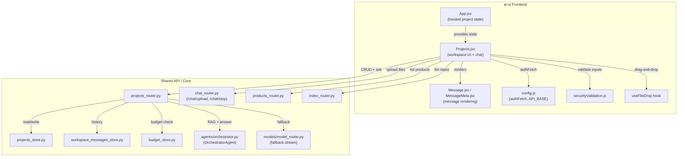
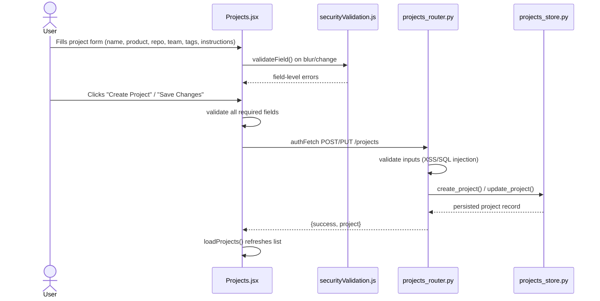
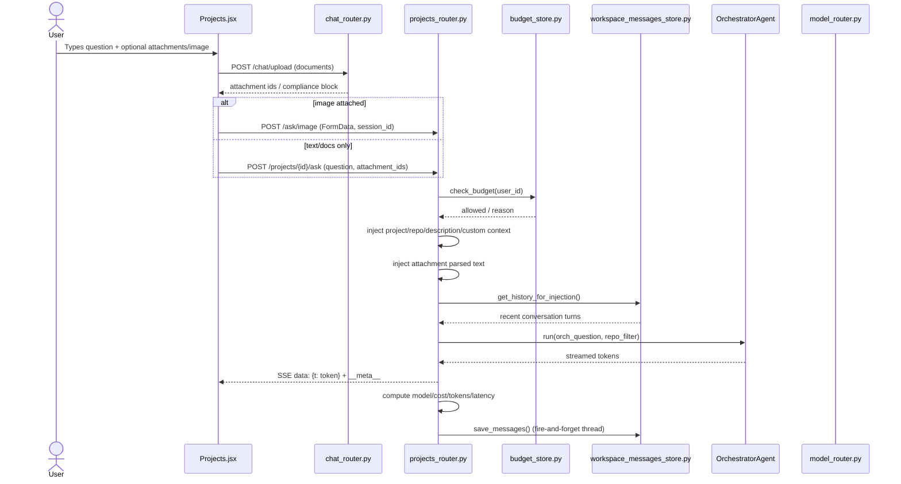
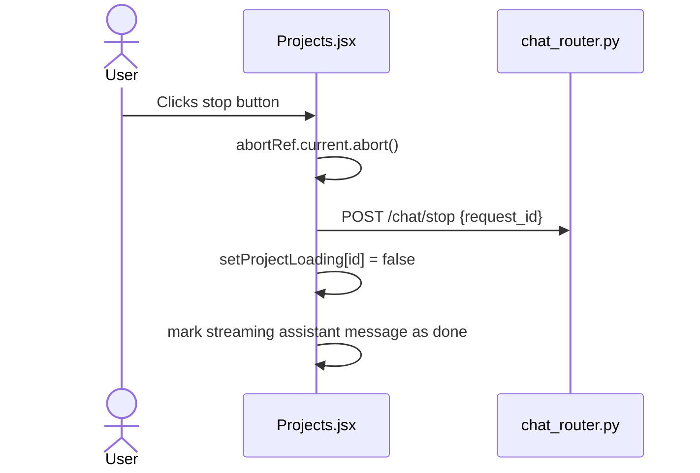
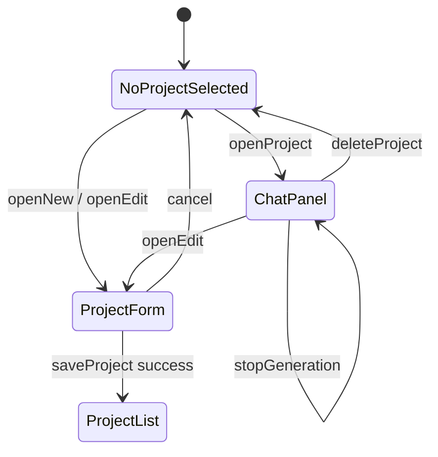

# Projects Module

## Brief Introduction

The **Projects** module provides persistent, project-scoped AI workspaces inside the `ai_ui_frontend` application. A "project" (also labeled "My Workspace" in the UI) binds together a **product**, an indexed **codebase/repo**, custom instructions, and a team, creating a dedicated chat context for code-aware conversations. Users can create, edit, delete, and search projects; within each project they can ask questions, attach documents or images, edit previous messages, enhance prompts, and stream answers from the backend orchestrator.

This module is intentionally modeled after the main [Chat](../chat/chat.md) experience but adds repository-aware retrieval: every question is automatically prefixed with project and codebase context so the orchestrator never classifies a project question as "general" and skips RAG retrieval.

---

## Purpose and Core Functionality

### What the module does

1. **Project lifecycle management** — Create, list, search, edit, and delete workspaces. Each workspace stores metadata such as name, description, product, repo/branch, team emails, tags, and custom instructions.
2. **Project-scoped chat** — Within a selected workspace, users ask questions and receive streaming assistant responses. The backend injects `[Project: ...]`, `[Codebase: ...]`, `[Description: ...]`, and custom-instruction context into every query.
3. **Multi-modal input** — Supports plain text, document attachments (PDF, DOCX, XLSX, CSV, TXT, HTML, JSON), and image uploads. Documents are parsed and their text is injected into the prompt; images are sent to the `/ask/image` endpoint.
4. **Prompt enhancement** — Users can ask the backend to rewrite/enhance a prompt and optionally answer follow-up questions before sending.
5. **Message history** — Conversation history is fetched from the server (`workspace_messages_store`) and is the single source of truth. History survives reloads and navigation because message/loading state is hoisted in [App.jsx](../ui/ai_ui_frontend_app_core.md).
6. **Streaming with stop** — Responses stream via Server-Sent Events (SSE). Users can abort generation, which triggers both a client-side `AbortController` and a cooperative backend stop via `/chat/stop`.

### Core components

| Component | File | Responsibility |
|-----------|------|----------------|
| `Projects` | `ai-ui/src/components/Projects.jsx` | Main React component that renders the project list, project form, and chat panel. |
| `saveProject` | `ai-ui/src/components/Projects.jsx` | Validates and submits project create/update requests. |
| `openNew` | `ai-ui/src/components/Projects.jsx` | Opens the empty project creation form. |
| `handleImageSelect` / `removeImage` | `ai-ui/src/components/Projects.jsx` | Manages image attachment selection and removal. |
| `handleEnhance` / `applyEnhancement` | `ai-ui/src/components/Projects.jsx` | Calls the prompt-enhancer endpoint and applies the enhanced text. |
| `stopGeneration` | `ai-ui/src/components/Projects.jsx` | Aborts the active stream and clears the loading state for the current workspace. |
| `ProjectsRouter` | `routers/projects_router.py` | FastAPI router exposing CRUD and `/projects/{id}/ask` endpoints. |
| `projects_store` | `store/projects_store.py` | Database persistence for project records. |
| `workspace_messages_store` | `store/workspace_messages_store.py` | Server-side persistence for per-project, per-user chat history. |

---

## Architecture and Component Relationships

The Projects UI is a single-page React component split into a left sidebar (project list) and a right pane (form or chat). It receives hoisted state from `App.jsx` so that streaming can survive route changes, and it delegates all persistence to backend routers.



### Key design decisions

- **Hoisted state in `App.jsx`**: `projectMessages`, `projectLoading`, and `activeProjectId` are dictionaries keyed by project ID. This lets a user switch routes while a stream continues in the background, and return to find the same live messages.
- **Server as source of truth**: On project open, messages are fetched from `/projects/{id}/messages`. There is no `localStorage` fallback for display.
- **Per-workspace loading**: Loading flags are scoped per project, so switching to a different workspace is never blocked by an active stream in another workspace.
- **Context injection**: The backend `ask_project` handler prepends project/codebase/description/custom-instruction context to every user question, ensuring retrieval is scoped to the selected repo.

---

## How the Module Fits into the Overall System

The Projects module sits alongside the main [Chat](../chat/chat.md), [Knowledge Base](../knowledge/knowledge_base.md), [Code](../codebase/code.md), and [Agents Catalog](../agents/agents_catalog.md) experiences in the `ai_ui_frontend` portal. It reuses shared infrastructure:

- **Authentication** — Uses `authFetch` and the httpOnly-cookie session managed by [AuthContext](../auth/auth.md).
- **Budget governance** — Every ask checks the user's budget via [budget_store](../llm/budget.md) and displays usage metadata via [MessageMeta](../chat/message_meta.md).
- **File upload & compliance** — Document uploads go through the shared `/chat/upload` endpoint; blocked files render the same compliance-block card used in [Chat](../chat/chat.md).
- **Model routing & orchestration** — Answers are produced by the shared `OrchestratorAgent` and fall back to the shared `model_router` stream.
- **Codebase indexing** — Repo options come from the shared `/index/repos` endpoint; the selected `repo_name` is passed as a `repo_filter` to the orchestrator.
- **Products** — Each project must be associated with a product from the shared [ProductManager](product_manager.md) catalog.

---

## Data Flows

### Creating or editing a project



### Asking a question in a project workspace



### Stopping generation



---

## State Management



### State shape (hoisted in App.jsx)

```javascript
{
  projectMessages: { [projectId]: Message[] },
  projectLoading:  { [projectId]: boolean },
  activeProjectId: string | null
}
```

Each `Message` object follows the shared chat message schema used by [Chat](../chat/chat.md) and includes optional metadata fields: `modelLabel`, `costUsd`, `latency`, `inTok`, `outTok`, `tokensToday`, `maxTokensToday`, `requestsToday`, `maxRequestsToday`.

---

## API Surface

The frontend consumes the following endpoints. Full backend contract details live in [projects_router](../core/shared_api_routers.md#projects_router).

| Method | Endpoint | Purpose |
|--------|----------|---------|
| GET | `/projects` | List projects for the current user (admin sees all). |
| POST | `/projects` | Create a new project. |
| PUT | `/projects/{id}` | Update an existing project. |
| DELETE | `/projects/{id}` | Delete a project and cascade-delete its messages. |
| GET | `/projects/{id}/messages` | Fetch server-side chat history. |
| POST | `/projects/{id}/ask` | Stream an answer scoped to the project/repo. |
| POST | `/ask/image` | Ask about an attached image. |
| POST | `/chat/upload` | Upload document attachments. |
| POST | `/chat/stop` | Cooperative backend stop for a request. |
| POST | `/enhance` | Rewrite/enhance a prompt. |
| GET | `/products` | List products for the project form. |
| GET | `/index/repos` | List indexed repos for the project form. |
| GET | `/budget/me` | Fetch current user's budget for metadata display. |

---

## Security and Validation

- All form inputs are validated on the client with `securityValidation.js` (`validateProductName`, `validateDescription`, `validateSecurity`, etc.).
- The backend re-validates every field in `projects_router.py` before persistence.
- Only the project creator or an admin can update or delete a project.
- Budget checks are enforced before every ask.
- File uploads are filtered by MIME type and size (images ≤ 10 MB). Blocked files render a compliance-block card.

---

## Related Documentation

- [ai_ui_frontend_app_core](../ui/ai_ui_frontend_app_core.md) — Hoisted project state and routing.
- [chat](../chat/chat.md) — Shared chat patterns, upload, and stop behavior.
- [message](../chat/message.md) / [message_meta](../chat/message_meta.md) — Message rendering and usage metadata.
- [auth](../auth/auth.md) — Authentication and `authFetch`.
- [product_manager](product_manager.md) — Product catalog used by project forms.
- [shared_api_routers](../core/shared_api_routers.md#projects_router) — Backend `projects_router` API details.
- [shared_core](../core/shared_core.md) — `OrchestratorAgent`, `model_router`, and store layer.
