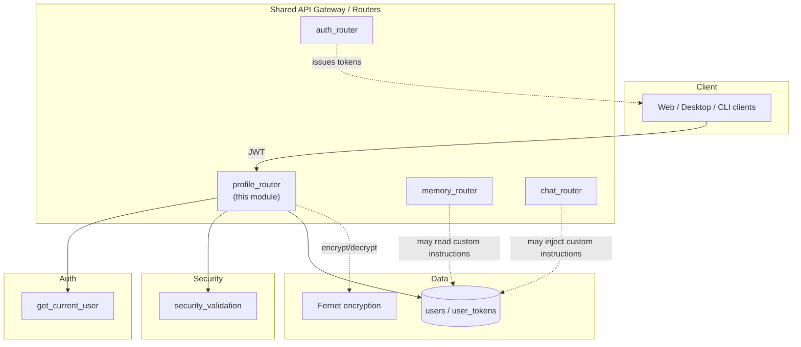
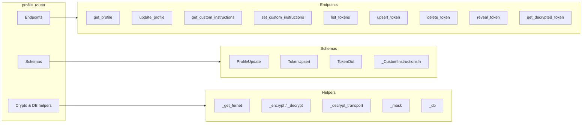
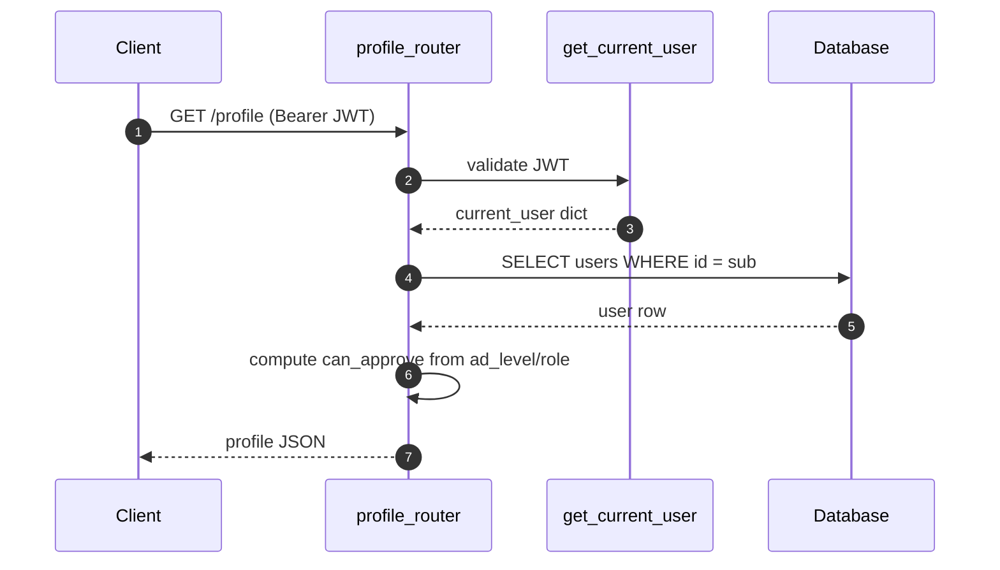
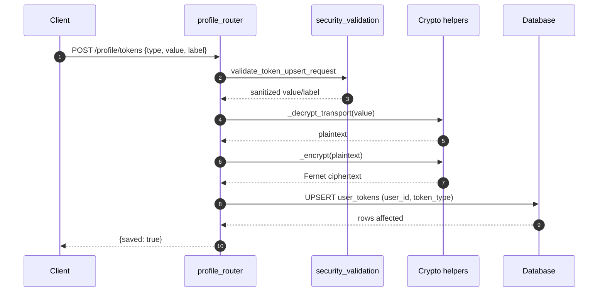
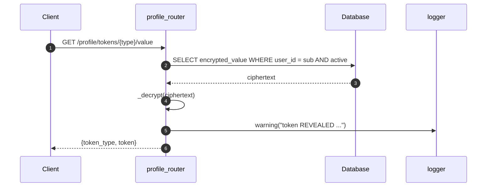
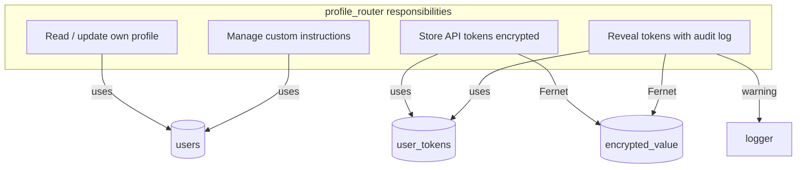

# profile_router

The `profile_router` module exposes authenticated REST endpoints for users to manage their own profile, custom instructions, and sensitive API tokens. It is a thin FastAPI router that sits on top of the shared user database and relies on the platform's authentication and security-validation utilities.

---

## 1. Purpose & Core Functionality

`profile_router` provides a self-service API for the currently authenticated user:

- **Profile management** — read and update mutable identity fields (`name`, `gitlab_username`) and read ABAC-derived authorization signals (`ad_level`, `can_approve`, `is_security_team`, etc.).
- **Custom instructions** — persist per-user persona text (`about_user`, `response_style`) that downstream chat components can inject into prompts.
- **API token vault** — store, list, update, and delete user-owned tokens (`local_llm`, `atlassian`, `gitlab`, `neuron`). Token values are encrypted at rest with Fernet and are only returned to the client in masked form, except for an explicit, audit-logged "reveal" endpoint.

The router is intentionally narrow in scope: it only ever operates on the calling user's own record (`current_user["sub"]`).

---

## 2. Architecture

### 2.1 High-level placement



### 2.2 Component diagram



---

## 3. Dependencies

| Dependency | Module | Role |
|------------|--------|------|
| `get_current_user` | [auth_router](auth_router.md) / `auth.dependencies` | Resolves the JWT into the current user dict (`sub`, `email`, `role`, etc.). |
| `validate_profile_update_request` | [core/security_validation](shared_core.md) | Validates `name` and `gitlab_username` for injection / XSS / special characters. |
| `validate_token_upsert_request` | [core/security_validation](shared_core.md) | Validates token value and label before persistence. |
| `logger` | [core/logger](shared_core.md) | Used for audit logging of token reveals and upserts. |
| `db.database.engine` | [db/database](database.md) | SQLAlchemy engine for `users` and `user_tokens` tables. |
| `cryptography.fernet.Fernet` | External | At-rest encryption of token values using `FERNET_KEY`. |
| `cryptography.hazmat.primitives.ciphers.aead.AESGCM` | External | Optional transport decryption of frontend-encrypted payloads using `LOGIN_ENCRYPT_KEY`. |

---

## 4. Data Flows

### 4.1 Reading the profile



### 4.2 Updating a token



### 4.3 Revealing a token (audit-logged)



---

## 5. Endpoints

| Method | Path | Handler | Description |
|--------|------|---------|-------------|
| `GET` | `/profile` | `get_profile` | Returns the caller's profile including ABAC fields. |
| `PUT` | `/profile` | `update_profile` | Updates `name` and/or `gitlab_username` after validation. |
| `GET` | `/profile/custom-instructions` | `get_custom_instructions` | Returns saved `about_user` and `response_style`. |
| `PUT` | `/profile/custom-instructions` | `set_custom_instructions` | Persists custom instruction blobs (max 4000 chars each). |
| `GET` | `/profile/tokens` | `list_tokens` | Lists active tokens with masked values. |
| `POST` | `/profile/tokens` | `upsert_token` | Creates or replaces a token for the caller. |
| `DELETE` | `/profile/tokens/{token_type}` | `delete_token` | Soft-deletes (deactivates) a token. |
| `GET` | `/profile/tokens/{token_type}/value` | `reveal_token` | Returns the plaintext token; audit-logged. |

---

## 6. Schemas

### 6.1 `ProfileUpdate`

```python
class ProfileUpdate(BaseModel):
    name:            Optional[str] = None
    gitlab_username: Optional[str] = None
```

### 6.2 `TokenUpsert`

```python
class TokenUpsert(BaseModel):
    token_type: Literal["local_llm", "atlassian", "gitlab", "neuron"]
    value:      str
    label:      Optional[str] = None
```

### 6.3 `TokenOut`

```python
class TokenOut(BaseModel):
    token_type: str
    label:      Optional[str]
    masked:     str
    is_active:  bool
```

### 6.4 `_CustomInstructionsIn`

```python
class _CustomInstructionsIn(BaseModel):
    about_user:     Optional[str] = None
    response_style: Optional[str] = None
```

---

## 7. Security Model

- **Authentication**: every endpoint depends on `get_current_user`; anonymous requests are rejected.
- **Authorization**: all queries are scoped by `current_user["sub"]`; a user can never access another user's tokens or profile.
- **Input validation**: profile updates and token upserts pass through `core.security_validation` helpers to mitigate XSS, injection, and special-character abuse.
- **Encryption at rest**: token values are encrypted with Fernet (`FERNET_KEY`) before being written to `user_tokens.encrypted_value`.
- **Transport decryption**: the frontend may AES-GCM-encrypt token values with `LOGIN_ENCRYPT_KEY`; the router decrypts them before Fernet-encrypting for storage.
- **Masking**: list endpoints return only a masked preview (`first4 + **** + last4`).
- **Audit logging**: `reveal_token` logs a `logger.warning` event containing the user, token type, and purpose.
- **Token types**: `local_llm`, `atlassian`, `gitlab`, `neuron`. Unknown types are rejected with HTTP 400.

---

## 8. Internal helper: `get_decrypted_token`

`get_decrypted_token(user_id: str, token_type: str) -> Optional[str]` is exported for use by other backend modules (notably the model-routing layer when `tier=NEURON`). It performs the same database lookup and Fernet decryption as `reveal_token` but does not expose the value over HTTP and does not audit-log.

---

## 9. Database Tables

### 9.1 `users`

Columns read by `get_profile`:

- `id`, `email`, `name`, `role`, `department`
- `gitlab_username`, `is_security_team`
- `last_ad_sync`, `account_status`
- `ad_level`, `ad_title`, `ad_username`, `manager_dn`
- `last_login_at`, `created_at`
- `custom_about_user`, `custom_response_style`

### 9.2 `user_tokens`

Columns used by token endpoints:

- `user_id` (partition key)
- `token_type`
- `encrypted_value`
- `label`
- `is_active`
- `updated_at`

Unique constraint on `(user_id, token_type)` enables upsert semantics.

---

## 10. Error Handling

| Scenario | HTTP Status | Detail |
|----------|-------------|--------|
| User not found | 404 | `"User not found"` |
| Invalid `token_type` | 400 | `"Invalid token_type. Must be one of: ..."` |
| Validation failure | 400 | Semicolon-joined field errors |
| Token not found | 404 | `"No active {type} token saved in your profile"` |
| Decryption failure | 500 | `"Token could not be decrypted"` |
| Missing `FERNET_KEY` | 500 | `"Encryption service unavailable: ..."` |
| Database error | 500 | Exception message |

---

## 11. Integration with the rest of the system

- **Authentication**: relies on [auth_router](auth_router.md) for JWT resolution.
- **Chat / Memory**: custom instructions may be consumed by [chat_router](chat_router.md) and [memory_router](memory_router.md) to shape persona-driven responses.
- **Model routing**: `get_decrypted_token` is used by the model-routing layer (see [model_router](model_routing.md)) when a NEURON-tier credential is required.
- **Desktop / Git workflows**: `reveal_token` for `gitlab` enables the desktop client to perform `git clone` with the user's stored PAT.
- **Security**: input validation is delegated to [core/security_validation](shared_core.md); audit logging uses [core/logger](shared_core.md).

---

## 12. Mermaid summary


