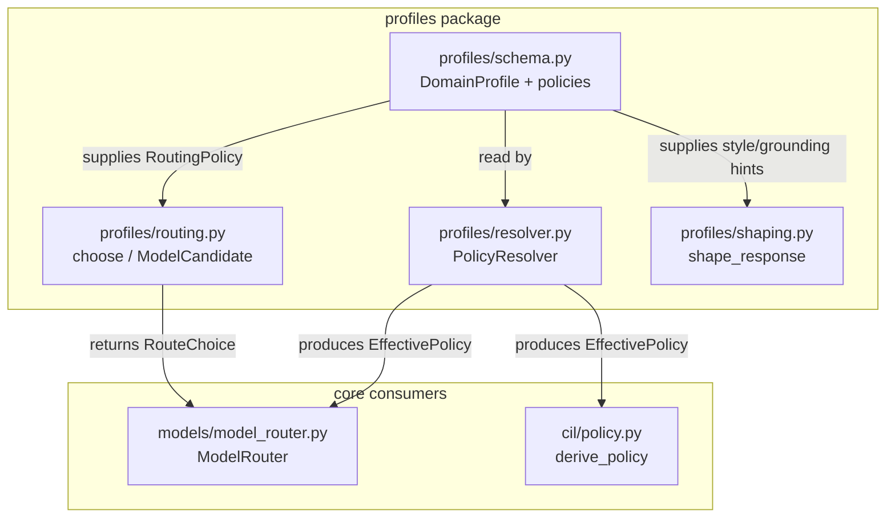
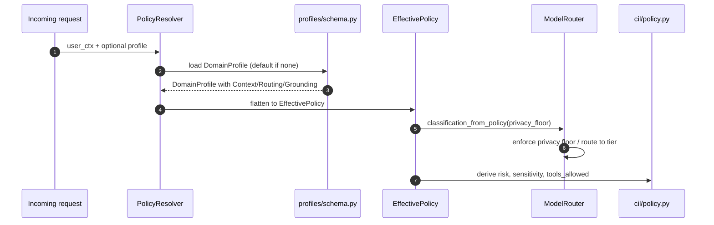
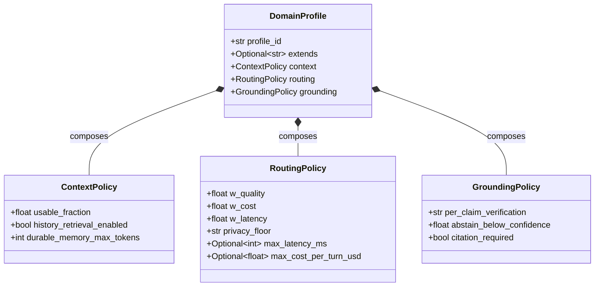
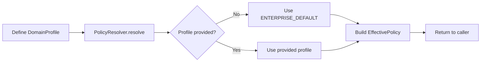
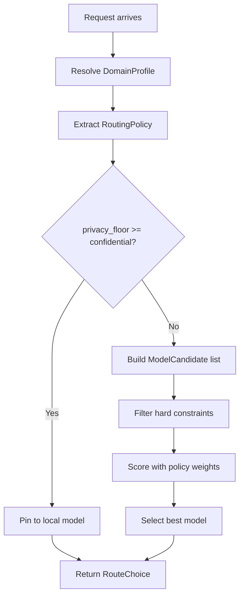

# profiles_schema

## Brief Introduction

`profiles/schema.py` defines the **data-model layer for domain profiles** in the shared-core `profiles` package. A *domain profile* is an immutable, named bundle of policy knobs that parameterizes the otherwise invariant runtime core so the same code can serve different audiences—enterprise, regulated, coding, customer-facing, etc.—without forking.

The module intentionally ships a **Wave 1 subset** of the full personalization schema (documented in `docs/architecture/17-personalization.md`). Wave 1 only contains the strict minimum needed to reproduce today's hard-coded gateway constants exactly. Later waves append additional sections (retrieval, planning, tools, presentation, governance) while keeping the envelope forward-compatible.

All classes are pure-stdlib, `frozen=True` dataclasses, making profiles safe value objects that can be imported in bare test environments and passed across thread boundaries.

---

## Core Components

### `ContextPolicy`

Context-engineering knobs that control how much conversation history and memory are exposed to the model.

| Field | Type | Default | Meaning |
|-------|------|---------|---------|
| `usable_fraction` | `float` | `0.75` | Fraction of the model context window considered usable for history/context. Matches the legacy `CHAT_CONTEXT_USABLE_FRACTION` constant. |
| `history_retrieval_enabled` | `bool` | `False` | Overflow-retrieval feature flag. Kept `False` in Wave 1 so the default profile matches the current gateway behavior. |
| `durable_memory_max_tokens` | `int` | `800` | Cap on the durable-memory slot injected into the prompt. |

### `RoutingPolicy`

Model-routing weights and hard constraints. The defaults reproduce the current implicit posture: quality-led, no hard privacy floor beyond local-first tiering, and no cost/latency ceilings.

| Field | Type | Default | Meaning |
|-------|------|---------|---------|
| `w_quality` | `float` | `0.6` | Weight given to model quality in the routing score. |
| `w_cost` | `float` | `0.2` | Weight given to estimated cost. |
| `w_latency` | `float` | `0.2` | Weight given to latency (normalized to seconds). |
| `privacy_floor` | `str` | `"public"` | Minimum data-sensitivity tier the profile may handle: `public \| internal \| confidential \| restricted`. |
| `max_latency_ms` | `Optional[int]` | `None` | Hard latency ceiling (ms). |
| `max_cost_per_turn_usd` | `float` | `None` | Hard cost ceiling per turn (USD). |

### `GroundingPolicy`

Per-claim verification posture, controlling when the system must cite sources or abstain.

| Field | Type | Default | Meaning |
|-------|------|---------|---------|
| `per_claim_verification` | `str` | `"off"` | `off \| on_factual \| always`. |
| `abstain_below_confidence` | `float` | `0.0` | Confidence threshold below which the model must abstain. |
| `citation_required` | `bool` | `False` | Whether generated claims must carry citations. |

### `DomainProfile`

The top-level named policy bundle. It composes the policy sections above and is designed to be extended in later waves.

| Field | Type | Default | Meaning |
|-------|------|---------|---------|
| `profile_id` | `str` | `"enterprise_default"` | Stable identifier for the profile. |
| `extends` | `Optional[str]` | `None` | Optional parent profile identifier for inheritance (reserved for future waves). |
| `context` | `ContextPolicy` | `ContextPolicy()` | Context-engineering policy. |
| `routing` | `RoutingPolicy` | `RoutingPolicy()` | Model-routing policy. |
| `grounding` | `GroundingPolicy` | `GroundingPolicy()` | Grounding/verification policy. |

---

## Architecture

### Design Principles

1. **Behavior-as-data**: Runtime constants that used to be scattered through `gateway.py` are now explicit, versioned data.
2. **Immutable value objects**: `frozen=True` guarantees that a profile cannot change after creation, eliminating a class of side-effect bugs.
3. **Forward-compatible envelope**: New policy sections are appended; existing code ignores unknown fields.
4. **Pure stdlib**: No external dependencies, so the module is importable in tests, scripts, and constrained environments.
5. **Fail-safe defaults**: The default `enterprise_default` profile reproduces today's behavior exactly, ensuring zero regression on deploy.

---

## Dependencies

### Internal dependencies

- `profiles/resolver.py` — reads `DomainProfile` to produce a flat `EffectivePolicy`.
- `profiles/routing.py` — consumes `RoutingPolicy` inside `choose()` to score and filter `ModelCandidate`s.
- `profiles/shaping.py` — uses profile-level style/grounding hints to produce a `ResponseShape`.
- `models/model_router.py` — maps `RoutingPolicy.privacy_floor` to a data-classification via `classification_from_policy()`.
- `cil/policy.py` — receives a `DomainProfile` in `derive_policy()` to decide risk, sensitivity, clarification, and tool allowance.

### External dependencies

None. The module uses only `dataclasses` and `typing` from the Python standard library.

---

## Data Flow

### How a profile influences a turn

1. A caller (gateway, agent, or router) asks `PolicyResolver.resolve()` for the effective policy.
2. The resolver returns `EffectivePolicy`, which flattens the nested dataclasses into request-scoped values.
3. `ModelRouter.route()` calls `classification_from_policy()` to translate `RoutingPolicy.privacy_floor` into the router's `CONFIDENTIAL`/`RESTRICTED` vocabulary. If the floor is `confidential` or `restricted`, the request is pinned to the local model and cloud fallback is disabled.
4. `profiles/routing.choose()` uses the `RoutingPolicy` weights and ceilings to score candidate models when explicit tier routing is not used.
5. `cil/policy.derive_policy()` uses the profile to decide risk level, whether clarification is needed, data sensitivity, and whether tools are allowed.
6. `profiles/shaping.shape_response()` applies profile-level tone, style, and citation settings to the final response.

---

## Component Interaction

---

## Process Flows

### Creating and resolving a profile

### Routing with a profile

---

## Integration with the Wider System

`profiles_schema` sits at the bottom of the `profiles` package and is the single source of truth for policy data. It does **not** contain routing logic, resolution rules, or response formatting; those live in sibling modules:

- For how profiles are resolved into request-scoped effective policies, see [`profiles_resolution.md`](profiles_resolution.md).
- For model-candidate scoring and selection, see [`profiles_routing.md`](profiles_routing.md).
- For how profile settings shape the final response, see [`profiles_shaping.md`](profiles_shaping.md).
- For the CIL policy derivation that consumes profiles, see [`cil_policy.md`](cil_policy.md).
- For the model router that enforces the privacy floor, see [`model_router.md`](model_router.md).

---

## Notes for Maintainers

- **Wave 1 scope**: Only `ContextPolicy`, `RoutingPolicy`, `GroundingPolicy`, and `DomainProfile` are defined. Do not add retrieval/planning/tools/presentation/governance fields here until the corresponding wave is implemented.
- **Default values must match legacy constants**: Any change to the defaults in `ContextPolicy` or `RoutingPolicy` is a behavior change. Update the docstrings and verify against `gateway.py` constants before merging.
- **Adding a new policy section**: Create a new frozen dataclass, add it to `DomainProfile` with a `field(default_factory=...)`, and update `PolicyResolver` to expose the flattened values in `EffectivePolicy`.
- **No external imports**: Keep this file free of third-party and heavy internal imports so it remains safe to import in tests and scripts.
