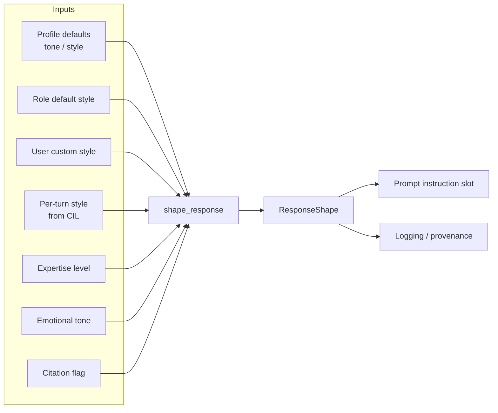
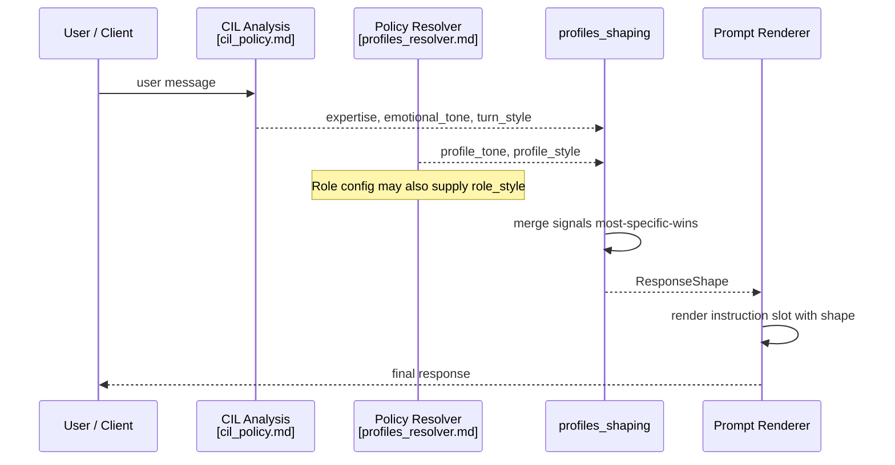
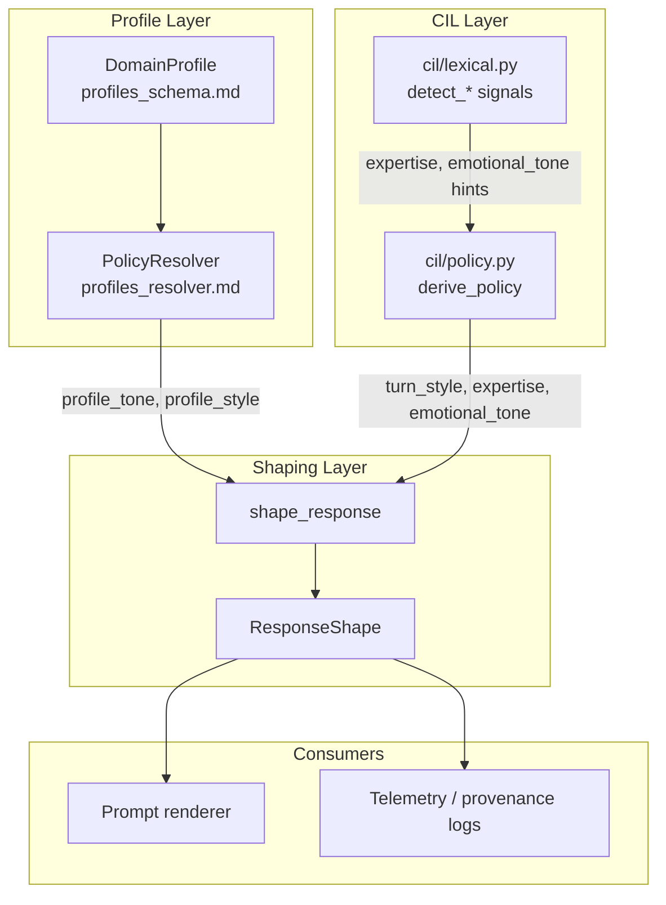
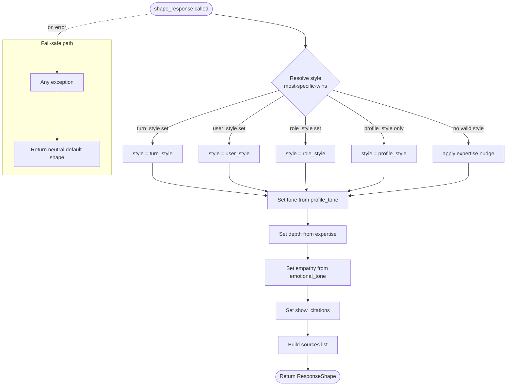
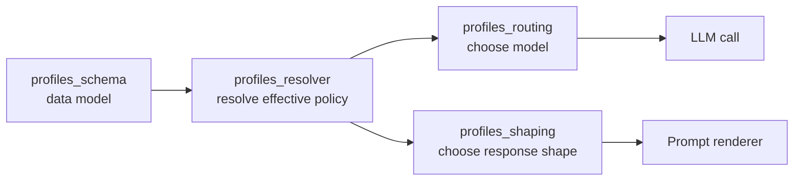

# profiles_shaping — Response Shape Computation

The `profiles_shaping` module computes the final **response shape** for a conversational turn. It takes multiple overlapping style signals—platform profile, role defaults, user preferences, and per-turn intent—and merges them into a single deterministic `ResponseShape` object that downstream prompt rendering consumes.

The design is intentionally **pure, stateless, and fail-safe**: the same inputs always produce the same shape, and any internal error returns a neutral platform default rather than breaking the turn.

---

## 1. Purpose and Scope

`profiles/shaping.py` implements a single public entry point, `shape_response`, plus a small value object, `ResponseShape`. Its responsibilities are limited to:

1. **Merging style signals** with a clear precedence: profile → role → user → per-turn.
2. **Deriving depth** from the detected expertise level (novice/intermediate/expert).
3. **Setting empathy** from the detected emotional tone (frustrated/urgent).
4. **Recording provenance** so prompt rendering and debugging can explain why a shape was chosen.
5. **Never raising**—any exception yields the platform default shape.

This module does **not** decide which model to call, which tools to allow, or how much context to retain. Those decisions live in sibling modules:

- Model routing → [profiles_routing.md](profiles_routing.md)
- Policy resolution → [profiles_resolver.md](profiles_resolver.md)
- Profile schema → [profiles_schema.md](profiles_schema.md)
- Turn-level risk/sensitivity/tool policy → [cil_policy.md](cil_policy.md)

---

## 2. Architecture



The module sits at the boundary between **policy/profile resolution** and **prompt construction**. It receives resolved values from the profile resolver and CIL (Command / Intent / Language) analysis, and emits a shape object that the prompt template can render directly.

---

## 3. Core Components

### 3.1 `ResponseShape`

A frozen-style dataclass that captures the final rendering instructions.

| Field | Type | Default | Meaning |
|-------|------|---------|---------|
| `style` | `str` | `"detailed"` | `concise`, `detailed`, or `step_by_step` |
| `tone` | `str` | `"helpful"` | `neutral`, `helpful`, `formal-precise`, `technical`, `brand-voice` |
| `depth` | `str` | `"normal"` | `scaffolded`, `normal`, or `terse` |
| `empathetic` | `bool` | `False` | Whether to use empathetic language |
| `show_citations` | `bool` | `False` | Whether to surface source citations |
| `sources` | `List[str]` | `[]` | Provenance of each decision |

`as_dict()` serializes the shape for prompt context or telemetry.

### 3.2 `shape_response(...)`

The public API. It accepts the following keyword-only arguments:

| Argument | Default | Source |
|----------|---------|--------|
| `profile_tone` | `"helpful"` | `DomainProfile` / platform default |
| `profile_style` | `"detailed"` | `DomainProfile` / platform default |
| `role_style` | `None` | Role configuration |
| `user_style` | `None` | User preference store |
| `turn_style` | `None` | CIL per-turn intent analysis |
| `expertise` | `None` | CIL lexical/intent analysis |
| `emotional_tone` | `None` | CIL lexical/intent analysis |
| `show_citations` | `False` | Grounding / RAG policy |

The function returns a `ResponseShape`. It never raises.

---

## 4. Data Flow



1. The **CIL pipeline** extracts per-turn signals such as expertise level, emotional tone, and explicit style requests (e.g., "explain like I'm five"). See [cil_policy.md](cil_policy.md) and [cil_lexical.md](cil_lexical.md).
2. The **profile resolver** supplies platform/organization defaults. See [profiles_resolver.md](profiles_resolver.md).
3. **Role and user preferences** are injected by the caller if configured.
4. `shape_response` merges everything deterministically.
5. The resulting `ResponseShape` is passed to the prompt renderer as an instruction slot.

---

## 5. Merge Rules

### 5.1 Style Precedence (Most-Specific-Wins)

The style field is resolved from the first valid value in this ordered list:

1. `profile_style`
2. `role_style`
3. `user_style`
4. `turn_style`

A later, more specific source overrides an earlier one. Valid styles are: `concise`, `detailed`, `step_by_step`.

If no explicit style is set beyond the profile, **expertise** provides a fallback nudge:

| Expertise | Implied style |
|-----------|---------------|
| `novice` | `detailed` |
| `intermediate` | no nudge |
| `expert` | `concise` |

### 5.2 Tone

Tone is taken directly from `profile_tone` if it is in the allowed vocabulary; otherwise it falls back to `"helpful"`. Per-turn or user tone overrides are not currently implemented in this module; callers that need them should pass an adjusted `profile_tone`.

### 5.3 Depth

Depth is derived purely from expertise:

| Expertise | Depth |
|-----------|-------|
| `novice` | `scaffolded` |
| `expert` | `terse` |
| other / unset | `normal` |

### 5.4 Empathy

Empathy is enabled when `emotional_tone` is `frustrated` or `urgent`.

### 5.5 Citations

`show_citations` is passed through from the caller, typically driven by grounding/RAG policy.

### 5.6 Provenance

The `sources` field records which inputs drove the final style and depth decisions, e.g.:

```python
["style:turn", "depth:novice"]
```

This supports explainability and A/B debugging without exposing PII.

---

## 6. Component Interaction



- [profiles_schema.md](profiles_schema.md) defines the data model that carries profile defaults.
- [profiles_resolver.md](profiles_resolver.md) resolves the effective policy and passes profile-level values into shaping.
- [cil_policy.md](cil_policy.md) and [cil_lexical.md](cil_lexical.md) produce the per-turn signals.
- The prompt renderer consumes `ResponseShape` to build the final system/user instruction.

---

## 7. Process Flow



---

## 8. Fail-Safe Behavior

The entire `shape_response` body is wrapped in a broad `try/except`. If any unexpected input, validation bug, or downstream dependency fails, the function returns:

```python
ResponseShape(
    style="detailed",
    tone="helpful",
    depth="normal",
    empathetic=False,
    show_citations=False,
    sources=[],
)
```

This guarantees that a shaping bug cannot break a user turn. The default shape is intentionally neutral and matches the platform's historical behavior.

---

## 9. Dependencies

| Dependency | Module Doc | Why It Matters |
|------------|------------|----------------|
| `profiles/schema.py` | [profiles_schema.md](profiles_schema.md) | Defines `DomainProfile`, the source of profile defaults. |
| `profiles/resolver.py` | [profiles_resolver.md](profiles_resolver.md) | Resolves the effective policy that feeds `profile_tone` and `profile_style`. |
| `profiles/routing.py` | [profiles_routing.md](profiles_routing.md) | Sibling routing layer; shaping does not route models but shares the same profile context. |
| `cil/policy.py` | [cil_policy.md](cil_policy.md) | Produces per-turn `derive_policy` outputs that may include style/expertise signals. |
| `cil/lexical.py` | [cil_lexical.md](cil_lexical.md) | Cheap lexical detectors for expertise, emotional tone, and output format hints. |

---

## 10. How It Fits Into the System

`profiles_shaping` is one of four coordinated modules in the **profiles** subsystem of `shared_core`:



- **Schema** stores the policy bundle.
- **Resolver** collapses profile/role/user layers into an effective policy.
- **Routing** uses the effective policy to pick a model.
- **Shaping** uses the same resolved values plus CIL signals to pick a response style.

This separation keeps shaping testable and independent from model selection, tool policy, and context engineering.

---

## 11. Testing and Extension Notes

- Because `shape_response` is pure, unit tests can assert exact output for every combination of inputs.
- Adding a new style or tone requires updating the `_STYLES` or `_TONES` tuple and the default shape if needed.
- Adding a new per-turn override source is a one-line change in the ordered candidate list inside `_first_valid`.
- The provenance list is append-only; consumers should treat unknown source strings as informational.

---

## 12. Related Documentation

- [profiles_schema.md](profiles_schema.md)
- [profiles_resolver.md](profiles_resolver.md)
- [profiles_routing.md](profiles_routing.md)
- [cil_policy.md](cil_policy.md)
- [cil_lexical.md](cil_lexical.md)
