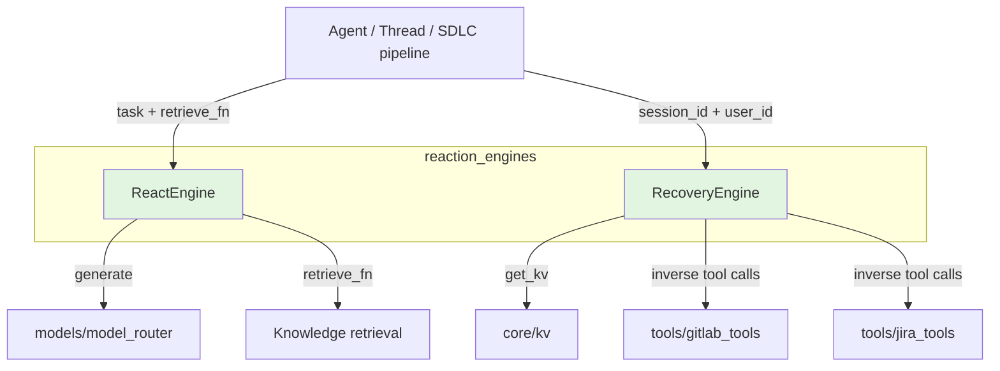
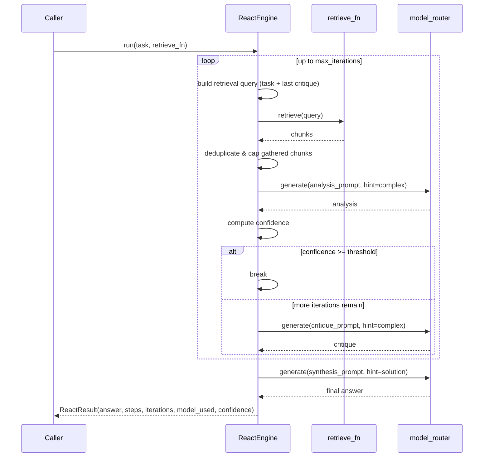
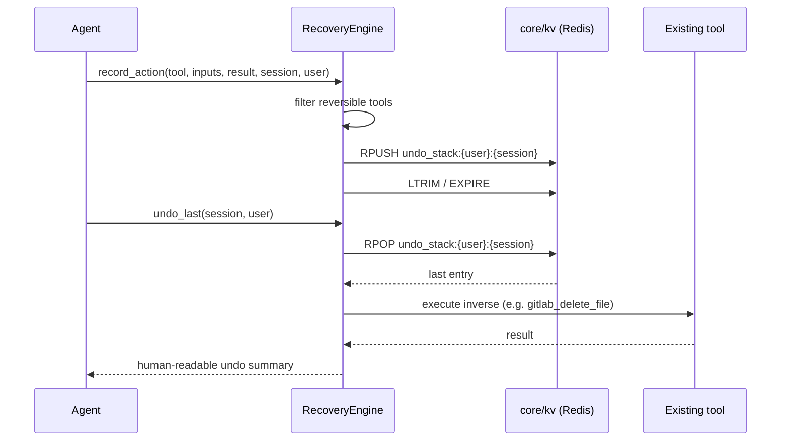

# reaction_engines

The `reaction_engines` module provides the iterative reasoning and session-recovery primitives used by the platform's autonomous agents. It lives inside the broader [`agent_system`](agent_system.md) and is consumed by features such as Threads @AiNxt and the SDLC pipeline.

## Purpose

Autonomous agents need two complementary capabilities to operate reliably on complex, multi-step tasks:

1. **Iterative reasoning** — the ability to plan, retrieve context, analyse, critique, and synthesise an answer over multiple passes rather than in a single LLM call.
2. **Session recovery** — the ability to undo reversible side-effects, resume an interrupted reasoning loop from a checkpoint, and report partial progress when a run cannot complete.

`reaction_engines` implements both capabilities in a small, reusable library:

- `ReactEngine` runs a retrieval-augmented ReACT loop (retrieve → analyse → critique → synthesise) with a configurable confidence threshold and iteration ceiling.
- `RecoveryEngine` maintains a Redis-backed undo stack for reversible tool calls, saves/restores ReACT checkpoints, and formats graceful partial-completion messages.

## Architecture Overview

The module is intentionally thin and stateless where possible:

- `ReactEngine` receives a task and a retrieval callback; it does not own the vector store or the model gateway.
- `RecoveryEngine` delegates persistence to the shared key/value layer ([`core_infrastructure`](core_infrastructure.md)) and delegates inverse operations to the existing tool implementations in [`shared_integrations`](shared_integrations.md)).

## Sub-modules

| Sub-module | Responsibility | Key Components |
|------------|----------------|----------------|
| [reaction_engines_react_loop](reaction_engines_react_loop.md) | Retrieval-augmented ReACT reasoning loop | `ReactEngine`, `ReactStep`, `ReactResult` |
| [reaction_engines_recovery](reaction_engines_recovery.md) | Undo stack, ReACT checkpointing, partial completion | `RecoveryEngine` |

## Data Flow — ReACT Loop

## Data Flow — Recovery

## Integration with the Rest of the System

- **Model routing**: `ReactEngine` calls [`models/model_router`](model_routing.md)`::model_router.generate()` for analysis, critique, and synthesis. It uses the `complex` hint for mid-loop calls (cost-controlled Sonnet) and the `solution` hint for the final answer (Opus when enabled).
- **Knowledge retrieval**: The engine accepts a `retrieve_fn` callback so callers can plug in the project's RAG/vector search without adding a hard dependency.
- **Key/value store**: `RecoveryEngine` uses [`core/kv`](core_infrastructure.md) for undo stacks and ReACT checkpoints. Keys are namespaced by `user_id` to prevent cross-user access (SEC-05).
- **Tool layer**: Inverse operations for tracked tool calls are implemented by reusing existing tools such as [`tools/gitlab_tools`](shared_integrations.md) and [`tools/jira_tools`](shared_integrations.md).
- **Loop policy**: The default iteration ceiling is imported from `agents/loop_policy` and falls back to `3` if that module is unavailable, ensuring the engine does not keep a private constant.

## Configuration & Tuning

| Setting | Default | Description |
|---------|---------|-------------|
| `MAX_REACT_ITERATIONS` | `agents.loop_policy.REACT_ITERATIONS` or `3` | Hard cap on ReACT iterations. |
| `CONFIDENCE_THRESHOLD` | `0.80` | Early-exit confidence score. |
| `synthesis_hint` | `"solution"` | Model hint for the final synthesis. |
| `iteration_hint` | `"complex"` | Model hint for analysis/critique steps. |
| `_UNDO_STACK_MAX` | `20` | Maximum undo entries kept per session. |
| `_UNDO_STACK_TTL` | `3600` seconds | Undo stack expiry. |
| `PLAN_CHECKPOINT_TTL_SEC` | `3600` seconds | ReACT checkpoint expiry. |

## Security & Safety Notes

- **Undo isolation**: Undo stack keys are scoped as `undo_stack:{user_id}:{session_id}`. Empty `user_id` is allowed only for internal callers, preventing broken-object-level authorisation (BOLA).
- **Reversible-only tracking**: Only tools with a clear inverse are recorded (`gitlab_create_or_update_file`, `jira_create_issue`). Immutable actions such as comments and sandbox runs are not tracked.
- **Privacy floor**: `ReactEngine` inherits the platform-wide privacy floor through [`model_routing`](model_routing.md); sensitive data is never routed to cloud providers.
- **Fail-safe synthesis**: If the final synthesis model fails, the engine falls back to the last analysis rather than returning an empty or generic response.

## When to Use

Use `reaction_engines` when an agent needs:

- Deep reasoning over a codebase or knowledge base with explicit retrieval steps.
- A bounded, observable loop that can stop early when confidence is high enough.
- The ability to undo recent write operations or resume after a crash/timeout.

For higher-level orchestration of multiple agents, see [`agent_orchestration`](agent_orchestration.md). For the full agent builder/runner, see [`core_agent_framework`](core_agent_framework.md).
