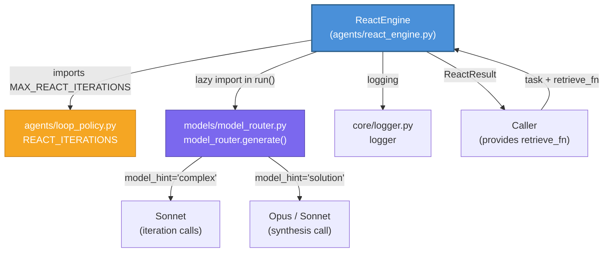
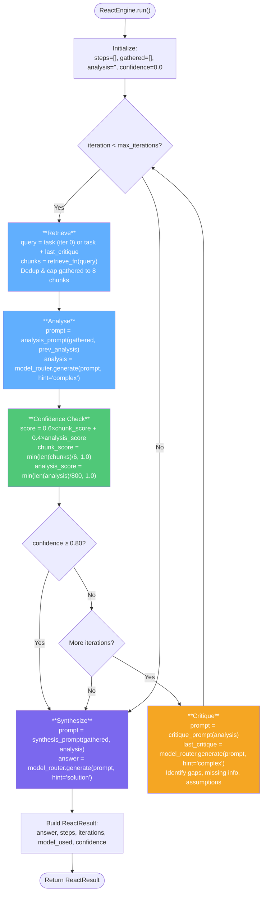
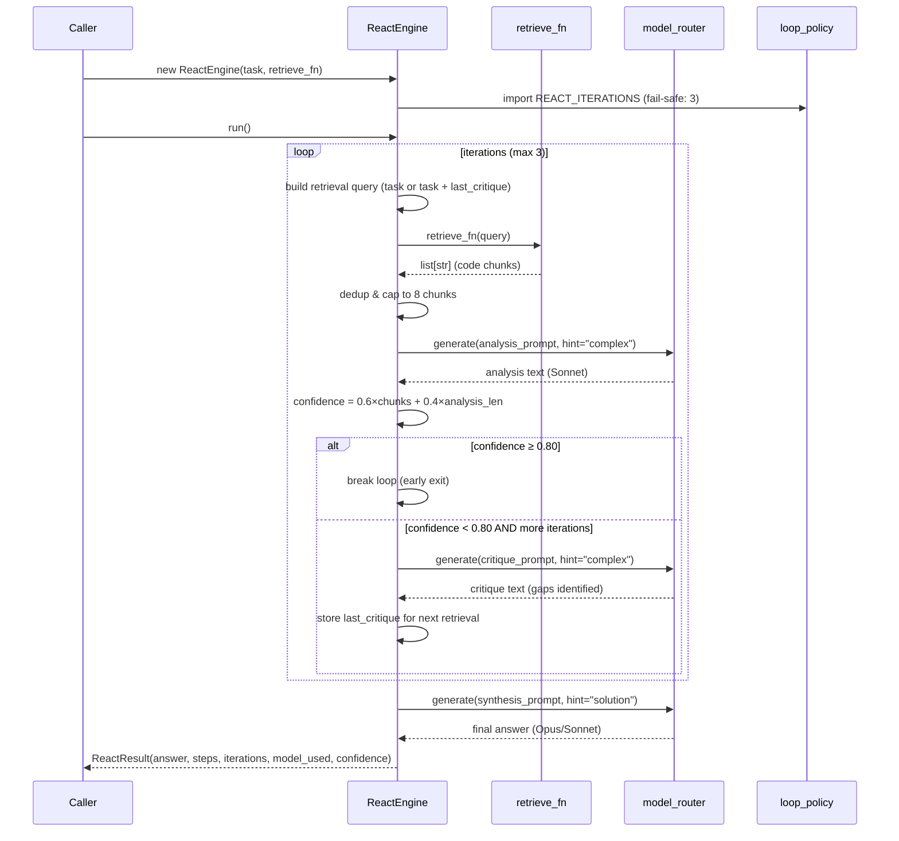

# Reaction Engines — ReAct Loop (`reaction_engines_react_loop`)

## Overview

The `reaction_engines_react_loop` module implements **`ReactEngine`** — a reusable, iterative ReACT (Reason + Act + Observe + Critique + Synthesize) loop for tasks that require deep reasoning over a codebase or knowledge corpus. Unlike the heavier [`ReactOrchestrator`](#relationship-to-reactorchestrator) (which drives Claude-native tool-use with multi-provider fallback and adversarial verification), `ReactEngine` is a lightweight, self-contained micro-loop designed for **retrieval-augmented analysis**: it iteratively retrieves context chunks, analyses them with an LLM, critiques its own analysis for gaps, and then synthesises a final structured answer using a higher-tier model.

The engine is part of the **`reaction_engines`** sub-group within the broader [`agent_system`](agent_system.md) module, sitting alongside its sibling [`reaction_engines_recovery`](reaction_engines_recovery.md) (which provides session-level undo stacks and ReAct checkpoint persistence).

---

## Core Component

### `ReactEngine`

**File:** `agents/react_engine.py`

```python
class ReactEngine:
    def __init__(
        self,
        task:                 str,
        retrieve_fn:          Callable[[str], list[str]],
        max_iterations:       int   = MAX_REACT_ITERATIONS,   # 3 (from loop_policy)
        confidence_threshold: float = CONFIDENCE_THRESHOLD,    # 0.80
        synthesis_hint:       str   = "solution",              # → Opus if ENABLE_OPUS, else Sonnet
        iteration_hint:       str   = "complex",               # → Sonnet (cost control)
    )
```

`ReactEngine` accepts a natural-language task and a caller-supplied retrieval callable, then runs a bounded loop of **retrieve → analyse → confidence-check → critique** iterations before a final **synthesise** step. The loop terminates early when the confidence threshold is met or the iteration cap is reached.

#### Constructor Parameters

| Parameter | Type | Default | Description |
|---|---|---|---|
| `task` | `str` | — | Natural-language task; also used as the base retrieval query on iteration 0. |
| `retrieve_fn` | `Callable[[str], list[str]]` | — | Caller-supplied function that takes a query string and returns a list of text chunks. |
| `max_iterations` | `int` | `3` | Hard cap on reasoning loops. Sourced from `agents.loop_policy.REACT_ITERATIONS`. |
| `confidence_threshold` | `float` | `0.80` | Stop early once this confidence score is reached. |
| `synthesis_hint` | `str` | `"solution"` | Model hint for the final synthesis call (routes to Opus if `ENABLE_OPUS=true`, else Sonnet). |
| `iteration_hint` | `str` | `"complex"` | Model hint for mid-loop analysis/critique calls (routes to Sonnet for cost control). |

#### Return Type

```python
@dataclass
class ReactResult:
    answer:     str           # Final synthesised answer
    steps:      list          # List of ReactStep objects (audit trail)
    iterations: int           # Number of analysis iterations executed
    model_used: str           # Label of the model used for synthesis
    confidence: float         # Final confidence score
```

```python
@dataclass
class ReactStep:
    action:     str    # "retrieve" | "analyze" | "critique" | "synthesize"
    query:      str
    result:     str    # Truncated preview of the step's output
    confidence: float  # Only populated for "analyze" steps
```

---

## Architecture

### Module Position

`ReactEngine` lives within the `shared_core` → `agent_system` → `reaction_engines` hierarchy:

```
shared_core
  └── agent_system
       ├── core_agent_framework        (AgentBuilder, AgentRunner)
       ├── advanced_reasoning           (TreeOfThoughts, SelfConsistency, ChainOfVerification)
       ├── decision_engines             (DecisionEngine, ComplianceEngine, HardBlockEngine)
       ├── agent_orchestration          (OrchestratorAgent, ReactOrchestrator, RouterAgent)
       ├── reaction_engines
       │    ├── reaction_engines_react_loop   ← THIS MODULE (ReactEngine)
       │    └── reaction_engines_recovery     (RecoveryEngine)
       └── ...
```

### Dependency Diagram



### ReAct Loop Flow



---

## Detailed Behaviour

### 1. Retrieval Phase

Each iteration begins with a retrieval query:

- **Iteration 0:** Uses the raw task text (truncated to 300 chars) as the query.
- **Subsequent iterations:** Combines the task (200 chars) with the last critique output (200 chars) to focus retrieval on identified gaps.

Retrieved chunks are **deduplicated** against already-gathered chunks and the accumulated context is **capped at 8 chunks** to control prompt size. Retrieval errors are caught and logged — the loop continues with whatever context was previously gathered.

### 2. Analysis Phase

The analysis prompt is constructed with:
- The original task
- Up to 6 retrieved code chunks (truncated to 3000 chars total)
- Previous analysis from earlier iterations (truncated to 800 chars, if available) — with an instruction to *refine, not repeat*

The LLM is called via `model_router.generate()` with `model_hint="complex"` (routes to Claude Sonnet for cost control). The response is expected to be a structured technical analysis referencing exact file paths and function names.

### 3. Confidence Scoring

Confidence is computed using a **heuristic formula** (no LLM self-estimation):

```
confidence = 0.6 × chunk_score + 0.4 × analysis_score

where:
  chunk_score    = min(len(gathered_chunks) / 6.0, 1.0)
  analysis_score = min(len(analysis_text) / 800.0, 1.0)
```

This rewards both **breadth of evidence** (more chunks) and **depth of analysis** (longer, more detailed reasoning). If confidence meets or exceeds the threshold (0.80), the loop exits early — no further critique or retrieval is performed.

### 4. Critique Phase

Only executed when the confidence threshold is **not** met and more iterations remain. The critique prompt asks the LLM to identify:
1. What specific information is missing
2. What assumptions were made without code evidence
3. What should be retrieved next to strengthen the analysis

The critique output is stored in `self._last_critique` and used to focus the next iteration's retrieval query.

### 5. Synthesis Phase

After the loop terminates (either by confidence threshold or iteration cap), a final synthesis call is made using `model_hint="solution"` (routes to Opus if `ENABLE_OPUS=true`, otherwise Sonnet). The synthesis prompt includes:
- The original task
- Up to 6 code chunks (2000 chars)
- The accumulated analysis from all iterations (2000 chars)

The synthesis is expected to produce a structured response with sections: **Root Cause**, **Proposed Fix**, **Impact Assessment**, and **Priority**.

If the synthesis LLM call fails, the engine **falls back** to using the last analysis text as the answer.

---

## Prompt Engineering

### Analysis Prompt

```
You are an expert engineering analyst.
Task: {task}

Retrieved Code Context:
{chunks[:3000]}

[Previous analysis (refine, do not repeat):]
{prev_analysis[:800]}

Provide a structured technical analysis. Reference exact file paths and function names from the context.
```

### Critique Prompt

```
Review this engineering analysis and identify gaps:
1. What specific information is missing?
2. What assumptions were made without code evidence?
3. What should be retrieved next to strengthen the analysis?

Analysis:
{analysis[:1500]}

Reply concisely — focus only on what is missing.
```

### Synthesis Prompt

```
You are an expert engineering assistant producing the final answer.

Task: {task}

Code Context:
{chunks[:2000]}

Reasoning from analysis iterations:
{analysis[:2000]}

Produce a final structured response:
## Root Cause
## Proposed Fix
## Impact Assessment
## Priority

Be precise — reference exact file paths and functions. No generic advice.
```

---

## Relationship to `ReactOrchestrator`

`ReactEngine` and `ReactOrchestrator` are **distinct but complementary** ReACT implementations:

| Aspect | `ReactEngine` (this module) | `ReactOrchestrator` |
|---|---|---|
| **Purpose** | Retrieval-augmented deep analysis micro-loop | Full Claude-native agentic tool-use loop |
| **Tool execution** | None — uses a caller-supplied `retrieve_fn` | Full tool-use via Claude/OpenAI/Gemini gateways |
| **Provider fallback** | Single `model_router` call | Claude → OpenAI → Gemini cascade |
| **Verification** | Heuristic confidence scoring | Risk-aware multi-step verifier loop with claim grounding, adversarial critique, contradiction detection |
| **Recovery** | Falls back to last analysis on synthesis failure | Recovery passes, partial completion handling, checkpoint resume |
| **Memory** | None | Persists tool sequences to Postgres memory |
| **Complexity** | Lightweight, ~150 lines | Heavy, ~800+ lines with extensive safety layers |
| **Typical use** | Codebase analysis, root-cause investigation, SDLC pipeline reasoning | User-facing agent interactions, multi-tool orchestration |

`ReactOrchestrator` also integrates with [`reaction_engines_recovery`](reaction_engines_recovery.md) for checkpoint-based crash recovery and undo stacks, while `ReactEngine` is stateless between runs.

---

## Relationship to `OrchestratorAgent`

The [`OrchestratorAgent`](agent_system.md) (in `agents/orchestrator.py`) is the **main user-facing agent loop** that handles query classification, planning, retrieval, compliance, and streaming generation. It uses a plan-based execution model (`retrieve → generate`) with adaptive loop depth sourced from `agents.loop_policy.decide_loop_budget()`. `ReactEngine` is a more specialised tool for **iterative deep reasoning** — it could be invoked by the orchestrator or SDLC pipeline components when a single retrieve-and-generate pass is insufficient and multi-round critique-driven analysis is needed.

---

## Relationship to `AgentLoop` (SDLC)

The [`AgentLoop`](shared_core_sdlc_pipeline.md) in `agents/sdlc_agent_loop.py` is a bounded Anthropic tool-use loop for SDLC pipeline stages (explore, code, test). It shares the same **unified loop policy** (`agents/loop_policy`) for iteration ceilings but operates at a different abstraction level — driving tool calls against a workspace (read_file, grep, propose_edit, run_build, run_tests) rather than retrieval-augmented analysis. `ReactEngine`'s simpler retrieve-analyse-critique pattern is complementary: it can be used for the analysis/design phases where the primary operation is reasoning over retrieved context rather than mutating files.

---

## Unified Loop Policy Integration

`ReactEngine` sources its iteration ceiling from the **unified loop policy** module (`agents/loop_policy.py`), ensuring no engine maintains a private constant:

```python
try:
    from agents.loop_policy import REACT_ITERATIONS as MAX_REACT_ITERATIONS
except Exception:
    MAX_REACT_ITERATIONS = 3  # fail-safe
```

This is part of a system-wide pattern ("Gap #7") where all agent loops — `OrchestratorAgent`, `ReactOrchestrator`, `ReactEngine`, and `AgentLoop` — consult `loop_policy` for their depth parameters:

| Policy Function / Constant | Used By | Purpose |
|---|---|---|
| `REACT_ITERATIONS = 3` | `ReactEngine` | Max retrieve-analyse-critique iterations |
| `decide_loop_budget()` | `OrchestratorAgent` | Adaptive iteration ceiling based on complexity + tools |
| `verify_loops_for_risk()` | `ReactOrchestrator` | Verify+recover loop ceiling by risk tier (HIGH=5, MEDIUM=3, LOW=1) |

The policy module guarantees that loop depth can only **match or exceed** historical defaults — never regress.

---

## Error Handling & Resilience

`ReactEngine` is designed to **never crash** the calling pipeline:

| Failure Point | Behaviour |
|---|---|
| `retrieve_fn()` raises | Caught, logged as warning; loop continues with previously gathered chunks |
| Analysis LLM call fails | Caught, logged; loop **breaks** immediately → proceeds to synthesis |
| Critique LLM call fails | Caught, logged; critique skipped; loop continues to next iteration |
| Synthesis LLM call fails | Caught, logged; **falls back** to last analysis text as the answer |
| `loop_policy` import fails | Falls back to hardcoded `MAX_REACT_ITERATIONS = 3` |

All exceptions are caught with broad `except Exception` blocks and logged via `core.logger.logger`. The engine always returns a `ReactResult` — even if it contains only partial analysis.

---

## Data Flow Summary



---

## Configuration

### Environment Variables

| Variable | Scope | Effect |
|---|---|---|
| `ENABLE_OPUS` | `model_router` | When `true`, `model_hint="solution"` routes to Opus for synthesis; otherwise Sonnet. |

### Constants

| Constant | Value | Source | Description |
|---|---|---|---|
| `MAX_REACT_ITERATIONS` | `3` | `agents.loop_policy.REACT_ITERATIONS` (fail-safe: 3) | Maximum retrieve-analyse-critique iterations |
| `CONFIDENCE_THRESHOLD` | `0.80` | `react_engine.py` | Early-exit threshold for the reasoning loop |

---

## Usage Example

```python
from agents.react_engine import ReactEngine
from models.hybrid_search import semantic_search

# Define a retrieval function
def my_retrieve_fn(query: str) -> list[str]:
    return semantic_search(query, repo_filter="my-repo", top_k=6)

# Run the ReAct loop
engine = ReactEngine(
    task="Why does the settlement batch fail intermittently for UPI transactions?",
    retrieve_fn=my_retrieve_fn,
    max_iterations=3,
    confidence_threshold=0.80,
)

result = engine.run()

print(f"Answer: {result.answer}")
print(f"Confidence: {result.confidence}")
print(f"Iterations: {result.iterations}")
print(f"Model used: {result.model_used}")
print(f"Steps: {len(result.steps)}")
```

---

## Cross-References

- [Agent System](agent_system.md) — parent module containing all agent frameworks
- [Reaction Engines — Recovery](reaction_engines_recovery.md) — sibling module (`RecoveryEngine`) for undo stacks and ReAct checkpointing
- [Shared Core — SDLC Pipeline](shared_core_sdlc_pipeline.md) — `AgentLoop` bounded tool-use loop for SDLC stages
- [Core Infrastructure](core_infrastructure.md) — `model_router`, `logger`, and other shared utilities
