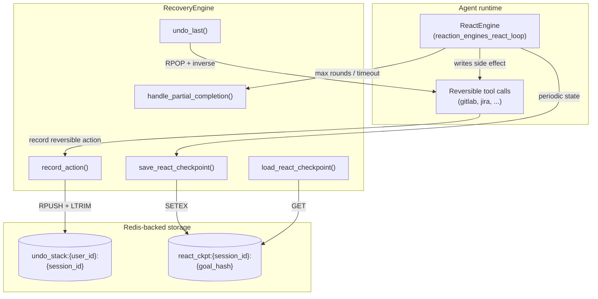
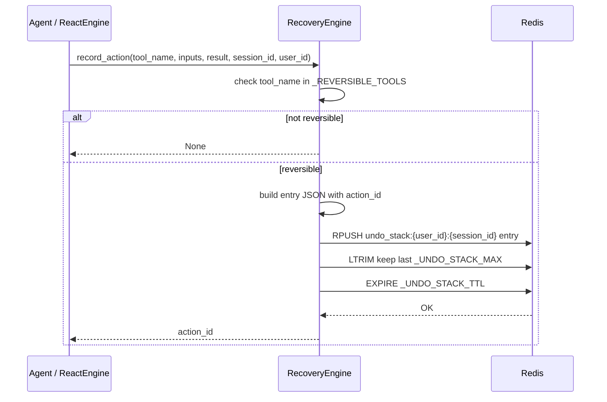
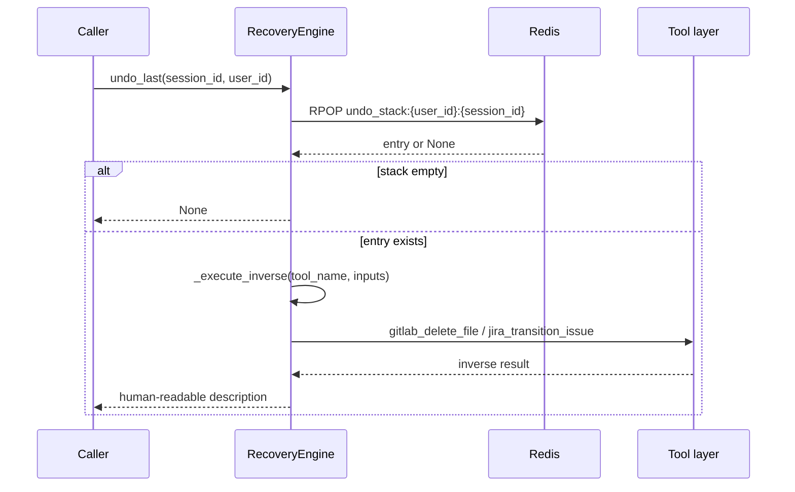
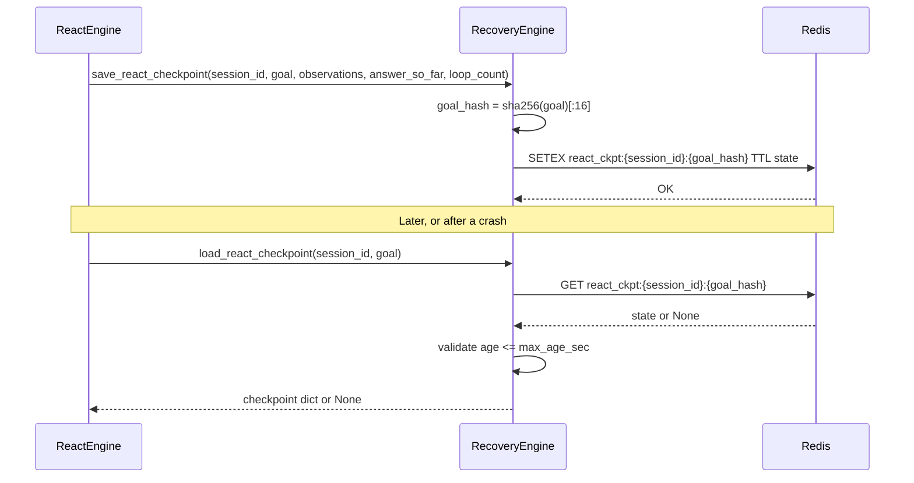

# reaction_engines_recovery

The `reaction_engines_recovery` module provides session-level recovery services for the agent runtime. It is responsible for **undoing reversible write operations**, **checkpointing and resuming ReAct loops**, and **producing graceful partial-completion messages** when a loop terminates early due to timeout or iteration limits.

This module is a companion to [`reaction_engines_react_loop`](reaction_engines_react_loop.md). While the ReAct loop performs iterative reasoning, the recovery engine records the side effects it produces and preserves enough state to recover from crashes, user mistakes, or resource exhaustion.

---

## Core responsibilities

| Responsibility | Description |
| --- | --- |
| **Undo stack** | Tracks a bounded, per-user, per-session stack of reversible tool calls so the last write operation can be rolled back. |
| **ReAct checkpointing** | Saves the current goal, observations, partial answer, and loop count to Redis so a crashed or interrupted loop can resume. |
| **Partial completion** | Formats a user-friendly summary when a loop stops before finishing, listing completed and failed steps. |

---

## Architecture



### Component overview

| Component | File | Purpose |
| --- | --- | --- |
| `RecoveryEngine` | `agents/recovery_engine.py` | Singleton service that exposes undo, checkpoint, and partial-completion APIs. |
| `ReactEngine` | `agents/react_engine.py` | Related component that performs iterative reasoning and can use checkpoint/resume services. See [`reaction_engines_react_loop`](reaction_engines_react_loop.md). |
| KV store | `core/kv/redis_impl.py` | Redis client used for lists and expiring strings. See [`core_kv`](core_kv.md). |

---

## Data flow

### Recording a reversible action



### Undoing the last action



### ReAct checkpoint lifecycle



---

## Security model

The recovery engine follows **SEC-05** from the codebase security guidelines:

- Undo stack keys are namespaced by `user_id`: `undo_stack:{user_id}:{session_id}`.
- A caller can only see, pop, or undo actions that belong to their own user namespace.
- When `user_id` is empty, the key falls back to `undo_stack::{session_id}` for internal callers, but production flows should always supply a user identifier.

This prevents **broken object-level authorization (BOLA)** where one user could undo another user's actions by guessing a session ID.

---

## Configuration

| Constant / env var | Default | Meaning |
| --- | --- | --- |
| `_UNDO_STACK_MAX` | `20` | Maximum number of reversible actions kept per session. |
| `_UNDO_STACK_TTL` | `3600` (1 hour) | Time-to-live for the undo stack. |
| `PLAN_CHECKPOINT_TTL_SEC` | `3600` (1 hour) | Time-to-live for ReAct checkpoints. |

---

## Reversible tools

Only tools with a well-defined inverse are tracked today:

| Tool | Inverse | Notes |
| --- | --- | --- |
| `gitlab_create_or_update_file` | `gitlab_delete_file` | Deletes the created file on the same branch. |
| `jira_create_issue` | `jira_transition_issue(..., "Cancel")` | Jira issues cannot be deleted via API, so the issue is transitioned to a cancelled status. |

The following are explicitly **not** reversible and are therefore not recorded:

- `jira_add_comment` — comments are immutable in Jira.
- `run_code` / sandbox execution — the sandbox is ephemeral.
- Redo (forward undo) is not implemented.
- Distributed undo across sessions is not implemented.

For more details on the tool layer, see [`shared_integrations`](shared_integrations.md).

---

## API reference

### `RecoveryEngine`

Singleton class exposed as `recovery_engine` at module level.

#### Undo stack

- `record_action(tool_name, inputs, result, session_id, user_id="") -> Optional[str]`  
  Records a reversible tool call. Returns the generated `action_id` or `None` if the tool is not tracked.

- `undo_last(session_id, user_id="") -> Optional[str]`  
  Pops and inverts the most recent action. Returns a human-readable description or `None` if the stack is empty / inverse failed.

- `get_undo_stack(session_id, user_id="") -> List[Dict]`  
  Returns the current undo stack for the session, newest entry last.

#### ReAct checkpointing

- `save_react_checkpoint(session_id, goal, observations, answer_so_far, loop_count) -> None`  
  Persists the current ReAct loop state to Redis under `react_ckpt:{session_id}:{goal_hash}`.

- `load_react_checkpoint(session_id, goal, max_age_sec=3600) -> Optional[Dict]`  
  Loads a checkpoint if it exists and is not older than `max_age_sec`.

#### Partial completion

- `handle_partial_completion(goal, observations, partial_answer, reason="timeout") -> str`  
  Builds a markdown summary of completed steps, failed steps, and the partial answer when a loop ends early.

---

## Integration with the rest of the system

- **ReAct loop**: [`reaction_engines_react_loop`](reaction_engines_react_loop.md) can call `save_react_checkpoint` between iterations and `load_react_checkpoint` on startup to resume work.
- **KV store**: [`core_kv`](core_kv.md) provides the Redis client used for lists and expiring strings.
- **Tool layer**: [`shared_integrations`](shared_integrations.md) contains `gitlab_tools` and `jira_tools`, which supply both the forward and inverse operations.
- **Logging**: [`core_logger`](core_logger.md) is used for debug/info/warning messages; failures in recovery are intentionally non-fatal.

---

## Process flow: full recovery scenario

```mermaid
flowchart LR
    A[User asks agent to create a Jira issue] --> B[Agent calls jira_create_issue]
    B --> C[RecoveryEngine.record_action]
    C --> D[Redis undo_stack updated]
    E[User says "undo that"] --> F[RecoveryEngine.undo_last]
    F --> G[Redis RPOP returns entry]
    G --> H[jira_transition_issue to Cancel]
    H --> I[User receives "Undone: cancelled Jira issue PROJ-123"]
```

---

## Operational notes

- Recovery failures are logged but never raised, so a storage outage does not crash the agent.
- Undo entries store only the first 500 characters of the tool result to keep Redis memory bounded.
- Checkpoints store only the first 2000 characters of `answer_so_far` for the same reason.
- The module-level `recovery_engine` singleton is the recommended entry point; constructing a new `RecoveryEngine` is supported but will share the same lazy Redis connection.
