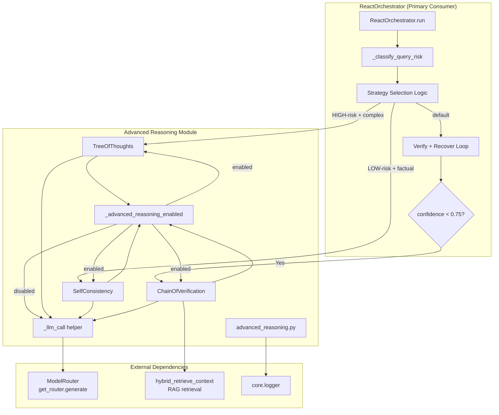
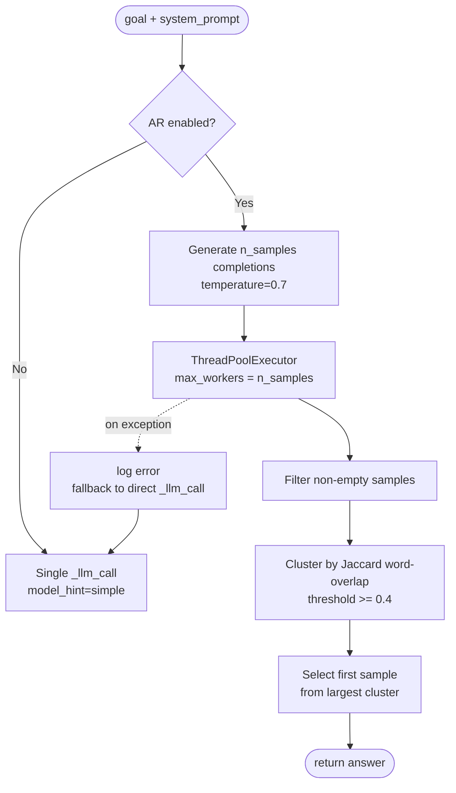
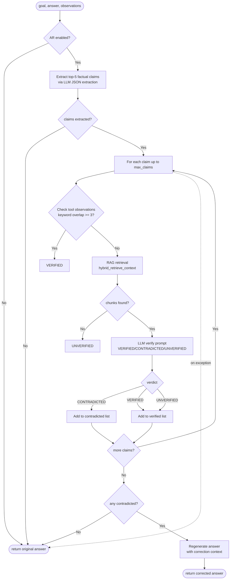
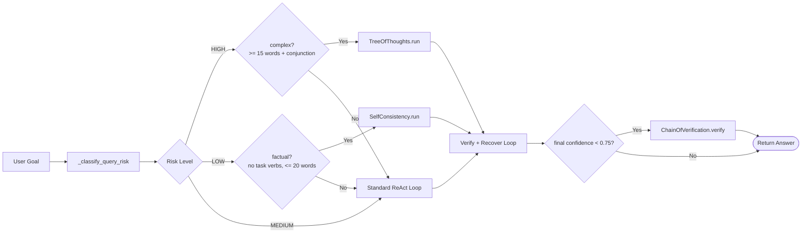
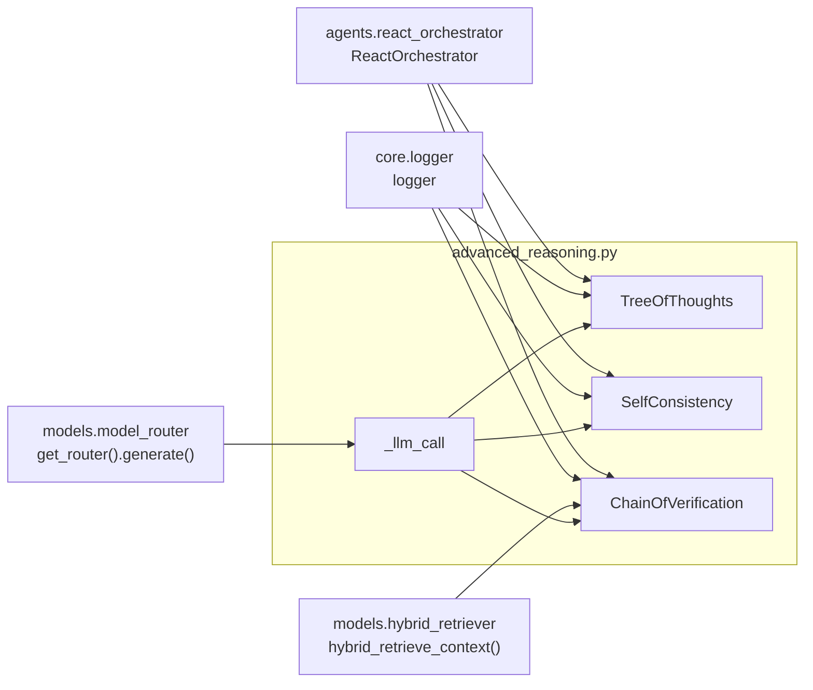
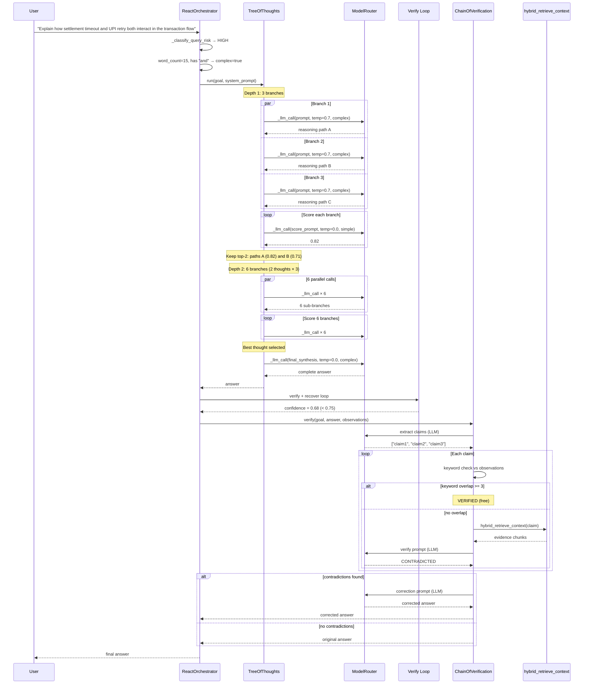
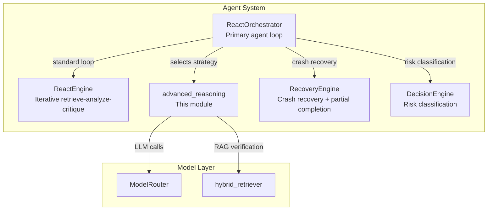

# Advanced Reasoning Module

## Overview

The **Advanced Reasoning** module (`agents/advanced_reasoning.py`) implements three
sophisticated reasoning strategies that extend the platform's baseline ReAct +
Reflexion agent loop with higher-fidelity answer generation and self-verification
capabilities:

| Strategy | Class | Trigger Condition | Purpose |
|---|---|---|---|
| **Tree of Thoughts (ToT)** | `TreeOfThoughts` | HIGH-risk + complex queries | Parallel branch exploration with scoring and pruning |
| **Self-Consistency (SC)** | `SelfConsistency` | LOW-risk + factual queries | Majority-vote sampling across multiple completions |
| **Chain of Verification (CoVe)** | `ChainOfVerification` | Post-answer confidence < 0.75 | Claim-level fact-checking against RAG evidence |

All three strategies are **disabled by default** and gated behind the
`ADVANCED_REASONING_ENABLED` environment variable (default `false`). This
kill-switch acts as a global circuit breaker — when off, every strategy
transparently degrades to a single direct LLM call, ensuring zero behavioural
change for environments that have not opted in.

### Design Principles

1. **Cost Control** — Each strategy has tight bounds: ToT caps at 3 branches × 2
   depth, SC samples 3 completions, CoVe verifies at most 5 claims. No unbounded
   LLM fan-out.
2. **Fail-Safe Degradation** — Every strategy wraps its logic in try/except and
   falls back to a single `_llm_call` on any error. The module never raises to
   its caller.
3. **Unified LLM Proxy** — All LLM invocations route through the same
   `ModelRouter` used by the rest of the agent system (see
   [model_routing](../models/model_routing.md)). No direct Anthropic/OpenAI SDK calls.
4. **Thread-Safe Parallelism** — ToT and SC use `ThreadPoolExecutor` with
   bounded workers (max 6) for parallel branch/sample generation.

---

## Architecture



### Module-Level Helpers

| Function | Description |
|---|---|
| `_advanced_reasoning_enabled()` | Reads `ADVANCED_REASONING_ENABLED` env var. Returns `True` when set to `1`/`true`/`yes`. Acts as the global kill-switch. |
| `_llm_call(prompt, temperature, model_hint)` | Thin wrapper around `ModelRouter.get_router().generate()`. Returns `""` on any failure (logged at debug level). All three strategies route every LLM invocation through this function. |

---

## Component Documentation

### TreeOfThoughts

Parallel branch exploration for **HIGH-risk complex queries**. Explores multiple
reasoning paths simultaneously, scores each path, and iteratively refines the
most promising branches.

```mermaid
flowchart TD
    Start([goal + system_prompt]) --> CheckEnabled{AR enabled?}
    CheckEnabled -->|No| DirectCall[Single _llm_call<br/>model_hint=complex]
    CheckEnabled -->|Yes| Init[current_thoughts = [goal]]

    Init --> DepthLoop{depth < max_depth?}
    DepthLoop -->|Yes| GenBranches[Generate n_branches prompts<br/>per current thought]
    GenBranches --> Parallel[ThreadPoolExecutor<br/>max_workers = min branches, 6]
    Parallel --> CollectBranches[Collect non-empty branches]
    CollectBranches --> ScoreLoop[Score each branch via _score_thought]
    ScoreLoop --> Sort[Sort by score descending]
    Sort --> Prune[Keep top-2 thoughts]
    Prune --> DepthLoop

    DepthLoop -->|No| FinalExpand[Expand best thought<br/>into complete answer]
    FinalExpand --> ReturnAnswer([return answer])

    Parallel -.->|on exception| Fallback[log error<br/>fallback to direct _llm_call]
    Fallback --> DirectCall
```

**Configuration:**

| Parameter | Env Var | Default | Description |
|---|---|---|---|
| `n_branches` | `TOT_N_BRANCHES` | `3` | Number of parallel branches generated per thought per depth level |
| `max_depth` | — (constructor arg) | `2` | Maximum tree depth before final answer synthesis |

**Scoring Mechanism (`_score_thought`):**

The scoring prompt asks the LLM to rate a reasoning path on a 0.0–1.0 scale for
how well it addresses the original question. The raw response is parsed with a
regex to extract the first numeric value, clamped to `[0.0, 1.0]`. If parsing
fails, a neutral score of `0.5` is returned.

**Cost Profile:**
- Depth 1: 3 branches + 3 scoring calls = 6 LLM calls
- Depth 2: 6 branches (2 thoughts × 3) + 6 scoring calls = 12 LLM calls
- Final synthesis: 1 LLM call
- **Total: ~19 LLM calls** (worst case, all branches non-empty)

---

### SelfConsistency

Majority-vote sampling for **LOW-risk factual queries**. Generates multiple
completions at elevated temperature, clusters them by word-overlap similarity,
and returns the answer from the largest cluster.



**Configuration:**

| Parameter | Env Var | Default | Description |
|---|---|---|---|
| `n_samples` | `SELF_CONSISTENCY_N_SAMPLES` | `3` | Number of parallel completions to generate |

**Clustering Algorithm (`_majority_vote`):**

1. Each sample starts as its own cluster.
2. For each subsequent sample, compute Jaccard similarity (word-set overlap)
   against the first element of each existing cluster.
3. If similarity ≥ 0.4, add to that cluster; otherwise start a new cluster.
4. Return the first sample from the largest cluster.

**Cost Profile:**
- 3 parallel completions at temperature 0.7
- **Total: 3 LLM calls** (no scoring or verification calls)

---

### ChainOfVerification

Claim-level fact verification applied **post-answer** when the orchestrator's
confidence score falls below 0.75. Extracts factual claims from the answer,
verifies each against tool observations and RAG evidence, and regenerates the
answer if contradictions are found.



**Configuration:**

| Parameter | Default | Description |
|---|---|---|
| `max_claims` | `5` | Maximum number of claims to extract and verify |

**Two-Stage Verification (`_verify_claim`):**

1. **Free keyword check** — Examines existing tool observations (no LLM call).
   If ≥ 3 claim keywords appear in successful tool result previews, the claim is
   marked `VERIFIED` immediately.
2. **RAG verification** — If the keyword check is inconclusive, performs a
   `hybrid_retrieve_context` search for the claim text, then asks the LLM whether
   the retrieved evidence supports, contradicts, or doesn't mention the claim.

**Correction Flow:**
When any claim is `CONTRADICTED`, a correction prompt is constructed that
includes the original answer, the list of contradicted claims (marked as wrong),
and the original question. The LLM regenerates a corrected answer that removes
or fixes the contradicted claims while preserving verified information.

**Cost Profile:**
- 1 claim-extraction LLM call
- Up to 5 RAG searches (free — no LLM call if keyword check passes)
- Up to 5 LLM verification calls (only when RAG search is needed)
- 1 correction LLM call (only if contradictions found)
- **Total: 2–11 LLM calls** depending on keyword-check hit rate

---

## Integration with ReactOrchestrator

The `ReactOrchestrator` (see [agent_orchestration](../agents/agent_orchestration.md)) is
the primary consumer of this module. Strategy selection is driven by the
orchestrator's risk classification and query analysis:



### Selection Criteria (from ReactOrchestrator)

| Condition | Check | Strategy |
|---|---|---|
| HIGH risk + complex | `word_count >= 15` AND regex match for `and\|or\|also\|as well as\|both` | TreeOfThoughts |
| LOW risk + factual | NOT a task request AND `word_count <= 20` AND no task verbs (`create\|update\|delete\|fix\|implement\|write\|run\|execute`) | SelfConsistency |
| Any other case | — | Standard ReAct loop (no advanced strategy) |
| Post-verification, confidence < 0.75 | `goal_state.confidence < 0.75` AND observations exist AND answer is not a hard-stop warning | ChainOfVerification |

> **Note:** CoVe is applied **after** the verify-and-recover loop, regardless of
> which strategy (ToT, SC, or standard ReAct) produced the initial answer. It
> acts as a final safety net for low-confidence outputs.

### Fallback Behaviour

When an advanced strategy fails (exception raised), the orchestrator logs a
warning and falls back to the standard ReAct loop via `_run_with_fallback`:

```
[ReactOrchestrator] ToT failed ({error}), falling back to ReAct
[ReactOrchestrator] SC failed ({error}), falling back to ReAct
[ReactOrchestrator] CoVe failed ({error}), keeping original answer
```

CoVe is unique in that its failure preserves the original answer rather than
triggering a full re-run — it is a post-processing step, not a primary
generation strategy.

---

## Environment Variables

| Variable | Default | Scope | Description |
|---|---|---|---|
| `ADVANCED_REASONING_ENABLED` | `false` | Global | Master kill-switch. When `false`/unset, all three strategies bypass their logic and return a single direct LLM call (or the original answer for CoVe). |
| `TOT_N_BRANCHES` | `3` | ToT only | Number of parallel branches per thought per depth level. |
| `SELF_CONSISTENCY_N_SAMPLES` | `3` | SC only | Number of parallel completions to sample. |

> Individual strategy env-var controls (`TOT_ENABLED`, `SC_ENABLED`,
> `COV_ENABLED`) are referenced in docstrings but are not currently enforced in
> the code — the global `ADVANCED_REASONING_ENABLED` is the sole gate. The
> orchestrator's strategy-selection logic provides implicit per-strategy gating
> via risk classification.

---

## Dependency Map



### Key Dependencies

| Dependency | Module | Role |
|---|---|---|
| `ModelRouter` | [model_routing](../models/model_routing.md) | Routes every `_llm_call` to the appropriate LLM gateway (Claude/OpenAI/Gemini/Local) with fallback chains and circuit breakers. The `model_hint` parameter (`"simple"` or `"complex"`) influences tier selection. |
| `hybrid_retrieve_context` | `models.hybrid_retriever` | RAG retrieval used by CoVe for claim verification. Searches the knowledge base for evidence supporting or contradicting extracted claims. Imported lazily inside `_verify_claim` to avoid import-time failures. |
| `logger` | [core_infrastructure](../infrastructure/core_infrastructure.md) | Structured logging for all strategy lifecycle events (start, depth progression, scoring, verification results, errors). |
| `ReactOrchestrator` | [agent_orchestration](../agents/agent_orchestration.md) | Primary consumer — invokes strategies based on risk classification and post-verification confidence. |

---

## Data Flow: End-to-End Example

The following sequence illustrates a HIGH-risk complex query flowing through
TreeOfThoughts and then ChainOfVerification:



---

## Error Handling & Resilience

All three strategies follow a uniform error-handling pattern:

| Strategy | On Error | Fallback |
|---|---|---|
| `TreeOfThoughts.run` | Any exception during branch generation, scoring, or synthesis | Single `_llm_call(goal, model_hint="complex")` |
| `SelfConsistency.run` | Any exception during sampling or clustering | Single `_llm_call(goal, model_hint="simple")` |
| `ChainOfVerification.verify` | Any exception during claim extraction, verification, or correction | Returns the **original answer** unchanged |

Additionally, the `_llm_call` helper itself never raises — it catches all
exceptions, logs at debug level, and returns an empty string. This means a
transient LLM gateway failure during ToT branch generation produces empty
branches that are filtered out, potentially reducing the tree width without
crashing the strategy.

The `ReactOrchestrator` adds a second layer of resilience: if a strategy
constructor or `run()`/`verify()` call raises despite the internal guards, the
orchestrator catches it and falls back to the standard ReAct loop or preserves
the original answer.

---

## Relationship to Other Agent Modules



- **[agent_orchestration](../agents/agent_orchestration.md)** — The `ReactOrchestrator` is
  the entry point that decides when to invoke each advanced strategy. It
  provides the risk classification, query analysis, and post-verification
  confidence check that drive strategy selection.
- **[core_agent_framework](../agents/core_agent_framework.md)** — The `AgentBuilder` and
  `AgentRunner` bootstrap platform agents that may eventually route through the
  `ReactOrchestrator`, indirectly consuming this module.
- **[model_routing](../models/model_routing.md)** — The `ModelRouter` handles all LLM
  gateway selection, fallback chains, and circuit breaking. The `model_hint`
  values (`"simple"`, `"complex"`) passed by this module influence which tier
  the router selects.
- **[core_infrastructure](../infrastructure/core_infrastructure.md)** — Provides the `logger`
  used throughout for structured logging of strategy lifecycle events.
