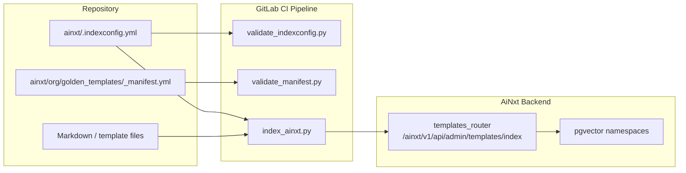
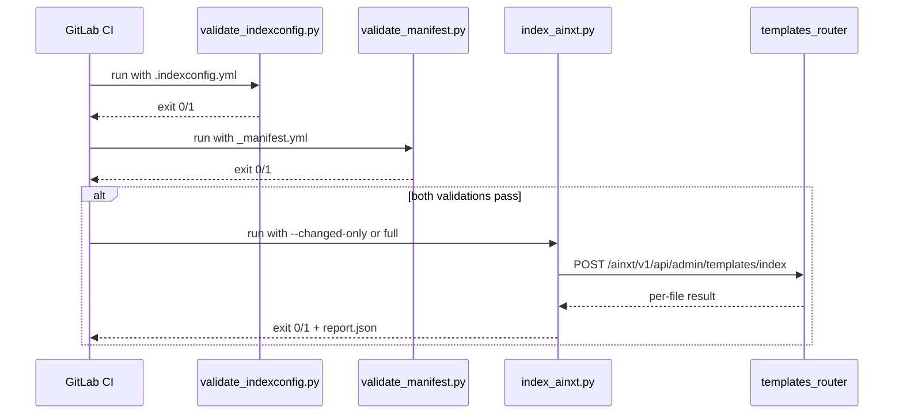

# ainxt_scripts

The `ainxt_scripts` module provides command-line utilities that power the **AiNxt OS indexing and validation pipeline**. These scripts are invoked from the GitLab CI pipeline on every merge to `main` to keep the platform's knowledge base, templates, and golden manifests in sync with the repository.

## Purpose

- **Index repository content** into the AiNxt backend (pgvector namespaces or structured tables) so agents, skills, and templates can retrieve it.
- **Validate `.indexconfig.yml`** before indexing runs, catching schema errors and missing source paths early.
- **Validate `golden_templates/_manifest.yml`** to ensure template metadata is complete, IDs and slash commands are unique, and referenced files exist.

These scripts are intentionally standalone and backend-agnostic: they read YAML configuration, inspect the local filesystem, and call the AiNxt backend's REST endpoints.

## Architecture Overview



### Data Flow

1. CI first runs `validate_indexconfig.py` against `ainxt/.indexconfig.yml`.
2. If a manifest is present, `validate_manifest.py` validates `golden_templates/_manifest.yml`.
3. On success, `index_ainxt.py` enumerates configured sources, optionally filters to changed files, and uploads each file to the backend.
4. The backend's `templates_router` persists the content into the appropriate namespace or structured table.

## Sub-modules

| Sub-module | File | Responsibility | Documentation |
|------------|------|----------------|---------------|
| `ainxt_scripts_indexer` | `ainxt/scripts/index_ainxt.py` | Enumerate files, detect changes, upload content to the AiNxt backend | [ainxt_scripts_indexer.md](../ainxt_scripts_indexer.md) |
| `ainxt_scripts_indexconfig_validation` | `ainxt/scripts/validate_indexconfig.py` | Validate the schema and source paths of `.indexconfig.yml` | [ainxt_scripts_indexconfig_validation.md](../ainxt_scripts_indexconfig_validation.md) |
| `ainxt_scripts_manifest_validation` | `ainxt/scripts/validate_manifest.py` | Validate `golden_templates/_manifest.yml` schema, uniqueness, and file references | [ainxt_scripts_manifest_validation.md](../ainxt_scripts_manifest_validation.md) |

## Integration with the Rest of the System

- **Backend ingestion endpoint**: `index_ainxt.py` posts to `/ainxt/v1/api/admin/templates/index`, which is implemented by the `templates_router` in the [`shared_api_routers`](../api/shared_api_routers.md) module. See [`templates_router`](../api/templates_router.md) for details on how payloads are chunked, stored, and versioned.
- **Knowledge retrieval**: Indexed namespaces are consumed by the RAG pipeline in [`shared_core`](shared_core.md), particularly the model-routing and hybrid-search components.
- **CI/CD**: The scripts are wired into `ainxt/.gitlab-ci.yml` and rely on environment variables such as `AINXT_INDEX_TOKEN`, `CI_COMMIT_SHA`, and optional `previous_sha` for incremental indexing.

## Common Usage

```bash
# Validate the index configuration
python ainxt/scripts/validate_indexconfig.py ainxt/.indexconfig.yml

# Validate the golden templates manifest
python ainxt/scripts/validate_manifest.py ainxt/org/golden_templates/_manifest.yml

# Full reindex
python ainxt/scripts/index_ainxt.py \
  --config ainxt/.indexconfig.yml \
  --backend-url https://your-ainxt-instance \
  --token "$AINXT_INDEX_TOKEN" \
  --commit-sha "$CI_COMMIT_SHA"

# Incremental reindex
python ainxt/scripts/index_ainxt.py \
  --config ainxt/.indexconfig.yml \
  --backend-url https://your-ainxt-instance \
  --token "$AINXT_INDEX_TOKEN" \
  --commit-sha "$CI_COMMIT_SHA" \
  --changed-only \
  --previous-sha "$PREVIOUS_SHA" \
  --output report.json
```

## Exit Codes

| Script | `0` | `1` | `2` |
|--------|-----|-----|-----|
| `index_ainxt.py` | Success | One or more uploads failed | — |
| `validate_indexconfig.py` | Valid | Validation errors | Bad usage |
| `validate_manifest.py` | Valid | Validation errors | Bad usage |

## Mermaid: CI Pipeline Sequence


