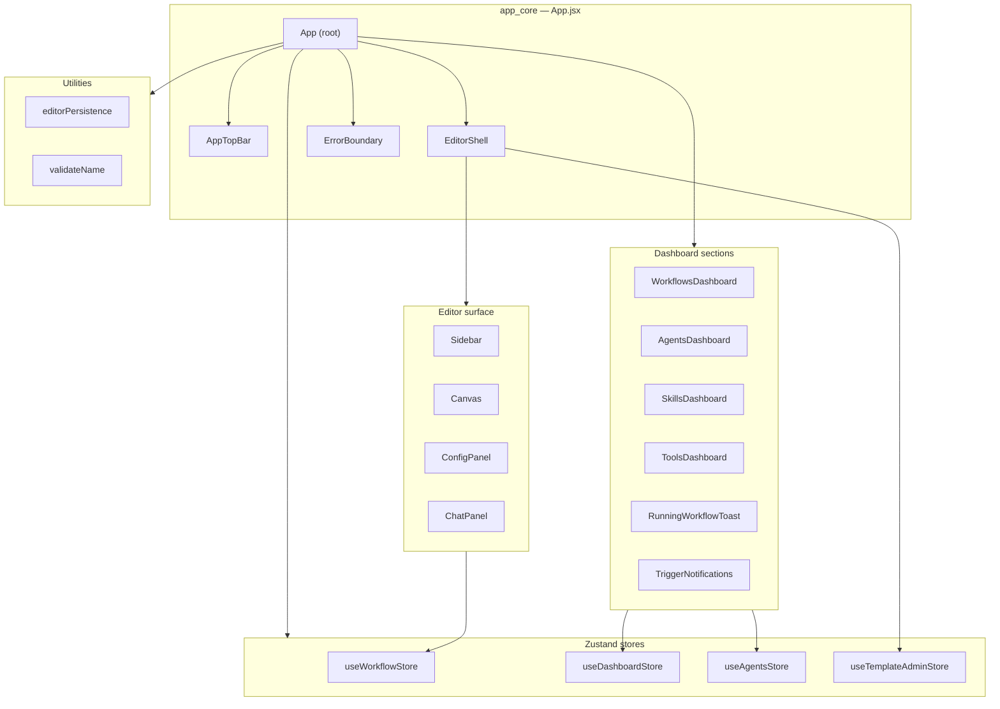
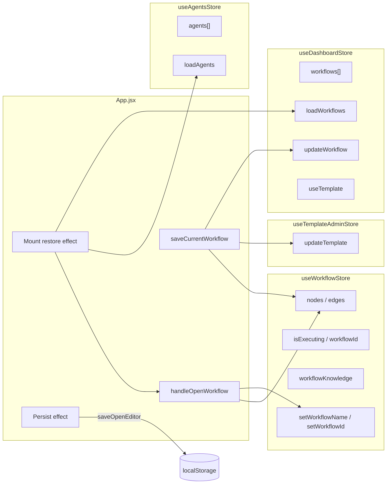
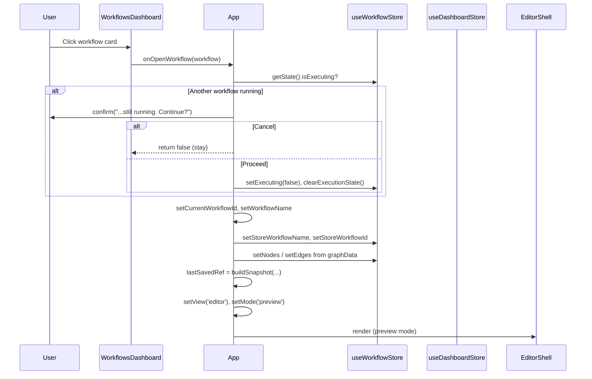
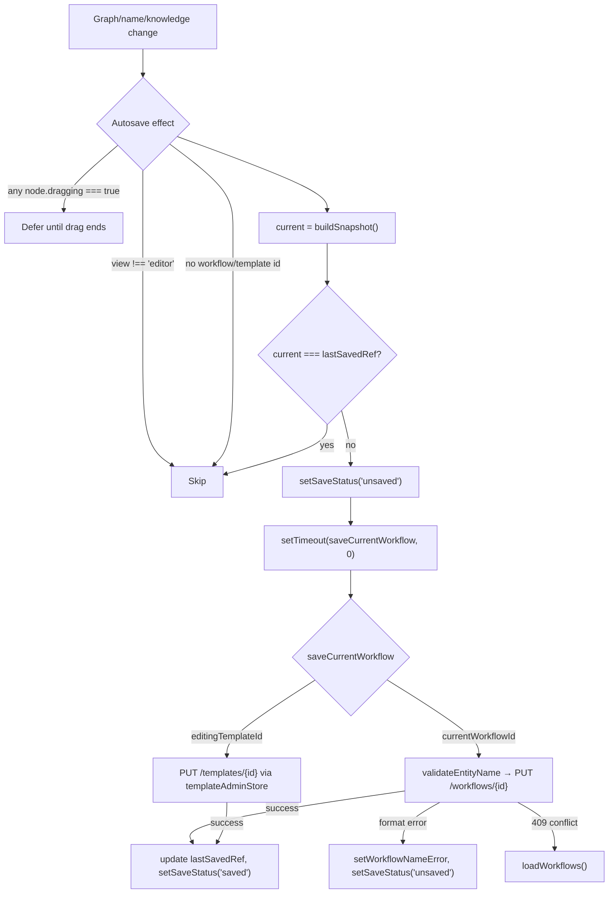
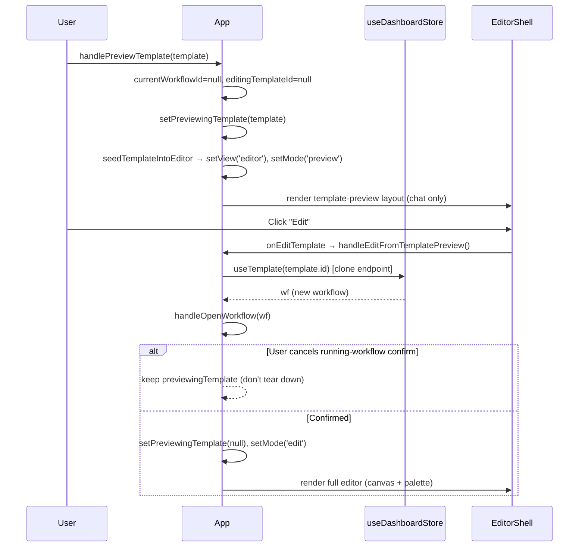
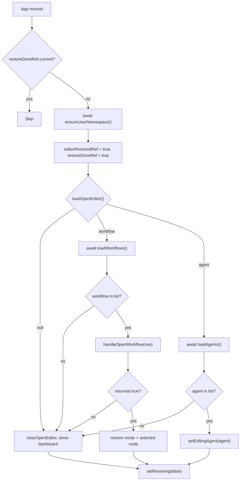
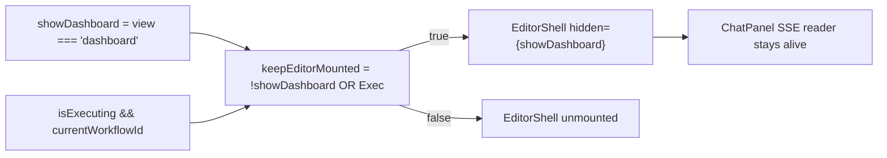
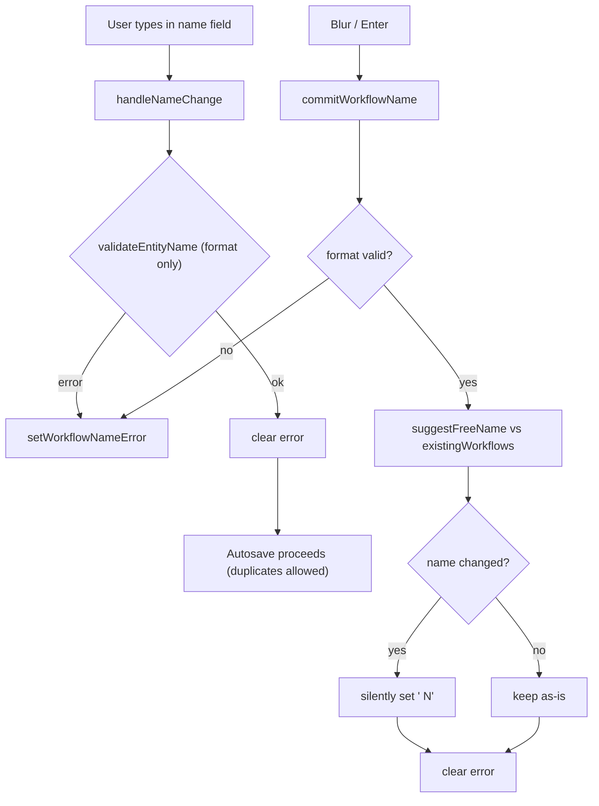
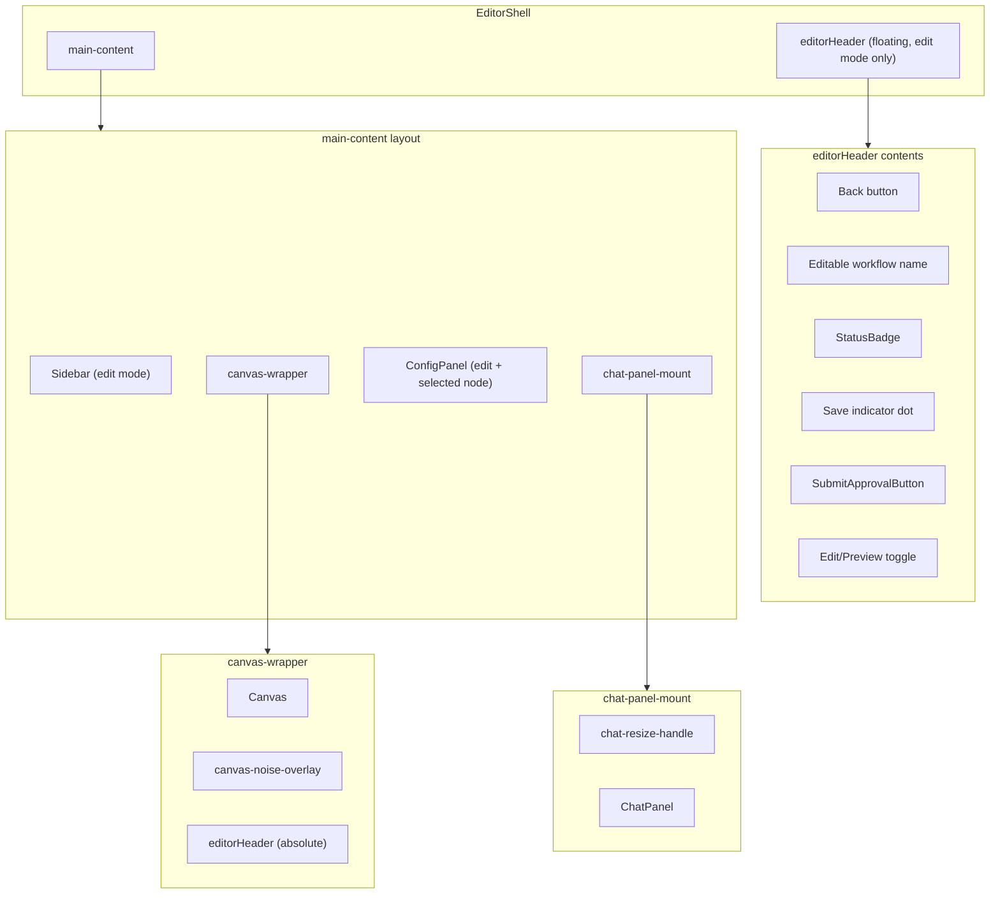

# app_core — Build Studio Frontend Root

> **File:** `ABStudio/frontend/src/App.jsx`
> **Role:** Root component and top-level orchestrator of the ABStudio "Build Studio" frontend application.

## 1. Introduction

`app_core` is the entry-point module of the ABStudio Build Studio frontend. The `App` component defined here is the single React tree root that every other Build Studio feature mounts under. It owns the **global navigation shell**, the **dashboard ↔ editor view switch**, the **autosave lifecycle** for the workflow canvas, the **template preview/clone flow**, and the **reload-restore** mechanism that reopens the editor the user had open before a page refresh.

It deliberately keeps no business data of its own — the database (via the backend API) remains the single source of truth for workflows, agents, skills, and tools. `App` coordinates *view state* and *editor identity*, delegating data fetching and mutation to dedicated Zustand stores and feature modules.

### What lives here

| Concern | Owner |
|---|---|
| Top-level view (`dashboard` / `editor`) | `App` local state |
| Dashboard section tabs (Workflows / Agents / Skills / Tools) | `App` + `AppTopBar` |
| Editor identity (which workflow / agent / template is open) | `App` local state |
| Edit ↔ Preview mode toggle | `App` local state |
| Autosave orchestration & dirty-checking | `App` (`saveCurrentWorkflow`, `buildSnapshot`) |
| Reload-restore of open editor | `App` mount effect + `editorPersistence` |
| Workflow name validation & uniqueness | `App` + `validateName` |
| Chat panel resize handle | `App` (`handleResizeMouseDown`) |
| Error containment | `ErrorBoundary` (exported as `AppErrorBoundary`) |
| Editor layout (Sidebar / Canvas / ConfigPanel / ChatPanel) | `EditorShell` |

---

## 2. Architecture Overview



The `App` component renders one of two top-level surfaces:

1. **Dashboard view** — `AppTopBar` plus the active section dashboard (`WorkflowsDashboard`, `AgentsDashboard`, `SkillsDashboard`, or `ToolsDashboard`). The `RunningWorkflowToast` floats over this view to surface in-flight workflow runs.
2. **Editor view** — `EditorShell`, which composes the workflow canvas (`Sidebar`, `Canvas`, `ConfigPanel`, `ChatPanel`) or the full-screen `AgentEditor`.

A critical design choice: while a workflow is executing, the `EditorShell` is kept **mounted but hidden** (`display: none`) even when the user navigates back to the dashboard. This keeps `ChatPanel`'s SSE reader and abort controller alive so the in-flight stream continues populating the store. See [§6.3](#63-keep-editor-mounted-during-execution).

---

## 3. Component Reference

### 3.1 `App` (default export)

The root component. Holds all top-level UI state and wires the stores to the view.

**Key state:**

| State | Type | Purpose |
|---|---|---|
| `view` | `'dashboard' \| 'editor'` | Which top-level surface is visible |
| `section` | `'workflows' \| 'agents' \| 'skills' \| 'tools'` | Active dashboard tab (persisted to `localStorage`) |
| `mode` | `'edit' \| 'preview'` | Editor mode — canvas+palette vs. chat-focused |
| `currentWorkflowId` | `string \| null` | DB id of the workflow open in the editor |
| `editingTemplateId` | `string \| null` | DB id when editing a *template* (autosave routes to `/templates/{id}`) |
| `previewingTemplate` | `object \| null` | Template in chat-only preview mode (no clone/persist) |
| `workflowName` / `workflowNameError` | `string` / `string \| null` | Live name + inline validation error |
| `editingAgent` / `agentEditorMode` | `object \| null` / `string` | Agent open in the full-screen `AgentEditor` |
| `saveStatus` | `'saved' \| 'saving' \| 'unsaved'` | Autosave indicator state |
| `restoring` | `boolean` | True during the one-shot reload-restore (suppresses dashboard flash) |
| `chatWidth` | `number` | Resizable chat panel width (px) |

**Refs (non-rendering):**

- `lastSavedRef` — canonical autosave snapshot string; the dirty-check baseline.
- `workflowUpdatedAtRef` — optimistic-concurrency token sent as `expected_updated_at` on PUT.
- `initialWorkflowNameRef` — name as loaded, so the uniqueness check ignores the self-row.
- `editorRestoredRef` / `restoreDoneRef` — guards for the one-shot mount restore (StrictMode-safe).
- `isResizing` / `startX` / `startWidth` — chat panel drag-resize tracking.

### 3.2 `AppTopBar`

A presentational header with the "Build Studio" wordmark, four tab buttons (`NAV_ITEMS`: Workflows, Agents, Skills, Tools), and a `TriggerNotifications` bell anchored to the right edge. It receives `section` and `onSectionChange` as props and is purely controlled.

> See [triggers_feature.md](triggers_feature.md) for `TriggerNotifications`.

### 3.3 `EditorShell`

Extracted as a separate component so it can be rendered **side-by-side** with the dashboard (hidden via `display: none`) while a workflow run is in flight. This is what keeps `ChatPanel`'s SSE reader alive across dashboard ↔ editor navigation.

Renders three layouts depending on context:

- **Template chat-preview** (`isTemplatePreview`) — a solid top bar + full-width `ChatPanel` only (no canvas/palette). Autosave is inert.
- **Edit mode** — `Sidebar` + `Canvas` (with floating `editorHeader`) + `ConfigPanel` (when a node is selected) + `ChatPanel` (hidden via CSS class).
- **Preview mode** — `Canvas` + `ChatPanel` (visible, resizable). `Sidebar` and `ConfigPanel` are unmounted.

The `editorHeader` is absolutely positioned over the canvas and contains: back button, editable workflow name, `StatusBadge` (governance), save indicator dot, `SubmitApprovalButton`, and the Edit/Preview toggle.

> See [governance_feature.md](../sdlc/governance_feature.md) for `StatusBadge` and `SubmitApprovalButton`.

### 3.4 `ErrorBoundary` (exported as `AppErrorBoundary`)

A class-based React error boundary that catches render errors anywhere in the tree and displays a fallback "Something went wrong" screen with a "Try Again" button that resets the error state. Used to wrap the application so a single component crash doesn't blank the entire UI.

### 3.5 Helper Functions

| Function | Scope | Responsibility |
|---|---|---|
| `loadStoredSection()` | Module | Reads the last active dashboard tab from `localStorage` (`abstudio.activeSection`); falls back to `'workflows'`. |
| `sanitizeNodesForPersist(ns)` | Module | Strips React Flow runtime fields (`measured`, `width`, `height`, `dragging`, `selected`, etc.) from nodes before persisting, so a canvas mount doesn't look like a user edit. |
| `buildSnapshot(name, nodes, edges, knowledge)` | Module | Single source of truth for the autosave snapshot JSON string. Every dirty-check and `lastSavedRef` seed goes through this. |
| `handleNameChange` | `App` | Live name update; surfaces only *format* errors (not duplicates). |
| `handleNameBlur` / `handleNameKeyDown` | `App` | Commit the name on blur/Enter; auto-resolves duplicates to `"<name> N"`. |
| `handleOpenWorkflow(workflow)` | `App` | Opens a workflow in the editor; guards against interrupting a running workflow. Returns `boolean` (false = user cancelled). |
| `handleOpenTemplate(template)` | `App` | Opens a template in template-save edit mode (autosave → `/templates/{id}`). |
| `handlePreviewTemplate(template)` | `App` | Opens a template as a chat-only preview (no clone/persist). |
| `handleEditFromTemplatePreview()` | `App` | Promotes a template preview into a real editable workflow via `useTemplate` (clone endpoint). |
| `handleBackToDashboard()` | `App` | Saves current workflow, preserves editor identity if a run is in flight, otherwise resets editor state. |
| `handleResizeMouseDown(e)` | `App` | Initiates the chat panel drag-resize; attaches window mousemove/mouseup listeners. |
| `handleBeforeUnload` | `App` (effect) | Flushes `saveCurrentWorkflow` on tab close. |

---

## 4. State Management & Dependencies

`App` is the convergence point for four Zustand stores. It reads graph/execution state from `useWorkflowStore`, dashboard lists from `useDashboardStore` and `useAgentsStore`, and (optionally) template mutations from `useTemplateAdminStore`.



### Store responsibilities

| Store | Owned by | Used in `App` for |
|---|---|---|
| `useWorkflowStore` | [store.md](../storage/store.md) | Canvas graph (`nodes`, `edges`), execution state (`isExecuting`, `workflowId`), knowledge config, name/id setters |
| `useDashboardStore` | [store.md](../storage/store.md) | Workflow list, `updateWorkflow`, `loadWorkflows`, `useTemplate` (clone) |
| `useAgentsStore` | [store.md](../storage/store.md) | Agent list, `loadAgents` |
| `useTemplateAdminStore` | [store.md](../storage/store.md) | `updateTemplate` (optional template editor; safe to remove) |

### Utility dependencies

| Utility | File | Purpose |
|---|---|---|
| `editorPersistence` | [utils.md](utils.md) | `localStorage`-backed UI view-state: open-editor pointer, active thread, composer draft, selected node. Namespaced by user id. |
| `validateName` | [utils.md](utils.md) | `validateEntityName` (format + uniqueness) and `suggestFreeName` (auto-resolve duplicates). Mirrors backend rules in `workflow_repo.py`. |
| `KnowledgeSection` (`KB_MODE_NONE`) | [common_components.md](../ui/common_components.md) | Canonical default knowledge config constant. |

---

## 5. Data Flow

### 5.1 Dashboard → Editor transition



The `handleOpenWorkflow` function returns a **boolean** that callers must honour. A `false` return means the user declined the "another run is in flight" confirmation — several callers chain follow-up navigation (e.g., flipping to edit mode) that would otherwise still execute after a cancel.

### 5.2 Autosave lifecycle



**Key design decisions:**

- **Immediate, not debounced.** Previously a 1.5s debounce created a window where clicking *Run* right after changing the model picker would snapshot the *old* `modelName`. Now `setTimeout(..., 0)` lets React commit the state update first so the snapshot is post-change, while `clearTimeout` still coalesces rapid edits into a single PUT.
- **Drag suppression.** ReactFlow tags nodes with `dragging: true` during moves and fires position changes every animation frame. The effect skips while any node is dragging and re-runs once dragging flips back to `false`, collapsing the burst into one PUT.
- **Snapshot canonicalization.** `buildSnapshot` + `sanitizeNodesForPersist` is the single source of truth. Every `lastSavedRef` seed and dirty-check goes through it, so key order and node sanitization never drift (drift re-introduces the spurious open-time save that demoted templates from Live to Submit-for-Approval).
- **Optimistic concurrency.** `expected_updated_at` is sent on PUT; a `409` triggers a `loadWorkflows()` refresh.

### 5.3 Template preview → edit (clone)



The `previewingTemplate` flag is cleared **only after** `handleOpenWorkflow` confirms the switch. Clearing it up-front used to tear down the chat-only preview shell before the confirm was answered, leaving the user on the full editor after a cancel.

---

## 6. Key Process Flows

### 6.1 Reload-restore (one-shot mount effect)

On first mount, `App` reopens the editor the user had open before a reload. The stored pointer is just `{kind, id, mode}`; the DB is re-fetched and the id re-validated so a deleted entity falls back to the dashboard.



**StrictMode safety:** `restoreDoneRef` is keyed on *completion*, not merely *start*. React StrictMode mounts → unmounts → remounts in dev, cancelling the first run's async work; keying the guard on completion lets the remount retry instead of skipping restore entirely.

**No-flash loading:** `restoring` is initialized to `hasStoredOpenEditor()` (a synchronous, namespace-agnostic localStorage scan). Only when a stored pointer exists does the app show a neutral spinner instead of flashing the dashboard first.

> See [utils.md](utils.md) for the `editorPersistence` API (`ensureUserNamespace`, `loadOpenEditor`, `saveOpenEditor`, `loadSelectedNode`, etc.).

### 6.2 Persist effect (open-editor pointer)

A separate effect writes the open-editor pointer to `localStorage` whenever the editor identity changes — but only *after* the mount restore has completed (`editorRestoredRef`), so hydration doesn't clobber the stored pointer with transient dashboard state.

```
view === 'editor' && currentWorkflowId && !editingTemplateId
  → saveOpenEditor({ kind: 'workflow', id, mode })
editingAgent?.id
  → saveOpenEditor({ kind: 'agent', id, mode: agentEditorMode })
otherwise
  → clearOpenEditor()
```

Only DB-addressable editors are stored. Template-edit and scratch (unsaved) sessions have ids that aren't in the dashboard list, so the pointer is cleared rather than storing an un-restorable one.

### 6.3 Keep editor mounted during execution



When the user navigates to the dashboard while a workflow is running, `EditorShell` is rendered with `hidden={true}` (`display: none`) rather than unmounted. This is essential because `ChatPanel`'s unmount-time effect calls `abortRef.current.abort()`, which would silently kill the SSE stream. The `RunningWorkflowToast` on the dashboard provides an "Open" button that routes back into the editor's preview pane.

> See [workflow_editor.md](../workflows/workflow_editor.md) for `ChatPanel`'s SSE handling and abort controller.

### 6.4 Name validation & uniqueness



Uniqueness is scoped to **workflows only** — a workflow may share a name with an agent. The subflow picker disambiguates by kind+id, so there's no ambiguity to guard against. Duplicates are never *blocked*; they're auto-resolved to a free `"<name> N"` on commit. Only *format* errors (empty, charset, length, digits-only) block autosave.

> See [utils.md](utils.md) for `validateEntityName` and `suggestFreeName`. These mirror the backend rules in `ABStudio/backend/app/core/workflow_repo.py::_validate_name_format`.

---

## 7. Editor Layout (EditorShell)



**Mode-dependent rendering:**

| Element | Edit mode | Preview mode | Template preview |
|---|---|---|---|
| `Sidebar` | ✅ | ❌ | ❌ |
| `Canvas` | ✅ | ✅ | ❌ |
| `ConfigPanel` | ✅ (if node selected) | ❌ | ❌ |
| `ChatPanel` | Hidden (CSS) | Visible (resizable) | Full-width |
| `editorHeader` | Floating over canvas | Floating over canvas | Solid top bar |
| Autosave | Active (workflow or template) | Active | Inert |

The `ChatPanel` is **always mounted** across edit/preview swaps (only hidden via CSS in edit mode) so the SSE reader and streaming state survive when the user clicks a node mid-run.

> See [workflow_editor.md](../workflows/workflow_editor.md) for `Sidebar`, `Canvas`, `ConfigPanel`, and `ChatPanel` internals.

---

## 8. Chat Panel Resize

The chat panel width is user-adjustable via a drag handle on its left edge. Constants enforce usable bounds:

| Constant | Value | Rationale |
|---|---|---|
| `CHAT_WIDTH_DEFAULT` | 480 px | Default width |
| `CHAT_WIDTH_MIN` | 340 px | Keeps chat usable |
| `CHAT_WIDTH_MAX` | 720 px | Prevents crowding the canvas |

`handleResizeMouseDown` attaches `mousemove`/`mouseup` listeners to `window`, computes the delta (inverted because the handle is on the left edge), clamps to `[MIN, MAX]`, and cleans up on mouse up (restoring cursor and user-select).

---

## 9. Governance Integration

The editor header integrates two governance components when a saved workflow is open:

- **`StatusBadge`** — displays the workflow's governance status (e.g., "Awaiting Approval") beside the name.
- **`SubmitApprovalButton`** — renders only when (re)submission is warranted, allowing the user to submit the workflow to their department manager for approval.

Both are conditionally rendered only when `currentWorkflowId && workflowName` are set (not for templates or scratch sessions).

> See [governance_feature.md](../sdlc/governance_feature.md) for details. The backend governance client lives in `ABStudio/backend/app/core/governance_client.py`.

---

## 10. Relationship to Other Modules

```mermaid
flowchart TB
  app_core["app_core (this module)"]

  app_core -->|renders| workflows_feature["workflows_feature<br/>WorkflowsDashboard, RunningWorkflowToast"]
  app_core -->|renders| agents_feature["agents_feature<br/>AgentsDashboard, AgentEditor"]
  app_core -->|renders| skills_feature["skills_feature<br/>SkillsDashboard"]
  app_core -->|renders| tools_feature["tools_feature<br/>ToolsDashboard"]
  app_core -->|renders| triggers_feature["triggers_feature<br/>TriggerNotifications"]
  app_core -->|renders| governance_feature["governance_feature<br/>StatusBadge, SubmitApprovalButton"]
  app_core -->|renders| workflow_editor["workflow_editor<br/>Sidebar, Canvas, ConfigPanel, ChatPanel"]
  app_core -->|reads/writes| store["store<br/>workflowStore, dashboardStore, agentsStore, templateAdminStore"]
  app_core -->|uses| utils["utils<br/>editorPersistence, validateName"]
  app_core -->|uses| common["common_components<br/>KnowledgeSection (KB_MODE_NONE)"]
  app_core -->|API via stores| backend["abstudio_backend<br/>/workflows, /templates, /agents endpoints"]
```



| Module | Relationship |
|---|---|
| [workflows_feature.md](../workflows/workflows_feature.md) | `WorkflowsDashboard` and `RunningWorkflowToast` are rendered in the dashboard view. `App` passes `onOpenWorkflow`, `onOpenTemplate`, `onPreviewTemplate` callbacks. |
| [agents_feature.md](../agents/agents_feature.md) | `AgentsDashboard` is rendered in the agents section. `AgentEditor` takes over the full screen when `editingAgent` is set. |
| [skills_feature.md](../agents/skills_feature.md) | `SkillsDashboard` is rendered in the skills section (no callbacks needed — self-contained). |
| [tools_feature.md](tools_feature.md) | `ToolsDashboard` is rendered in the tools section (self-contained). |
| [workflow_editor.md](../workflows/workflow_editor.md) | `Sidebar`, `Canvas`, `ConfigPanel`, `ChatPanel` compose the editor surface inside `EditorShell`. |
| [triggers_feature.md](triggers_feature.md) | `TriggerNotifications` bell lives in `AppTopBar` (dashboard + agent editor surfaces; intentionally absent from the workflow editor where `ChatPanel` surfaces triggered runs inline). |
| [governance_feature.md](../sdlc/governance_feature.md) | `StatusBadge` and `SubmitApprovalButton` render in the editor header. |
| [store.md](../storage/store.md) | All four Zustand stores consumed by `App`. |
| [utils.md](utils.md) | `editorPersistence` (localStorage view-state) and `validateName` (name validation). |
| [common_components.md](../ui/common_components.md) | `KnowledgeSection` provides `KB_MODE_NONE`, the canonical default knowledge config. |
| [abstudio_backend.md](../ui/abstudio_backend.md) | Backend API endpoints consumed via stores: `/workflows`, `/workflows/{id}`, `/templates/{id}`, `/templates/{id}/use`, `/agents`, `/auth/me`. |

---

## 11. Constants & Configuration

| Constant | Value | Purpose |
|---|---|---|
| `SECTION_STORAGE_KEY` | `'abstudio.activeSection'` | localStorage key for the active dashboard tab |
| `VALID_SECTIONS` | `['workflows', 'agents', 'skills', 'tools']` | Whitelist for the stored section |
| `CHAT_WIDTH_DEFAULT` | `480` | Default chat panel width (px) |
| `CHAT_WIDTH_MIN` | `340` | Minimum chat panel width (px) |
| `CHAT_WIDTH_MAX` | `720` | Maximum chat panel width (px) |
| `NAV_ITEMS` | 4 items | Navigation tab definitions (id, label, icon SVG) |

---

## 12. Exports

| Export | Type | Description |
|---|---|---|
| `App` (default) | React component | Root component — mount this to render the entire Build Studio frontend. |
| `AppErrorBoundary` | React component (class) | `ErrorBoundary` — wrap the app tree to catch render errors. |

---

## 13. Design Principles

1. **DB is the source of truth; localStorage is for view-state only.** `editorPersistence` stores *which* editor is open, *which* chat thread is active, and *unsent* composer drafts — never workflow/agent data itself.

2. **One snapshot shape.** `buildSnapshot` + `sanitizeNodesForPersist` is the single canonical autosave snapshot. All dirty-checks and `lastSavedRef` seeds go through it to prevent drift that causes spurious saves.

3. **Never block on duplicates.** Name uniqueness is auto-resolved to `"<name> N"` on commit. Only format errors block autosave. This keeps the user flowing without modal interruptions.

4. **Keep the SSE reader alive.** The editor stays mounted (hidden) during execution so `ChatPanel`'s abort controller and stream reader survive dashboard navigation. Unmounting would silently kill the run.

5. **Honour the boolean contract.** `handleOpenWorkflow` returns `false` when the user cancels the running-workflow confirmation. Callers must check this before chaining navigation.

6. **StrictMode-safe restore.** The one-shot mount restore is guarded by a *completion*-keyed ref, not a *start*-keyed one, so React StrictMode's double-invoke in dev retries instead of skipping.
