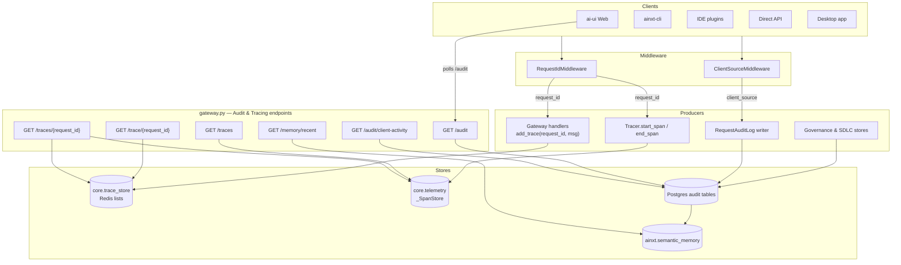
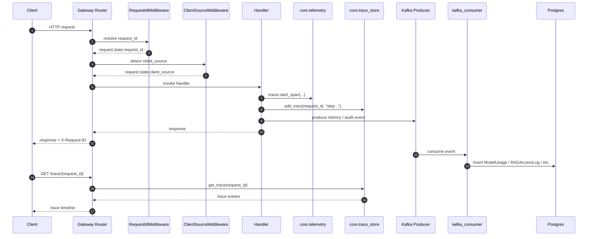
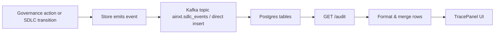
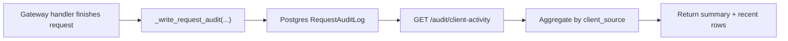

# Audit and Tracing Module

## Brief Introduction

The **Audit and Tracing** module is the observability backbone of the AiNxt gateway. It exposes a set of REST endpoints that let operators, admins, and clients inspect the lifecycle of a request, retrieve distributed execution traces, and audit governance and SDLC state transitions. The module is intentionally non-intrusive: it reads from stores that are populated by middleware and downstream components during normal request processing, so tracing and audit data are collected without blocking the critical path.

Core responsibilities:

- **Request tracing** — correlate every gateway request with a stable `request_id`, surface a human-readable timeline of trace events, and expose OpenTelemetry-style spans.
- **Operational audit** — return immutable governance and SDLC transition logs for compliance review and debugging.
- **Client activity audit** — break down usage by client surface (web, CLI, IDE, API, desktop) with request counts, unique users, latency, and cost.
- **Memory introspection** — let CLI users see the most recently accessed semantic memories.

This module lives inside `gateway.py` and delegates all persistence to dedicated subsystems. See [gateway.md](../models/gateway.md) for the broader gateway architecture and [core_telemetry.md](../core_telemetry.md) for the underlying tracing implementation.

---

## Core Components

| Component | File | Responsibility |
|-----------|------|----------------|
| `trace` | `gateway.py` | `GET /trace/{request_id}` — returns the Redis-backed trace log for a single request. |
| `list_traces` | `gateway.py` | `GET /traces` — lists recent telemetry spans held in the in-memory span store. |
| `get_request_trace` | `gateway.py` | `GET /traces/{request_id}` — returns both spans and the Redis trace log for a request. |
| `get_audit_log` | `gateway.py` | `GET /audit` — returns the last 200 governance and SDLC audit events as formatted log lines. |
| `get_client_activity` | `gateway.py` | `GET /audit/client-activity` — per-client usage summary and recent request details. |
| `memory_recent` | `gateway.py` | `GET /memory/recent` — recently accessed semantic memory rows. |

These endpoints are thin read layers. The actual data is produced by:

- `RequestIdMiddleware` — mints and propagates `request_id`.
- `ClientSourceMiddleware` — classifies the caller surface.
- `core.trace_store` — Redis list storage for per-request trace messages.
- `core.telemetry` — in-memory span store and OTLP tracer.
- `db.models.RequestAuditLog`, `GovernanceEvent`, `SDLCRunEvent` — immutable audit tables.
- `workers.kafka_consumer` — async bulk writer for metrics, audit, chat, and SDLC events.

---

## Architecture



### Component Interaction



---

## Data Flows

### 1. Recording and Retrieving a Request Trace

Every request that enters the gateway is tagged with a `request_id` by `RequestIdMiddleware`. Downstream code can append human-readable trace messages via `core.trace_store.add_trace(request_id, message)`, which pushes a timestamped JSON entry onto a Redis list keyed by `trace:{request_id}` with a 24-hour TTL.

```mermaid
flowchart LR
    A[Request enters gateway] --> B[RequestIdMiddleware mints request_id]
    B --> C[Handler executes]
    C --> D["add_trace(request_id, msg)"]
    D --> E[Redis RPUSH trace:{request_id}]
    E --> F[Redis EXPIRE 24h]
    C --> G[Response returned]
    G --> H[Client calls GET /trace/{request_id}]
    H --> I[core.trace_store.get_trace]
    I --> J[Redis LRANGE trace:{request_id}]
    J --> K[Return ordered trace entries]
```

The `trace` endpoint simply returns:

```json
{
  "request_id": "<uuid>",
  "trace": [
    {"timestamp": "2026-01-15T09:23:01.123456", "message": "Routing query..."},
    {"timestamp": "2026-01-15T09:23:01.234567", "message": "Model call started"}
  ]
}
```

### 2. Telemetry Spans

`core.telemetry.Tracer` creates spans either as real OpenTelemetry spans (when `OTLP_ENDPOINT` is configured) or as plain dictionaries stored in `_SpanStore`. The in-memory store is bounded to the last 1,000 spans and is keyed by `request_id`.

- `list_traces(limit=50)` returns the most recent spans.
- `get_request_trace(request_id)` returns both the in-memory spans for that request and the Redis trace log.

See [core_telemetry.md](../core_telemetry.md) for the full span lifecycle, OTLP propagation, and Prometheus metric integration.

### 3. Audit Log

`get_audit_log` reads two immutable Postgres tables:

- `GovernanceEvent` — lifecycle transitions for agents, skills, MCP tools, and workflows (submit, approve, reject, promote, deprecate).
- `SDLCRunEvent` — every state transition in an SDLC run.

The endpoint formats the rows as log lines, merges them, and returns the most recent 200 entries. This is consumed by the `TracePanel` component in `ai-ui`.



### 4. Client Activity Audit

`get_client_activity(days=7)` queries `RequestAuditLog` to produce:

- A per-client summary: request count, unique users, average latency, total cost.
- The 50 most recent requests with metadata such as email, department, endpoint, model, cache hit, compliance block, and error.

`RequestAuditLog` rows are written fire-and-forget by gateway handlers (for example, after an `/ask` turn) and are also consumed asynchronously from Kafka by `workers.kafka_consumer`.



### 5. Recent Semantic Memory

`memory_recent(limit=10)` queries the `ainxt.semantic_memory` table and returns the most recently used L3 memory entries. This endpoint is primarily used by the CLI `/memory` command so users can see what contextual facts the platform has learned about them.

---

## How It Fits into the Overall System

The Audit and Tracing module is a **read-only observability surface** that sits on top of data produced by nearly every other subsystem:

- **Chat and agent execution** produce `RequestAuditLog` rows, trace messages, and telemetry spans.
- **Governance** emits `GovernanceEvent` records for entity lifecycle transitions.
- **SDLC pipeline** emits `SDLCRunEvent` records for every run state change.
- **Middleware** supplies the cross-cutting `request_id` and `client_source` dimensions.
- **Kafka consumer workers** durably persist events that are produced asynchronously.
- **Frontend** surfaces the audit log in `TracePanel.jsx` and can link to individual traces.

Because the module only reads, it is resilient: failures in trace storage or audit persistence do not fail user requests. The design follows the principle of "instrument once, read many ways" — the same `request_id` ties together Redis traces, in-memory spans, Postgres audit rows, and Kafka event streams.

### Related Modules

- [gateway.md](../models/gateway.md) — overall gateway routing, middleware registration, and handler organization.
- [core_telemetry.md](../core_telemetry.md) — `Tracer`, `_SpanStore`, OTLP export, and Prometheus metrics.
- [core_trace_store.md](../core_trace_store.md) — Redis-backed trace list storage (`add_trace`, `get_trace`, `delete_trace`).
- [middleware.md](middleware.md) — `RequestIdMiddleware` and `ClientSourceMiddleware`.
- [db_models.md](../db_models.md) — `RequestAuditLog`, `GovernanceEvent`, `SDLCRunEvent`, and `ModelUsage`.
- [workers_kafka_consumer.md](../workers_kafka_consumer.md) — async persistence of audit, metrics, chat, and SDLC events.
- [ai_ui_frontend_trace_panel.md](../ai_ui_frontend_trace_panel.md) — UI component that polls `/audit`.

---

## API Reference

| Method | Path | Auth | Description |
|--------|------|------|-------------|
| GET | `/ainxt/v1/trace/{request_id}` | — | Redis trace log for a request. |
| GET | `/ainxt/v1/traces` | — | Recent telemetry spans. |
| GET | `/ainxt/v1/traces/{request_id}` | — | Spans + trace for a request. |
| GET | `/ainxt/v1/audit` | — | Governance + SDLC audit log lines. |
| GET | `/ainxt/v1/audit/client-activity` | Required | Per-client usage summary and recent requests. |
| GET | `/memory/recent` | Required | Recently accessed semantic memories. |

> Note: Exact path prefixes depend on the gateway router configuration. The examples above reflect the typical `/ainxt/v1` mount used by the platform UI.

---

## Operational Notes

- **Trace TTL**: Redis trace lists expire after 24 hours. For long-term retention, rely on Postgres audit tables and Kafka-persisted metrics.
- **Span store limit**: The in-memory fallback span store keeps only the last 1,000 spans. In production, configure `OTLP_ENDPOINT` to export spans to Tempo/Jaeger.
- **Audit immutability**: `GovernanceEvent`, `SDLCRunEvent`, and `RequestAuditLog` rows are append-only. This supports compliance and non-repudiation requirements.
- **Failure isolation**: All audit writes are fire-and-forget or asynchronous. A failure in tracing or audit persistence never blocks the user response.
