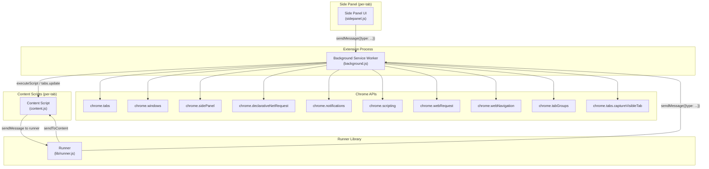
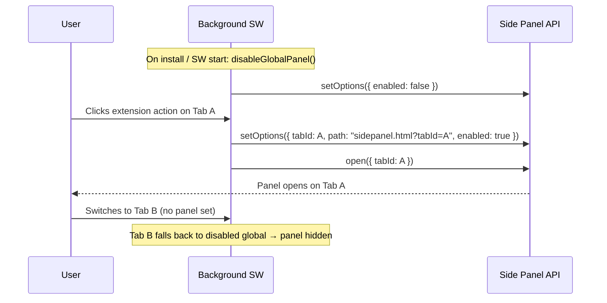
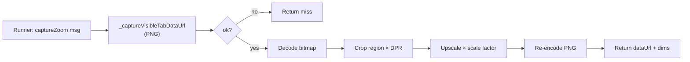
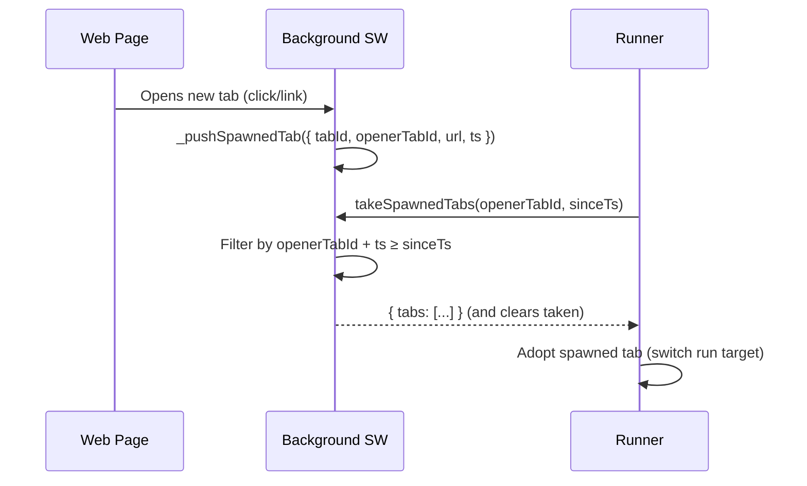
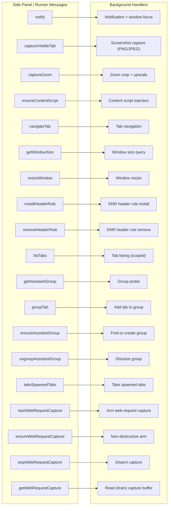
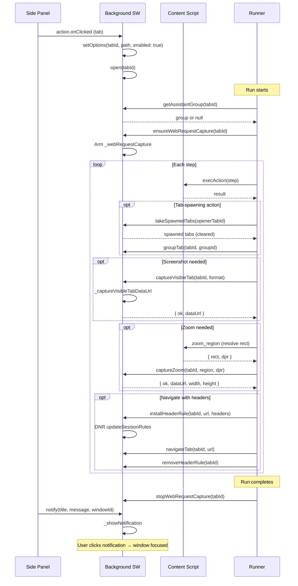

# Browser Automation Extension — Background Service Worker

## Overview

The **background service worker** (`background.js`) is the privileged backbone of the browser automation extension. It runs as a Manifest V3 service worker and acts as a central message router and API proxy for the extension's side panel UI and content scripts. Because MV3 service workers have access to Chrome APIs that extension pages and content scripts cannot call directly—`chrome.tabs.captureVisibleTab`, `chrome.declarativeNetRequest`, `chrome.notifications`, `chrome.tabGroups`, `chrome.scripting`, `chrome.webRequest`, and `chrome.windows`—the background worker is the sole gateway for screenshots, network-level header injection, tab-group scoping, desktop notifications, and cross-origin frame injection.

The side panel ([browser_automation_extension_sidepanel](../browser_automation_extension_sidepanel.md)) and the runner ([browser_automation_extension_runner](../browser_automation_extension_runner.md)) communicate with the background exclusively through `chrome.runtime.sendMessage` calls, each carrying a `type` discriminator. The background worker handles each message type asynchronously and returns a structured `{ ok, ... }` response.

---

## Architecture

### Component Relationships

The background worker is consumed by two primary callers:

| Caller | Module | How it calls the background |
|---|---|---|
| **Side Panel** | [browser_automation_extension_sidepanel](../browser_automation_extension_sidepanel.md) | `chrome.runtime.sendMessage` for notifications, screenshot capture, tab listing, and group management |
| **Runner** | [browser_automation_extension_runner](../browser_automation_extension_runner.md) | `chrome.runtime.sendMessage` for screenshot/zoom capture, header rules, tab navigation, window resize, web-request capture, spawned-tab tracking, content-script injection, and tab-group operations |

The background never calls into the side panel or runner directly—it only responds to messages and fires event listeners (`onClicked`, `onRemoved`, `onCreated`, `onCreatedNavigationTarget`, `webRequest` events, `notifications.onClicked`).

---

## Core Components

### Side Panel Lifecycle Management

#### `disableGlobalPanel()`

Disables the global (window-level) side panel so it never leaks onto tabs the user never opened it on. This is the foundation of the per-tab panel model:

1. On extension install and every service-worker start, `chrome.sidePanel.setOptions({ enabled: false })` is called.
2. When the user clicks the extension action on a specific tab, a **tab-specific** panel document (`sidepanel.html?tabId=<id>`) is enabled for that tab only.
3. Switching to a tab without a tab-specific panel falls back to the disabled global, hiding the panel; switching back to an opened tab shows it again.

### Screenshot Capture

#### `_captureVisibleTabDataUrl(tabId, { format })`

The only function in the extension that calls `chrome.tabs.captureVisibleTab`. It enforces a critical safety invariant: **only the run's own tab is captured, and only when it is actually visible (active)**. A backgrounded run receives a clean `{ ok: false, reason: "not_visible" }` miss rather than another tab's screenshot.

- **PNG mode** (default): Full-resolution capture for zoom crops, upload artifacts, and pixel-diff assertions.
- **JPEG mode** (LLM-bound): Quality 65, downscaled to a maximum of 1440 device pixels wide via `OffscreenCanvas`. This prevents multi-MB retina PNGs from being shipped to vision models every turn.

The function also powers the **zoom/crop** message handler (`captureZoom`), which crops a small viewport region (resolved by the content script into a CSS-pixel rect + DPR) and optionally upscales it for close inspection of icons or dense table cells.

### Web Request Capture

#### `_wrShouldIgnore(details)` / `_wrPush(tabId, entry)`

A per-tab network-error buffer that records browser-level failures invisible to in-page `fetch`/console wrappers: CORS rejections, X-Frame-Options blocks, DNS failures, and HTTP 4xx/5xx responses.

- **`_wrShouldIgnore`**: Filters out browser-internal URLs (`chrome://`, `chrome-extension://`, `devtools://`, `about:`) and invalid tab IDs.
- **`_wrPush`**: Appends to a capped buffer (max 50 entries per tab) attached to a `_webRequestCapture` Map. Only active when a slot's `capturing` flag is `true`.

Two `chrome.webRequest` listeners feed the buffer:
- `onErrorOccurred` → records network-level errors (e.g., `net::ERR_FAILED`).
- `onCompleted` → records HTTP responses with status ≥ 400.

The runner arms/disarms capture via `startWebRequestCapture`, `ensureWebRequestCapture` (non-destructive), `stopWebRequestCapture`, and reads (with optional drain) via `getWebRequestCapture`. The agent's `read_network_requests` action merges this buffer with the content script's in-page fetch wrapper buffer for a complete network picture.

### Spawned Tab Tracking

#### `_pushSpawnedTab(entry)`

An in-memory ring buffer (`_spawnedTabs`, max 20 entries, 30-second TTL) that tracks which tabs a page opened and from which opener. This feeds the runner's **auto-follow** mechanism: after a click-like step that might open a new tab, the runner calls `takeSpawnedTabs` (a take-and-clear operation) to discover and adopt any spawned tabs.

Two listeners cover different spawn paths:
- `chrome.webNavigation.onCreatedNavigationTarget` → catches `target=_blank` and `window.open(url)`.
- `chrome.tabs.onCreated` → catches `window.open('')`/`about:blank` popups that the navigation listener misses.

Deduplication by `tabId` ensures both listeners firing for the same spawn don't create duplicate entries; the best URL is kept.

### Tab Group Management

#### `isAssistantGroupTitle(title)`

A case-insensitive comparator for the string `"assistant"`. A run whose tab sits inside a tab group with this title is **scoped** to that group—the agent can only see and act on grouped tabs. Membership is always queried live from the browser (never cached), so the tab bar remains the single source of truth.

The background provides a full lifecycle of group operations via message handlers:

| Message Type | Purpose |
|---|---|
| `getAssistantGroup` | Probe whether a tab is inside an "Assistant" group; returns group info or `null` |
| `ensureAssistantGroup` | Find-or-create the window's "Assistant" group and add the tab to it (reuses existing group to avoid duplicates) |
| `groupTab` | Add a specific tab to an existing group (keeps agent-opened tabs in scope) |
| `ungroupAssistantGroup` | Session-end cleanup: dissolve the group (tabs stay open, just leave scope) |
| `listTabs` | With `groupId`, lists only that group's members |

### Notifications

#### `_showNotification({ title, message, windowId })`

Creates a Chrome desktop notification (basic type, priority 1) and remembers the originating window ID. When the user clicks the notification, the background re-focuses that window via `chrome.windows.update({ focused: true, drawAttention: true })`.

The side panel calls this via the `notify` message type when a backgrounded run completes, errors, or hits an approval gate. The side panel's `notifyBackgroundRun` helper suppresses the notification when the panel is already focused.

### Header Rule Management

The background manages per-tab `declarativeNetRequest` session rules for custom HTTP headers on navigation (REQ-15). Rules are:

- **Scoped** to one exact URL + tab ID (using `|url|` anchor filters) so headers can't leak onto unrelated same-origin requests.
- **Session-scoped** (cleared automatically when the browser session ends).
- **Tracked** in a `_headerRuleByTab` Map so removal targets the right rule.
- **Swept** on service-worker startup to remove stale rules attached to tab IDs Chrome may have recycled.

The runner's `navigate` step with `headers` installs a rule before navigating and always removes it afterward (in a `finally` block) via `installHeaderRule` / `removeHeaderRule` messages.

---

## Message Router

The background's `chrome.runtime.onMessage` listener is the central dispatch point. Every message carries a `type` field and receives an async `{ ok, ... }` response. The listener returns `true` to keep the message port open for async `sendResponse`.

### Complete Message Catalogue

| Message Type | Caller | Purpose | Key Response Fields |
|---|---|---|---|
| `notify` | Side Panel | Show desktop notification for backgrounded run | `ok`, `id` |
| `captureVisibleTab` | Runner | Capture full visible tab as data URL (PNG or JPEG) | `ok`, `dataUrl` or `reason` |
| `captureZoom` | Runner | Crop + upscale a viewport region | `ok`, `dataUrl`, `width`, `height` |
| `ensureContentScript` | Runner | Inject `content.js` into a tab or specific frame | `ok` or `error` |
| `navigateTab` | Runner | Navigate a tab to a URL | `ok` |
| `getWindowSize` | Runner | Get current window dimensions (for resize restore) | `ok`, `windowId`, `width`, `height` |
| `resizeWindow` | Runner | Resize the entire browser window | `ok`, `windowId` |
| `installHeaderRule` | Runner | Install a DNR session rule for custom headers on a navigation | `ok`, `ruleId` or `error` |
| `removeHeaderRule` | Runner | Remove the DNR rule for a tab | `ok` |
| `listTabs` | Runner | List tabs in current window or a specific group | `ok`, `tabs[]` |
| `getAssistantGroup` | Runner | Probe if a tab is in an "Assistant" group | `ok`, `group` or `null` |
| `groupTab` | Runner | Add a tab to an existing group | `ok` |
| `ensureAssistantGroup` | Runner | Find-or-create the "Assistant" group for a tab | `ok`, `group`, `tabCount` |
| `ungroupAssistantGroup` | Runner | Dissolve a group (session-end cleanup) | `ok`, `ungrouped` |
| `takeSpawnedTabs` | Runner | Take-and-clear spawned tabs for an opener | `ok`, `tabs[]` |
| `startWebRequestCapture` | Runner | Arm web-request capture for a tab (destructive) | `ok` |
| `ensureWebRequestCapture` | Runner | Arm capture non-destructively (no clobber) | `ok` |
| `stopWebRequestCapture` | Runner | Disarm capture for a tab | `ok` |
| `getWebRequestCapture` | Runner | Read (optionally drain) captured network errors | `ok`, `errors[]` |

---

## Event Listeners

The background registers several Chrome event listeners that operate independently of the message router:

| Event | Handler | Purpose |
|---|---|---|
| `chrome.action.onClicked` | Opens per-tab side panel | Scopes a panel document to the clicked tab, then opens it (without awaiting, to preserve the user gesture) |
| `chrome.runtime.onInstalled` | `disableGlobalPanel` | Re-asserts global panel disable on install |
| `chrome.webRequest.onErrorOccurred` | `_wrPush` | Records network-level errors |
| `chrome.webRequest.onCompleted` | `_wrPush` | Records HTTP 4xx/5xx responses |
| `chrome.webNavigation.onCreatedNavigationTarget` | `_pushSpawnedTab` | Tracks `target=_blank` / `window.open(url)` spawns |
| `chrome.tabs.onCreated` | `_pushSpawnedTab` | Tracks `about:blank` popup spawns |
| `chrome.tabs.onRemoved` | Cleanup | Deletes web-request capture slot, removes header rule, prunes spawned-tab entries |
| `chrome.notifications.onClicked` | Window focus | Re-focuses the originating window and clears the notification |
| `chrome.notifications.onClosed` | Cleanup | Removes the window-ID mapping |

### Startup Sweep

On service-worker start, an async IIFE sweeps all existing `declarativeNetRequest` session rules and removes any whose `tabIds` no longer correspond to live tabs. This prevents stale rules from a crash or extension reload from attaching to recycled tab IDs.

---

## Data Flow: Agent Run Lifecycle

The following diagram shows how the background participates in a typical agent run:

---

## Service Worker Persistence Considerations

MV3 service workers are ephemeral—they can be terminated and restarted at any time. The background's in-memory state (`_webRequestCapture`, `_spawnedTabs`, `_headerRuleByTab`, `_notificationWindows`) is designed with this in mind:

- **`_spawnedTabs`**: Only needs to survive the sub-second gap between a click and the runner's post-step check. A SW restart merely misses one tab adoption—the runner continues on the current tab.
- **`_webRequestCapture`**: Loss on restart means the current run's network-error buffer resets. The runner re-arms capture each turn, so only the current step's window is affected.
- **`_headerRuleByTab`**: Loss on restart means a stale DNR rule might persist. The startup sweep handles this by removing rules for dead tabs.
- **`_notificationWindows`**: Loss on restart means a notification click can't re-focus the window—a minor UX degradation, not a correctness issue.

---

## Dependencies

### Internal Module Dependencies

| Module | Relationship |
|---|---|
| [browser_automation_extension_sidepanel](../browser_automation_extension_sidepanel.md) | Primary consumer: sends `notify`, `captureVisibleTab`, `listTabs`, and group-management messages |
| [browser_automation_extension_runner](../browser_automation_extension_runner.md) | Primary consumer: sends screenshot, zoom, header-rule, navigation, resize, web-request, spawned-tab, and group messages |
| [browser_automation_extension_content](browser_automation_extension_content.md) | Injection target: `ensureContentScript` injects `content.js` into tabs and frames |
| [browser_automation_extension_llm](../models/browser_automation_extension_llm.md) | Indirect dependency: the runner uses LLM calls that may trigger screenshot captures routed through the background |
| [browser_automation_extension_support](../browser_automation_extension_support.md) | No direct dependency; persistence and parsing utilities are used by the side panel and runner, not the background |

### Chrome API Dependencies

| API | Usage |
|---|---|
| `chrome.sidePanel` | Per-tab panel behavior and options |
| `chrome.action` | Action click → open per-tab panel |
| `chrome.tabs` | Tab queries, updates, grouping, capture |
| `chrome.windows` | Window resize and focus |
| `chrome.tabGroups` | Group queries, updates, ungrouping |
| `chrome.scripting` | Content script injection (per-tab and per-frame) |
| `chrome.declarativeNetRequest` | Session-scoped header modification rules |
| `chrome.webRequest` | Network error and HTTP status capture |
| `chrome.webNavigation` | Navigation target tracking (spawned tabs) |
| `chrome.notifications` | Desktop notifications for backgrounded runs |
| `chrome.runtime` | Message listener and install event |
| `chrome.storage` | Not used directly by background (used by side panel and runner) |

---

## Key Design Decisions

1. **Per-tab panels over global panels**: The global panel is disabled so the side panel appears only on tabs where the user explicitly opened it, matching a Gemini-style UX. This prevents the panel from persisting across unrelated tabs.

2. **Screenshot safety invariant**: `captureVisibleTab` only captures the run's own tab when it's active. A backgrounded run gets a clean "not visible" miss, never another tab's screenshot. This prevents the agent from acting on stale or wrong visual context.

3. **JPEG downsampling for LLM-bound captures**: Vision-model screenshots are JPEG at quality 65, downscaled to 1440px max width. This keeps per-turn payloads manageable (retina PNGs can be multi-MB) while preserving enough detail for the model. PNG remains the default for zoom crops and pixel-diff assertions.

4. **Take-and-clear spawned tabs**: The `takeSpawnedTabs` operation is destructive (returns and removes matching entries) so each step's auto-follow check sees only tabs spawned since that step started, not accumulated history.

5. **Live tab-group membership**: Group membership is never cached—it's queried from `chrome.tabs.query` / `chrome.tabGroups.get` at each use. This ensures the tab bar is always the single source of truth for the agent's visibility scope.

6. **Non-destructive web-request arming**: `ensureWebRequestCapture` never clobbers an existing capture buffer, so the agent loop's per-turn re-arm is a no-op while the same page keeps accumulating errors.

7. **Session-scoped header rules**: DNR rules use `updateSessionRules` (not dynamic rules) so they're automatically cleared when the browser session ends, with a startup sweep for crash recovery.
