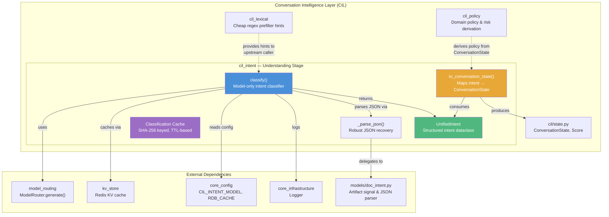
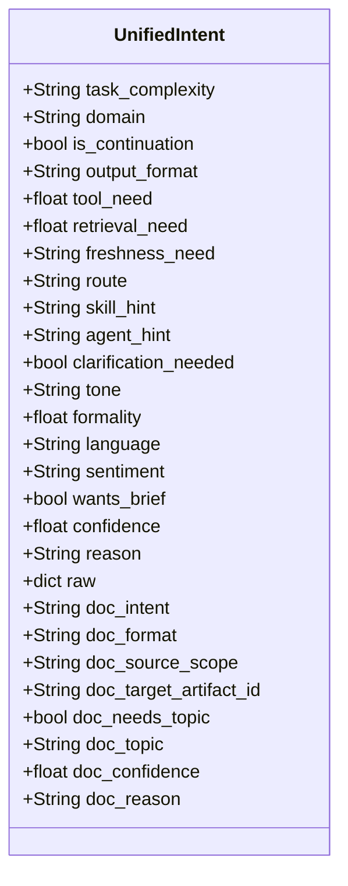
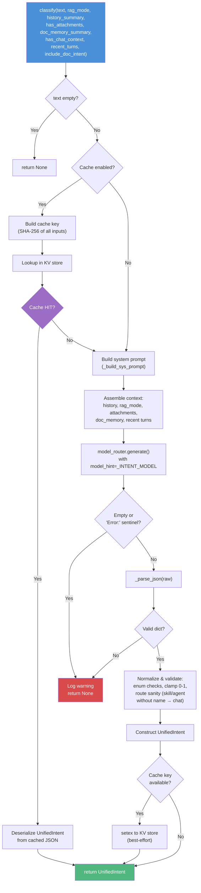
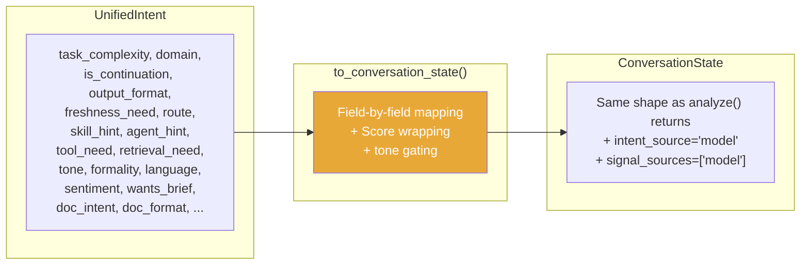
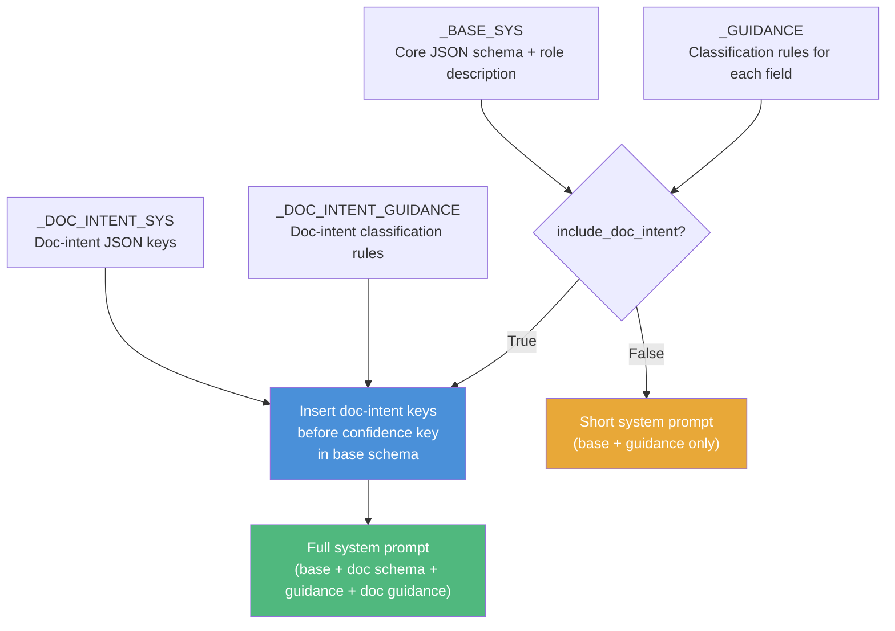
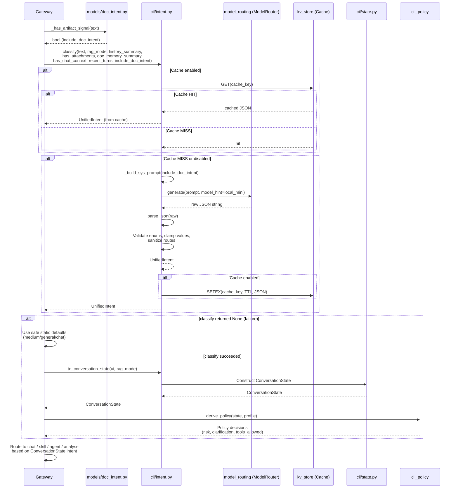
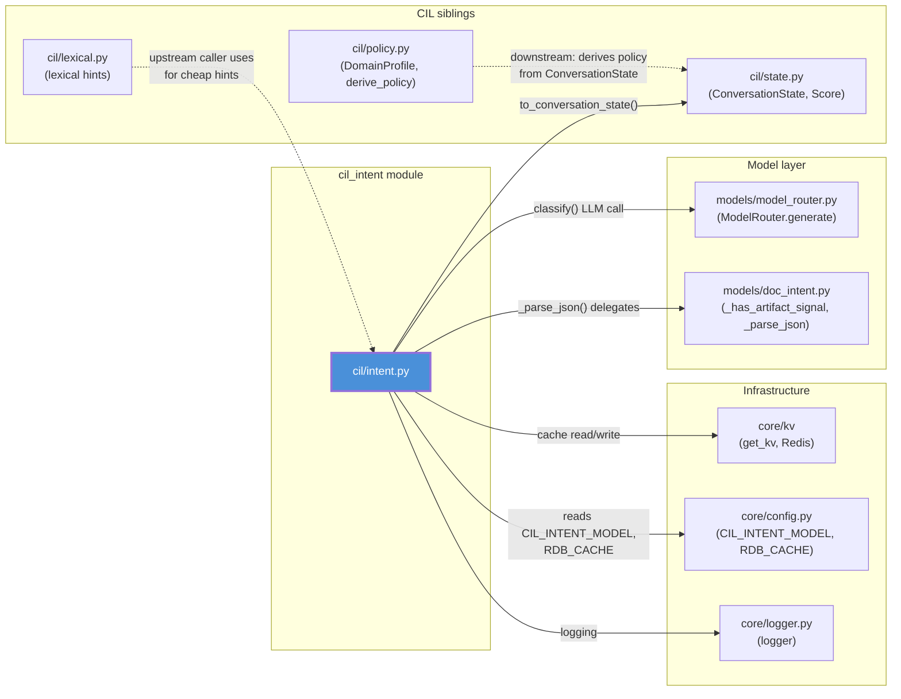
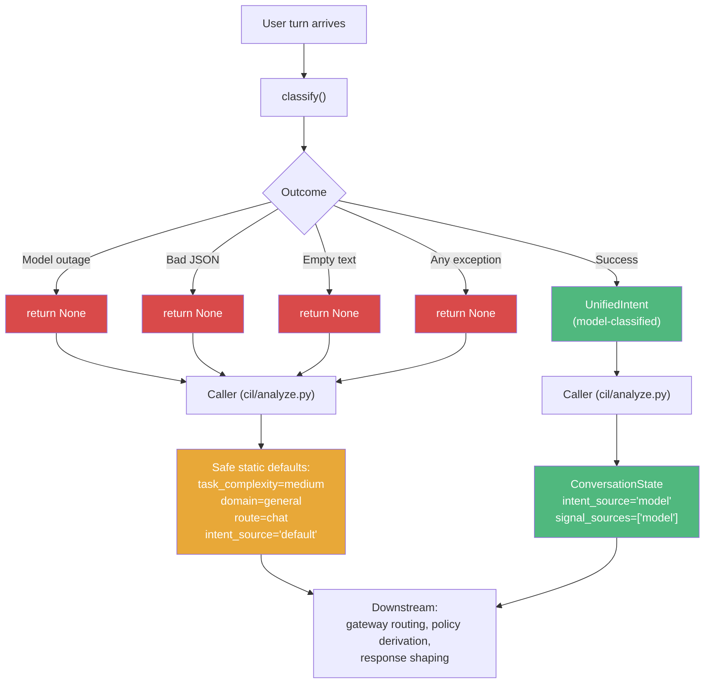
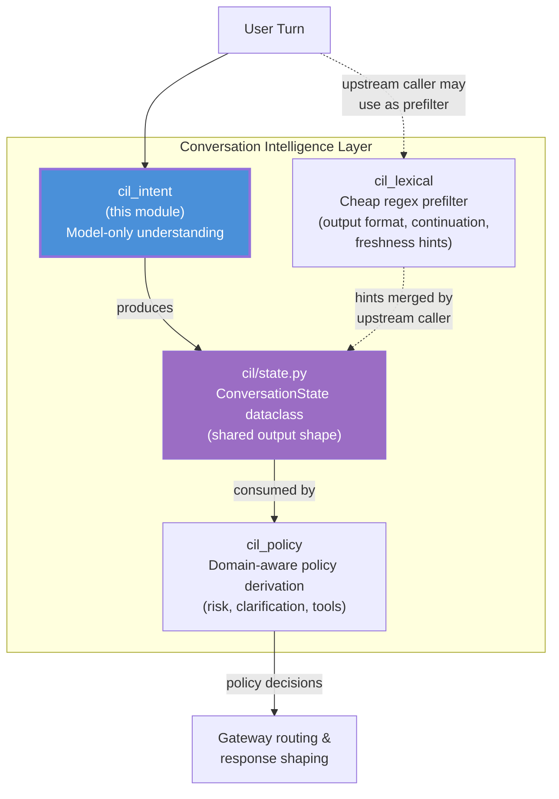

# CIL Intent — Conversation Intelligence Layer: Understanding Stage

## Brief Introduction

The `cil_intent` module is the **understanding stage** of the Conversation Intelligence Layer (CIL). It transforms a raw user turn into a structured `UnifiedIntent` object using a single fast LLM call — **no regex, no keyword heuristics**. This is what elevates the platform from a simple prompt→LLM→UI chatbot into an *intelligence* layer: the model genuinely *understands* whether a turn is trivial vs. deep, a follow-up vs. new, whether it needs tools/retrieval/freshness, and whether it should route to a skill or autonomous agent.

The module is designed with a **fail-safe philosophy**: `classify()` returns `None` on any failure (model outage, bad JSON, timeout), allowing the caller to degrade to safe static defaults (`medium`/`general`/`chat`) — never to regex, and never a crash.

---

## Architecture Overview



### Design Principles

| Principle | Implementation |
|-----------|---------------|
| **Model-only, zero regex** | All intent detection is performed by a single LLM call. No keyword/regex heuristics anywhere in this module. |
| **Fail-safe** | `classify()` returns `None` on any failure; callers degrade to safe static defaults. |
| **Single source of truth for doc intent** | Document-generation intent is merged into `UnifiedIntent` but `models/doc_intent.py` remains the sole doc authority for artifact-signal detection. |
| **Performance caching** | Results are cached by a SHA-256 hash of all classification inputs, so identical turns skip the LLM round-trip (~2.3s in production). |
| **Enum validation & clamping** | All model-returned fields are validated against enum sets and clamped to valid ranges before use. |

---

## Core Components

### 1. `UnifiedIntent` Dataclass

The central structured output of the understanding stage. Encapsulates every signal the model extracts from a single user turn.



**Field Groups:**

| Group | Fields | Purpose |
|-------|--------|---------|
| **Understanding** | `task_complexity`, `domain`, `is_continuation`, `output_format` | Core comprehension of what the user is asking |
| **Needs** | `tool_need`, `retrieval_need`, `freshness_need` | What external resources the turn requires |
| **Routing** | `route`, `skill_hint`, `agent_hint`, `clarification_needed` | Where the turn should be dispatched |
| **Style/Persona** | `tone`, `formality`, `language`, `sentiment`, `wants_brief` | How the response should be shaped |
| **Document Intent** | `doc_intent`, `doc_format`, `doc_source_scope`, `doc_target_artifact_id`, `doc_needs_topic`, `doc_topic`, `doc_confidence` | Whether the user wants a downloadable file artifact |
| **Provenance** | `confidence`, `reason`, `raw` | Trust and debuggability metadata |

**Valid Enum Values:**

| Field | Valid Values |
|-------|-------------|
| `task_complexity` | `simple`, `medium`, `complex`, `deep`, `solution` |
| `route` | `chat`, `skill`, `agent`, `analyse` |
| `output_format` | `prose`, `code`, `table`, `document`, `data` |
| `freshness_need` | `none`, `low`, `high` |
| `tone` | `formal`, `neutral`, `casual`, `frustrated`, `excited` |
| `sentiment` | `neg`, `neutral`, `pos` |
| `doc_intent` | `generate`, `summarize`, `convert`, `extract`, `compare`, `revise`, `none` |
| `doc_format` | `pdf`, `docx`, `pptx`, `xlsx`, `csv`, `md`, `txt` |
| `doc_source_scope` | `uploaded`, `chat`, `artifact`, `none` |

---

### 2. `classify()` — The Primary Entry Point



**Key Behaviors:**

- **Model selection**: Uses `CIL_INTENT_MODEL` from `core_config` (defaults to `"local_mini"` tier, configured via `OPENAI_OSS_MODEL`). The `model_router` cascades from local→cloud on outage.
- **Cache key**: A SHA-256 hash of `text`, `rag_mode`, `history_summary`, `has_attachments`, `doc_memory_summary`, `has_chat_context`, `recent_turns[-5:]`, and `include_doc_intent`. The cache is a pure function of inputs — no `chat_id`/`user_id`/time dependence — so a HIT is exactly the answer the model would give.
- **Cache TTL**: Default 3600s (1 hour), configurable via `CIL_INTENT_CACHE_TTL`.
- **Cache toggle**: `CIL_INTENT_CACHE_ENABLED=false` disables caching without a deploy.
- **Route sanitization**: If the model returns `route=skill` or `route=agent` but no `skill_hint`/`agent_hint`, the route is clamped to `chat`. The authoritative existence check against the DB is done by the gateway downstream.
- **Doc-intent gating**: When `include_doc_intent=False`, all doc-intent fields are forced to defaults (`none`/`None`/`0.0`), and the system prompt omits the doc-intent schema entirely, producing a shorter prompt.

---

### 3. `to_conversation_state()` — Intent → State Mapping

Maps a `UnifiedIntent` into a `ConversationState` (defined in `cil/state.py`), ensuring every downstream reader operates on the same state shape regardless of whether the state was produced by the model classifier or by safe static defaults.



**Notable mapping rules:**

| UnifiedIntent Field | ConversationState Field | Transformation |
|---------------------|------------------------|----------------|
| `tool_need` (float) | `tool_need` (Score) | Wrapped as `Score(score=ui.tool_need, tags=[domain])` |
| `retrieval_need` (float) | `retrieval_need` (Score) | Only set when `rag_mode != "off"` |
| `route` | `intent` | Direct copy |
| `confidence` | `intent_conf`, `classifier_conf` | Set to same value |
| `tone`, `formality`, `language`, `sentiment`, `wants_brief` | Same names | Only surfaced when `CIL_TONE_DETECT=true` (default); otherwise neutral defaults are preserved |
| `doc_*` fields | `doc_*` fields | Direct copy |
| — | `intent_source` | Hardcoded to `"model"` |
| — | `signal_sources` | Hardcoded to `["model"]` |

---

### 4. `_parse_json()` — Robust JSON Recovery

A defensive JSON extractor that handles common LLM output quirks:

1. **Delegates** to `models/doc_intent.py::_parse_json` (which itself delegates to `agents/doc_generator_agent._parse_llm_json`) when available.
2. **Fallback**: Strips markdown code fences (` ``` `), finds the first `{` and last `}`, and attempts `json.loads` on the slice.
3. **Never raises** — returns whatever `json.loads` produces or propagates the exception to the caller's `try/except`.

> See [cil_policy](cil_policy.md) and [cil_lexical](cil_lexical.md) for how lexical hints and domain policies complement the model-based classification.

---

## System Prompt Construction

The system prompt is dynamically assembled by `_build_sys_prompt()`:



The `include_doc_intent` flag is set by the upstream caller (gateway) based on `models/doc_intent.py::_has_artifact_signal()` — a cheap lexical check that detects whether the prompt references a downloadable file/artifact. When no artifact signal is present, the prompt is shorter and the model is not asked to produce doc-intent fields, saving tokens and reducing classification noise.

---

## Data Flow: End-to-End Turn Processing



---

## Dependency Graph



### Dependency Summary

| Dependency | Type | Purpose |
|------------|------|---------|
| [`model_routing`](../models/model_routing.md) | **Hard** | `ModelRouter.generate()` — the single LLM call for classification. Cascades local→cloud on outage. |
| `cil/state.py` | **Hard** | `ConversationState` and `Score` — the output shape consumed by all downstream readers. |
| [`models/doc_intent.py`](../models_doc_intent.md) | **Hard** | `_parse_json()` for robust JSON recovery; `_has_artifact_signal()` used by upstream caller to gate `include_doc_intent`. |
| [`core_config`](../infrastructure/core_config.md) | **Hard** | `CIL_INTENT_MODEL` (model tier), `RDB_CACHE` (cache KV namespace). |
| [`kv_store`](../storage/kv_store.md) | **Hard** | `get_kv()` for cache read/write via Redis. |
| [`core_infrastructure`](../infrastructure/core_infrastructure.md) | **Hard** | `logger` for structured logging. |
| [`cil_lexical`](cil_lexical.md) | **Indirect** | Upstream caller may use lexical hints as a cheap prefilter; `cil_intent` itself is regex-free. |
| [`cil_policy`](cil_policy.md) | **Downstream** | Consumes the `ConversationState` produced by `to_conversation_state()` to derive risk, clarification, and tool-allowance policy. |

---

## Configuration

All configuration is environment-variable driven, requiring no code changes or deploys:

| Variable | Default | Description |
|----------|---------|-------------|
| `CIL_INTENT_MODEL` | `local_mini` | Model tier hint passed to `ModelRouter`. Configured via `OPENAI_OSS_MODEL` in `core/model_registry.py`. |
| `CIL_INTENT_CACHE_ENABLED` | `true` | Master toggle for classification caching. |
| `CIL_INTENT_CACHE_TTL` | `3600` (1 hour) | TTL in seconds for cached classification results. |
| `CIL_TONE_DETECT` | `true` | When `false`, `to_conversation_state()` preserves neutral `ConversationState` defaults for tone/formality/language/sentiment/wants_brief instead of surfacing model-detected values. |

---

## Fail-Safe & Degradation Strategy



The fail-safe contract is absolute:
- `classify()` **never raises** — every code path either returns a valid `UnifiedIntent` or `None`.
- `to_conversation_state()` is only called when `classify()` succeeds; the caller handles the `None` case by constructing a `ConversationState` with safe defaults.
- The `ConversationState` itself has safe defaults on every field, so even a partial failure degrades gracefully.

---

## Relationship to Sibling CIL Modules

The CIL is organized into three sibling modules under `cil/`:



- **[cil_lexical](cil_lexical.md)**: Provides cheap regex-based hints (`detect_output_format`, `detect_continuation`, `detect_freshness`) that the upstream caller may use as a prefilter. These hints are **not** used inside `cil_intent` — the intent module is strictly model-only.
- **[cil_policy](cil_policy.md)**: Consumes the `ConversationState` produced by `to_conversation_state()` and derives domain-aware policy decisions (risk level, clarification needs, tool allowances, sensitivity) using `DomainProfile` configurations.
- **`cil/state.py`**: The shared `ConversationState` dataclass that serves as the canonical output shape for all CIL components, ensuring downstream readers are agnostic to whether the state came from the model classifier or static defaults.

---

## Performance Characteristics

| Metric | Value | Notes |
|--------|-------|-------|
| LLM round-trip (cache MISS) | ~2.3s | Measured in production with `local_mini` tier |
| Cache lookup (cache HIT) | <5ms | Redis GET + JSON deserialize |
| Cache key computation | <1ms | SHA-256 of input string |
| Prompt size (with doc intent) | ~1.5KB | System prompt + context + user turn |
| Prompt size (without doc intent) | ~1.1KB | Shorter schema, no doc-intent guidance |

The cache is a **pure function** of its inputs (no `chat_id`/`user_id`/time dependence), meaning a cache HIT is provably the same answer the model would give — not a staleness trade-off. This makes it safe for double-submits, retried requests, and cross-chat identical questions.
