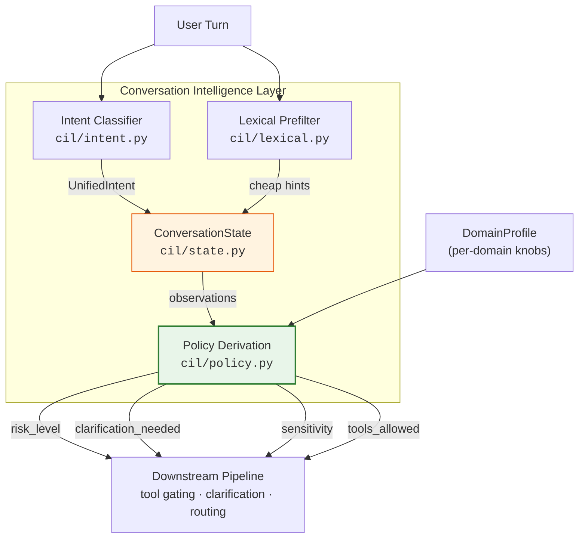
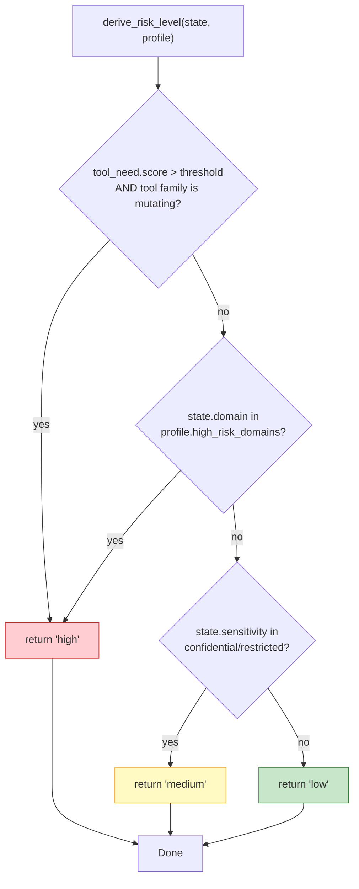
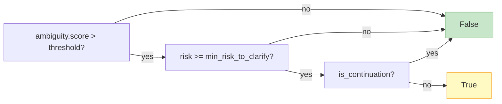
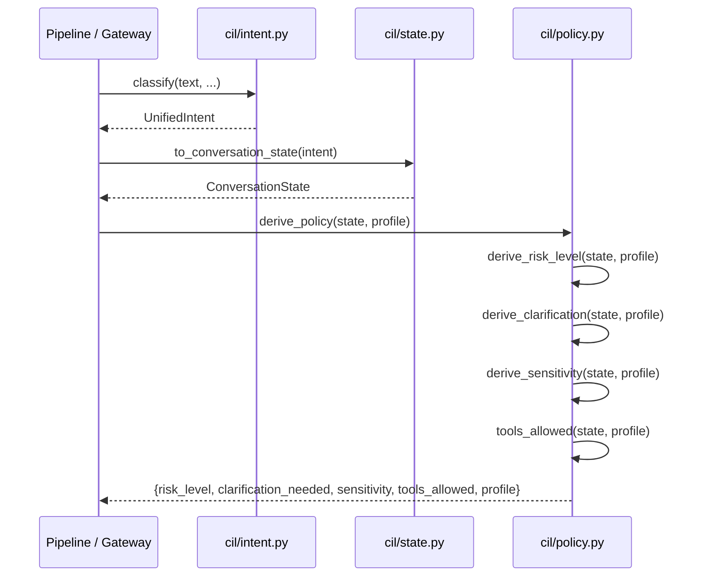
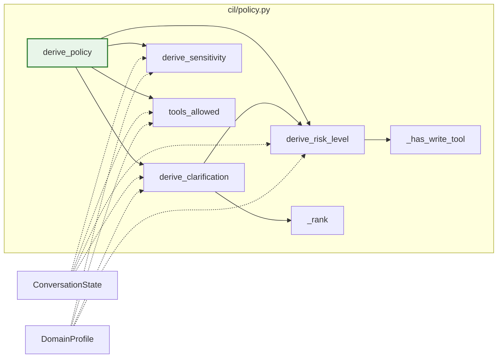
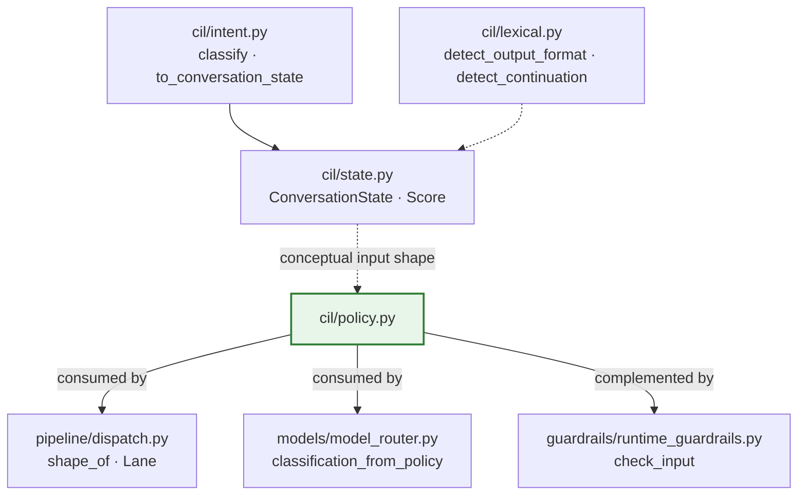

# CIL Policy (`cil_policy`)

> **File:** `cil/policy.py`
> **Components:** `derive_policy`, `DomainProfile`

## 1. Introduction

The `cil_policy` module is the **Class-4 decision layer** of the Conversation
Intelligence Layer (CIL).  It takes the *observations* produced by upstream CIL
classifiers — risk scores, ambiguity, tool-need, domain, sensitivity — and
turns them into *decisions*: Is this turn high-risk? Should we ask for
clarification? What sensitivity label applies? Are tools allowed?

The design split is deliberate:

| Layer | Responsibility | Module |
|-------|---------------|--------|
| **Observations** (Class 1–3) | Domain-neutral scores & labels on a `ConversationState` | [`cil_intent`](cil_intent.md), [`cil_lexical`](cil_lexical.md) |
| **Decisions** (Class 4) | Domain-specific policy from state + profile | **`cil_policy`** (this module) |

This separation means **a new vertical ships a new `DomainProfile`, not a
re-trained classifier** (Tenet 2 of the semantic-understanding architecture).

### Key properties

- **Pure** — functions of `(state, profile)` only; no I/O, no model calls.
- **Deterministic** — same inputs always produce the same output.
- **Instant** — no latency beyond a few attribute lookups and comparisons.
- **Fail-safe** — every function catches all exceptions and returns today's
  implicit default (low risk, no clarification, no tools).  Understanding stays
  *additive*; a policy error never breaks a turn.

---

## 2. Architecture



### Where it fits in the system

`cil_policy` sits at the end of the CIL pipeline, just before the request
enters the broader execution pipeline.  Upstream, the intent classifier
([`cil_intent`](cil_intent.md)) and lexical prefilter
([`cil_lexical`](cil_lexical.md)) populate a `ConversationState` with
domain-neutral observations.  `cil_policy` consumes that state alongside a
`DomainProfile` and emits a flat policy dictionary that downstream consumers
use to shape the response.

Downstream consumers include:

- **Pipeline dispatch** ([`pipeline`](pipeline.md)) — uses policy decisions to
  select the response shape (e.g. whether to inject a clarification turn).
- **Model routing** ([`model_routing`](../models/model_routing.md)) — sensitivity and
  risk can influence local-vs-cloud routing decisions.
- **Guardrails** ([`guardrails`](../security/guardrails.md)) — operate independently on
  input safety; `cil_policy` risk levels are complementary, not a substitute.

---

## 3. Core Components

### 3.1 `DomainProfile`

A lightweight dataclass holding per-domain policy knobs.  Defaults reproduce
today's behavior: low risk, rarely clarify, internal sensitivity.

```python
@dataclass
class DomainProfile:
    name: str = "general"
    high_risk_domains: List[str] = field(default_factory=list)   # e.g. ["finance","legal"]
    ambiguity_threshold: float = 0.6      # clarify only above this
    min_risk_to_clarify: str = "medium"   # never interrupt low-risk turns
    tool_need_threshold: float = 0.5      # per-profile tool trigger
    default_sensitivity: str = "internal" # public|internal|confidential|restricted
```

| Field | Type | Default | Purpose |
|-------|------|---------|---------|
| `name` | `str` | `"general"` | Profile identifier included in the policy output for telemetry. |
| `high_risk_domains` | `List[str]` | `[]` | Domains automatically treated as high-risk (e.g. `finance`, `legal`). |
| `ambiguity_threshold` | `float` | `0.6` | Ambiguity score above which clarification is *considered*. |
| `min_risk_to_clarify` | `str` | `"medium"` | Minimum risk level required to interrupt with a clarification. |
| `tool_need_threshold` | `float` | `0.5` | Tool-need score at or above which tools are allowed. |
| `default_sensitivity` | `str` | `"internal"` | Fallback data-classification label when the state carries no hint. |

> **Note:** This `DomainProfile` is distinct from the broader
> `profiles/schema.py::DomainProfile` (see
> [profiles](profiles.md)), which bundles context, routing, and grounding
> policies.  The CIL `DomainProfile` is a focused subset of knobs that only
> govern Class-4 decisions.

### 3.2 `derive_policy`

The single entry point callers use.  It invokes all individual derivations and
returns a flat dictionary:

```python
def derive_policy(state, profile: DomainProfile, clearance: Optional[str] = None) -> Dict[str, Any]:
    risk = derive_risk_level(state, profile)
    return {
        "risk_level": risk,
        "clarification_needed": derive_clarification(state, profile),
        "sensitivity": derive_sensitivity(state, profile, clearance),
        "tools_allowed": tools_allowed(state, profile),
        "profile": profile.name,
    }
```

**Output schema**

| Key | Type | Values | Description |
|-----|------|--------|-------------|
| `risk_level` | `str` | `"low"` \| `"medium"` \| `"high"` | Overall risk classification for the turn. |
| `clarification_needed` | `bool` | `True` / `False` | Whether the system should ask for clarification before acting. |
| `sensitivity` | `str` | `"public"` \| `"internal"` \| `"confidential"` \| `"restricted"` | Most-restrictive data-handling label. |
| `tools_allowed` | `bool` | `True` / `False` | Whether the tool-need score clears the profile's trigger threshold. |
| `profile` | `str` | e.g. `"general"` | Name of the `DomainProfile` that produced the decisions. |

### 3.3 Individual derivation functions

Each sub-function is public for targeted reuse and unit testing.  All are
fail-safe.

#### `derive_risk_level(state, profile) -> str`



Mutating (write) tool families that force high risk:

```
write, email, delete, deploy, payment, exec, shell
```

#### `derive_clarification(state, profile) -> bool`

Clarification is requested **only** when all three conditions hold:

1. Ambiguity score exceeds `profile.ambiguity_threshold`.
2. Risk level is at least `profile.min_risk_to_clarify`.
3. The turn is **not** a continuation (continuations are never interrupted).



#### `derive_sensitivity(state, profile, clearance) -> str`

Returns the **most-restrictive** label from the set `{profile.default_sensitivity, state.sensitivity}`.
The ordering (least → most restrictive) is:

```
public < internal < confidential < restricted
```

A lower principal clearance can only *raise* the required handling, never lower
it.  (The `clearance` parameter is accepted for future use; current logic relies
on the profile default and state hint.)

#### `tools_allowed(state, profile) -> bool`

Simple threshold check: `state.tool_need.score >= profile.tool_need_threshold`.

---

## 4. Internal Helpers

| Helper | Visibility | Purpose |
|--------|-----------|---------|
| `_rank(risk)` | private | Maps a risk string to an integer (`low=0`, `medium=1`, `high=2`) for threshold comparisons. |
| `_has_write_tool(families)` | private | Returns `True` if any tag/family in the list matches a mutating tool family. |

### Module-level constants

| Constant | Value | Purpose |
|----------|-------|---------|
| `_RISK_RANK` | `{"low": 0, "medium": 1, "high": 2}` | Risk ordering for comparisons. |
| `_WRITE_FAMILIES` | `{"write", "email", "delete", "deploy", "payment", "exec", "shell"}` | Tool families that trigger high risk. |

---

## 5. Data Flow



### Input: `ConversationState` shape

`derive_policy` uses `getattr` to read attributes defensively, so it works with
any object that exposes the expected fields.  The canonical source is
`cil/state.py::ConversationState`:

| Attribute | Type | Used by | Default |
|-----------|------|---------|---------|
| `domain` | `str` | `derive_risk_level` | `"general"` |
| `sensitivity` | `str \| None` | `derive_risk_level`, `derive_sensitivity` | `None` |
| `is_continuation` | `bool` | `derive_clarification` | `False` |
| `ambiguity.score` | `float` | `derive_clarification` | `0.0` |
| `tool_need.score` | `float` | `derive_risk_level`, `tools_allowed` | `0.0` |
| `tool_need.tags` / `.families` | `List[str] \| None` | `derive_risk_level` | `None` |

See [`cil_intent`](cil_intent.md) for how `ConversationState` is populated from
`UnifiedIntent` via `to_conversation_state`.

---

## 6. Component Interaction



`derive_policy` is the orchestrator.  `derive_clarification` internally calls
`derive_risk_level` because clarification depends on the risk decision — this
ensures a single source of truth for risk within a turn.

---

## 7. Fail-Safe Behavior

Every public function wraps its body in `try/except Exception` and returns a
safe default on any error:

| Function | Safe default on error |
|----------|----------------------|
| `derive_risk_level` | `"low"` |
| `derive_clarification` | `False` |
| `derive_sensitivity` | `profile.default_sensitivity` |
| `tools_allowed` | `False` |
| `derive_policy` | Inherits from sub-functions (each fails individually) |

This guarantees that a malformed state object, a missing attribute, or an
unexpected type never propagates an exception to the caller.  The worst case is
that the system behaves as if CIL understanding were unavailable — i.e., today's
implicit default path.

---

## 8. Usage Example

```python
from cil.policy import DomainProfile, derive_policy
from cil.intent import classify, to_conversation_state

# 1. Classify the turn (model-backed; returns None on total failure)
intent = classify("Delete all records from the finance database")

# 2. Convert to ConversationState
state = to_conversation_state(intent) if intent else None

# 3. Define a domain profile
finance_profile = DomainProfile(
    name="finance",
    high_risk_domains=["finance", "legal"],
    ambiguity_threshold=0.55,
    min_risk_to_clarify="medium",
    tool_need_threshold=0.5,
    default_sensitivity="confidential",
)

# 4. Derive policy (pass a dummy state for illustration)
if state:
    policy = derive_policy(state, finance_profile)
    # {
    #   "risk_level": "high",            # mutating tool + finance domain
    #   "clarification_needed": True,    # if ambiguous enough
    #   "sensitivity": "confidential",   # most-restrictive of state hint & default
    #   "tools_allowed": True,           # tool_need >= threshold
    #   "profile": "finance"
    # }
```

---

## 9. Adding a New Domain

Because decisions are separated from observations, onboarding a new vertical
requires only a new `DomainProfile` instance — no model retraining and no
changes to the classifier:

```python
legal_profile = DomainProfile(
    name="legal",
    high_risk_domains=["legal"],
    ambiguity_threshold=0.5,        # legal text is often ambiguous → lower bar
    min_risk_to_clarify="medium",
    tool_need_threshold=0.4,
    default_sensitivity="restricted",
)
```

The same `derive_policy(state, legal_profile)` call then produces decisions
tuned for the legal domain.

---

## 10. Dependencies



### Hard dependencies

`cil/policy.py` has **zero runtime imports** beyond the Python standard library
(`dataclasses`, `typing`).  It reads `state` via `getattr`, so there is no hard
import of `cil/state.py`.  This keeps the module trivially testable and
side-effect-free.

### Conceptual dependencies

| Module | Relationship |
|--------|-------------|
| [`cil_intent`](cil_intent.md) | Produces `UnifiedIntent` → `ConversationState` that `cil_policy` consumes. |
| [`cil_lexical`](cil_lexical.md) | Provides cheap pre-LLM hints that may enrich `ConversationState`. |
| [`pipeline`](pipeline.md) | Consumes policy decisions for response shaping and clarification injection. |
| [`model_routing`](../models/model_routing.md) | Uses sensitivity/risk to influence local-vs-cloud routing (see `classification_from_policy`). |
| [`guardrails`](../security/guardrails.md) | Independent input-safety layer; complementary to `cil_policy` risk decisions. |
| [`profiles`](profiles.md) | Broader policy bundles; note the separate `DomainProfile` class in `profiles/schema.py`. |

---

## 11. Related Documentation

- [cil_intent](cil_intent.md) — Model-backed intent classification and `UnifiedIntent` → `ConversationState` mapping.
- [cil_lexical](cil_lexical.md) — Cheap regex-based lexical prefilter for output format, continuation, and freshness signals.
- [pipeline](pipeline.md) — Request dispatch and response shaping.
- [model_routing](../models/model_routing.md) — Model selection, fallback, and privacy-floor classification.
- [guardrails](../security/guardrails.md) — NeMo Guardrails input-safety checks.
- [profiles](profiles.md) — Enterprise policy profiles (context, routing, grounding).
- [context_engine](context_engine.md) — Context budget planning and age-tier compaction.
