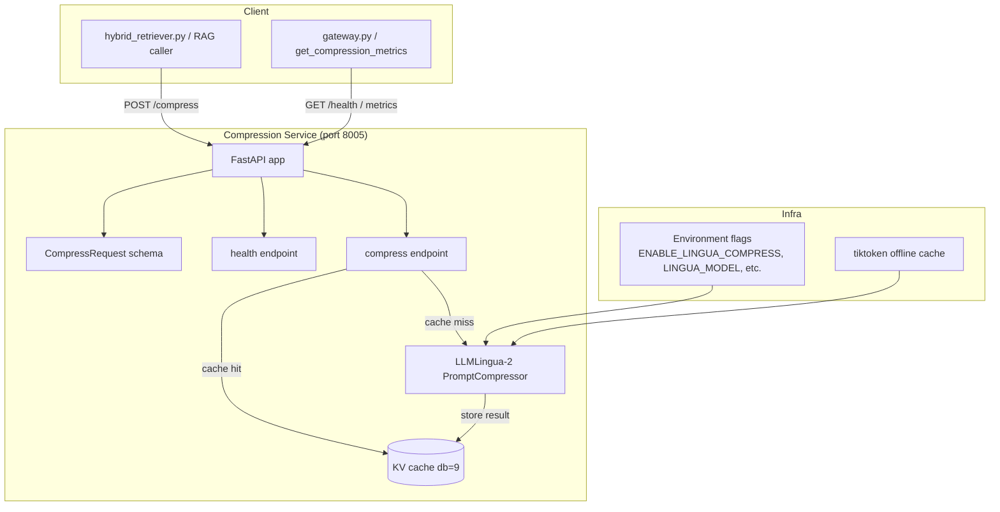
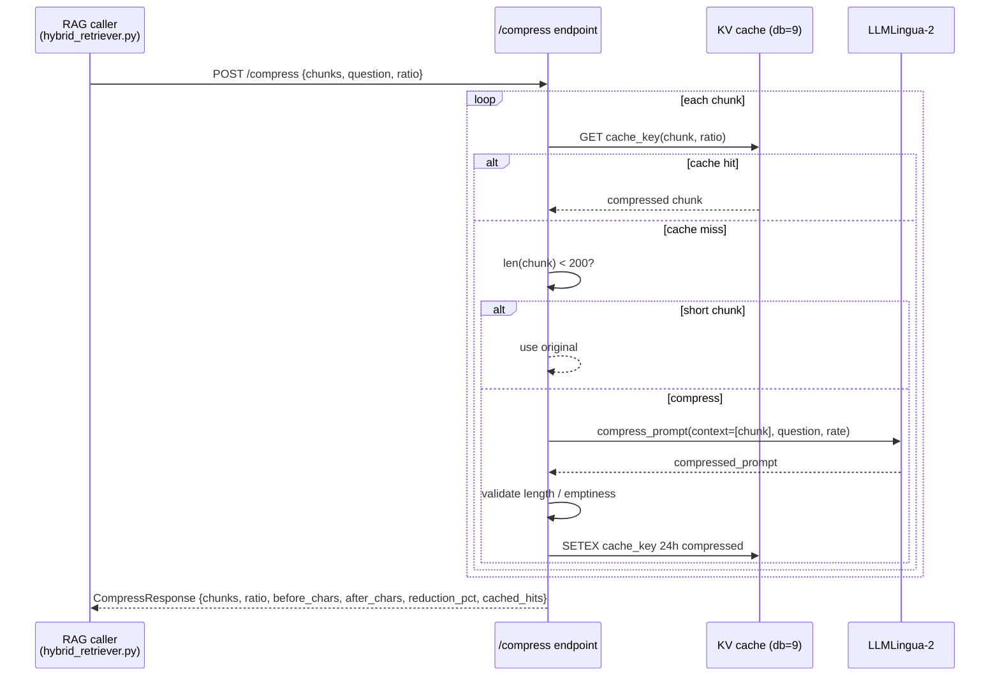
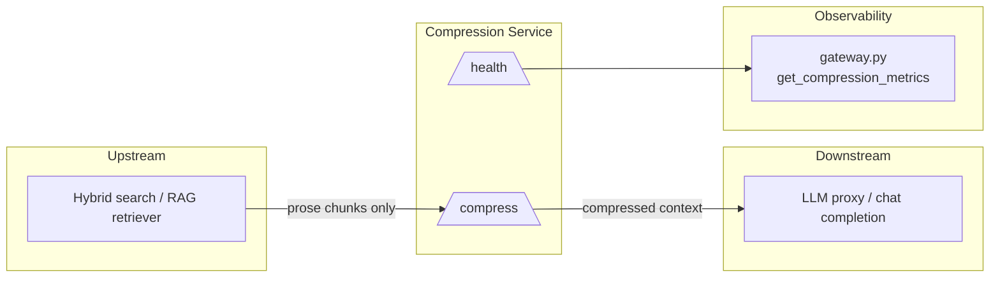

# Compression Service

The **Compression Service** (`services/compression_svc`) is a dedicated, standalone FastAPI microservice that compresses retrieved-context chunks before they are sent to downstream LLM calls. It uses the **LLMLingua-2** prompt-compression model to reduce token volume for RAG-style retrieval while preserving semantic recall for prose documents.

> **Scope note:** This service is intended **only** for prose namespaces such as Confluence and platform documentation. It must **never** be applied to code repositories. Namespace gating is the responsibility of the caller (see [Data Flow](#data-flow)).

---

## Table of Contents

1. [Purpose and Core Functionality](#purpose-and-core-functionality)
2. [Architecture](#architecture)
3. [Component Reference](#component-reference)
4. [Data Flow](#data-flow)
5. [Configuration and Environment](#configuration-and-environment)
6. [Deployment and Operations](#deployment-and-operations)
7. [Integration with the Broader System](#integration-with-the-broader-system)
8. [Error Handling and Fallbacks](#error-handling-and-fallbacks)

---

## Purpose and Core Functionality

Long retrieved contexts are a major driver of LLM cost and latency. The Compression Service addresses this by:

- Accepting a list of text chunks and an optional user question.
- Running each chunk through **LLMLingua-2** (`microsoft/llmlingua-2-xlm-roberta-large-meetingbank` by default) to drop low-salience tokens.
- Returning compressed chunks together with before/after character counts and reduction percentage.
- Caching compressed results in a KV store (Redis, DB `9`) to avoid redundant inference.

The service is **opt-in** via the `ENABLE_LINGUA_COMPRESS` environment variable. When disabled or when the model fails to load, it starts in a safe stub mode where `/compress` returns the original chunks unchanged.

### Key design decisions

| Decision | Rationale |
|----------|-----------|
| Separate process on port `8005` | Heavy ML model loading must not block or destabilize the main gateway process. |
| Model loaded at import time | Avoids first-request latency and ensures startup failures are visible immediately. |
| `device_map="cpu"` | Keeps the service deployable on CPU-only nodes per platform ML policy. |
| Only prose namespaces | Code semantics are fragile; token dropping can break syntax, identifiers, and imports. |
| KV cache on DB `9` | Shared with compression metrics; reduces repeated inference for identical chunks. |
| Skip chunks under 200 characters | Compression overhead outweighs savings for very short inputs. |

---

## Architecture



---

## Component Reference

### `CompressRequest`

Pydantic request model for the `/compress` endpoint.

| Field | Type | Default | Description |
|-------|------|---------|-------------|
| `chunks` | `List[str]` | required | Text chunks to compress. |
| `question` | `Optional[str]` | `""` | Optional query used to preserve question-relevant tokens. |
| `ratio` | `float` | `0.5` | Fraction of tokens to **keep** (e.g., `0.5` ≈ 50% retained). |

### `compress(req: CompressRequest) -> CompressResponse`

Core endpoint logic:

1. Sums input character count.
2. Returns early for empty input.
3. Returns originals if the compressor model is not loaded.
4. Iterates over chunks:
   - Checks the KV cache; returns cached value on hit.
   - Skips chunks shorter than 200 characters.
   - Calls `_compressor.compress_prompt(...)` with `condition_in_question` when a question is supplied.
   - Falls back to the original chunk if compression fails, returns empty, or increases length.
   - Writes the result to the KV cache with a 24-hour TTL.
5. Computes reduction percentage and returns metadata.

### `health()`

Liveness/readiness endpoint returning:

```json
{
  "status": "ok",
  "enabled": true,
  "model_loaded": true,
  "cache": true
}
```

This is consumed by orchestration health checks and by [gateway.md](../models/gateway.md) (`get_compression_metrics`).

### Internal helpers

- `_cache_key(chunk, ratio)` — deterministic SHA-256 cache key.
- `_ENABLED` guard — controls stub mode and model loading.
- `_compressor` — global `PromptCompressor` instance loaded at module import time.
- `_rc` — KV client from `core.kv.get_kv(_cache_db)`.

---

## Data Flow



### Namespace gating

The Compression Service itself does **not** inspect the source namespace. The caller is expected to invoke it only for prose-oriented namespaces. In the platform this gating is performed by the hybrid search / RAG retrieval layer. For details on retrieval and namespace handling, see the retrieval-related modules in the system documentation.

---

## Configuration and Environment

| Variable | Default | Purpose |
|----------|---------|---------|
| `ENABLE_LINGUA_COMPRESS` | `false` | Master switch. Must be `"true"`, `"1"`, or `"yes"` to load the model. |
| `LINGUA_MODEL` | `microsoft/llmlingua-2-xlm-roberta-large-meetingbank` | HuggingFace model name or local path. |
| `LINGUA_CACHE_DB` | `9` | KV database number for the compression cache. |
| `TIKTOKEN_CACHE_DIR` | `services/compression_svc/tiktoken_cache` | Offline cache for tiktoken encodings (air-gapped deployments). |

### Local-path model workaround

When `LINGUA_MODEL` points to a local filesystem path, LLMLingua-2's tokenizer-type detection can fail because it matches against the model name string. The service automatically overrides `_compressor.model_name` to the canonical HF name so that the XLM-RoBERTa tokenizer logic is used.

---

## Deployment and Operations

### Standalone start

```bash
ENABLE_LINGUA_COMPRESS=true uvicorn services.compression_svc.main:app \
  --host 0.0.0.0 --port 8005 --workers 1
```

### PM2

A PM2 config is available at `deploy/ainxt-compression.config.js`.

### Health and metrics

- Service health: `GET /health`
- Platform-level compression metrics are exposed through [gateway.md](../models/gateway.md) (`get_compression_metrics`).

### Air-gapped tiktoken setup

If the runtime cannot reach Azure Blob, pre-cache the encoding file:

```bash
wget -O cl100k_base.tiktoken \
  "https://openaipublic.blob.core.windows.net/encodings/cl100k_base.tiktoken"
mkdir -p services/compression_svc/tiktoken_cache
HASH=$(echo -n "https://openaipublic.blob.core.windows.net/encodings/cl100k_base.tiktoken" | sha1sum | cut -d' ' -f1)
cp cl100k_base.tiktoken services/compression_svc/tiktoken_cache/$HASH
```

---

## Integration with the Broader System



- **Upstream caller**: The RAG retrieval layer sends chunks to `/compress` before constructing the final LLM prompt.
- **Downstream consumer**: Compressed chunks flow into LLM calls, reducing token spend.
- **Observability**: [gateway.md](../models/gateway.md) surfaces compression health/metrics via `get_compression_metrics`.

The service is intentionally isolated from the main gateway and from other model services such as [llm_proxy.md](../models/llm_proxy.md) and [embedding_service.md](../knowledge/embedding_service.md). It only depends on the shared `core.kv` and `core.logger` utilities.

---

## Error Handling and Fallbacks

The service is designed to fail safely in all error paths:

| Scenario | Behavior |
|----------|----------|
| `ENABLE_LINGUA_COMPRESS` not set | Service starts in stub mode; `/compress` returns originals. |
| `llmlingua` not installed | Model load fails; `/compress` returns originals. |
| Model load throws exception | Logged; `/compress` returns originals. |
| KV cache unavailable | Compression still works; caching is disabled. |
| Single chunk compression fails | That chunk falls back to original; other chunks continue. |
| Compressed result is empty or longer | Original chunk is used. |
| Chunk shorter than 200 chars | Original chunk is used. |

This makes the service safe to deploy opportunistically: enabling it improves cost and latency, but disabling it or a model failure never breaks upstream callers.
